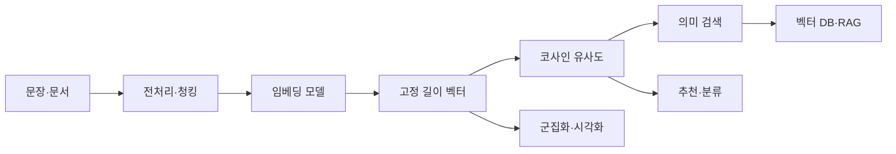
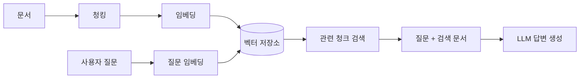

# 텍스트 벡터화와 임베딩

> **핵심 흐름**  
> 텍스트 → 벡터화 → 유사도 계산 → 검색·추천·군집화·RAG



---

## 1. 벡터화와 임베딩

### 1-1. 벡터화

텍스트를 컴퓨터가 계산할 수 있는 숫자 배열인 **벡터**로 바꾸는 과정.

| 구분 | 대표 방법 | 표현 방식 | 장점 | 한계 |
|---|---|---|---|---|
| 희소 표현 | BoW, TF-IDF | 단어마다 칸을 만들고 빈도·가중치를 기록 | 구조가 단순하고 어떤 단어가 영향을 줬는지 해석하기 쉬움 | 단어 순서·문맥·동의어 관계를 충분히 표현하기 어려움 |
| 밀집 표현 | 임베딩 | 학습된 모델이 텍스트를 짧은 실수 벡터로 변환 | 표현이 달라도 의미가 비슷한 텍스트를 가깝게 배치 가능 | 모델 선택과 품질 평가가 필요하고 계산·저장 비용이 발생 |

> TF-IDF가 의미를 전혀 담지 못하는 것은 아님.  
> 문서에서 중요한 단어는 표현하지만, **표현이 다른 동의어와 문맥적 의미**를 직접 이해하지는 못함.

### 1-2. 임베딩

**임베딩(Embedding)**은 단어·문장·문서·이미지 등을 의미가 비슷할수록 벡터 공간에서 가깝게 놓이도록 변환한 표현.

- **임베딩 벡터**: 모델이 출력한 고정 길이 숫자 배열
- **임베딩 공간**: 각 벡터가 놓이는 다차원 공간
- **차원**: 벡터를 이루는 숫자의 개수
- 각 차원은 보통 사람이 직접 이름 붙일 수 없는 **잠재 특징**

```text
"강아지가 뛰어놀고 있다" → [0.21, -0.42, 0.08, ...]
"개가 공원에서 달린다"   → [0.19, -0.39, 0.11, ...]
```

두 문장의 표현은 다르지만 의미가 비슷하면 벡터도 가까워질 수 있음.

### 1-3. 임베딩 종류

- **단어 임베딩**: 단어 하나를 벡터로 표현. 예: Word2Vec, FastText
- **문장 임베딩**: 문장이나 짧은 문단 전체를 하나의 벡터로 표현
- **문서 임베딩**: 문서 전체 또는 문서를 나눈 조각을 벡터로 표현
- **멀티모달 임베딩**: 텍스트와 이미지를 같은 의미 공간에 표현

문장 임베딩 모델은 대량의 텍스트에서 의미 관계를 학습함. 비슷한 문장을 가깝게, 다른 문장을 멀게 만드는 **대조 학습**이 자주 사용되지만 모든 모델이 동일한 방식으로 학습되는 것은 아님.

### 1-4. 긴 문서는 청킹

임베딩 모델에는 한 번에 처리할 수 있는 최대 토큰 길이가 있음. 긴 문서를 그대로 넣으면 뒷부분이 잘리거나 정보가 뭉개질 수 있으므로 **청크(chunk)**로 나눔.

```text
긴 문서
  ↓ 문단·제목·토큰 길이를 기준으로 분할
청크 1 / 청크 2 / 청크 3
  ↓ 각각 임베딩
벡터 1 / 벡터 2 / 벡터 3
```

청크를 너무 작게 나누면 문맥이 끊기고, 너무 크게 나누면 검색 결과가 모호해짐. 일반적으로 문장이나 문단 경계를 유지하고 일부 내용을 겹치는 방식이 사용됨.

---

## 2. 코사인 유사도와 임베딩 모델

### 2-1. 코사인 유사도

두 벡터가 이루는 **각도**를 이용해 방향이 얼마나 비슷한지 비교하는 방법.

$$
\cos(\theta)=\frac{\mathbf{a}\cdot\mathbf{b}}
{\lVert\mathbf{a}\rVert\lVert\mathbf{b}\rVert}
$$

| 값 | 일반적 해석 |
|---:|---|
| 1에 가까움 | 방향이 매우 비슷함 |
| 0에 가까움 | 방향의 관련성이 약함 |
| -1에 가까움 | 방향이 반대임 |

주의할 점:

- 음수도 나올 수 있으므로 `실제 임베딩에서는 나오지 않는다`고 단정하면 안 됨
- 유사도 값의 의미는 모델과 데이터에 따라 달라짐
- `0.8 이상이면 무조건 유사` 같은 고정 기준보다 실제 검색 결과로 임계값을 평가하는 것이 안전함
- 벡터를 길이 1로 정규화하면 **내적과 코사인 유사도가 같아짐**

### 2-2. 모델 선택

Hugging Face는 모델을 공유하는 저장소이며, `sentence-transformers`는 호환 모델을 쉽게 불러오고 임베딩을 생성하는 라이브러리.

| 모델 예시 | 언어·차원 | 특징 |
|---|---|---|
| `jhgan/ko-sroberta-multitask` | 한국어 · 768차원 | 한국어 문장 유사도 작업에 사용하기 쉬움 |
| `intfloat/multilingual-e5-base` | 다국어 · 768차원 | 검색용 모델. 모델 지침에 따라 `query:`·`passage:` 접두어 사용 |
| `BAAI/bge-m3` | 다국어 · 1024차원 | 다국어와 비교적 긴 입력을 지원하는 검색용 모델 |

> 차원이 크다고 항상 더 좋은 모델은 아님.  
> 학습 데이터·언어·목적·속도·메모리 비용을 함께 비교해야 함. 정확한 사용법과 입력 길이는 각 모델 카드에서 확인.

### 2-3. 문장 임베딩과 유사도 계산

```python
# 설치
# pip install sentence-transformers

from sentence_transformers import SentenceTransformer, util

# 한국어 문장 임베딩 모델
model = SentenceTransformer("jhgan/ko-sroberta-multitask")

sentences = [
    "강아지가 공원에서 뛰고 있다.",
    "개가 야외에서 달리고 있다.",
    "주식 시장의 금리가 상승했다.",
]

# normalize_embeddings=True:
# 각 벡터의 길이를 1로 맞춰 유사도 계산을 단순화
embeddings = model.encode(
    sentences,
    convert_to_tensor=True,
    normalize_embeddings=True,
)

# 첫 번째 문장과 나머지 문장의 코사인 유사도
scores = util.cos_sim(embeddings[0], embeddings[1:])[0]

for sentence, score in zip(sentences[1:], scores):
    print(sentence, round(score.item(), 4))
```

실제 점수는 사용하는 모델에 따라 달라짐.

---

## 3. 차원 축소와 군집화

임베딩은 보통 수백~수천 차원이므로 사람이 그대로 볼 수 없음. 차원 축소로 2차원이나 3차원 좌표를 만들어 시각화할 수 있음.

### 3-1. 차원 축소 비교

| 방법 | 특징 | 주의점 |
|---|---|---|
| PCA | 선형 변환. 빠르고 설명된 분산 비율 확인 가능 | 복잡한 비선형 구조는 놓칠 수 있음 |
| t-SNE | 가까운 이웃을 잘 표현해 군집이 선명하게 보일 수 있음 | 느리고 전역 거리·군집 크기를 그대로 해석하면 안 됨 |
| UMAP | 비선형 차원 축소. 비교적 빠르고 큰 데이터에도 사용 가능 | 결과가 설정값에 민감하며 축·군집 간 거리 자체에는 직접 의미가 없음 |

UMAP은 **군집화 알고리즘이 아니라 차원 축소 알고리즘**. 가까운 이웃 관계를 어느 정도 보존하지만, 2차원 그림에서 군집의 크기와 간격을 실제 의미 거리로 단정하면 안 됨.

### 3-2. KMeans 군집화

KMeans는 라벨 없이 비슷한 데이터를 `k`개 그룹으로 나누는 대표적인 비지도 군집화 알고리즘.

작동 과정:

1. `k`개의 중심점 설정
2. 각 데이터를 가장 가까운 중심에 배정
3. 그룹별 평균 위치로 중심 이동
4. 배정이 거의 변하지 않을 때까지 반복

**관성(inertia)**은 각 점과 해당 군집 중심 사이 거리의 제곱합. `k`가 커질수록 항상 감소하므로 관성만 가장 작게 만드는 값을 선택하면 안 됨.

군집 수 결정 방법:

- **엘보우 방법**: 관성 감소 폭이 눈에 띄게 완만해지는 지점 선택
- **실루엣 점수**: 군집 내부 응집도와 군집 간 분리도 평가. 일반적으로 높을수록 좋음
- **업무 해석**: 실제로 구분할 가치가 있는 군집인지 확인

### 3-3. 권장 작업 순서

```text
원본 임베딩 → 필요 시 정규화 → KMeans 군집화
                              ↓
                         군집 번호 생성

원본 임베딩 → UMAP 2차원 축소 → 군집 번호로 색칠 → 시각화
```

> 실제 군집화는 보통 **원본 고차원 임베딩**에서 수행.  
> UMAP 2차원 좌표는 주로 결과를 보기 위한 시각화에 사용.

```python
# 설치
# pip install scikit-learn umap-learn

import numpy as np
from sklearn.cluster import KMeans
from sklearn.metrics import silhouette_score
from umap import UMAP

# model.encode 결과를 NumPy 배열로 생성
emb = model.encode(
    sentences,
    normalize_embeddings=True,
)

# 원본 임베딩에서 군집화
kmeans = KMeans(
    n_clusters=2,
    random_state=42,
    n_init="auto",
)
labels = kmeans.fit_predict(emb)

# 군집이 2개 이상이고 각 군집에 표본이 있을 때 평가
score = silhouette_score(emb, labels, metric="cosine")
print("실루엣 점수:", round(score, 3))

# 시각화를 위한 2차원 축소
xy = UMAP(
    n_components=2,
    n_neighbors=2,      # 실제 데이터가 많다면 더 크게 조정
    metric="cosine",
    random_state=42,
).fit_transform(emb)

print("원본:", emb.shape)   # 예: (문장 수, 768)
print("축소:", xy.shape)    # (문장 수, 2)
print("군집:", labels)
```

표본이 매우 적으면 UMAP·실루엣 점수가 불안정하므로 결과를 강하게 해석하면 안 됨.

---

## 4. 이미지와 텍스트 임베딩

### 4-1. CLIP

CLIP은 이미지와 텍스트를 **같은 임베딩 공간**에 배치하도록 학습된 멀티모달 모델.

가능한 작업:

- 문장으로 비슷한 이미지 검색
- 이미지와 설명문 연결
- 이미지 간 유사도 계산
- 텍스트·이미지 데이터를 함께 분류하거나 군집화

```python
# 설치
# pip install sentence-transformers pillow

from pathlib import Path
from PIL import Image
from sentence_transformers import SentenceTransformer

clip = SentenceTransformer("clip-ViT-B-32")

paths = sorted(Path("photos").glob("*.jpg"))
images = []

for path in paths:
    with Image.open(path) as image:
        images.append(image.convert("RGB").copy())

# 이미지 임베딩
image_embeddings = clip.encode(
    images,
    normalize_embeddings=True,
)

# 검색 문장 임베딩
query_embedding = clip.encode(
    ["고양이가 있는 사진"],
    normalize_embeddings=True,
)

# 정규화된 벡터이므로 행렬 내적으로 코사인 유사도 계산
scores = query_embedding @ image_embeddings.T
best_index = int(scores.argmax())

print("가장 비슷한 이미지:", paths[best_index])
print("이미지 임베딩 shape:", image_embeddings.shape)
```

CLIP도 모델별 언어 성능 차이가 있음. 한국어 검색이 중요하면 다국어 또는 한국어에 적합한 멀티모달 모델인지 확인해야 함.

---

## 5. 실무 활용과 최종 정리

### 5-1. 의미 검색

```text
1. 문서를 청크로 나눔
2. 각 청크를 임베딩하고 원문·출처 메타데이터와 함께 저장
3. 사용자 질문을 같은 모델로 임베딩
4. 코사인 유사도가 높은 청크 검색
5. 상위 결과를 사용자에게 보여 주거나 LLM에 전달
```

데이터가 적으면 NumPy·scikit-learn만으로도 검색 가능. 데이터가 많아지면 FAISS나 벡터 DB를 사용해 빠르게 검색함.

### 5-2. RAG 연결



임베딩은 RAG의 검색 부분을 담당함. 검색된 문서가 부정확하면 LLM 답변도 부정확해질 수 있으므로 검색 품질 평가가 필요함.

### 5-3. 작업별 핵심 기술

| 하고 싶은 일 | 핵심 기술 |
|---|---|
| 텍스트를 숫자로 변환 | 임베딩 모델의 `encode()` |
| 비슷한 문장 찾기 | 코사인 유사도 |
| 대량 벡터 검색 | FAISS·벡터 DB |
| 2차원 시각화 | PCA·t-SNE·UMAP |
| 비슷한 문서 자동 분류 | KMeans 등 군집화 |
| 글로 이미지 검색 | CLIP 계열 멀티모달 임베딩 |
| 내 문서를 바탕으로 답변 | 검색 + LLM을 연결한 RAG |

### 5-4. 핵심 주의사항

- 같은 임베딩 모델로 문서와 질문을 변환해야 함
- 모델의 언어·학습 목적·입력 형식을 확인해야 함
- 긴 문서는 최대 입력 길이에 맞춰 청킹해야 함
- 유사도 점수는 정답이 아니라 모델의 판단값
- 고정 임계값보다 실제 데이터로 검색 품질을 검증
- 차원이 크다고 반드시 성능이 좋은 것은 아님
- UMAP 그림의 축·거리·군집 크기를 그대로 해석하지 않음
- KMeans는 UMAP 그림이 아니라 원본 임베딩에 적용하는 것이 일반적
- 임베딩만 저장하지 말고 원문·문서 ID·출처 등의 메타데이터도 함께 저장

---

## 한 줄 요약

> **임베딩은 텍스트나 이미지를 의미 벡터로 바꾸고, 코사인 유사도로 가까운 정보를 찾아 검색·추천·군집화·RAG에 활용하는 기술.**
