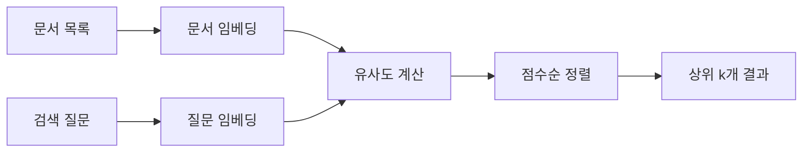

# 임베딩 기초

> 문장·문서를 **의미가 비슷할수록 가까운 숫자 벡터**로 바꾸고, 이를 이용해 유사도 계산·의미 검색·시각화를 수행하는 방법.

## 1. TF-IDF와 임베딩

### TF-IDF

문서에 등장한 단어의 빈도와 희귀도를 이용해 문서를 벡터로 표현하는 방식.

- 벡터의 각 칸이 특정 단어와 대응
- 대부분의 값이 0인 **희소 벡터**
- 어떤 단어가 중요한지 해석하기 쉬움
- 단어가 겹치지 않으면 뜻이 비슷해도 유사도가 낮게 나올 수 있음

### 임베딩

문장이나 문서를 고정 길이의 실수 벡터로 변환하는 방식.

- 각 차원은 사람이 직접 이름 붙인 단어 칸이 아님
- 대부분의 값이 채워진 **밀집 벡터**
- 표현이 달라도 의미가 비슷한 문장을 가깝게 배치할 수 있음
- 검색, 추천, 분류, 군집화, RAG 등에 사용

| 구분 | TF-IDF | 임베딩 |
|---|---|---|
| 기준 | 단어의 등장과 중요도 | 문맥과 의미 |
| 벡터 형태 | 희소 벡터 | 밀집 벡터 |
| 차원 | 어휘 수에 따라 달라짐 | 모델이 정한 고정 차원 |
| 장점 | 빠르고 해석하기 쉬움 | 표현이 달라도 의미 검색 가능 |
| 한계 | 동의어·문맥 파악이 약함 | 모델 선택과 계산 비용이 필요 |

> TF-IDF가 의미를 전혀 다루지 못하는 것은 아님. 단어 통계를 통해 일부 주제 정보를 담지만, 문맥과 동의 표현을 직접 학습한 임베딩보다 의미 비교에 제한이 큼.

---

## 2. 문장을 임베딩으로 변환하기

### 기본 설치

```bash
pip install sentence-transformers scikit-learn umap-learn
```

### 모델 불러오기

```python
from sentence_transformers import SentenceTransformer

MODEL_ID = "jhgan/ko-sroberta-multitask"
model = SentenceTransformer(MODEL_ID)
```

`MODEL_ID`에 Hugging Face 모델 저장소의 ID를 넣으면 해당 모델을 내려받아 사용할 수 있음.

### 문장 임베딩

```python
import numpy as np

sentences = [
    "노트북이 너무 느려서 답답해요",
    "컴퓨터 속도가 느려 불편합니다",
    "오늘 저녁 메뉴를 고민 중이에요",
    "점심으로 무엇을 먹을지 고민돼요",
    "배송이 하루 만에 왔어요",
    "주문한 다음 날 바로 받았어요",
]

embeddings = model.encode(sentences)

print(embeddings.shape)
print(np.round(embeddings[0][:8], 3))
```

출력 형태:

```text
(6, 768)
```

의미:

- 문장 6개를 변환
- 문장 하나당 768개의 실수
- 전체 결과는 `(문장 수, 임베딩 차원)` 모양의 2차원 배열

### 벡터와 차원

벡터는 숫자를 정해진 순서로 나열한 것.

```text
[0.21, -0.84, 0.37, ...]
```

숫자 칸이 768개라면 **768차원 벡터**라고 부름. 문장 하나를 768차원 의미 공간의 점 하나로 표현한 것과 같음.

---

## 3. 벡터 유사도

### 3-1. 내적과 벡터 길이

코사인 유사도를 이해하려면 내적과 벡터 길이가 필요함.

#### 내적

두 벡터의 같은 위치끼리 곱한 뒤 모두 더한 값.

\[
a \cdot b = \sum_{i=1}^{n} a_i b_i
\]

#### 벡터 길이

각 값을 제곱해 더한 뒤 제곱근을 구한 값. 노름(norm)이라고도 함.

\[
\lVert a \rVert = \sqrt{\sum_{i=1}^{n} a_i^2}
\]

```python
import numpy as np

a = np.array([3, 4])
b = np.array([4, 3])

print(a @ b)                # 내적: 24
print(np.linalg.norm(a))    # 길이: 5.0
```

### 3-2. 코사인 유사도

두 벡터가 향하는 **방향의 유사성**을 비교함.

\[
\operatorname{cosine}(a,b)
= \frac{a \cdot b}{\lVert a \rVert\lVert b \rVert}
\]

| 값 | 일반적 해석 |
|---:|---|
| 1에 가까움 | 방향이 매우 비슷함 |
| 0에 가까움 | 방향의 관련성이 낮음 |
| -1에 가까움 | 방향이 반대임 |

```python
from sklearn.metrics.pairwise import cosine_similarity

vectors = embeddings

similar_score = cosine_similarity(vectors[0:1], vectors[1:2])[0, 0]
different_score = cosine_similarity(vectors[0:1], vectors[2:3])[0, 0]

print("비슷한 문장:", round(float(similar_score), 3))
print("다른 문장:", round(float(different_score), 3))
```

> `0.8 이상이면 무조건 유사하다` 같은 공통 기준은 없음. 모델·데이터·업무에 따라 점수 분포가 다르므로 실제 예시로 임계값을 검증해야 함.

### 3-3. 코사인·유클리드 거리·내적 비교

| 측정법 | 비교 대상 | 비슷할수록 | 범위 |
|---|---|---:|---:|
| 코사인 유사도 | 벡터의 방향 | 큼 | -1 ~ 1 |
| 유클리드 거리 | 두 점 사이의 직선거리 | 작음 | 0 이상 |
| 내적 | 방향과 길이 | 큼 | 제한 없음 |

```python
from sklearn.metrics.pairwise import euclidean_distances

u = vectors[0:1]
v = vectors[1:2]

cos_score = cosine_similarity(u, v)[0, 0]
euc_distance = euclidean_distances(u, v)[0, 0]
dot_score = vectors[0] @ vectors[1]

print("코사인:", cos_score)
print("유클리드 거리:", euc_distance)
print("내적:", dot_score)
```

측정법은 모델이 학습된 방식과 검색 시스템의 설정에 맞춰 선택해야 함. 내적은 벡터 길이의 영향도 받으므로, 해당 척도에 맞춰 학습·설정된 모델에서 사용해야 함. 코사인용 모델에 임의로 유클리드 거리만 적용하면 검색 순위가 달라질 수 있음.

---

## 4. L2 정규화

벡터의 길이를 1로 맞추는 작업.

```python
unit_embeddings = embeddings / np.linalg.norm(
    embeddings,
    axis=1,
    keepdims=True,
)

print(np.linalg.norm(unit_embeddings, axis=1))
```

Sentence Transformers에서는 직접 나누는 대신 다음 옵션을 사용할 수 있음.

```python
unit_embeddings = model.encode(
    sentences,
    normalize_embeddings=True,
)
```

모든 벡터가 길이 1인 상태에서는 다음 관계가 성립함.

- 코사인 유사도 = 내적
- 코사인 유사도가 클수록 유클리드 거리는 작음
- 단위 벡터에서는 `유클리드 거리² = 2 - 2 × 코사인 유사도`
- 따라서 세 방법의 **검색 순위가 같아짐**

단, 점수 자체가 같은 것은 아님. 유클리드 거리는 여전히 거리값이고, 코사인과 내적은 유사도값임.

---

## 5. 의미 검색

질문과 문서를 **같은 임베딩 공간**으로 변환한 뒤 가장 유사한 문서를 찾는 방식.

> 질문과 문서는 같은 모델·모델 버전·전처리·정규화 설정을 사용해야 함. 서로 다른 모델에서 만든 벡터는 차원이 같아도 좌표 체계가 달라 직접 비교할 수 없음.



### 전체 예시

```python
import numpy as np
from sentence_transformers import SentenceTransformer

model = SentenceTransformer("jhgan/ko-sroberta-multitask")

documents = [
    "긴장감 넘치는 총격전과 카체이싱이 끝까지 몰아쳐요",
    "주인공이 악당 소굴에 잠입해 격투를 벌여요",
    "오랜 친구가 연인으로 발전하는 과정이 달콤해요",
    "대사가 재치 있고 상황 코미디가 재미있어요",
]

# 문서는 반복 검색하므로 미리 임베딩
# normalize_embeddings=True를 사용하면 내적으로도 코사인 순위를 계산 가능
doc_vectors = model.encode(
    documents,
    normalize_embeddings=True,
)

query = "박진감 넘치는 싸움 장면"
query_vector = model.encode(
    [query],
    normalize_embeddings=True,
)

# 정규화된 벡터의 내적 = 코사인 유사도
scores = query_vector @ doc_vectors.T
scores = scores[0]

top_k = 3
top_indices = np.argsort(-scores)[:top_k]

for rank, index in enumerate(top_indices, start=1):
    print(f"{rank}위 | {scores[index]:.3f} | {documents[index]}")
```

핵심:

1. 문서 임베딩은 미리 계산해 저장
2. 모델 ID·버전·전처리·정규화 설정도 함께 기록
3. 검색할 때는 질문만 같은 설정으로 임베딩
4. 질문과 문서의 유사도를 계산
5. 점수가 큰 순서로 상위 결과 반환

문서 수가 적으면 NumPy로 충분하지만, 수십만~수백만 개가 되면 FAISS·벡터 DB 같은 검색 도구가 필요함.

---

## 6. 임베딩 모델 선택

모델을 고를 때 다운로드 수만 보지 않고 아래 항목을 함께 확인해야 함.

| 확인 항목 | 이유 |
|---|---|
| 언어 | 한국어 또는 다국어 학습 여부가 성능에 직접 영향 |
| 용도 | 문장 유사도·검색·분류 등 학습 목적이 다름 |
| 임베딩 차원 | 저장 공간과 검색 계산량에 영향 |
| 최대 입력 길이 | 초과한 뒷부분이 잘릴 수 있음 |
| 모델 크기 | 메모리·다운로드 크기·속도에 영향 |
| 라이선스 | 상업적 사용 가능 여부 확인 필요 |
| 평가 결과 | 실제 검색·유사도 벤치마크 확인 |
| 입력 형식 | 일부 검색 모델은 `query:`·`passage:` 접두어나 별도 query/document 인코딩 요구 |

> 차원이 크다고 항상 더 좋은 모델은 아님. 차원 수보다 학습 데이터·학습 목적·실제 평가 성능이 더 중요함. 검색 모델의 접두어·프롬프트 규칙은 모델 카드 설명을 그대로 따라야 함.

### 코드로 모델 정보 확인

```python
print("최대 입력 길이:", model.max_seq_length)
print("임베딩 차원:", model.get_embedding_dimension())
```

`get_sentence_embedding_dimension()`에서 이름 변경 경고가 발생하면 `get_embedding_dimension()`을 사용.

> 실습 모델 `jhgan/ko-sroberta-multitask`는 모델 설정상 최대 입력 길이가 128토큰임. 이 값은 모델마다 다르며, 128을 임의로 늘린다고 긴 문장을 제대로 학습한 모델이 되는 것은 아님.

---

## 7. 토큰과 최대 입력 길이

모델은 문장을 띄어쓰기 단위의 낱말이 아니라 **토큰**으로 나눠 읽음.

- 자주 쓰는 표현은 한 토큰이 될 수 있음
- 드문 단어는 여러 서브워드 토큰으로 분리될 수 있음
- 따라서 `128토큰 = 128단어`가 아님
- 최대 길이를 넘은 뒤쪽 내용은 모델 설정에 따라 경고 없이 잘릴 수 있음
- 최대 토큰 수는 모델마다 다르므로 코드로 직접 확인해야 함

```python
sentence = "긴장감 넘치는 총격전과 카체이싱이 끝까지 몰아쳐요"
tokens = model.tokenizer.tokenize(sentence)

print("낱말 수:", len(sentence.split()))
print("토큰 수:", len(tokens))
print(tokens)
```

### 긴 문서 처리

긴 뉴스·논문·계약서 전체를 한 번에 임베딩하지 않고 **청크(chunk)**로 나눠 처리함.

```text
긴 문서
  ├─ 청크 1
  ├─ 청크 2
  ├─ 청크 3
  └─ ...
```

실무 처리 순서:

1. 문서를 모델 입력 길이보다 작은 단위로 분할
2. 문맥 단절을 줄이기 위해 일부 구간을 겹치게 설정
3. 청크별 임베딩과 원문 위치·제목·문서 ID를 함께 저장
4. 질문과 가까운 청크를 검색
5. 필요하면 검색 결과를 LLM에 전달해 RAG 구성

> 정확한 청크 크기는 모델의 토크나이저와 문서 특성을 기준으로 정해야 함.

---

## 8. UMAP으로 임베딩 시각화

UMAP은 고차원 데이터를 저차원으로 줄이는 차원 축소 알고리즘. 여기서는 임베딩을 2차원으로 줄여 대략적인 이웃 관계를 확인하는 데 사용함.

```python
from umap import UMAP

# 앞에서 만든 문장 6개의 임베딩 사용
coords_2d = UMAP(
    n_components=2,
    n_neighbors=3,
    min_dist=0.05,
    metric="cosine",
    random_state=42,
).fit_transform(embeddings)

print(coords_2d.shape)  # (6, 2)
```

| 매개변수 | 의미 |
|---|---|
| `n_components=2` | 2차원으로 축소 |
| `n_neighbors` | 한 점이 참고할 이웃의 범위. 표본 수보다 작게 설정 |
| `min_dist` | 2차원에서 점들이 붙을 수 있는 정도 |
| `metric="cosine"` | 원본 임베딩의 이웃을 코사인 거리 기준으로 계산 |
| `random_state` | 실행마다 결과를 재현하기 위한 난수 고정 |

주의:

- UMAP은 **차원 축소 알고리즘**이지 군집화 알고리즘이 아님
- 축 자체에는 직접적인 의미가 없음
- 군집 사이의 정확한 거리와 크기를 그대로 해석하면 안 됨
- 매개변수에 따라 그림 모양이 바뀔 수 있음
- 최종 유사도와 검색 판단은 원래 임베딩 공간에서 수행
- 문장 6개나 15개처럼 표본이 매우 적으면 그림을 일반화하기 어려움

---

## 9. 핵심 코드 치트시트

| 작업 | 코드 |
|---|---|
| 모델 불러오기 | `SentenceTransformer(MODEL_ID)` |
| 문장 임베딩 | `model.encode(sentences)` |
| 정규화 임베딩 | `model.encode(sentences, normalize_embeddings=True)` |
| 임베딩 차원 | `model.get_embedding_dimension()` |
| 최대 입력 길이 | `model.max_seq_length` |
| 토큰 확인 | `model.tokenizer.tokenize(text)` |
| 코사인 유사도 | `cosine_similarity(A, B)` |
| 유클리드 거리 | `euclidean_distances(A, B)` |
| 내적 | `A @ B.T` |
| 큰 순서 정렬 | `np.argsort(-scores)` |
| 작은 순서 정렬 | `np.argsort(distances)` |
| 2차원 축소 | `UMAP(...).fit_transform(embeddings)` |

## 최종 정리

- TF-IDF는 단어 통계, 임베딩은 문맥과 의미를 중심으로 문장을 벡터화함.
- 문장 하나는 모델이 정한 고정 차원의 실수 벡터로 변환됨.
- 의미 비교에는 주로 코사인 유사도를 사용하지만, 모델의 학습 방식에 맞는 거리 척도를 선택해야 함.
- L2 정규화된 벡터에서는 코사인 유사도·내적·유클리드 거리의 검색 순위가 같아짐.
- 의미 검색은 `질문 임베딩 → 문서와 유사도 계산 → 상위 결과 정렬` 흐름으로 구성됨.
- 모델 선택 시 언어·용도·최대 입력 길이·라이선스·평가 성능을 확인해야 함.
- 긴 문서는 최대 입력 길이 때문에 청크로 나눠 임베딩해야 함.
- UMAP 그림은 구조를 이해하기 위한 요약이며, 실제 유사도·검색 판단은 원본 임베딩에서 수행함.
