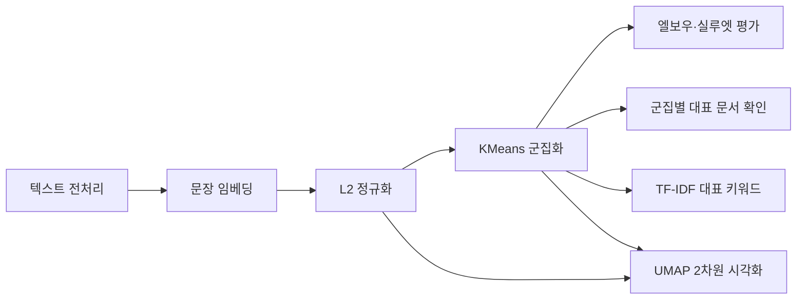
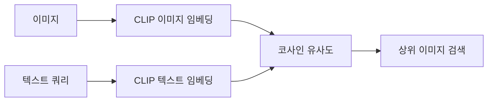

# 군집화·토픽 기초·멀티모달

> 임베딩을 이용해 비슷한 데이터를 자동으로 묶고, 군집을 대표하는 키워드를 추출하며, CLIP으로 이미지와 텍스트를 함께 검색하는 방법.

## 1. KMeans 군집화

### 핵심 개념

KMeans는 정답 라벨 없이 비슷한 데이터를 `k`개 군집으로 나누는 비지도 학습 알고리즘.

- `K`: 만들 군집 수
- `centroid`: 각 군집의 중심점
- 각 점을 가장 가까운 중심점에 배정
- 군집에 포함된 점의 평균 위치로 중심점 갱신
- 배정과 갱신을 중심점이 거의 움직이지 않을 때까지 반복

```text
초기 중심점 선택
      ↓
가장 가까운 중심점에 데이터 배정
      ↓
군집별 평균으로 중심점 이동
      ↓
변화가 거의 없을 때까지 반복
```

KMeans의 군집 번호 `0`, `1`, `2` 자체에는 의미가 없음. 실행 조건이 달라지면 번호가 바뀔 수 있으므로 군집 안의 데이터와 대표 키워드로 해석해야 함.

### 임베딩 군집화

텍스트는 먼저 임베딩으로 변환한 뒤 군집화함.

```python
from sentence_transformers import SentenceTransformer
from sklearn.cluster import KMeans

MODEL_ID = "jhgan/ko-sroberta-multitask"
model = SentenceTransformer(MODEL_ID)

reviews = movie_df["review"].tolist()

# 각 문장을 임베딩하고 벡터 길이를 1로 정규화
review_vectors = model.encode(
    reviews,
    normalize_embeddings=True,
)

kmeans = KMeans(
    n_clusters=3,
    random_state=42,
    n_init=10,
)

cluster_labels = kmeans.fit_predict(review_vectors)

result = movie_df.copy()
result["cluster"] = cluster_labels

display(result[["cluster", "genre", "review"]])
```

> **KMeans는 원본 임베딩에서 수행**하고, UMAP 2차원 좌표는 시각화에만 사용하는 편이 안전함. UMAP 좌표에서 군집화하면 차원 축소 과정의 왜곡이 군집 결과에 반영될 수 있음.

### 실제 라벨과 비교

장르처럼 정답 라벨이 있는 실습 데이터에서는 교차표로 군집 결과를 확인할 수 있음.

```python
compare = pd.crosstab(
    result["cluster"],
    result["genre"],
)

display(compare)
```

교차표는 군집을 만들 때 사용한 정답이 아니라, 군집화가 끝난 뒤 결과를 해석·평가하기 위한 자료.

---

## 2. 거리와 데이터 스케일

KMeans는 기본적으로 **유클리드 거리**를 사용함. 값의 범위가 큰 특성은 거리 계산에 더 큰 영향을 줌.

예:

| 특성 | 값의 범위 |
|---|---:|
| 무게 | 0~1,650g |
| 길이 | 8~63cm |
| 너비 | 1~8cm |

원본 값을 그대로 사용하면 무게가 거리 계산을 거의 지배할 수 있음.

### 표 데이터: StandardScaler

수치형 표 데이터는 각 특성을 평균 0, 표준편차 1로 맞춰 단위 차이를 줄임.

\[
z = \frac{x - \mu}{\sigma}
\]

```python
from sklearn.preprocessing import StandardScaler
from sklearn.cluster import KMeans

features = ["Weight", "Length", "Diagonal", "Height", "Width"]
X = fish[features]

scaler = StandardScaler()
X_scaled = scaler.fit_transform(X)

labels = KMeans(
    n_clusters=7,
    random_state=42,
    n_init=10,
).fit_predict(X_scaled)
```

실무에서는 학습 데이터로 `fit()`한 같은 `scaler`를 저장하고, 새 데이터에는 `transform()`만 적용해야 함.

```python
scaler.fit(train_X)
train_scaled = scaler.transform(train_X)
test_scaled = scaler.transform(test_X)
```

### 텍스트 임베딩: L2 정규화

텍스트 임베딩에는 각 차원을 `StandardScaler`로 바꾸기보다, 벡터 하나의 길이를 1로 만드는 **L2 정규화**를 주로 사용함.

```python
review_vectors = model.encode(
    reviews,
    normalize_embeddings=True,
)
```

| 데이터 | 일반적인 전처리 |
|---|---|
| 단위가 다른 수치형 표 데이터 | `StandardScaler` |
| 코사인 의미를 사용하는 임베딩 | L2 정규화 |

정규화된 임베딩에서는 유클리드 거리와 코사인 유사도가 같은 순위를 만듦. 따라서 유클리드 거리 기반 KMeans에서도 벡터의 방향 차이가 중심적으로 반영됨.

### KMeans의 한계

KMeans는 다음 상황에서 결과가 불안정할 수 있음.

- 군집이 둥근 형태가 아닐 때
- 군집별 크기와 밀도가 크게 다를 때
- 이상치가 많을 때
- 적절한 `k`를 알기 어려울 때
- 의미상 코사인 거리가 적합하지만 벡터 정규화를 하지 않았을 때

따라서 결과를 엘보우·실루엣·도메인 지식으로 함께 확인해야 함.

---

## 3. 군집 수와 품질 평가

### 3-1. 관성과 엘보우 방법

관성(`inertia`)은 각 점과 해당 군집 중심점 사이의 **제곱거리 합**.

- 작을수록 군집 내부가 촘촘함
- `k`를 늘리면 항상 감소함
- 감소 폭이 급격히 작아지는 팔꿈치 지점을 후보 `k`로 선택

```python
import matplotlib.pyplot as plt
from sklearn.cluster import KMeans

k_values = range(1, 9)
inertias = []

for k in k_values:
    model_k = KMeans(
        n_clusters=k,
        random_state=42,
        n_init=10,
    )
    model_k.fit(review_vectors)
    inertias.append(model_k.inertia_)

plt.figure(figsize=(7, 4))
plt.plot(list(k_values), inertias, marker="o")
plt.xlabel("군집 수 k")
plt.ylabel("관성")
plt.title("엘보우 방법")
plt.show()
```

팔꿈치가 항상 뚜렷하게 나타나는 것은 아님.

### 3-2. 실루엣 계수

한 점이 자기 군집에는 얼마나 가깝고, 다른 군집과는 얼마나 떨어져 있는지 측정함.

- `a`: 같은 군집 안의 다른 점까지 평균 거리
- `b`: 가장 가까운 다른 군집까지 평균 거리

\[
s = \frac{b-a}{\max(a,b)}
\]

| 값 | 해석 |
|---:|---|
| 1에 가까움 | 자기 군집에 잘 붙고 다른 군집과 잘 분리됨 |
| 0 근처 | 군집 경계에 위치 |
| 음수 | 다른 군집이 더 가까워 잘못 묶였을 가능성 |

```python
from sklearn.metrics import silhouette_score

rows = []

for k in range(2, 9):
    model_k = KMeans(
        n_clusters=k,
        random_state=42,
        n_init=10,
    )
    labels_k = model_k.fit_predict(review_vectors)

    rows.append({
        "k": k,
        "inertia": model_k.inertia_,
        "silhouette": silhouette_score(review_vectors, labels_k),
    })

score_df = pd.DataFrame(rows)
```

### 평가 지표 해석

| 지표 | 정답 라벨 필요 | 의미 |
|---|---|---|
| 관성 | 필요 없음 | 군집 내부 제곱거리 합 |
| 실루엣 | 필요 없음 | 내부 응집도와 군집 간 분리도 |
| 순도 | 필요 | 각 군집이 실제 라벨 하나로 얼마나 채워졌는지 |
| 교차표 | 필요 | 군집과 실제 라벨의 대응 구조 |

표준화 후 순도는 올라가지만 실루엣은 내려갈 수도 있음. 지표가 보는 기준이 다르기 때문.

- 실루엣: 정답 없이 거리 구조만 평가
- 순도: 실제 정답 라벨과의 일치 정도 평가

`k`는 하나의 지표만으로 결정하지 않고 다음을 함께 고려함.

1. 엘보우의 감소 폭
2. 실루엣 점수
3. 군집별 데이터 수
4. 군집 대표 사례와 키워드
5. 실제 업무에서 필요한 분류 단위

---

## 4. 군집 해석과 대표 키워드

KMeans 결과는 군집 번호만 제공함. 각 군집이 무슨 주제인지 알려면 내부 문장을 확인하거나 대표 키워드를 추출해야 함.

### 기본 흐름

```text
문서 임베딩
    ↓
KMeans 군집화
    ↓
군집별 문서 합치기
    ↓
군집별 특징 단어 계산
    ↓
사람이 군집 이름 해석
```

### 군집별 TF-IDF 키워드

```python
from sklearn.feature_extraction.text import TfidfVectorizer

# result에는 review, cluster 열이 있다고 가정
cluster_docs = (
    result.groupby("cluster")["review"]
          .apply(" ".join)
          .sort_index()
)

vectorizer = TfidfVectorizer(
    token_pattern=r"(?u)\b\w+\b",
)

cluster_tfidf = vectorizer.fit_transform(cluster_docs)
terms = vectorizer.get_feature_names_out()
cluster_ids = cluster_docs.index.to_numpy()

for row_index, cluster_id in enumerate(cluster_ids):
    scores = cluster_tfidf[row_index].toarray().ravel()
    top_indices = scores.argsort()[::-1][:6]
    keywords = terms[top_indices]

    print(f"군집 {cluster_id}: {', '.join(keywords)}")
```

### 한국어 키워드의 문제

원문을 띄어쓰기 기준으로 바로 벡터화하면 다음처럼 불필요한 표현이 대표 단어로 나올 수 있음.

- `좋았어요`
- `이야기예요`
- `정말`
- 조사나 어미가 붙은 단어

따라서 실제 분석에서는 형태소 분석과 불용어 제거 후 군집별 문서를 만드는 편이 좋음.

```python
# tokens 열에 전처리된 형태소 목록이 있다고 가정
result["clean_text"] = result["tokens"].apply(" ".join)

cluster_docs = (
    result.groupby("cluster")["clean_text"]
          .apply(" ".join)
          .sort_index()
)
```

대표 키워드는 군집 이름을 자동으로 확정하는 정답이 아님. 상위 문서와 함께 읽고 사람이 최종 주제를 붙여야 함.

> 군집별 문서를 합쳐 TF-IDF 상위어를 뽑는 방식은 **군집 해석용 대표 키워드 추출**에 가까움. 이것만으로 LDA 같은 전통적 토픽 모델 전체와 같다고 보기는 어려움.

---

## 5. UMAP으로 군집 시각화

UMAP은 군집화 알고리즘이 아니라 고차원 벡터를 2차원으로 줄이는 차원 축소 알고리즘.

- KMeans: 원본 임베딩에서 군집 계산
- UMAP: 군집 결과를 사람이 보기 쉽게 표현

```python
from umap import UMAP
import matplotlib.pyplot as plt

coords_2d = UMAP(
    n_components=2,
    n_neighbors=5,
    min_dist=0.05,
    metric="cosine",
    random_state=42,
).fit_transform(review_vectors)

plt.figure(figsize=(7, 5))

for cluster_id in sorted(result["cluster"].unique()):
    mask = result["cluster"].to_numpy() == cluster_id

    plt.scatter(
        coords_2d[mask, 0],
        coords_2d[mask, 1],
        label=f"군집 {cluster_id}",
        alpha=0.8,
    )

plt.xlabel("UMAP 1")
plt.ylabel("UMAP 2")
plt.title("리뷰 임베딩 군집 시각화")
plt.legend()
plt.show()
```

주의:

- UMAP 축 자체에는 의미가 없음
- 군집 사이의 거리와 크기를 정확한 수치처럼 해석하면 안 됨
- 매개변수와 난수에 따라 모양이 달라질 수 있음
- 표본이 매우 적으면 그림이 과도하게 잘 분리되어 보일 수 있음
- 최종 군집 품질은 원본 임베딩에서 평가

---

## 6. CLIP 이미지·텍스트 임베딩

### CLIP의 역할

CLIP은 이미지와 텍스트를 같은 임베딩 공간에 배치하는 멀티모달 모델.

가능한 작업:

- 이미지끼리 유사도 비교
- 비슷한 이미지 찾기
- 텍스트로 이미지 검색
- 이미지 자동 분류의 기초

### 이미지 임베딩

```python
from pathlib import Path
from PIL import Image
from sentence_transformers import SentenceTransformer

clip_model = SentenceTransformer("clip-ViT-B-32")

image_paths = sorted(Path("data/photos").glob("*/*.jpg"))
images = [Image.open(path).convert("RGB") for path in image_paths]

image_vectors = clip_model.encode(
    images,
    normalize_embeddings=True,
)

print(image_vectors.shape)
```

### 가장 비슷한 이미지 찾기

정규화된 벡터에서는 내적이 코사인 유사도와 같음.

```python
import numpy as np

image_scores = image_vectors @ image_vectors.T

target_index = 0
scores = image_scores[target_index].copy()

# 자기 자신은 검색 결과에서 제외
scores[target_index] = -np.inf
nearest_index = int(np.argmax(scores))

print("기준 이미지:", image_paths[target_index])
print("가장 비슷한 이미지:", image_paths[nearest_index])
print("유사도:", round(float(scores[nearest_index]), 3))
```

기존 예시에서 가장 가까운 사진의 카테고리를 출력할 때는 `image_cats[target]`이 아니라 `image_cats[nearest]`를 사용해야 함.

### 텍스트로 이미지 검색

이미지와 텍스트를 **같은 CLIP 모델**로 임베딩해야 직접 비교할 수 있음.

```python
queries = [
    "a photo of a cat",
    "a photo of a car",
    "a photo of a ship",
]

query_vectors = clip_model.encode(
    queries,
    normalize_embeddings=True,
)

# 행: 텍스트 쿼리, 열: 이미지
query_image_scores = query_vectors @ image_vectors.T

for query_index, query in enumerate(queries):
    best_index = int(np.argmax(query_image_scores[query_index]))
    best_score = float(query_image_scores[query_index, best_index])

    print(
        query,
        "->",
        image_paths[best_index],
        round(best_score, 3),
    )
```

### CLIP 점수 해석

코사인 유사도의 기준선은 모델과 비교 대상에 따라 달라짐.

- 이미지↔이미지 점수 분포
- 텍스트↔이미지 점수 분포
- 서로 다른 임베딩 모델의 점수 분포

이 값들은 직접 같은 기준으로 비교하기 어려움.

따라서 다음 방식으로 해석함.

- 같은 모델 안에서 상대 순위 비교
- 같은 검색 조건의 양성·음성 예시로 기준값 검증
- 실제 검색 결과의 정확도 측정
- `0.7 이상이면 유사` 같은 공통 기준 사용 금지

### 한국어 쿼리

`clip-ViT-B-32` 예시는 영어 중심 모델이라 한국어 검색 결과가 불안정할 수 있음.

대응 방법:

- 쿼리를 영어로 번역
- 한국어 또는 다국어 텍스트를 학습한 멀티모달 모델 사용
- 실제 한국어 검색 데이터로 성능 평가

단순히 한국어 문자열을 `encode()`할 수 있다는 사실이 한국어 의미를 잘 이해한다는 뜻은 아님.

---

## 7. 전체 작업 흐름

### 텍스트 군집화



### 멀티모달 검색



---

## 핵심 코드 치트시트

| 작업 | 코드 |
|---|---|
| KMeans 생성 | `KMeans(n_clusters=k, random_state=42, n_init=10)` |
| 군집 학습·예측 | `fit_predict(X)` |
| 중심점 | `model.cluster_centers_` |
| 관성 | `model.inertia_` |
| 표 데이터 표준화 | `StandardScaler().fit_transform(X)` |
| 임베딩 L2 정규화 | `model.encode(texts, normalize_embeddings=True)` |
| 실루엣 평균 | `silhouette_score(X, labels)` |
| 점별 실루엣 | `silhouette_samples(X, labels)` |
| 교차표 | `pd.crosstab(cluster, label)` |
| 대표 키워드 | `TfidfVectorizer()` |
| 2차원 시각화 | `UMAP(...).fit_transform(X)` |
| CLIP 불러오기 | `SentenceTransformer("clip-ViT-B-32")` |
| 이미지 검색 | `query_vectors @ image_vectors.T` |
| 큰 순서 정렬 | `np.argsort(-scores)` |

## 최종 정리

- KMeans는 정답 없이 가까운 데이터를 `k`개 군집으로 묶음.
- 텍스트 군집화는 UMAP 좌표가 아니라 원본 임베딩에서 수행하는 편이 안전함.
- 수치형 표 데이터는 `StandardScaler`, 코사인 기반 임베딩은 L2 정규화를 주로 사용함.
- `k`는 엘보우·실루엣·군집 해석·도메인 지식을 함께 보고 결정함.
- 군집 번호 자체에는 의미가 없으므로 대표 문서와 키워드로 해석해야 함.
- 군집별 TF-IDF는 대표 키워드 추출의 기초이며, 한국어는 형태소 분석과 불용어 제거가 중요함.
- UMAP은 시각화용 차원 축소이며, 실제 군집 평가와 계산은 원본 공간에서 수행함.
- CLIP은 이미지와 텍스트를 같은 공간에 배치해 글로 사진을 검색할 수 있게 함.
- 유사도 절댓값은 모델마다 다르므로 같은 모델 안에서 상대 순위와 실제 성능으로 판단함.
