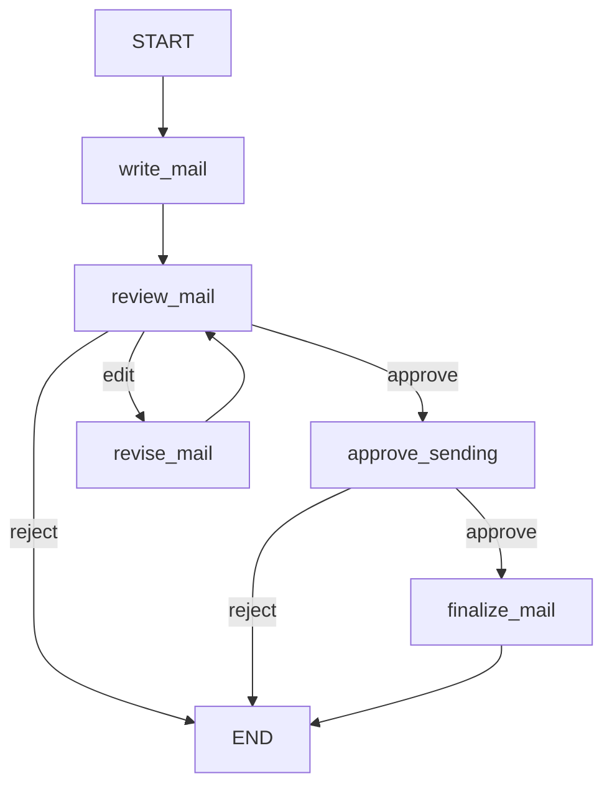

# LangGraph 실전 코드 - 메일 AI 비서

> 메일 초안 작성 → 내용 검토 → 수정 → 발송 승인 → 최종 확정 흐름을 LangGraph로 구성한다.
>
> **참고:** 원본 문서는 `5번 → 7번`으로 이어지며 **6번 항목이 없다.** 또한 8번에서 `finalize_mail`을 사용하지만 해당 함수 정의는 원본에 포함되어 있지 않다.

## 전체 흐름

```text
START
  ↓
write_mail
  ↓
review_mail
  ├─ approve → approve_sending
  │               ├─ approve → finalize_mail → END
  │               └─ reject  → END
  ├─ edit → revise_mail ─────→ review_mail
  └─ reject → END
```

---

## 0. 기본 준비

입력 메일·사용자 상황·작성 규칙을 JSON에서 불러온다.

### 코드

```python
mail_packet = json.loads(
    (data_dir / "assignment02_mail.json").read_text(encoding="utf-8")
)

for name, value in mail_packet.items():
    print(name + ":")
    print(value)

from uuid import uuid4
from langgraph.config import get_stream_writer
```

### 결과

```text
incoming:
수신: 김서현 / 발신: 한빛파트너스 박지훈
제목: 제품 소개 미팅 요청
다음 주 수요일 15시에 온라인으로 제품 소개를 듣고 싶습니다.
미리 견적서와 소개 자료를 받을 수 있을까요?

context:
사용자: 김서현, 새봄솔루션 영업 담당.
다음 주 수요일은 일정이 있고 목요일 10시 또는 14시에 30분 미팅 가능.
제품 소개 PDF는 공유 가능.
견적은 요구사항을 확인한 뒤 산정하며 금액과 전달일은 아직 미정.
미팅 시간은 상대방의 회신을 받아 확정한다.

rules:
정중하고 간결한 한국어 업무 메일.
제목과 본문을 포함한다.
요청에 빠짐없이 답하고, 가능한 선택지를 제안하되 미확정 사항을 약속하지 않는다.
자료 전달·미팅 확정·메일 발송을 실제 완료했다고 쓰지 않는다.
입력에 없는 확인 시점·방법·추가 절차를 약속하지 않는다.
```

---

## 1. 메일 검토 State 생성

메일 작성부터 최종 승인까지 필요한 상태값을 하나의 `MailState`로 관리한다.

### 코드

```python
class MailState(TypedDict):
    incoming: str
    context: str
    rules: str
    draft: str
    decision: str
    feedback: str
    send_decision: str
    approved_mail: str


mail_input: MailState = {
    "incoming": mail_packet["incoming"],
    "context": mail_packet["context"],
    "rules": mail_packet["rules"],
    "draft": "",
    "decision": "",
    "feedback": "",
    "send_decision": "",
    "approved_mail": "",
}

print("State:", MailState.__annotations__)
print(
    "초기 판단:",
    repr(mail_input["decision"]),
    repr(mail_input["send_decision"]),
)
```

### 결과

```text
State: {
    'incoming': <class 'str'>,
    'context': <class 'str'>,
    'rules': <class 'str'>,
    'draft': <class 'str'>,
    'decision': <class 'str'>,
    'feedback': <class 'str'>,
    'send_decision': <class 'str'>,
    'approved_mail': <class 'str'>
}
초기 판단: '' ''
```

---

## 2. 회신 작성 노드 만들기 - 노드 A

LLM이 받은 메일과 사용자 상황을 기반으로 첫 회신 초안을 작성한다.

### 코드

```python
mail_prompt = ChatPromptTemplate.from_messages([
    (
        "system",
        "사용자의 업무 메일 비서입니다. 받은 메일의 요청에 답하는 회신 초안을 작성하세요. "
        "제목과 본문을 쓰고 사용자 상황에 없는 약속은 만들지 마세요.\n"
        "작성 기준:\n{rules}",
    ),
    (
        "human",
        "받은 메일:\n{incoming}\n사용자 상황:\n{context}",
    ),
])

mail_chain = mail_prompt | llm


def write_mail(state: MailState):
    """입력 자료로 회신 초안을 작성합니다."""
    writer = get_stream_writer()
    writer({
        "stage": "writing",
        "message": "회신 초안을 작성합니다.",
    })

    response = mail_chain.invoke({
        "incoming": state["incoming"],
        "context": state["context"],
        "rules": state["rules"],
    })

    return {"draft": response.text}


# 회신 생성 테스트
test_response = mail_chain.invoke({
    "incoming": mail_input["incoming"],
    "context": mail_input["context"],
    "rules": mail_input["rules"],
})

display(test_response.content)
```

### 결과

LLM 응답의 내부 메타데이터·reasoning 정보는 생략하고 실제 메일 본문만 남긴다.

```text
[
  ...,
  {
    'type': 'text',
    'text': '**제목: Re: 제품 소개 미팅 요청**\n\n'
            '박지훈님, 안녕하세요. 새봄솔루션 김서현입니다.\n\n'
            '문의 주신 다음 주 수요일 15시는 일정상 참석이 어렵습니다. '
            '대신 다음 주 목요일 10시 또는 14시에 30분간 온라인 미팅이 가능합니다. ...\n\n'
            '제품 소개 PDF는 공유 가능합니다. '
            '견적서는 미팅을 통해 요구사항을 확인한 후 산정할 예정이며, '
            '구체적인 금액과 전달 일정은 확인 후 안내드리겠습니다.\n\n'
            '감사합니다.\n김서현 드림'
  }
]
```

---

## 3. 내용 검토를 기다리는 노드 만들기 - 노드 B

`interrupt()`로 실행을 멈추고 사용자의 승인·수정·반려 입력을 기다린다.

### 코드

```python
def review_mail(state: MailState):
    """현재 초안에 대한 사용자의 선택과 편집 내용을 반환합니다."""
    request = {
        "stage": "content_review",
        "draft": state["draft"],
        "actions": ["approve", "edit", "reject"],
    }
    response = interrupt(request)

    draft = state["draft"]

    # 직접 수정한 내용을 승인한 경우 수정본을 그대로 사용
    if response["action"] == "approve" and response.get("edited_text", "").strip():
        draft = response["edited_text"]

    return {
        "decision": response["action"],
        "feedback": response.get("feedback", ""),
        "draft": draft,
    }


from unittest.mock import patch

test_state = {
    **mail_input,
    "draft": "안녕하세요. 요청하신 내용을 확인했습니다.",
}

with patch.dict(globals(), {
    "interrupt": lambda request: {
        "action": "approve",
        "feedback": "",
        "edited_text": "안녕하세요. 요청하신 내용을 확인했습니다. 감사합니다.",
    }
}):
    test_result = review_mail(test_state)
    print(test_result)
```

### 결과

```text
{
    'decision': 'approve',
    'feedback': '',
    'draft': '안녕하세요. 요청하신 내용을 확인했습니다. 감사합니다.'
}
```

---

## 4. 수정 노드 제작 - 노드 C

사용자의 수정 의견을 반영해 초안을 다시 작성하고, 내용 승인 상태를 초기화한다.

### 코드

```python
mail_revision_prompt = ChatPromptTemplate.from_messages([
    (
        "system",
        "업무 메일 초안을 사용자 의견에 따라 수정하세요. "
        "원래 요청에 대한 답변과 확인된 사실을 유지하세요. "
        "의견에 없는 사실이나 약속을 새로 만들지 마세요.\n"
        "작성 기준:\n{rules}",
    ),
    (
        "human",
        "받은 메일:\n{incoming}\n"
        "사용자 상황:\n{context}\n"
        "현재 초안:\n{draft}\n"
        "수정 의견:\n{feedback}",
    ),
])

mail_revision_chain = mail_revision_prompt | llm


def revise_mail(state: MailState):
    """의견을 반영한 초안과 비운 내용 검토 결과를 반환합니다."""
    writer = get_stream_writer()
    writer({"stage": "revising", "message": "수정 의견을 반영합니다."})

    response = mail_revision_chain.invoke({
        "incoming": state["incoming"],
        "context": state["context"],
        "rules": state["rules"],
        "draft": state["draft"],
        "feedback": state["feedback"],
    })

    return {
        "draft": response.text,
        "decision": "",
    }


# 수정 체인 테스트
test_response = mail_revision_chain.invoke({
    "incoming": mail_input["incoming"],
    "context": mail_input["context"],
    "rules": mail_input["rules"],
    "draft": "안녕하세요. 요청하신 내용을 확인했습니다.",
    "feedback": "조금 더 정중하게 작성해 주세요.",
})

print(test_response.text)
```

### 결과

```text
제목: 제품 소개 미팅 일정 및 자료 관련 회신

박지훈님, 안녕하세요.
새봄솔루션 김서현입니다.

제품 소개 미팅을 요청해 주셔서 감사합니다.
말씀해 주신 다음 주 수요일 15시는 일정상 참석이 어려워,
다음 주 목요일 10시 또는 14시 중 30분간 온라인 미팅이 가능합니다.
가능하신 시간을 회신해 주시면 일정 확정에 참고하겠습니다.

제품 소개 PDF는 공유 가능하며,
견적서는 요구사항을 확인한 후 산정할 예정입니다.
따라서 현재 견적 금액과 전달 일정은 아직 확정되지 않은 점 양해 부탁드립니다.

감사합니다.
김서현 드림
```

---

## 5. 최종 발송 승인을 기다리기 - 노드 D

내용 검토와 별개로 실제 발송 여부를 한 번 더 승인받는다.

### 코드

```python
def approve_sending(state: MailState):
    """현재 메일의 발송 승인 또는 반려를 반환합니다."""
    request = {
        "stage": "send_approval",
        "draft": state["draft"],
        "actions": ["approve", "reject"],
    }

    response = interrupt(request)

    return {
        "send_decision": response["action"],
    }


from unittest.mock import patch

test_state = {
    **mail_input,
    "draft": "안녕하세요. 요청하신 내용을 확인했습니다.",
}

with patch.dict(globals(), {
    "interrupt": lambda request: {"action": "approve"}
}):
    print(approve_sending(test_state))
```

### 결과

```text
{'send_decision': 'approve'}
```

> **원본 누락:** 문서에는 6번 항목과 `finalize_mail()` 정의가 보이지 않는다. 이후 그래프에서는 `finalize_mail` 노드를 사용한다.

---

## 7. 두 검토의 경로 함수 작성 - 노드 E

내용 검토와 발송 검토의 결과를 다음 노드 이름으로 변환한다.

### 코드

```python
def route_mail(state: MailState):
    decision = state["decision"]

    if decision == "approve":
        return "approve"
    if decision == "edit":
        return "edit"

    return "reject"


def route_sending(state: MailState):
    send_decision = state["send_decision"]

    if send_decision == "approve":
        return "approve"

    return "reject"


for action in ["approve", "edit", "reject"]:
    print(
        "내용:", action,
        "->", route_mail({**mail_input, "decision": action})
    )

for action in ["approve", "reject"]:
    print(
        "발송:", action,
        "->", route_sending({**mail_input, "send_decision": action})
    )
```

### 결과

```text
내용: approve -> approve
내용: edit -> edit
내용: reject -> reject
발송: approve -> approve
발송: reject -> reject
```

---

## 8. 노드와 엣지 연결

노드와 조건부 엣지를 연결하고 체크포인터를 붙여 `interrupt` 상태를 유지한다.

### 코드

```python
mail_builder = StateGraph(MailState)

# 노드 등록
mail_builder.add_node("write_mail", write_mail)
mail_builder.add_node("review_mail", review_mail)
mail_builder.add_node("revise_mail", revise_mail)
mail_builder.add_node("approve_sending", approve_sending)
mail_builder.add_node("finalize_mail", finalize_mail)

# 시작 → 초안 작성 → 내용 검토
mail_builder.add_edge(START, "write_mail")
mail_builder.add_edge("write_mail", "review_mail")

# 내용 검토 결과 분기
mail_builder.add_conditional_edges(
    "review_mail",
    route_mail,
    {
        "approve": "approve_sending",
        "edit": "revise_mail",
        "reject": END,
    },
)

# 수정 후 다시 내용 검토
mail_builder.add_edge("revise_mail", "review_mail")

# 발송 승인 결과 분기
mail_builder.add_conditional_edges(
    "approve_sending",
    route_sending,
    {
        "approve": "finalize_mail",
        "reject": END,
    },
)

# 최종 확정 후 종료
mail_builder.add_edge("finalize_mail", END)

# 체크포인터 연결
mail_saver = InMemorySaver()
mail_graph = mail_builder.compile(checkpointer=mail_saver)

# 그래프 구조 확인
from IPython.display import Image, display

display(Image(mail_graph.get_graph().draw_mermaid_png()))
```

### 결과

원본 그래프 이미지를 텍스트 흐름으로 바꾸면 다음과 같다.



---

## 9. 초안을 스트리밍하고 검토 요청 읽기

여러 스트림 모드로 실행한 뒤 첫 `content_review` interrupt에서 멈춘 상태를 확인한다.

### 코드

```python
mail_config = {
    "configurable": {
        "thread_id": f"mail-{uuid4()}"
    }
}

mail_stream = mail_graph.stream(
    mail_input,
    mail_config,
    stream_mode=["messages", "updates", "values", "custom"],
    version="v2",
)

mail_stream_modes = show_mail_stream(mail_stream)

mail_snapshot = mail_graph.get_state(mail_config)
mail_request = mail_snapshot.interrupts[0]

print(mail_request)
```

### 결과

```text
진행: 사용자 검토 대기

제목: Re: 제품 소개 미팅 요청

박지훈님, 안녕하세요.
새봄솔루션 김서현입니다.

문의 주신 다음 주 수요일 15시는 일정상 미팅이 어렵습니다.
대신 다음 주 목요일 10시 또는 14시에 온라인으로 30분간 미팅 가능합니다.
가능하신 시간을 회신해 주시면 일정 확정하겠습니다.

제품 소개 PDF는 공유 가능하며,
견적서는 미팅을 통해 요구사항을 확인한 후 산정할 예정입니다.
따라서 현재 금액과 전달 일정은 아직 확정되지 않은 점 양해 부탁드립니다.

감사합니다.
김서현 드림

{'내용 검토': '', '발송 승인': ''}
```

```text
Interrupt(
    value={
        'stage': 'content_review',
        'draft': '...',
        'actions': ['approve', 'edit', 'reject']
    },
    id='...'
)
```

---

## 10. 수정 의견 전달 후 다시 검토하기

현재 interrupt ID에 `edit` 응답을 전달해 같은 작업을 이어 실행한다.

### 코드

```python
mail_snapshot = mail_graph.get_state(mail_config)
mail_request = mail_snapshot.interrupts[0]

edit_response = {
    "action": "edit",
    "feedback": (
        "가능한 미팅 시간은 목요일 오전 10시 하나만 제안하고, "
        "견적은 요구사항 확인 후 안내한다고 간결하게 써 주세요."
    ),
}

revision_stream = mail_graph.stream(
    Command(resume={mail_request.id: edit_response}),
    mail_config,
    stream_mode=["messages", "updates", "values", "custom"],
    version="v2",
)

revision_stream_modes = show_mail_stream(revision_stream)

revised_snapshot = mail_graph.get_state(mail_config)
revised_request = revised_snapshot.interrupts[0]

print("다시 검토할 단계:", revised_request.value["stage"])
display(Markdown(revised_request.value["draft"]))
```

### 결과

```text
다시 검토할 단계: content_review
```

```text
제목: Re: 제품 소개 미팅 요청

박지훈님, 안녕하세요.
새봄솔루션 김서현입니다.

요청하신 다음 주 수요일 15시는 일정상 어렵습니다.
대신 다음 주 목요일 오전 10시에 온라인으로 30분간 미팅 가능하오니,
가능 여부를 회신해 주시면 감사하겠습니다.

제품 소개 PDF는 공유 가능하며,
견적은 요구사항 확인 후 안내드리겠습니다.

감사합니다.
김서현 드림
```

---

## 11. 직접 편집한 메일 내용 승인하기

직접 수정한 텍스트는 LLM에 다시 보내지 않고 그대로 내용 승인한다.

### 코드

```python
edited_text = (
    revised_request.value["draft"]
    + "\n\n추가로 궁금하신 사항이 있으면 회신 부탁드립니다."
)

content_response = {
    "action": "approve",
    "edited_text": edited_text,
}

content_result = mail_graph.invoke(
    Command(resume={revised_request.id: content_response}),
    mail_config,
)

content_snapshot = mail_graph.get_state(mail_config)
send_request = content_snapshot.interrupts[0]

print("draft 동일:", content_snapshot.values["draft"] == edited_text)
print("approved_mail:", content_snapshot.values["approved_mail"])
print("다음 요청:", send_request.value)
```

### 결과

```text
draft 동일: True
approved_mail:
다음 요청: {
    'stage': 'send_approval',
    'draft': '...추가로 궁금하신 사항이 있으면 회신 부탁드립니다.',
    'actions': ['approve', 'reject']
}
```

**핵심:** 내용 승인이 끝나도 `approved_mail`은 아직 비어 있다. 발송 승인 전에는 최종 확정하지 않는다.

---

## 12. 발송 승인 후 확정문 저장

발송까지 승인하면 최종 메일을 `approved_mail`에 저장한다.

### 코드

```python
send_request = mail_graph.get_state(mail_config).interrupts[0]

mail_result = mail_graph.invoke(
    Command(resume={send_request.id: {"action": "approve"}}),
    mail_config,
)

final_snapshot = mail_graph.get_state(mail_config)

print(final_snapshot.values["approved_mail"] == edited_text)
print(final_snapshot.values["approved_mail"])
```

### 결과

```text
True
```

```text
제목: Re: 제품 소개 미팅 요청

박지훈님, 안녕하세요.
새봄솔루션 김서현입니다.

요청하신 다음 주 수요일 15시는 일정상 어렵습니다.
대신 다음 주 목요일 오전 10시에 온라인으로 30분간 미팅 가능하오니,
가능 여부를 회신해 주시면 감사하겠습니다.

제품 소개 PDF는 공유 가능하며,
견적은 요구사항 확인 후 안내드리겠습니다.

감사합니다.
김서현 드림

추가로 궁금하신 사항이 있으면 회신 부탁드립니다.
```

---

## 13. 이벤트 스트리밍으로 읽고 내용 단계에서 반려하기

다른 메일 입력으로 실행하고, 첫 내용 검토 단계에서 바로 반려한다.

### 코드

```python
other_mail_input = {
    **mail_input,
    "incoming": "협력사에서 내부 제품 로드맵과 공개 제품 소개 자료를 함께 요청했습니다.",
    "context": (
        "공개 제품 소개 자료만 공유할 수 있습니다. "
        "내부 로드맵은 외부 제공 대상이 아닙니다. "
        "자료를 실제 전달하기 전 담당자 승인이 필요합니다."
    ),
}

rejection_config = {
    "configurable": {
        "thread_id": f"mail-content-reject-{uuid4()}"
    }
}

# 이벤트 스트리밍 실행
event_run = mail_graph.stream_events(
    other_mail_input,
    rejection_config,
    version="v3",
)

event_text = display(Markdown(""), display_id=True)
event_state = display({}, display_id=True)

for kind, item in event_run.interleave("values", "messages"):
    if kind == "values":
        event_state.update({
            "내용 검토": item["decision"],
            "확정문": item["approved_mail"],
        })

    elif kind == "messages":
        chunks = []
        for text in item.text:
            chunks.append(text)
        event_text.update(Markdown("".join(chunks)))

# 첫 interrupt까지 실행 결과 읽기
event_output = event_run.output

event_snapshot = mail_graph.get_state(rejection_config)
event_request = event_snapshot.interrupts[0]

# 내용 검토 단계에서 reject
rejected_run = mail_graph.stream_events(
    Command(resume={event_request.id: {"action": "reject"}}),
    rejection_config,
    version="v3",
)

content_rejected = rejected_run.output

print("첫 대기:", event_run.interrupted, event_request.value["stage"])
display(Markdown(event_output["draft"]))
print("내용 반려:", content_rejected["decision"])
print(
    "발송 판단과 확정문:",
    repr(content_rejected["send_decision"]),
    repr(content_rejected["approved_mail"]),
)
print("남은 실행:", mail_graph.get_state(rejection_config).next)
```

### 결과

원본 문서에는 이 코드의 최종 출력값이 별도로 기록되어 있지 않다.

**핵심:** 내용 단계에서 `reject`하면 발송 승인 단계로 넘어가지 않고 종료된다.

---

## 14. 발송 단계에서 반려해도 확정되지 않는지 확인

별도 thread에서 내용은 승인하고 발송만 반려해, 다른 작업의 확정문에 영향을 주지 않는지 확인한다.

### 코드

```python
send_reject_config = {
    "configurable": {
        "thread_id": f"mail-send-reject-{uuid4()}"
    }
}

# 새 작업 시작 → 내용 검토 단계에서 중단
mail_graph.invoke(other_mail_input, send_reject_config)
request = mail_graph.get_state(send_reject_config).interrupts[0]

# 내용 승인
mail_graph.invoke(
    Command(resume={request.id: {"action": "approve"}}),
    send_reject_config,
)

# 새 발송 승인 요청 읽기
request = mail_graph.get_state(send_reject_config).interrupts[0]
print("반려할 단계:", request.value["stage"])

# 발송 단계에서 반려
send_rejected = mail_graph.invoke(
    Command(resume={request.id: {"action": "reject"}}),
    send_reject_config,
)

# 12번에서 승인한 기존 작업의 확정문 유지 여부 확인
approved_mail = mail_graph.get_state(mail_config).values["approved_mail"]
print("12번 승인 메일 유지:", approved_mail == edited_text)
```

### 결과

```text
반려할 단계: send_approval
12번 승인 메일 유지: True
```

**핵심:** `thread_id`가 다르면 작업 상태도 분리된다. 한 작업의 반려가 이미 승인된 다른 작업의 `approved_mail`을 변경하지 않는다.

---

# 핵심 정리

- `MailState`: 메일 작성·검토·승인 상태를 공유하는 데이터 구조
- `interrupt()`: 사람의 승인이나 수정 입력이 올 때까지 그래프 실행을 중단
- `Command(resume=...)`: 중단된 동일 작업을 사용자 응답과 함께 재개
- `InMemorySaver`: interrupt 전후 상태를 thread별로 보존
- `thread_id`: 서로 다른 메일 작업의 상태를 분리
- `conditional_edges`: 승인·수정·반려 결과에 따라 다음 노드를 분기
- **내용 승인과 발송 승인을 분리**해 최종 확정 전 두 번 확인
