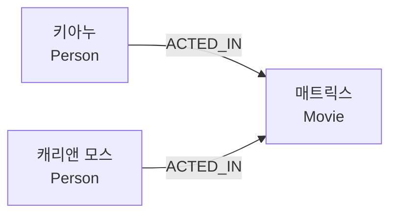
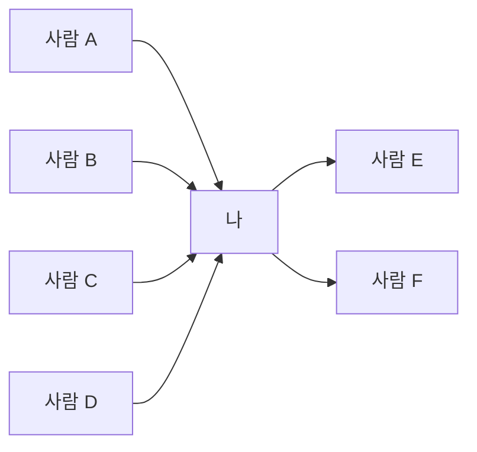
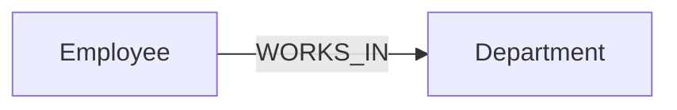
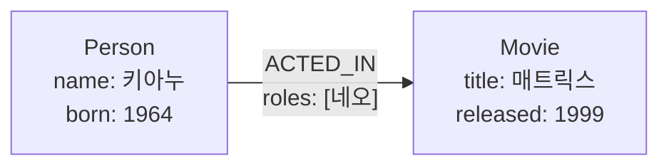
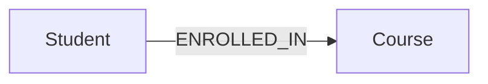
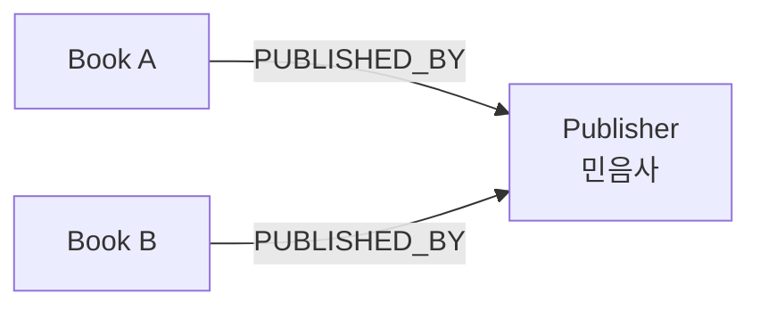
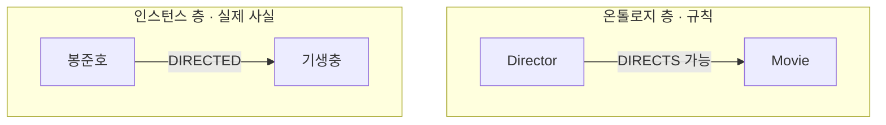
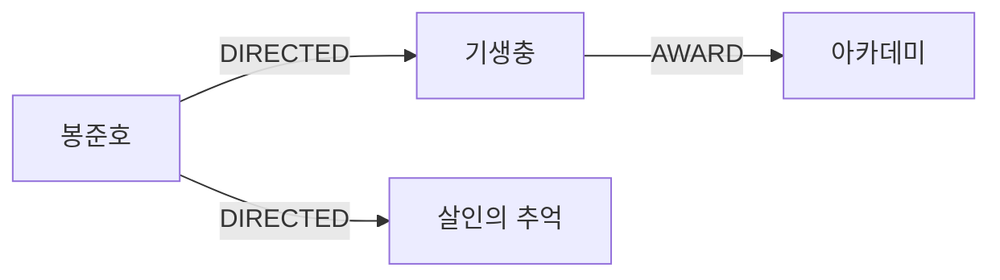
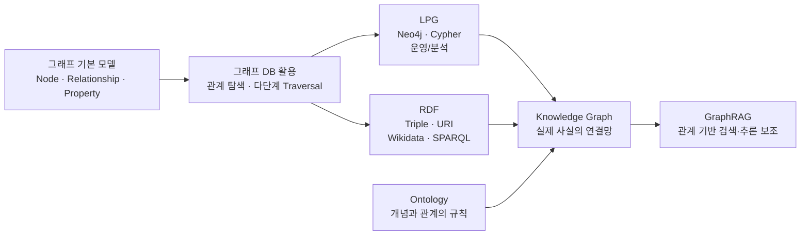

# 그래프 데이터베이스 · 온톨로지 · 지식 그래프

> 그래프의 기본 구조부터 GraphRAG, LPG, RDF, 온톨로지, 지식 그래프까지 연결해서 보는 정리.

---

## 1. 그래프의 기본 구성요소

그래프는 **노드(Node)**와 **관계(Relationship)**를 중심으로 데이터를 표현한다.

| 개념 | 의미 | 다른 표현 |
|---|---|---|
| 노드(Node) | 하나의 개체 | 정점(Vertex) |
| 관계(Relationship) | 노드와 노드를 연결하는 선 | 엣지(Edge), 간선 |
| 속성(Property) | 노드나 관계에 붙는 `key: value` 정보 | - |
| 순회(Traversal) | 관계를 따라 다른 노드로 이동하는 것 | - |

### 기본 예시



그래프에서는 **개별 데이터보다 어떤 노드가 어떤 관계로 연결되어 있는가**가 중요하다.

---

## 2. Hop과 Degree

### Hop

**Hop**은 관계를 몇 번 따라 이동했는지를 의미한다.

```text
나 → 친구                = 1-hop
나 → 친구 → 친구         = 2-hop
나 → 친구 → 친구 → 친구  = 3-hop
```

즉, **관계를 한 번 타고 이동할 때마다 1-hop**이다.

### Degree

**Degree(차수)**는 한 노드에 연결된 관계의 수다.

방향 그래프에서는 들어오는 관계와 나가는 관계를 구분한다.

| 종류 | 의미 |
|---|---|
| In-degree | 해당 노드로 들어오는 관계 수 |
| Out-degree | 해당 노드에서 나가는 관계 수 |



위 예시라면:

```text
in-degree  = 4
out-degree = 2
```

차수는 노드의 연결 정도를 보는 간단한 지표로 사용할 수 있다.  
단, **관계의 종류와 의미를 함께 봐야 실제 중요성을 판단할 수 있다.**

---

# 3. 그래프 데이터베이스(Graph Database)

그래프 데이터베이스는 데이터를 **노드와 관계로 직접 저장하는 데이터베이스**다.

## 관계형 DB와의 차이

### 관계형 DB

관계형 DB는 테이블을 중심으로 데이터를 저장하고, 필요한 관계를 `JOIN` 등을 통해 조회한다.

```text
Employee
   │ dept_id
   ▼
Department
```

### 그래프 DB

그래프 DB는 관계 자체를 데이터 구조에 포함한다.



따라서 여러 단계의 관계를 계속 따라가야 하는 탐색에 유리하다.

> 그래프 DB가 항상 더 빠른 것은 아니다.  
> 대규모 집계나 단순한 표 형태의 분석은 관계형 DB가 더 적합할 수 있다.

---

## 3.1 Index-free Adjacency

대표적인 그래프 DB에서는 각 노드가 인접한 관계를 통해 다음 노드로 바로 이동할 수 있는 구조를 사용한다.

```text
현재 노드
   ↓
연결된 관계
   ↓
이웃 노드
   ↓
다음 관계
   ↓
다음 노드
```

그래서 전체 테이블에서 매번 연결 대상을 다시 찾는 방식보다 **다단계 관계 탐색에 유리하다.**

---

# 4. 벡터 검색만으로 어려운 질문

벡터 검색은 **질문과 의미적으로 가까운 문단을 찾는 것**에 강하다.

하지만 다음과 같은 질문은 문단 하나만 찾아서는 답하기 어렵다.

```text
"매트릭스에 나온 배우가 출연한 다른 영화는?"
```

필요한 연결은 다음과 같다.


벡터 검색은 관련 문서는 찾을 수 있어도,  
**문단과 문단 사이의 관계를 명시적으로 따라가야 하는 질문**은 약할 수 있다.

### 그래프가 필요한 질문

- 연결을 여러 단계 따라가야 하는 질문
- 여러 문서에 분산된 사실을 연결해야 하는 질문
- 전체적인 관계 구조가 중요한 질문
- "무엇이 무엇과 이어져 있는가?"가 핵심인 질문

이런 문제에서 **지식 그래프 + 검색**을 이용하는 GraphRAG가 활용될 수 있다.

---

# 5. LPG(Labeled Property Graph)

LPG는 **레이블이 붙은 속성 그래프**다.

대표적인 LPG 기반 그래프 DB가 **Neo4j**다.

## 구성요소

| 요소 | 역할 | 예 |
|---|---|---|
| Label | 노드의 종류 | `:Person`, `:Movie` |
| Relationship Type | 관계의 종류 | `:ACTED_IN` |
| Property | 노드·관계의 세부 정보 | `name`, `born`, `roles` |

### 표현 예시

```text
(:Person {name:'키아누', born:1964})
-[:ACTED_IN {roles:['네오']}]>
(:Movie {title:'매트릭스', released:1999})
```

이를 그림으로 보면:



---

## 5.1 LPG 표기법

```text
( )     → 노드
:Label  → 레이블
[ ]     → 관계
{ }     → 속성
```

### 노드

```text
(:Person {name:'키아누'})
```

### 관계

```text
-[:ACTED_IN]->
```

### 관계에도 속성을 붙일 수 있음

```text
-[:ACTED_IN {roles:['네오']}]>
```

### 한 노드에 여러 레이블도 가능

```text
(:Person:Director)
```

---

# 6. 관계형 DB를 그래프로 옮겨 보기

관계형 DB의 구조는 그래프로 옮기면 다음과 같이 대응할 수 있다.

| 관계형 DB | 그래프 | 예 |
|---|---|---|
| 테이블 | 레이블 | 직원 테이블 → `:Employee` |
| 행 하나 | 노드 하나 | 김민준 행 → 김민준 노드 |
| 컬럼 값 | 노드 속성 | `name: '김민준'` |
| 외래 키 | 관계 | `dept_id` → `[:WORKS_IN]` |
| N:M 조인 테이블 | 관계 | 수강 테이블 → `[:ENROLLED_IN]` |

### 가장 큰 변화

관계형 DB에서는 N:M 관계를 표현하기 위해 중간 조인 테이블이 필요한 경우가 많다.

```text
Student
   │
Enrollment
   │
Course
```

그래프에서는 이 연결을 관계로 직접 표현할 수 있다.



필요하다면 관계 자체에도 속성을 붙인다.

```text
(Student)
-[:ENROLLED_IN {semester:'2026-1', grade:'A'}]->
(Course)
```

---

# 7. 속성으로 둘까, 노드로 분리할까?

그래프 모델링에서 자주 필요한 판단이다.

## 속성으로 두기

그 값이 **단순한 설명값**이고, 별도의 관계 탐색 대상이 아니라면 속성으로 둔다.

```text
(:Book {
    title:'...',
    pages:320
})
```

예:

```text
pages: 320
released: 1999
price: 18000
```

---

## 노드로 분리하기

다음 경우에는 별도 노드로 만드는 것이 적합하다.

### 1. 여러 노드가 같은 값을 공유함



### 2. 그 값 자체에 추가 정보가 붙음

```text
(:Publisher {
    name:'민음사',
    address:'...',
    founded:1966
})
```

즉:

```text
단순 표시값 → Property
독립적인 의미·관계가 있는 대상 → Node
```

---

# 8. 온톨로지(Ontology)

온톨로지는 **한 도메인에서 어떤 개념이 존재하고, 서로 어떤 관계를 가질 수 있는지 정의한 의미의 설계도**다.

쉽게 말하면:

> 그래프를 어떤 규칙으로 쌓을 것인지 정하는 구조.

## 온톨로지가 정의하는 것

### Class

어떤 종류의 개체가 존재하는가?

```text
Person
Company
Product
Movie
Director
```

### Relationship

어떤 종류의 개체끼리 연결될 수 있는가?

```text
Person ──WORKS_AT──> Company
Director ──DIRECTS──> Movie
```

### Constraint

어떤 형태의 데이터가 가능한지를 정의한다.

단, **설계 규칙을 정의하는 것과 실제 저장 단계에서 잘못된 데이터를 강제로 차단하는 것은 별개의 문제**다.

---

# 9. 온톨로지 층과 인스턴스 층

온톨로지와 실제 데이터를 구분해서 보면 이해하기 쉽다.



### 온톨로지 층

```text
"감독은 영화를 연출할 수 있다."
```

### 인스턴스 층

```text
"봉준호가 기생충을 연출했다."
```

---

# 10. 지식 그래프(Knowledge Graph)

지식 그래프는 **현실 세계의 사실을 개체와 관계의 연결망으로 표현한 데이터**다.



핵심 차이:

```text
온톨로지   = 어떤 관계가 가능한지 정의하는 규칙
지식 그래프 = 그 규칙에 따라 쌓인 실제 사실
```

---

# 11. RDF(Resource Description Framework)

RDF는 지식을 **주어(Subject) · 술어(Predicate) · 목적어(Object)** 세 칸으로 표현하는 표준이다.

이를 **트리플(Triple)**이라고 한다.

```text
주어        술어        목적어
봉준호      감독했다     기생충
기생충      수상했다     아카데미
```

트리플이 여러 개 연결되면 그래프가 된다.


---

# 12. SPARQL

SPARQL은 **RDF 그래프를 조회하기 위한 W3C 표준 질의어**다.

기본적으로 트리플의 세 자리 중:

- 아는 값은 그대로 적음
- 찾고 싶은 값은 `?변수`로 적음

예를 들어:

```text
?movie  wdt:P57  wd:Q495980
```

| 위치 | 값 | 의미 |
|---|---|---|
| 주어 | `?movie` | 찾고 싶은 값 |
| 술어 | `wdt:P57` | 감독 관계 |
| 목적어 | `wd:Q495980` | 봉준호 |

즉:

```text
"감독이 봉준호인 영화는 무엇인가?"
```

를 묻는 패턴이다.

개념적인 SPARQL 형태:

```sparql
SELECT ?movie
WHERE {
    ?movie wdt:P57 wd:Q495980 .
}
```

---

# 13. LPG와 RDF의 차이

둘 다 그래프를 표현하지만 목적과 표현 방식이 다르다.

| 구분 | LPG | RDF |
|---|---|---|
| 대표 예 | Neo4j | Wikidata |
| 기본 단위 | 노드 · 관계 · 속성 | 주어 · 술어 · 목적어 트리플 |
| 식별 방식 | 내부 ID + 레이블·속성 | URI |
| 관계 속성 | 관계에 직접 저장 가능 | 기본 트리플에는 직접 붙일 수 없음 |
| 대표 질의어 | Cypher | SPARQL |
| 강점 | 운영 · 분석 · 앱 개발 | 표준 상호운용 · 공개 지식 · 추론 |

---

## 13.1 관계에 속성을 붙일 때

LPG에서는 관계에 속성을 직접 붙일 수 있다.

```text
(:Person {name:'키아누'})
-[:ACTED_IN {role:'네오'}]->
(:Movie {title:'매트릭스'})
```

RDF의 기본 트리플은 세 칸뿐이므로 관계 자체에 추가 정보를 붙이려면 별도 구조가 필요하다.

개념적으로:

```text
키아누 ──출연했다──> 매트릭스

추가 정보:
"이 출연 관계에서 배역은 네오다."
```

RDF에서는 이런 관계 자체를 다시 하나의 대상으로 표현하는 방식 등을 사용한다.

---

# 14. LPG와 RDF를 언제 쓰는가

## LPG

서비스 내부의 운영과 관계 분석에 적합하다.

```text
Neo4j
Cypher
GraphRAG 내부 그래프
서비스 관계 탐색
추천·연결 분석
```

## RDF

조직이나 시스템 사이에서 지식을 표준 형식으로 공유할 때 강하다.

```text
Wikidata
공개 지식 그래프
URI 기반 식별
표준 상호운용
SPARQL
```

둘은 서로 경쟁하는 개념이라기보다 **목적이 다른 그래프 표현 방식**으로 보는 것이 좋다.

---

# 15. 전체 흐름



---

# 16. 핵심 구분

```text
그래프
└─ 노드와 관계로 데이터를 표현하는 구조

그래프 DB
└─ 그래프 구조를 직접 저장하고 탐색하는 데이터베이스

LPG
└─ 노드·관계에 속성을 직접 붙이는 그래프 모델
   └─ Neo4j / Cypher

RDF
└─ 주어-술어-목적어 트리플 기반의 표준 그래프 모델
   └─ Wikidata / SPARQL

온톨로지
└─ 어떤 개념과 관계가 가능한지 정의하는 의미의 설계도

지식 그래프
└─ 실제 개체와 사실을 관계로 연결한 그래프

GraphRAG
└─ 그래프의 연결 구조를 검색·생성 과정에 활용하는 RAG 방식
```

---

## 한 줄 정리

> **온톨로지가 관계의 규칙을 정의하고, 지식 그래프가 실제 사실을 연결하며, 그래프 DB가 그 연결을 저장·탐색한다. GraphRAG는 이 연결 구조를 검색과 답변 생성에 활용한다.**
