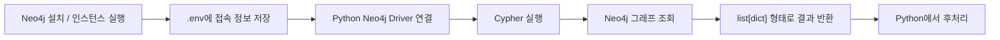
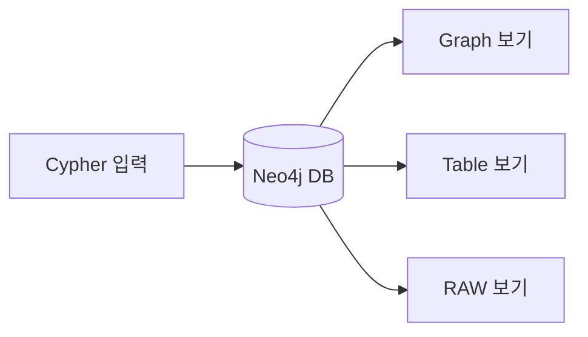
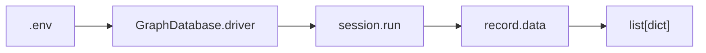
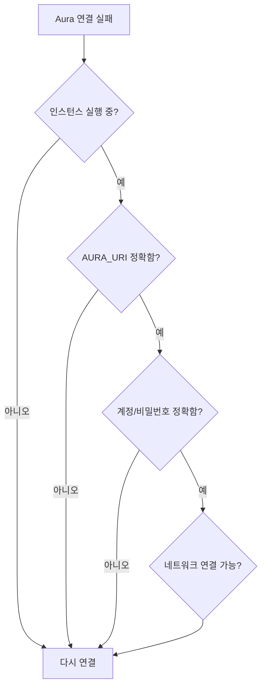
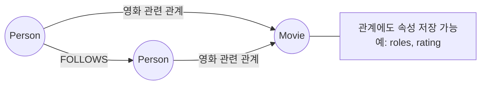
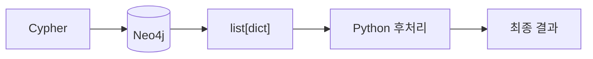
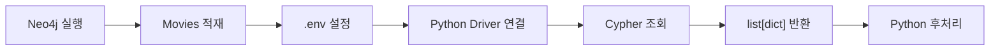

# Neo4j 시작하기: 설치 · 연결 · Movies 첫 조회

> Neo4j를 설치하고 Python에서 연결한 뒤, 예제 `Movies` 그래프를 조회하는 기본 흐름 정리.
>
> 원본 노트북에서 참조한 이미지 파일(`images/...`)은 노트북 내부에 포함되어 있지 않아 직접 추출할 수 없음.  
> 이미지가 설명하던 핵심 구조는 **Mermaid 시각화**로 재구성함.

---

## 1. Neo4j 기본 개념과 전체 흐름

**Neo4j**는 데이터를 표가 아니라 **노드(Node) · 관계(Relationship) · 속성(Property)** 중심으로 저장하는 그래프 데이터베이스.

- **노드**: 사람, 영화 같은 개체
- **관계**: 개체 사이의 연결
- **속성**: 노드나 관계에 붙는 값
- **레이블(Label)**: 노드의 종류 구분
- **Cypher**: Neo4j에 질문을 보내는 쿼리 언어

이번 단계의 핵심은 Cypher 문법 자체보다 **Neo4j를 실행하고 Python에서 결과를 받아 사용하는 흐름**.



### 학습 목표

- Neo4j Desktop 또는 Aura 인스턴스 준비
- Query에서 그래프를 직접 확인
- `.env` 기반 Python 연결
- Movies 예제 그래프 적재
- Cypher 결과를 `list[dict]`로 받아 Python에서 처리
- 연결 오류 발생 시 주소 · 인증 · 서버 상태 진단

---

# 2. Neo4j 설치와 실행

## Neo4j Desktop

로컬 PC에서 직접 Neo4j를 실행하는 방식.

기본 흐름:

1. Neo4j Desktop 설치
2. 실습용 인스턴스 생성
3. 사용자와 비밀번호 설정
4. 인스턴스 실행
5. 접속 URI 확인

대표적인 로컬 접속 정보:

```text
URI      : bolt://localhost:7687
USER     : neo4j
PASSWORD : 직접 설정한 비밀번호
```

인스턴스가 꺼져 있으면 Python에서 연결할 수 없음.

---

## Neo4j Aura

별도 설치 없이 클라우드에서 사용하는 Neo4j.

대표적인 URI:

```text
neo4j+s://xxxxxxxx.databases.neo4j.io
```

`+s`는 암호화된 연결을 사용한다는 의미.

Aura를 생성하면 다음 정보를 저장해야 함.

```text
Connection URI
Username
Password
```

비밀번호는 생성 시 한 번만 표시될 수 있으므로 별도 보관 필요.

---

## 로컬과 Aura의 차이

| 구분 | 로컬 Desktop | Aura |
|---|---|---|
| 실행 위치 | 내 PC | Neo4j 클라우드 |
| 대표 URI | `bolt://localhost:7687` | `neo4j+s://...` |
| 인터넷 | 기본적으로 불필요 | 필요 |
| Python 연결 코드 | 동일 | 동일 |
| 주로 바뀌는 값 | URI · 계정 정보 | URI · 계정 정보 |

즉, **드라이버 사용 방법은 거의 같고 접속 정보가 달라짐**.

---

# 3. Query로 그래프 확인

Neo4j의 **Query** 도구를 사용하면 Cypher 결과를 그래프로 직접 확인할 수 있음.

주요 영역:

| 영역 | 역할 |
|---|---|
| Cypher 편집기 | 쿼리 입력 및 실행 |
| Graph | 노드와 관계를 그래프로 표시 |
| Table | 결과를 표로 표시 |
| RAW | 원시 결과 확인 |
| Database information | 노드 수, 관계 수, 레이블, 관계 종류, 속성 키 확인 |

원본 노트북에서는 Query 화면에서 `The Matrix`와 연결된 인물들을 Graph 형태로 확인하는 예시 이미지를 사용함.

이미지의 핵심 역할은 다음 구조를 시각적으로 확인하는 것.



---

# 4. Python에서 Neo4j 연결

## 필요한 패키지

```bash
pip install neo4j python-dotenv
```

- `neo4j`: Python 공식 Neo4j 드라이버
- `python-dotenv`: `.env` 파일의 접속 정보 로드

---

## `.env` 작성

접속 정보는 코드에 직접 작성하지 않고 `.env`에 저장.

```bash
NEO4J_URI=bolt://localhost:7687
NEO4J_USER=neo4j
NEO4J_PASSWORD=비밀번호
```

Aura를 같이 사용할 경우:

```bash
AURA_URI=neo4j+s://xxxxxxxx.databases.neo4j.io
AURA_USER=neo4j
AURA_PASSWORD=비밀번호
```

---

## Neo4j 연결 코드

```python
import os

from dotenv import load_dotenv
from neo4j import GraphDatabase

# .env 읽기
load_dotenv(".env")
load_dotenv("../.env")

NEO4J_URI = os.getenv("NEO4J_URI", "bolt://localhost:7687")
NEO4J_USER = os.getenv("NEO4J_USER", "neo4j")
NEO4J_PASSWORD = os.getenv("NEO4J_PASSWORD", "neo4j")

# Neo4j 드라이버 생성
driver = GraphDatabase.driver(
    NEO4J_URI,
    auth=(NEO4J_USER, NEO4J_PASSWORD)
)

# 실제 연결 확인
driver.verify_connectivity()


def run_cypher(query, **params):
    """Cypher 실행 → 결과를 dict 리스트로 반환."""
    with driver.session() as session:
        return [
            record.data()
            for record in session.run(query, **params)
        ]


print("Neo4j 연결:", NEO4J_URI)
```

### 결과

```text
Neo4j 연결: bolt://localhost:7687
```

### 핵심 구조



`record.data()`가 Neo4j의 결과 한 행을 Python `dict`로 변환.

여러 행이 있으므로 최종 결과는 보통 다음 구조.

```python
[
    {"title": "A Few Good Men", "released": 1992},
    {"title": "Apollo 13", "released": 1995},
]
```

---

# 5. 연결 상태 진단

연결이 이상하면 먼저 **주소 → 서버 → 현재 DB** 순서로 확인.

## 1) 접속 주소 확인

```python
print(
    "접속 주소:", NEO4J_URI,
    "/ 사용자:", NEO4J_USER
)
```

### 결과

```text
접속 주소: bolt://localhost:7687 / 사용자: neo4j
```

---

## 2) 서버 정보 확인

```python
for row in run_cypher(
    "CALL dbms.components() "
    "YIELD name, versions, edition "
    "RETURN name, versions[0] AS version, edition"
):
    print(
        "서버:",
        row["name"],
        row["version"],
        row["edition"]
    )
```

### 원본 실행 결과

```text
서버: Neo4j Kernel 2026.07.1 enterprise
서버: Cypher 5
```

---

## 3) 현재 데이터베이스 확인

```python
db_name = run_cypher(
    "CALL db.info() YIELD name RETURN name"
)[0]["name"]

print("현재 데이터베이스:", db_name)
```

### 결과

```text
현재 데이터베이스: neo4j
```

---

# 6. Aura 연결

```python
AURA_URI = os.getenv("AURA_URI", "")
AURA_USER = os.getenv("AURA_USER", "neo4j")
AURA_PASSWORD = os.getenv("AURA_PASSWORD", "")

aura_driver = GraphDatabase.driver(
    AURA_URI,
    auth=(AURA_USER, AURA_PASSWORD)
)

aura_driver.verify_connectivity()

with aura_driver.session() as session:
    rows = [
        record.data()
        for record in session.run(
            "MATCH (n) RETURN count(n) AS cnt"
        )
    ]

print("Aura 노드 수:", rows[0]["cnt"])
```

### 원본 노트북 실행 결과

```text
Unable to retrieve routing information
ServiceUnavailable: Unable to retrieve routing information
```

즉, 원본 실행에서는 **Aura 연결이 성공하지 않음**.

확인 순서:



로컬 연결이 정상이라면 Aura 오류와 별개로 로컬 실습은 계속 진행 가능.

---

# 7. Movies 예제 그래프 적재

Neo4j의 학습용 **Movies** 그래프 사용.

원본 실습 기준:

- 전체 노드: **171개**
- 전체 관계: **253개**
- 영화 노드: **38개**
- 인물 노드: **133개**

## 적재 방법

### 방법 A — 제공 Cypher 파일 사용

```text
data/movies_setup.cypher
```

파일 전체 내용을 Neo4j Query에 붙여넣어 실행.

### 방법 B — 내장 가이드

환경에 따라 다음 명령 사용.

```text
:guide movies
```

이전 버전에서는 다음 형태를 사용할 수도 있음.

```text
:play movies
```

---

## 적재 확인

```python
node_count = run_cypher(
    "MATCH (n) RETURN count(n) AS cnt"
)[0]["cnt"]

print("연결된 그래프의 노드 수:", node_count)
```

### 결과

```text
연결된 그래프의 노드 수: 171
```

`171`이면 원본 실습용 Movies 그래프가 정상 적재된 상태.

---

# 8. Movies 그래프 구조

원본 노트북의 `movies_schema_props.png`는 파일 자체가 포함되어 있지 않아 직접 사용할 수 없음.

원본 설명에서 확인되는 핵심 구조:

- 노드 종류: `Person`, `Movie`
- `Person`과 `Movie` 사이에 여러 종류의 관계 존재
- `Person`끼리 연결하는 `FOLLOWS` 관계 존재
- 관계에도 `roles`, `rating` 같은 속성이 붙을 수 있음



### 핵심

```text
노드에도 속성이 붙음
관계에도 속성이 붙을 수 있음
```

그래프 DB의 중요한 특징 중 하나.

---

# 9. 첫 조회

## 영화 개수 확인

```python
result = run_cypher(
    "MATCH (m:Movie) "
    "RETURN count(m) AS movie_count"
)

print(result)
```

### 결과

```python
[{"movie_count": 38}]
```

### 해석

```cypher
MATCH (m:Movie)
```

`Movie` 레이블을 가진 노드를 찾음.

```cypher
RETURN count(m) AS movie_count
```

찾은 영화의 수를 `movie_count`라는 이름으로 반환.

---

## 영화 제목과 개봉연도 조회

```python
movies = run_cypher(
    "MATCH (m:Movie) "
    "RETURN m.title AS title, m.released AS released "
    "ORDER BY m.title "
    "LIMIT 5"
)

for row in movies:
    print(row)
```

### 결과

```text
{'title': 'A Few Good Men', 'released': 1992}
{'title': 'A League of Their Own', 'released': 1992}
{'title': 'Apollo 13', 'released': 1995}
{'title': 'As Good as It Gets', 'released': 1997}
{'title': 'Bicentennial Man', 'released': 1999}
```

`row` 하나는 Python `dict`.

```python
row["title"]
row["released"]
```

처럼 일반 딕셔너리와 동일하게 사용.

---

# 10. 조회 결과를 Python에서 후처리

Neo4j가 데이터를 가져오면 Python은 그 결과를 다시 가공.

전체 흐름:



---

## 가장 오래된 영화 5편

```python
oldest = run_cypher(
    "MATCH (m:Movie) "
    "RETURN m.title AS title, m.released AS released "
    "ORDER BY m.released "
    "LIMIT 5"
)

oldest_titles = [
    row["title"]
    for row in oldest
]

print(oldest)
print(oldest_titles)
```

### 결과

```text
[
    {'title': "One Flew Over the Cuckoo's Nest", 'released': 1975},
    {'title': 'Top Gun', 'released': 1986},
    {'title': 'Stand By Me', 'released': 1986},
    {'title': 'Joe Versus the Volcano', 'released': 1990},
    {'title': 'A Few Good Men', 'released': 1992}
]
```

```text
[
    "One Flew Over the Cuckoo's Nest",
    "Top Gun",
    "Stand By Me",
    "Joe Versus the Volcano",
    "A Few Good Men"
]
```

원본 코드의 `titles` 변수는 문제 설명에 맞춰 `oldest_titles`로 통일.

---

## 모든 인물 이름 조회 후 인원 계산

원본 코드에는 다음 문제가 있었음.

```cypher
ORDER BY p.released
```

`Person`의 이름을 정렬하는 문제이므로 `p.name` 기준으로 정렬해야 함.

또한 문제에서는 `names` 리스트를 만들도록 했지만 원본 코드에서는 `people`의 길이만 바로 계산함.

수정:

```python
people = run_cypher(
    "MATCH (p:Person) "
    "RETURN p.name AS name "
    "ORDER BY p.name"
)

names = [
    row["name"]
    for row in people
]

print(names)
print(len(names))
```

### 결과

```text
133
```

즉, 원본 Movies 데이터에는 **Person 노드 133개**가 존재.

---

# 11. 자주 발생하는 오류

| 증상 | 주요 원인 | 확인 |
|---|---|---|
| `ConnectionRefusedError` | 로컬 Neo4j가 꺼짐 | Desktop 인스턴스 실행 |
| `ServiceUnavailable` | 서버 정지, URI 오류, Aura 연결 문제 | 인스턴스와 URI 확인 |
| `Unable to retrieve routing information` | Aura 접속/라우팅 실패 | Aura 상태, URI, 계정, 네트워크 확인 |
| 인증 오류 | 사용자 또는 비밀번호 불일치 | `.env` 값 확인 |
| 연결되지만 노드 수 `0` | Movies 미적재 | `movies_setup.cypher` 실행 |
| `ModuleNotFoundError: neo4j` | 현재 Python 환경에 패키지 없음 | 가상환경과 커널 확인 |

### 진단 순서

```text
1. Neo4j가 실행 중인지 확인
2. URI 확인
3. USER / PASSWORD 확인
4. verify_connectivity() 실행
5. 서버 정보 조회
6. 현재 DB 확인
7. 노드 수 확인
```

---

# 12. 핵심 정리

| 개념 | 핵심 |
|---|---|
| Neo4j | 노드와 관계 중심의 그래프 데이터베이스 |
| Cypher | Neo4j 조회 언어 |
| Desktop | 로컬 Neo4j 실행 환경 |
| Aura | 클라우드 Neo4j |
| Query | Cypher 실행 및 그래프 시각화 도구 |
| `.env` | URI · 사용자 · 비밀번호 분리 저장 |
| `GraphDatabase.driver()` | Python과 Neo4j 연결 |
| `session.run()` | Cypher 실행 |
| `record.data()` | 결과 한 행을 `dict`로 변환 |
| `run_cypher()` | Cypher 결과를 `list[dict]`로 받는 헬퍼 |
| Movies | `Person`과 `Movie` 중심의 학습용 그래프 |
| Python 후처리 | 조회 결과에서 리스트·딕셔너리 방식으로 필요한 값 추출 |

## 전체 프로세스



### 한 줄 핵심

> **Neo4j에서 연결 관계를 조회하고 → 결과를 `list[dict]`로 받아 → Python에서 후처리한다.**
