# Neo4j 노드 · 관계 · 속성 모델

> Movies 예제 그래프를 직접 조회하면서 **노드와 레이블, 관계의 방향, 다중 관계, 노드·관계 속성**을 확인하고  
> 마지막으로 이를 **RDB와 비교해 그래프 모델링 기준**까지 연결하는 실습 정리.
>
> 원본 노트북은 `images/...` 경로의 그림 6개를 참조하지만 이미지 파일 자체는 노트북에 포함되어 있지 않음.  
> 따라서 그림이 설명하던 핵심 구조는 **Mermaid 시각화**로 재구성함.

---

## 1. 이번 실습의 전체 흐름

지난 단계에서 Neo4j 연결과 Movies 그래프 적재까지 끝냈다면, 이번에는 **그래프 내부가 어떻게 구성되어 있는지** 확인하는 단계.

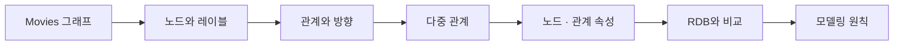

### 핵심 목표

- `Person`, `Movie`가 **노드 레이블**이라는 것을 실제 결과로 확인
- 관계에는 **종류와 방향**이 있음을 확인
- 같은 종류의 노드끼리도 관계를 만들 수 있음을 확인
- 같은 두 노드 사이에 **여러 관계**가 동시에 존재할 수 있음을 이해
- 속성은 노드뿐 아니라 **관계에도 붙을 수 있음**을 확인
- 무엇을 노드 · 관계 · 속성으로 둘지 판단하는 기준 이해

---

# 2. 실습에서 읽어야 할 Cypher 기본 형태

이번 단계에서는 Cypher를 직접 설계하기보다 **주어진 쿼리가 어떤 그래프를 찾는지 읽는 것**이 핵심.

대표적인 패턴:

```cypher
MATCH (p:Person)-[r:ACTED_IN]->(m:Movie {title:'The Matrix'})
RETURN p.name AS actor, r.roles AS roles
ORDER BY p.name
```

구조를 나누면 다음과 같음.

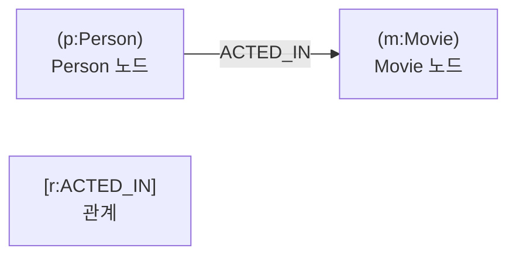

| 조각 | 의미 | 예 |
|---|---|---|
| `MATCH` | 그래프에서 찾을 모양 지정 | `MATCH (m:Movie)` |
| `(p:Person)` | `Person` 레이블 노드를 변수 `p`로 지정 | `(p:Person)` |
| `(:Movie)` | 변수 없이 `Movie` 노드만 지정 | `(:Movie)` |
| `()` | 레이블도 변수도 지정하지 않은 임의 노드 | `()` |
| `-[:ACTED_IN]->` | 관계 종류와 방향 지정 | 사람 → 영화 |
| `-[r:ACTED_IN]->` | 관계를 변수 `r`로 받아 속성 사용 | `r.roles` |
| `{title:'The Matrix'}` | 속성값으로 조건 지정 | 특정 영화 |
| `RETURN ... AS ...` | 반환 값과 결과 키 이름 지정 | `p.name AS actor` |
| `ORDER BY` | 결과 정렬 | `ORDER BY p.name` |
| `LIMIT` | 결과 개수 제한 | `LIMIT 5` |
| `count()` | 개수 집계 | `count(m)` |
| `type(r)` | 관계 종류 이름 반환 | `ACTED_IN` |
| `CALL ... YIELD` | Neo4j 내장 프로시저 실행 | `CALL db.labels()` |

### 방향 읽기

```cypher
(:Person)-[:ACTED_IN]->(:Movie)
```

```text
Person → Movie
사람이 영화에 출연함
```

반대로 노드를 먼저 적더라도 화살촉이 같은 방향을 가리키면 같은 의미.

```cypher
(:Movie)<-[:ACTED_IN]-(:Person)
```

화살촉을 제거하면 방향을 가리지 않음.

```cypher
(:Person)-[:FOLLOWS]-(:Person)
```

---

# 3. 준비: Neo4j 연결과 데이터 확인

```python
import os

from dotenv import load_dotenv
from neo4j import GraphDatabase

load_dotenv(".env")
load_dotenv("../.env")

NEO4J_URI = os.getenv("NEO4J_URI", "bolt://localhost:7687")
NEO4J_USER = os.getenv("NEO4J_USER", "neo4j")
NEO4J_PASSWORD = os.getenv("NEO4J_PASSWORD", "neo4j")

driver = GraphDatabase.driver(
    NEO4J_URI,
    auth=(NEO4J_USER, NEO4J_PASSWORD)
)

driver.verify_connectivity()


def run_cypher(query, **params):
    """Cypher 실행 → 결과를 dict 리스트로 반환."""
    with driver.session() as session:
        return [
            record.data()
            for record in session.run(query, **params)
        ]


print("Neo4j 연결:", NEO4J_URI)
```

### 결과

```text
Neo4j 연결: bolt://localhost:7687
```

Movies 그래프 적재 확인:

```python
_n = run_cypher(
    "MATCH (n) RETURN count(n) AS cnt"
)[0]["cnt"]

print("연결된 그래프의 노드 수:", _n)
```

### 결과

```text
연결된 그래프의 노드 수: 171
```

---

# 4. 노드와 레이블

**노드(Node)**는 그래프의 개체이고, **레이블(Label)**은 그 노드의 종류를 나타냄.

Movies 그래프에는 두 종류의 노드가 있음.

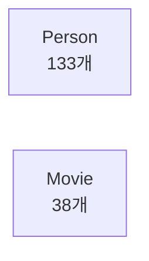

## 레이블 목록 확인

```python
labels = run_cypher(
    "CALL db.labels() "
    "YIELD label "
    "RETURN label "
    "ORDER BY label"
)

print(labels)
```

### 결과

```python
[
    {"label": "Movie"},
    {"label": "Person"}
]
```

## 레이블별 노드 수

```python
person_count = run_cypher(
    "MATCH (p:Person) RETURN count(p) AS c"
)[0]["c"]

movie_count = run_cypher(
    "MATCH (m:Movie) RETURN count(m) AS c"
)[0]["c"]

print("Person 노드:", person_count)
print("Movie 노드:", movie_count)
```

### 결과

```text
Person 노드: 133
Movie 노드: 38
```

```text
133 + 38 = 171
```

즉, 현재 Movies 그래프의 전체 노드 수와 일치.

> 레이블은 노드의 **종류 이름표**.  
> `:Person`으로 사람만, `:Movie`로 영화만 골라 조회할 수 있음.

---

# 5. 관계와 방향

Movies 그래프에는 총 **6종류, 253개의 관계**가 존재.

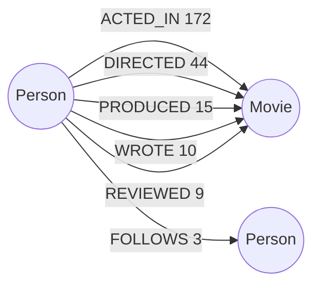

## 관계 종류 확인

```python
rel_types = run_cypher(
    "CALL db.relationshipTypes() "
    "YIELD relationshipType "
    "RETURN relationshipType AS rel "
    "ORDER BY rel"
)

print(rel_types)
```

### 결과

```text
ACTED_IN
DIRECTED
FOLLOWS
PRODUCED
REVIEWED
WROTE
```

## 관계 종류별 개수

```python
rel_counts = run_cypher(
    "MATCH ()-[r]->() "
    "RETURN type(r) AS rel, count(r) AS c "
    "ORDER BY c DESC"
)

for row in rel_counts:
    print(row)
```

### 결과

| 관계 | 개수 |
|---|---:|
| `ACTED_IN` | 172 |
| `DIRECTED` | 44 |
| `PRODUCED` | 15 |
| `WROTE` | 10 |
| `REVIEWED` | 9 |
| `FOLLOWS` | 3 |
| **합계** | **253** |

---

## 특정 노드 조합의 관계만 찾기

사람 → 사람 관계만 조회:

```python
rel_counts = run_cypher(
    "MATCH (:Person)-[r]->(:Person) "
    "RETURN type(r) AS rel, count(r) AS c "
    "ORDER BY c DESC"
)

for row in rel_counts:
    print(row)
```

### 결과

```python
{"rel": "FOLLOWS", "c": 3}
```

즉, 현재 Movies 그래프에서 `Person → Person` 형태의 관계는 `FOLLOWS`뿐.

---

# 6. 관계의 방향 확인

## 감독 → 영화

```python
directed = run_cypher(
    "MATCH (p:Person)-[:DIRECTED]->(m:Movie) "
    "RETURN p.name AS director, m.title AS movie "
    "ORDER BY p.name, m.title "
    "LIMIT 5"
)

for row in directed:
    print(row)
```

### 결과

```text
{'director': 'Cameron Crowe', 'movie': 'Jerry Maguire'}
{'director': 'Chris Columbus', 'movie': 'Bicentennial Man'}
{'director': 'Clint Eastwood', 'movie': 'Unforgiven'}
{'director': 'Danny DeVito', 'movie': 'Hoffa'}
{'director': 'Frank Darabont', 'movie': 'The Green Mile'}
```

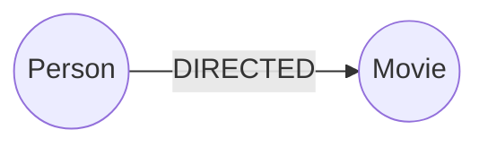

`DIRECTED`는 **사람에서 영화 방향**으로 저장됨.

---

## 제작자 이름만 중복 없이 모으기

원본 셀에서는 결과를 `directed` 변수에 담았지만, 내용이 제작 관계이므로 `produced`가 더 명확함.

```python
produced = run_cypher(
    "MATCH (p:Person)-[:PRODUCED]->(m:Movie) "
    "RETURN p.name AS producer, m.title AS movie "
    "ORDER BY p.name, m.title "
    "LIMIT 5"
)

for row in produced:
    print(row)

producer_set = {
    row["producer"]
    for row in produced
}

print("조회 행:", len(produced))
print("제작자:", producer_set)
```

### 결과

```text
조회 행: 5
제작자: {'Cameron Crowe', 'Joel Silver'}
```

여러 영화가 같은 제작자에게 연결되어 있기 때문에 **5개 관계를 조회해도 제작자는 2명**일 수 있음.

---

# 7. 같은 종류의 노드도 관계로 연결 가능

관계는 서로 다른 레이블만 연결하는 것이 아님.

`FOLLOWS`는 다음 구조.

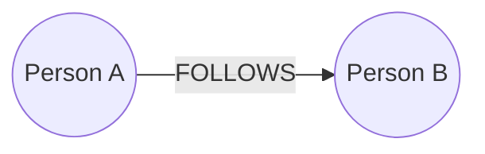

```python
follows = run_cypher(
    "MATCH (a:Person)-[:FOLLOWS]->(b:Person) "
    "RETURN a.name AS follower, b.name AS followee "
    "ORDER BY follower"
)

for row in follows:
    print(row)
```

### 결과

```text
Angela Scope → Jessica Thompson
James Thompson → Jessica Thompson
Paul Blythe → Angela Scope
```

같은 `Person`끼리 연결되어도 **방향에 따라 의미가 달라짐**.

---

## 화살촉 방향 비교

Angela Scope를 기준으로 같은 패턴의 화살촉만 바꿔 확인.

```python
followers = run_cypher(
    "MATCH (a:Person)-[:FOLLOWS]->"
    "(:Person {name:'Angela Scope'}) "
    "RETURN a.name AS name ORDER BY a.name"
)

followers_2 = run_cypher(
    "MATCH (:Person {name:'Angela Scope'})"
    "<-[:FOLLOWS]-(a:Person) "
    "RETURN a.name AS name ORDER BY a.name"
)

both_ways = run_cypher(
    "MATCH (:Person {name:'Angela Scope'})"
    "-[:FOLLOWS]-(a:Person) "
    "RETURN a.name AS name ORDER BY a.name"
)

followees = run_cypher(
    "MATCH (:Person {name:'Angela Scope'})"
    "-[:FOLLOWS]->(a:Person) "
    "RETURN a.name AS name ORDER BY a.name"
)
```

### 결과

| 패턴 | 의미 | 결과 |
|---|---|---|
| `Person → Angela` | Angela를 팔로우하는 사람 | `Paul Blythe` |
| `Angela ← Person` | 위와 동일 | `Paul Blythe` |
| `Angela - Person` | 방향 무시 | `Jessica Thompson`, `Paul Blythe` |
| `Angela → Person` | Angela가 팔로우하는 사람 | `Jessica Thompson` |

### 핵심

```text
노드를 어느 쪽에 적었는지가 아니라
화살촉이 어느 쪽을 향하는지가 관계의 방향을 결정함.
```

---

## The Matrix 출연진 세기

```python
matrix_cast = run_cypher(
    "MATCH (p:Person)-[:ACTED_IN]->"
    "(:Movie {title:'The Matrix'}) "
    "RETURN p.name AS name "
    "ORDER BY p.name"
)

print(matrix_cast)
print(len(matrix_cast))
```

### 결과

```text
Carrie-Anne Moss
Emil Eifrem
Hugo Weaving
Keanu Reeves
Laurence Fishburne
```

```text
5
```

---

# 8. 같은 두 노드 사이에 여러 관계가 존재할 수 있음

한 사람이 같은 영화에 대해 여러 역할을 가질 수 있음.

예:

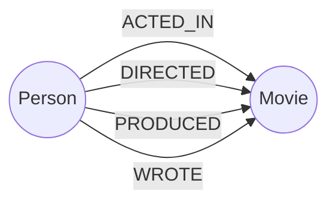

RDB에서는 역할별 연결 테이블을 따로 조회하고 조인해야 할 수 있지만, 그래프에서는 **동일한 두 노드 사이에 관계를 여러 개 두는 방식**으로 표현 가능.

## 관계가 2종 이상인 사람-영화 쌍

```python
multi = run_cypher(
    "MATCH (p:Person)-[r]->(m:Movie) "
    "WITH p, m, collect(DISTINCT type(r)) AS types "
    "WHERE size(types) >= 2 "
    "RETURN p.name AS person, m.title AS movie, types "
    "ORDER BY size(types) DESC, p.name"
)

print(
    "관계가 2종 이상인 (사람, 영화) 쌍:",
    len(multi)
)
```

### 결과

```text
관계가 2종 이상인 (사람, 영화) 쌍: 12
```

앞부분:

```text
Cameron Crowe → Jerry Maguire
['DIRECTED', 'PRODUCED', 'WROTE']

Nancy Meyers → Something's Gotta Give
['DIRECTED', 'PRODUCED', 'WROTE']

Aaron Sorkin → A Few Good Men
['ACTED_IN', 'WROTE']

Clint Eastwood → Unforgiven
['ACTED_IN', 'DIRECTED']

Danny DeVito → Hoffa
['ACTED_IN', 'DIRECTED']
```

- 관계가 2종 이상인 쌍: **12개**
- 그중 관계가 3종인 쌍: **2개**

---

# 9. 속성: 노드에도, 관계에도 붙음

그래프의 속성은 단순히 **노드에만 저장되는 값**이 아님.

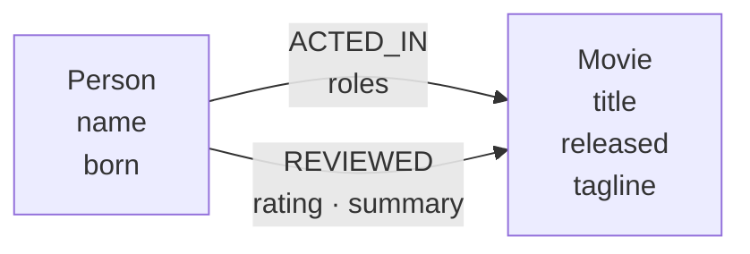

## 노드 속성

### Movie

```python
movie_props = run_cypher(
    "MATCH (m:Movie {title:'The Matrix'}) "
    "RETURN "
    "m.title AS title, "
    "m.released AS released, "
    "m.tagline AS tagline"
)

print(movie_props[0])
```

### 결과

```python
{
    "title": "The Matrix",
    "released": 1999,
    "tagline": "Welcome to the Real World"
}
```

### Person

```python
person_props = run_cypher(
    "MATCH (p:Person {name:'Tom Hanks'}) "
    "RETURN p.name AS name, p.born AS born"
)

print(person_props[0])
```

### 결과

```python
{
    "name": "Tom Hanks",
    "born": 1956
}
```

레이블에 따라 사용하는 속성이 다름.

```text
Movie  → title, released, tagline
Person → name, born
```

---

# 10. 관계 속성

## `ACTED_IN.roles`

배역은 배우 자체의 속성도, 영화 자체의 속성도 아님.

**특정 배우가 특정 영화에서 어떤 역할을 맡았는지**를 나타내므로 두 노드를 잇는 `ACTED_IN` 관계에 붙음.

```python
roles_rows = run_cypher(
    "MATCH (p:Person)-[r:ACTED_IN]->"
    "(m:Movie {title:'Cloud Atlas'}) "
    "RETURN p.name AS actor, r.roles AS roles "
    "ORDER BY p.name"
)

for row in roles_rows:
    print(row)
```

### 결과

```text
Halle Berry
['Luisa Rey', 'Jocasta Ayrs', 'Ovid', 'Meronym']

Hugo Weaving
['Bill Smoke', 'Haskell Moore', 'Tadeusz Kesselring',
 'Nurse Noakes', 'Boardman Mephi', 'Old Georgie']

Jim Broadbent
['Vyvyan Ayrs', 'Captain Molyneux', 'Timothy Cavendish']

Tom Hanks
['Zachry', 'Dr. Henry Goose', 'Isaac Sachs', 'Dermot Hoggins']
```

`roles`는 하나의 문자열이 아니라 **리스트**.

한 배우가 한 영화에서 여러 배역을 맡을 수 있기 때문.

---

## `REVIEWED.rating`, `REVIEWED.summary`

```python
rating_rows = run_cypher(
    "MATCH (p:Person)-[r:REVIEWED]->"
    "(:Movie {title:'The Da Vinci Code'}) "
    "RETURN "
    "p.name AS reviewer, "
    "r.rating AS rating, "
    "r.summary AS summary "
    "ORDER BY r.rating DESC"
)

for row in rating_rows:
    print(row)
```

### 결과

```text
Jessica Thompson | 68 | A solid romp
James Thompson   | 65 | Fun, but a little far fetched
```

같은 영화라도 사람에 따라 평점이 다름.

따라서:

```text
Movie.rating      X
Person.rating     X
REVIEWED.rating   O
```

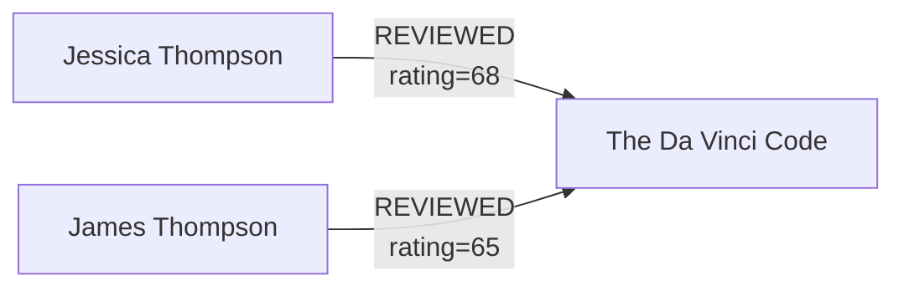

> **값이 누구와 누구의 연결에 따라 달라진다면 관계 속성으로 두는 것이 자연스러움.**

---

## 속성이 없는 노드도 가능

Movies의 모든 `Person`이 `born`을 가지고 있는 것은 아님.

RDB에서는 보통 `NULL`에 가까운 상태지만, Neo4j에서는 단순히 **그 속성 자체가 없는 노드**가 될 수 있음.

---

# 11. 실습 교정: The Polar Express 배역 수

원본 문제는 `The Polar Express`의 `ACTED_IN.roles`를 조회하도록 되어 있지만, 실제 코드 셀에는 이전 `PRODUCED` 실습 코드가 잘못 복사되어 있음.

문제 의도에 맞는 코드는 다음 형태.

```python
polar_rows = run_cypher(
    "MATCH (p:Person)-[r:ACTED_IN]->"
    "(:Movie {title:'The Polar Express'}) "
    "RETURN p.name AS actor, r.roles AS roles "
    "ORDER BY p.name"
)

polar_roles = {
    row["actor"]: len(row["roles"])
    for row in polar_rows
}

print(polar_rows)
print(polar_roles)
```

원본 설명에서 확인 가능한 것은 다음까지.

```text
The Polar Express의 출연 배우는 1명
→ polar_roles 역시 한 칸짜리 dict
```

원본 노트북에는 이 교정된 셀의 실제 실행 결과가 남아 있지 않아 **배우 이름과 정확한 배역 수는 결과값으로 확정하지 않음**.

---

# 12. 그래프와 RDB 대응

| 그래프 Neo4j | 관계형 DB | Movies 예 |
|---|---|---|
| 노드 | 행 | 사람 한 명, 영화 한 편 |
| 레이블 | 테이블 종류 | `Person`, `Movie` |
| 노드 속성 | 일반 열 값 | `name`, `title`, `released` |
| 관계 | FK / 조인 테이블 | `ACTED_IN`, `DIRECTED` |
| 관계 속성 | 조인 테이블의 추가 열 | `roles`, `rating` |

구조 차이를 단순화하면:

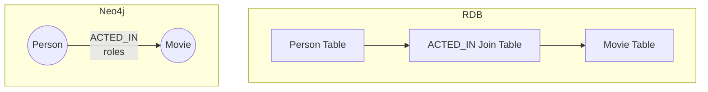

그래프에서는 **연결 자체가 1급 구조**이므로, 조인을 거쳐야 하는 관계를 직접 따라갈 수 있음.

---

# 13. 무엇을 노드 · 관계 · 속성으로 둘까

기본 판단:

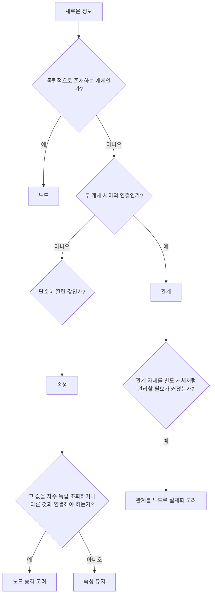

### 간단한 원칙

```text
개체(명사)       → 노드
개체 사이의 동작 → 관계
단순한 딸린 값   → 속성
자주 경유하거나 연결할 값 → 노드 승격 고려
복잡한 관계 자체를 관리해야 함 → 관계를 노드로 실체화 고려
```

예를 들어 `Genre`를 단순 문자열로만 저장할 수도 있음.

```text
Movie.genre = "Action"
```

하지만 다음 질문을 자주 한다면:

```text
같은 장르의 영화
특정 장르와 연결된 배우
장르 사이의 관계
```

`Genre`를 별도 노드로 만드는 편이 그래프 탐색에 유리할 수 있음.

---

# 14. 노드가 있으면 '경로'가 생김

## 영화는 노드이므로 경유 가능

Keanu Reeves와 같은 영화에 출연한 사람:

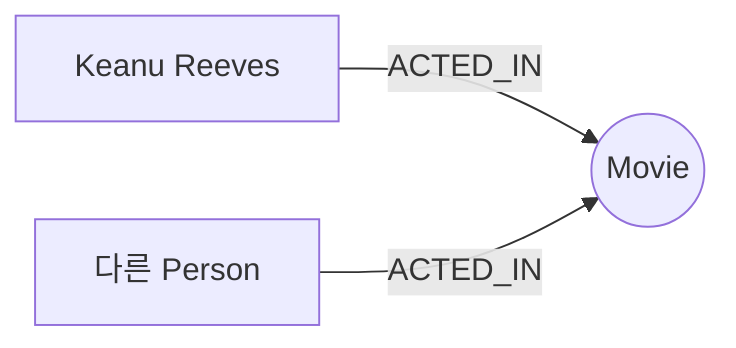

Cypher:

```python
co_actors = run_cypher(
    "MATCH (:Person {name:'Keanu Reeves'})"
    "-[:ACTED_IN]->(:Movie)"
    "<-[:ACTED_IN]-(other:Person) "
    "RETURN DISTINCT other.name AS name "
    "ORDER BY name"
)

print(
    "Keanu Reeves와 같은 영화에 나온 사람:",
    len(co_actors),
    "명"
)
```

### 결과

```text
Keanu Reeves와 같은 영화에 나온 사람: 14명
```

영화가 **노드**라서 사람 → 영화 → 다른 사람이라는 경로를 직접 탐색할 수 있음.

---

## 개봉연도는 속성이므로 경유할 노드가 없음

`released=1999`는 `Movie`의 속성.

현재 모델에서는 다음 경로가 존재하지 않음.

```text
Movie → Year → Movie
```

따라서 원본 실습에서는 영화를 모두 가져와 Python에서 비교.

```python
all_movies = run_cypher(
    "MATCH (m:Movie) "
    "RETURN m.title AS title, m.released AS released"
)

year = next(
    row["released"]
    for row in all_movies
    if row["title"] == "The Matrix"
)

same_year = sorted(
    row["title"]
    for row in all_movies
    if row["released"] == year
    and row["title"] != "The Matrix"
)

print(year, "년에 나온 다른 영화:", same_year)
```

### 결과

```text
1999년에 나온 다른 영화:
- Bicentennial Man
- Snow Falling on Cedars
- The Green Mile
```

### 구조 비교

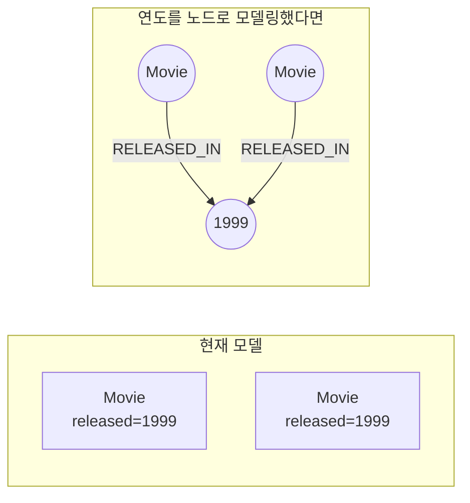

단, **속성이라고 해서 반드시 비효율적인 것은 아님**.  
여기서 핵심은 자주 탐색해야 하는 값이라면 **경로로 모델링할 필요가 있는지 판단한다는 것**.

---

# 15. 그래프 설계를 네 칸으로 정리

그래프를 설계할 때 최소한 다음 네 가지를 정리하면 구조를 빠르게 볼 수 있음.

```text
1. 노드 레이블
2. 관계와 방향
3. 노드 속성
4. 관계 속성
```

Movies 그래프:

```python
movies_model = {
    "nodes": {
        "Person",
        "Movie"
    },

    "relationships": {
        "ACTED_IN": ("Person", "Movie"),
        "DIRECTED": ("Person", "Movie"),
        "PRODUCED": ("Person", "Movie"),
        "WROTE": ("Person", "Movie"),
        "REVIEWED": ("Person", "Movie"),
        "FOLLOWS": ("Person", "Person"),
    },

    "node_properties": {
        "Movie": {
            "title",
            "released",
            "tagline"
        },
        "Person": {
            "name",
            "born"
        }
    },

    "rel_properties": {
        "ACTED_IN": {
            "roles"
        },
        "REVIEWED": {
            "rating",
            "summary"
        }
    }
}
```

```text
노드 레이블: 2종
관계: 6종
```

이 구조 하나로 지금까지 확인한 그래프의 핵심을 표현 가능.

---

# 16. 도서 도메인으로 적용

주어진 조건:

```text
Reader가 Book을 PURCHASED
Author가 Book을 WROTE
Book에는 title
Reader에는 name
Reader마다 책에 매긴 rating이 다름
```

관계는 `PURCHASED`, `WROTE` 두 종류만 사용한다는 조건이므로 `rating`은 `PURCHASED` 관계 속성으로 배치.

```python
book_sketch = {
    "nodes": {
        "Reader",
        "Book",
        "Author"
    },

    "relationships": {
        "PURCHASED": ("Reader", "Book"),
        "WROTE": ("Author", "Book"),
    },

    "node_properties": {
        "Reader": {
            "name"
        },
        "Book": {
            "title"
        }
    },

    "rel_properties": {
        "PURCHASED": {
            "rating"
        }
    }
}

print("레이블:", len(book_sketch["nodes"]))
print("관계:", len(book_sketch["relationships"]))
```

### 결과

```text
레이블: 3
관계: 2
```

시각화:

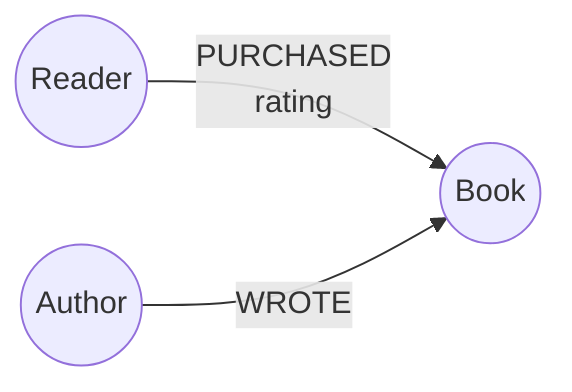

> 원본 뒤쪽의 `book_sketch_v2`는 별도 확장 아이디어로 날짜 노드와 리뷰 관계를 추가한 형태지만,  
> 이 실습의 제시 조건인 **레이블 3개 · 관계 2종**을 벗어나므로 기본 답안에서는 분리함.

---

# 17. 핵심 정리

| 개념 | 핵심 |
|---|---|
| 노드 | 그래프에서 독립적으로 존재하는 개체 |
| 레이블 | 노드의 종류. `Person`, `Movie` |
| 관계 | 노드와 노드를 연결하는 구조 |
| 방향 | `A → B`와 `B → A`는 다른 의미 |
| 같은 레이블 관계 | `Person → Person`도 가능 (`FOLLOWS`) |
| 다중 관계 | 같은 두 노드 사이에 여러 종류의 관계 가능 |
| 노드 속성 | `name`, `title`, `released`, `born` |
| 관계 속성 | `ACTED_IN.roles`, `REVIEWED.rating` |
| 관계 속성 기준 | 두 노드의 조합에 따라 값이 달라질 때 관계에 배치 |
| RDB 대응 | 관계 ≈ 조인/FK 구조, 관계 속성 ≈ 교차 테이블 추가 열 |
| 노드 승격 | 자주 독립 조회하거나 그래프에서 경유해야 하는 값이면 고려 |
| 설계 기본 틀 | 노드 · 관계/방향 · 노드 속성 · 관계 속성 |

## 전체 구조

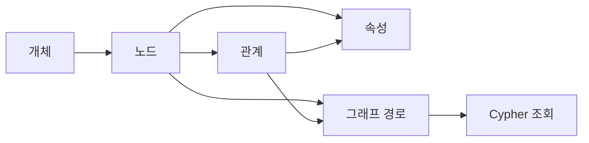

### 한 줄 핵심

> **그래프 모델링은 무엇을 노드로 만들고, 무엇을 관계로 연결하며, 각 값을 노드와 관계 중 어디에 붙일지 결정하는 작업.**
