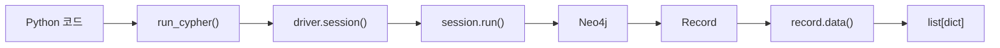

# Neo4j CSV 데이터 준비 · 적재 문법 핵심 정리

> 현재 확인 가능한 두 노트북의 셀·문제·실행 오류에서 드러난 범위를 중심으로 통합 정리.  
> **문법을 최우선**으로 두고, 뒤에 **제작 순서 → 실제 호출 순서**를 배치함.  
> 확인되지 않는 노드·관계 스키마는 임의로 추가하지 않음.

---

# 1. 전체 흐름


핵심은 다음 순서.

```text
파일을 제대로 읽는다
→ Neo4j가 읽을 수 있는 위치에 둔다
→ LOAD CSV로 행을 읽는다
→ 잘못된 행을 먼저 센다
→ 정상 데이터만 적재한다
→ 적재 결과를 다시 조회한다
```

---

# 2. Python: CSV 준비 문법

## CP949 CSV 읽기

국내 공공데이터는 `cp949` 인코딩인 경우가 있음.

```python
import pandas as pd

df = pd.read_csv(
    "data/seoul_metro_transfer_cp949.csv",
    encoding="cp949"
)
```

핵심 문법:

```python
pd.read_csv(path, encoding="cp949")
```

- `path`: 읽을 CSV 위치
- `encoding="cp949"`: 파일의 문자 인코딩 지정
- 인코딩이 맞지 않으면 한글이 깨지거나 읽기 오류 발생

## 머리글을 리스트로 사용

```python
headers = df.columns.tolist()
```

구조:

```text
DataFrame
   ↓
.columns
   ↓
Index 형태의 열 이름
   ↓
.tolist()
   ↓
Python list
```

문제에서 요구한 함수 형태:

```python
def read_headers(path):
    df = pd.read_csv(
        path,
        encoding="cp949"
    )

    return df.columns.tolist()


headers = read_headers(
    "data/seoul_metro_transfer_cp949.csv"
)
```

---

# 3. 파일 경로와 Neo4j import 폴더

Neo4j에서 다음처럼 읽는 파일은 일반적으로 Neo4j의 `import` 폴더에서 찾음.

```cypher
LOAD CSV FROM 'file:///파일.csv'
```

따라서 Python 쪽에서는 실습용 데이터를 해당 위치로 복사하는 과정이 들어갈 수 있음.

## `Path` 기본 문법

```python
from pathlib import Path
```

경로 존재 확인:

```python
Path("data").exists()
```

실습 위치가 달라질 때의 형태:

```python
_SRC_DIR = (
    Path("data")
    if Path("data").exists()
    else Path("../data")
)
```

문법:

```python
참일때값 if 조건 else 거짓일때값
```

## 특정 확장자 파일 찾기

```python
_SRC_DIR.glob("*.csv")
_SRC_DIR.glob("*.json")
```

정렬해서 순서 고정:

```python
sorted(_SRC_DIR.glob("*.csv"))
```

두 결과 합치기:

```python
files = (
    sorted(_SRC_DIR.glob("*.csv"))
    + sorted(_SRC_DIR.glob("*.json"))
)
```

## 파일 복사

```python
import shutil

shutil.copy(
    source,
    destination
)
```

실습에서 사용된 형태:

```python
for f in files:
    shutil.copy(
        f,
        Path(_IMPORT_DIR) / f.name
    )
```

`Path(_IMPORT_DIR) / f.name`은 하위 경로를 만드는 형태.

```text
C:/neo4j/import
+
stations.csv

→ C:/neo4j/import/stations.csv
```

---

# 4. Cypher: CSV 읽기 핵심 문법

## `LOAD CSV WITH HEADERS`

```cypher
LOAD CSV WITH HEADERS
FROM 'file:///seoul_metro_transfer_utf8.csv'
AS row
```

구조:

```text
LOAD CSV
WITH HEADERS
FROM 'file:///파일명'
AS 행변수
```

`WITH HEADERS`가 있으면 첫 줄을 열 이름으로 사용.

예를 들어 CSV가:

```text
역명,호선
서울역,1호선
강남,2호선
```

이면 다음처럼 접근.

```cypher
row.역명
row.호선
```

개념적으로는 다음과 유사함.

```python
row = {
    "역명": "서울역",
    "호선": "1호선"
}
```

---

# 5. 적재 전 데이터 검증 문법

데이터를 바로 `MERGE`/`CREATE`하지 않고 먼저 오염 행을 확인하는 흐름이 중요함.

## 전체 행 수

```cypher
count(*)
```

예:

```cypher
LOAD CSV WITH HEADERS
FROM 'file:///seoul_metro_transfer_utf8.csv'
AS row

RETURN count(*) AS 전체행
```

`count(*)`는 현재 파이프라인에 존재하는 행의 개수를 셈.

## `null`을 기본값으로 바꾸기: `coalesce()`

```cypher
coalesce(row.역명, '')
```

의미:

```text
row.역명이 값 있음 → 그 값 사용
row.역명이 null    → '' 사용
```

일반형:

```cypher
coalesce(값1, 값2, 값3, ...)
```

앞에서부터 처음으로 `null`이 아닌 값을 반환.

## 양끝 공백 제거: `trim()`

```cypher
trim(row.역명)
```

`null`까지 안전하게 처리하려면:

```cypher
trim(
    coalesce(row.역명, '')
)
```

## 빈 문자열 검사

```cypher
trim(
    coalesce(row.역명, '')
) = ''
```

이 조건은 다음 둘을 함께 잡음.

```text
null
'     '   # 공백만 있음
```

처리 과정:

```text
null
 ↓ coalesce
''
 ↓ trim
''
 ↓
빈 값으로 판정
```

---

# 6. `CASE WHEN`: 조건을 숫자로 바꾸기

기본 문법:

```cypher
CASE
    WHEN 조건 THEN 값
    ELSE 값
END
```

빈 역명인지 표시:

```cypher
CASE
    WHEN trim(coalesce(row.역명, '')) = ''
    THEN 1
    ELSE 0
END
```

결과:

```text
빈 역명   → 1
정상 역명 → 0
```

## 조건을 만족하는 행 수 세기

`CASE` 결과를 `sum()`으로 더함.

```cypher
sum(
    CASE
        WHEN trim(coalesce(row.역명, '')) = ''
        THEN 1
        ELSE 0
    END
)
```

구조:

```text
각 행 검사
  ↓
문제 있음 → 1
정상      → 0
  ↓
sum()
  ↓
문제 행 총개수
```

---

# 7. 전체 행 + 오염 행을 한 번에 확인

문제에서 요구한 핵심 형태:

```python
check = run_cypher("""
LOAD CSV WITH HEADERS
FROM 'file:///seoul_metro_transfer_utf8.csv'
AS row

RETURN
    count(*) AS 전체행,

    sum(
        CASE
            WHEN trim(coalesce(row.역명, '')) = ''
            THEN 1
            ELSE 0
        END
    ) AS 빈이름
""")[0]
```

반환 구조는 보통 다음 형태.

```python
{
    "전체행": ...,
    "빈이름": ...
}
```

`run_cypher(...)[0]`은 조회 결과가 `list[dict]`일 때 첫 번째 결과 행을 꺼내는 형태.

```text
run_cypher(...)
    ↓
[
    {"전체행": ..., "빈이름": ...}
]
    ↓ [0]
{"전체행": ..., "빈이름": ...}
```

---

# 8. 조회와 적재에서 연결되는 문법

## 조건으로 문제 행 제외

```cypher
LOAD CSV WITH HEADERS
FROM 'file:///파일.csv'
AS row

WITH row
WHERE trim(coalesce(row.역명, '')) <> ''

...
```

핵심:

```cypher
WITH row
WHERE 조건
```

`WITH`는 현재 값을 다음 단계로 넘김.

```text
LOAD CSV
   ↓
WITH
   ↓
WHERE
   ↓
MERGE / CREATE
```

## `CREATE`와 `MERGE`

```cypher
CREATE (n:Label {name: row.name})
```

실행할 때마다 새 노드를 생성.

```cypher
MERGE (n:Label {name: row.name})
```

같은 패턴이 있으면 기존 것을 사용하고, 없으면 생성.

```text
CREATE → 무조건 생성
MERGE  → 찾고, 없을 때 생성
```

> 현재 확인 가능한 범위에서는 실제 지하철 데이터의 최종 노드·관계 스키마까지 확정되지 않으므로, 여기서는 문법 형태만 정리함.

---

# 9. Python → Neo4j 호출 구조

Neo4j Driver를 사용하는 실습이라면 핵심 호출 구조는 다음 형태.

```python
def run_cypher(query, **params):
    with driver.session() as session:
        return [
            record.data()
            for record in session.run(
                query,
                **params
            )
        ]
```

호출:

```python
rows = run_cypher("""
MATCH (n)
RETURN count(n) AS cnt
""")
```

처리 흐름:



---

# 10. 제작 순서

```text
1. 원본 파일 확인
   ↓
2. 올바른 인코딩으로 Python에서 읽기
   ↓
3. 머리글 확인
   ↓
4. Neo4j에서 읽을 CSV 준비
   ↓
5. import 폴더로 복사
   ↓
6. LOAD CSV로 읽히는지 확인
   ↓
7. 전체 행 수 확인
   ↓
8. null / 공백 / 잘못된 값 개수 확인
   ↓
9. 문제 행 필터링
   ↓
10. MERGE / CREATE로 적재
   ↓
11. MATCH / count()로 적재 결과 검증
```

중요한 원칙:

```text
파일 확인
→ 오염 검사
→ 적재
```

---

# 11. 호출 순서만 압축

```text
Python
read_headers(path)
    ↓
pd.read_csv(..., encoding='cp949')
    ↓
df.columns.tolist()

파일 준비
Path(...)
    ↓
glob(...)
    ↓
shutil.copy(...)

Neo4j
run_cypher(...)
    ↓
LOAD CSV WITH HEADERS
    ↓
row.열이름
    ↓
coalesce()
    ↓
trim()
    ↓
CASE WHEN
    ↓
count() / sum()
    ↓
오염 여부 판단
    ↓
WHERE
    ↓
MERGE / CREATE
    ↓
RETURN
```

---

# 12. 문법 치트시트

| 목적 | 핵심 문법 |
|---|---|
| CP949 CSV 읽기 | `pd.read_csv(path, encoding="cp949")` |
| 열 이름 가져오기 | `df.columns.tolist()` |
| 경로 만들기 | `Path("data")` |
| 경로 존재 확인 | `Path(...).exists()` |
| CSV 찾기 | `Path(...).glob("*.csv")` |
| 파일 복사 | `shutil.copy(src, dst)` |
| Neo4j CSV 읽기 | `LOAD CSV WITH HEADERS FROM 'file:///...' AS row` |
| 열 접근 | `row.역명` |
| 전체 행 수 | `count(*)` |
| `null` 기본값 | `coalesce(value, '')` |
| 앞뒤 공백 제거 | `trim(value)` |
| 조건 분기 | `CASE WHEN ... THEN ... ELSE ... END` |
| 조건 행 개수 | `sum(CASE WHEN ... THEN 1 ELSE 0 END)` |
| 다음 단계로 값 전달 | `WITH row` |
| 행 제외 | `WHERE 조건` |
| 무조건 생성 | `CREATE` |
| 중복을 고려한 생성 | `MERGE` |
| 조회 결과 반환 | `RETURN ... AS ...` |
| 첫 결과 행 사용 | `run_cypher(...)[0]` |

---

# 최종 핵심

```text
Python 문법
파일을 정확히 읽고 Neo4j가 접근할 위치까지 준비

Cypher 문법
LOAD CSV → row.열 → 데이터 검사 → 필터 → 적재

가장 중요한 순서
읽기 → 확인 → 오염 검사 → 적재 → 검증
```

특히 이번 범위에서 기억할 조합:

```cypher
trim(coalesce(row.열, ''))
```

```cypher
sum(
    CASE
        WHEN 조건 THEN 1
        ELSE 0
    END
)
```

두 패턴은 CSV 적재 전 데이터 품질 검사에서 반복해서 사용할 수 있음.
