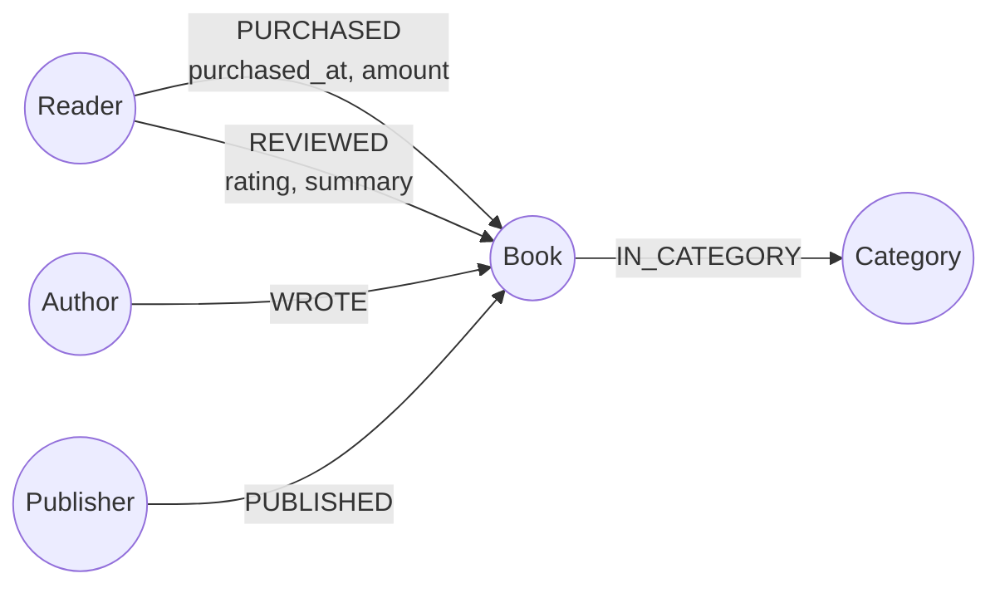
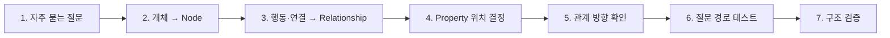

# Neo4j 스키마 설계 핵심 정리

> 핵심 흐름: **질문 정의 → 노드·관계·속성 설계 → 관계 방향 확인 → 질문에 필요한 경로 검증**

---

## 1. 그래프 스키마 설계의 기준

그래프 스키마는 데이터를 많이 담는 것보다 **자주 묻는 질문에 필요한 연결 경로가 실제로 만들어지는지**가 중요함.

온라인 서점 예시:



주요 질문과 필요한 경로:

| 질문 | 필요한 경로 |
|---|---|
| 같은 카테고리의 책 | `Book → Category ← Book` |
| 이 저자의 다른 책 | `Book ← Author → Book` |
| 이 독자가 구매한 책 | `Reader → Book` |
| 이 책의 평균 별점 | `Reader -[REVIEWED]-> Book`의 `rating` 집계 |

즉:

```text
질문
→ 필요한 개체와 연결을 찾음
→ 노드·관계로 설계
→ 실제로 그 경로를 따라갈 수 있는지 검사
```

---

## 2. 노드 · 관계 · 속성 배치 기준

| 구분 | 판단 기준 | 예 |
|---|---|---|
| **Node** | 독립적으로 구분하거나 다른 개체와 연결할 대상 | `Reader`, `Book`, `Author` |
| **Relationship** | 두 개체 사이의 행동·연결 | `PURCHASED`, `WROTE`, `REVIEWED` |
| **Node Property** | 개체 자체에 붙는 값 | `Reader.name`, `Book.title`, `Book.isbn` |
| **Relationship Property** | 특정 연결·행동마다 달라지는 값 | `rating`, `summary`, `purchased_at`, `amount` |

가장 중요한 판단:

```text
이 값은 무엇마다 달라지는가?
```

예를 들어 별점은 책 자체의 고정값이 아님.

```text
철수 -[:REVIEWED {rating: 5}]-> 데미안
영희 -[:REVIEWED {rating: 3}]-> 데미안
```

같은 책이어도 독자마다 값이 달라지므로:

```text
Book.rating            X
REVIEWED.rating        O
```

---

## 3. Python으로 스키마 표현하기

```python
book_model = {
    "nodes": {
        "Reader",
        "Book",
        "Author",
        "Publisher",
        "Category",
    },

    # 관계이름: (시작 노드, 끝 노드)
    "relationships": {
        "PURCHASED": ("Reader", "Book"),
        "REVIEWED": ("Reader", "Book"),
        "WROTE": ("Author", "Book"),
        "PUBLISHED": ("Publisher", "Book"),
        "IN_CATEGORY": ("Book", "Category"),
    },

    "node_properties": {
        "Reader": {"name"},
        "Book": {"title", "isbn"},
    },

    "rel_properties": {
        "REVIEWED": {"rating", "summary"},
        "PURCHASED": {"purchased_at", "amount"},
    },
}
```

> 원본 계열 자료의 `REIVIEW` 표기는 의미상 `REVIEWED`로 통일.

구조는 다음 네 묶음만 먼저 보면 됨.

```text
nodes
relationships
node_properties
rel_properties
```

---

## 4. 설계 검증

### 형식 검사

```python
assert validate_model(book_model) is True

print("✅ 형식 검사 통과")
```

### 결과

```text
✅ 형식 검사 통과
```

검사할 핵심:

```text
관계의 시작·끝 노드가 실제 존재하는가
모든 노드가 필요한 관계에 연결되는가
속성이 노드와 관계 중 올바른 위치에 있는가
```

하지만 **형식 검증만으로 설계가 좋은지는 판단할 수 없음.**

다음 단계에서 실제 질문에 답할 수 있는지 확인해야 함.

---

## 5. 질문을 경로로 바꾸기

```python
answers = {
    "같은 카테고리 책": [
        "IN_CATEGORY",
        "IN_CATEGORY",
    ],

    "이 저자의 다른 책": [
        "WROTE",
        "WROTE",
    ],

    "이 독자가 산 책": [
        "PURCHASED",
    ],

    "이 책 평균 별점": [
        "REVIEWED",
    ],
}
```

### 경로 읽기

```text
같은 카테고리 책

Book
  └─ IN_CATEGORY → Category
                         ← IN_CATEGORY ─ Book
```

```text
이 저자의 다른 책

Book ← WROTE ─ Author ─ WROTE → Book
```

```text
이 독자가 산 책

Reader ─ PURCHASED → Book
```

```text
이 책 평균 별점

Reader ─ REVIEWED {rating} → Book
```

도달성 검사:

```python
assert check_reachable(
    book_model,
    answers,
) is True

print("✅ 질문 경로 확인")
```

### 결과

```text
✅ 질문 경로 확인
```

---

## 6. 실제 Cypher로 생각하기

### 같은 카테고리의 다른 책

```cypher
MATCH
    (b:Book {title: '데미안'})
    -[:IN_CATEGORY]->
    (c:Category)
    <-[:IN_CATEGORY]-
    (other:Book)

WHERE b <> other

RETURN other.title
```

핵심은 `Category`가 단순 문자열이 아니라 **경유할 수 있는 노드**라는 점.

```text
Book → Category ← Book
```

따라서 카테고리가 같은 책을 관계 탐색으로 바로 찾을 수 있음.

### 이 책의 평균 별점

```cypher
MATCH
    (:Reader)
    -[r:REVIEWED]->
    (b:Book {title: '데미안'})

RETURN avg(r.rating) AS avg_rating
```

별점을 `Book.rating`에 넣었다면 독자별 평가를 구분할 수 없음.

---

## 7. 잘못된 스키마 찾기

대표적으로 확인할 문제:

| 문제 | 예 | 이유 |
|---|---|---|
| 속성 위치 오류 | `Book.rating` | 독자별로 달라지는 값 |
| 관계 방향 오류 | `Book -[:WROTE]-> Author` | 의미가 `책이 저자를 집필`이 됨 |
| 고립 노드 | `Publisher`만 만들고 관계 없음 | 그래프 경로에서 사용할 수 없음 |
| 질문 경로 누락 | `Category` 정보는 있는데 연결 없음 | 같은 카테고리 탐색 불가능 |

예시 진단 결과:

```text
B: rating은 관계 속성으로 두어야 함
D: 관계에 연결되지 않은 Publisher가 존재함
```

### 관계 방향은 문장으로 읽기

```text
Author -[:WROTE]-> Book
저자가 책을 집필했다
```

반대 방향:

```text
Book -[:WROTE]-> Author
책이 저자를 집필했다
```

문법상 가능한 구조라도 **의미가 틀릴 수 있음.**

따라서 자동 검증기는 보통:

```text
자료형
노드 존재 여부
연결 여부
속성 위치
```

등은 잡을 수 있지만, 관계 이름의 자연스러운 의미까지 완전히 판단하지는 못함.

---

## 8. 스키마 설계 순서



실제로는 다음 순서로 생각하면 됨.

```text
1. 어떤 질문에 답해야 하는가
2. 질문 속 핵심 개체를 노드 후보로 뽑음
3. 개체 사이의 동작을 관계로 만듦
4. 값이 개체 자체인지 관계마다 달라지는지 판단
5. 관계를 문장처럼 읽어 방향 확인
6. 질문을 그래프 경로로 바꿔 실제 도달 가능한지 확인
7. 검증 코드로 구조적 실수 확인
```

---

# 핵심 치트시트

```text
독립적으로 구분·연결할 대상
→ Node

개체 사이의 행동·연결
→ Relationship

개체 자체에 붙는 값
→ Node Property

특정 연결마다 달라지는 값
→ Relationship Property
```

스키마 품질 판단:

```text
값을 어디에 저장했는가?
+
질문에 필요한 경로가 존재하는가?
+
관계 방향을 문장으로 읽었을 때 자연스러운가?
```

### 한 줄 핵심

> **그래프 스키마 설계는 데이터를 분류하는 작업이 아니라, 필요한 질문을 관계 경로로 답할 수 있게 만드는 작업.**
