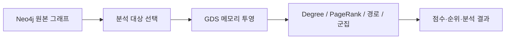
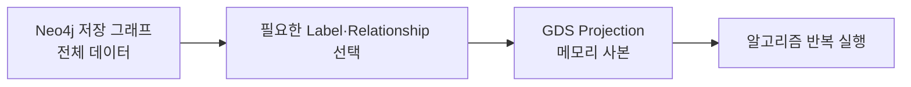
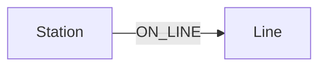
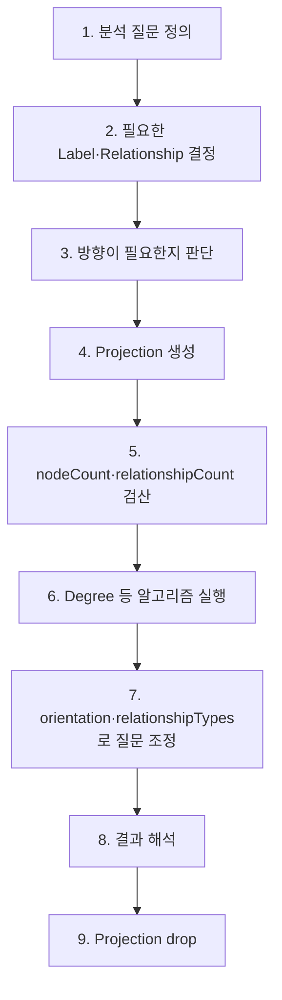

# Neo4j GDS 핵심 정리: 그래프 투영과 차수

> GDS를 사용할 때 가장 먼저 이해할 것은 **알고리즘보다 투영(projection)** 이다.  
> 원본 Neo4j 그래프에서 분석에 필요한 부분만 메모리에 올리고, 그 투영 위에서 Degree·PageRank 같은 알고리즘을 실행한다.

---

## 1. GDS와 그래프 투영

### GDS가 필요한 이유

일반 Cypher는 특정 패턴을 찾거나 집계하는 데 적합하다.

```text
기준 노드 지정
    ↓
MATCH로 필요한 경로 탐색
    ↓
조건·집계
    ↓
결과 반환
```

예를 들어 특정 약과 같은 유전자에 결합하는 약을 찾는 것은 Cypher만으로 충분하다.

```cypher
MATCH (c:Compound {name: $drug})-[:BINDS]->(g:Gene)<-[:BINDS]-(other:Compound)
WHERE other <> c
RETURN other.name AS 약물,
       count(DISTINCT g) AS 공유표적수
ORDER BY 공유표적수 DESC
LIMIT 5
```

반면 다음처럼 **그래프 전체를 대상으로 점수를 계산**하는 문제는 GDS가 담당한다.

```text
"전체 노드 중 무엇이 중심인가?"
"어떤 노드가 네트워크에서 중요한가?"
"어떤 군집이 형성되는가?"
"전체 그래프에서 최단 경로나 영향력은 어떠한가?"
```



GDS는 중심성·경로·군집 같은 그래프 분석 알고리즘을 제공한다.

단, **Degree 자체는 반복 계산을 하는 알고리즘은 아니다.**  
한 노드에 연결된 선을 세는 가장 단순한 중심성이고, GDS 사용법을 익히기 위한 첫 알고리즘으로 보면 된다.

### 설치 확인

```cypher
RETURN gds.version() AS version
```

버전 문자열이 나오면 GDS가 동작하는 상태다.

---

### 투영(projection)

GDS 알고리즘은 보통 Neo4j에 저장된 원본 그래프를 그대로 계산하지 않는다.

분석할 노드와 관계를 골라 **메모리 그래프를 별도로 생성**한다.



투영을 사용하는 이유:

- 메모리 구조에서 알고리즘을 빠르게 실행
- 필요한 노드·관계만 골라 계산 범위를 제한
- 같은 투영에 여러 알고리즘을 반복 적용 가능
- 원본 그래프와 분석용 구조를 분리

중요한 점:

> **투영에 무엇을 담는지가 곧 분석 질문의 범위를 결정한다.**

또한 투영은 **생성 시점의 사본**이다.  
원본 그래프가 바뀌어도 기존 투영이 자동으로 갱신되지는 않는다.

```text
원본 변경
   ↓
기존 Projection에는 자동 반영되지 않음
   ↓
최신 데이터가 필요하면 drop → 다시 project
```

단순 조회라면 굳이 투영할 필요가 없다.

```text
특정 데이터 조회·집계       → Cypher
전체 그래프 분석·중심성 계산 → GDS
```

---

## 2. 기본 투영과 관계 방향

### 기본(native) 투영

가장 기본적인 형태:

```cypher
CALL gds.graph.project(
    '투영이름',
    ['노드레이블1', '노드레이블2'],
    ['관계타입']
)
YIELD graphName, nodeCount, relationshipCount
RETURN graphName, nodeCount, relationshipCount
```

의료 그래프에서 약물과 질병의 `TREATS` 관계만 투영:

```cypher
CALL gds.graph.project(
    'treatGraph',
    ['Compound', 'Disease'],
    ['TREATS']
)
YIELD graphName, nodeCount, relationshipCount
RETURN graphName, nodeCount, relationshipCount
```

### 결과

```text
graphName         : treatGraph
nodeCount         : 1667
relationshipCount : 755
```

`Compound` 1,531개와 `Disease` 136개가 전부 들어간 결과다.

```text
1531 + 136 = 1667
```

`TREATS`가 없는 약물도 `Compound` 레이블을 가진 이상 투영에 포함된다.

### 관계의 양 끝 레이블이 모두 필요

예:

```text
(:Station)-[:ON_LINE]->(:Line)
```

투영할 때 `Station`만 넣으면 `Line`이 투영 밖에 있으므로 `ON_LINE` 관계가 들어갈 수 없다.

```cypher
CALL gds.graph.project(
    'lineGraph',
    ['Station', 'Line'],
    ['ON_LINE']
)
YIELD graphName, nodeCount, relationshipCount
RETURN graphName, nodeCount, relationshipCount
```

### 결과

```text
nodeCount         : 684
relationshipCount : 802
```

```text
Station 659 + Line 25 = 684
```

> 투영 직후에는 `nodeCount`, `relationshipCount`를 확인하는 습관이 중요하다.

---

### 투영할 때 관계 방향 지정

관계 설정을 map으로 주면 방향을 바꿀 수 있다.

| 설정 | 의미 |
|---|---|
| `NATURAL` | 원본 방향 유지. 기본값 |
| `REVERSE` | 원본 방향을 반대로 투영 |
| `UNDIRECTED` | 양방향 관계로 투영 |

예:

```cypher
CALL gds.graph.project(
    'treatUndirected',
    ['Compound', 'Disease'],
    {
        TREATS: {
            orientation: 'UNDIRECTED'
        }
    }
)
YIELD nodeCount, relationshipCount
RETURN nodeCount, relationshipCount
```

### 결과

```text
nodeCount         : 1667
relationshipCount : 1510
```

원본 `TREATS`는 755개다.

```text
755 × 2 = 1510
```

무방향 투영에서는 하나의 관계를 양쪽 방향으로 사용할 수 있게 담기 때문에 `relationshipCount`가 2배가 된다.

```text
원본
A ──▶ B

UNDIRECTED 투영
A ──▶ B
A ◀── B
```

### 언제 방향을 없애는가

방향 자체가 의미 있는 경우:

```text
계좌 ──송금──▶ 계좌
사용자 ──팔로우──▶ 사용자
Station ──ON_LINE──▶ Line
```

→ 방향 유지가 일반적.

연결 여부 자체가 중요한 경우:

```text
공통 이웃
유사한 개체
연결망 중심성
두 집단 사이의 연결
```

→ 무방향 분석을 고려.

핵심은 **원본 데이터의 방향이 아니라 분석 질문에서 방향이 필요한지** 판단하는 것.

---

## 3. 투영 검산과 관리

### 관계 수로 검산

투영을 만들었으면 원본 관계 수와 비교한다.

```cypher
MATCH ()-[r:TREATS]->()
RETURN count(r) AS cnt
```

### 결과

```text
755
```

방향 투영:

```text
Projection relationshipCount = 755
```

무방향 투영:

```text
Projection relationshipCount = 1510
                             = 755 × 2
```

정리:

| 투영 방식 | 예상 `relationshipCount` |
|---|---:|
| 방향 유지 | 원본 관계 수 |
| `UNDIRECTED` | 원본 관계 수 × 2 |

관계 타입이 여러 개라 어느 설정이 잘못됐는지 모를 때는 `schemaWithOrientation`을 확인한다.

```cypher
CALL gds.graph.list('mixedGraph')
YIELD schemaWithOrientation
RETURN schemaWithOrientation
```

예:

```text
PALLIATES   DIRECTED
TREATS      UNDIRECTED
```

설정이 잘못된 관계 타입을 바로 확인할 수 있다.

---

### 투영 목록 확인

```cypher
CALL gds.graph.list()
YIELD graphName, nodeCount, relationshipCount
RETURN graphName, nodeCount, relationshipCount
ORDER BY graphName
```

특정 투영만 확인:

```cypher
CALL gds.graph.list('treatGraph')
YIELD graphName, nodeCount, relationshipCount
RETURN graphName, nodeCount, relationshipCount
```

메모리 사용량 확인:

```cypher
CALL gds.graph.list()
YIELD graphName, nodeCount, memoryUsage
RETURN graphName, nodeCount, memoryUsage
ORDER BY graphName
```

큰 그래프라면 생성 전에 메모리를 추정할 수 있다.

```cypher
CALL gds.graph.project.estimate(
    ['Compound', 'Disease'],
    ['TREATS']
)
YIELD requiredMemory
RETURN requiredMemory
```

---

### 투영 삭제

```cypher
CALL gds.graph.drop('treatGraph')
YIELD graphName
RETURN graphName
```

존재하지 않아도 오류 없이 넘어가게 하려면:

```cypher
CALL gds.graph.drop('treatGraph', false)
YIELD graphName
RETURN graphName
```

노트북을 반복 실행할 때는 이 방식이 편하다.

```cypher
CALL gds.graph.drop('myGraph', false)
YIELD graphName
RETURN graphName
```

```text
↓
같은 이름으로 다시 project
```

투영 이름은 중복될 수 없다.

```text
A graph with name 'treatGraph' already exists.
```

이 오류가 나오면 기존 투영을 먼저 삭제하면 된다.

> 실사용에서는 자신이 만든 투영 이름을 명확하게 관리하고, 분석이 끝난 투영만 삭제하는 편이 안전하다.

---

## 4. 조건을 걸어 만드는 Cypher 투영

기본 투영은 지정한 레이블의 노드를 **전부** 담는다.

예를 들어:

```text
"질병 중 hypertension, asthma, migraine만 분석"
```

처럼 일부 데이터만 고르고 싶다면 기본 투영보다 **Cypher 투영**이 적합하다.

### 기본 구조

```cypher
MATCH (a)-[:REL]->(b)
WHERE 조건
RETURN gds.graph.project(
    '투영이름',
    a,
    b,
    {
        sourceNodeLabels: labels(a),
        targetNodeLabels: labels(b)
    }
) AS g
```

예:

```cypher
MATCH (c:Compound)-[:TREATS]->(d:Disease)
WHERE d.name IN ['hypertension', 'asthma', 'migraine']

RETURN gds.graph.project(
    'narrowGraph',
    c,
    d,
    {
        sourceNodeLabels: labels(c),
        targetNodeLabels: labels(d)
    }
) AS g
```

### 결과

```text
nodeCount         : 112
relationshipCount : 112
```

기본 투영과 비교:

| 투영 | 범위 | 노드 | 관계 |
|---|---|---:|---:|
| `treatGraph` | 모든 `Compound`, `Disease`, `TREATS` | 1667 | 755 |
| `narrowGraph` | 지정한 질병 3개와 연결된 약물만 | 112 | 112 |

즉 같은 원본 데이터라도 **투영 조건에 따라 분석 그래프가 완전히 달라진다.**

---

### 원본에 없는 분석용 관계 만들기

Cypher에서 만든 노드 쌍을 바로 투영할 수도 있다.

```cypher
MATCH
    (p:PharmacologicClass)-[:INCLUDES]->(c1:Compound),
    (p)-[:INCLUDES]->(c2:Compound)

WHERE elementId(c1) < elementId(c2)

RETURN gds.graph.project(
    'sameClassGraph',
    c1,
    c2,
    {
        sourceNodeLabels: labels(c1),
        targetNodeLabels: labels(c2)
    }
) AS g
```

의미:

```text
원본

Compound A ─▶ PharmacologicClass ◀─ Compound B

분석용 Projection

Compound A ───────────── Compound B
       같은 약효분류
```

원본 DB에 새 관계를 저장하지 않고도 **분석할 때만 필요한 연결 구조**를 만들 수 있다.

---

### Cypher 투영을 무방향으로 만들기

다섯 번째 인자에 다음 설정을 사용한다.

```cypher
{undirectedRelationshipTypes: ['*']}
```

예:

```cypher
MATCH (c:Compound)-[:TREATS]->(d:Disease)
WHERE d.name IN ['hypertension', 'asthma', 'migraine']

RETURN gds.graph.project(
    'narrowUndirected',
    c,
    d,
    {
        sourceNodeLabels: labels(c),
        targetNodeLabels: labels(d)
    },
    {
        undirectedRelationshipTypes: ['*']
    }
) AS g
```

### 결과

```text
nodeCount         : 112
relationshipCount : 224
```

방향 투영 `112`건의 정확히 2배다.

### 기본 투영과 Cypher 투영 선택

| 방식 | 특징 | 사용 상황 |
|---|---|---|
| 기본 투영 | 레이블·관계 타입 전체를 빠르게 투영 | 전체 그래프 분석 |
| Cypher 투영 | `MATCH`, `WHERE`로 필요한 쌍만 선택 | 일부 데이터 분석 |
| Cypher 가상 연결 | 원본에 없는 관계도 분석용으로 생성 | 공통 속성·경유 노드를 직접 연결해 분석 |

---

## 5. Degree 중심성 실전

### Degree란

**Degree = 한 노드에 연결된 관계의 개수**

가장 단순한 중심성이다.

방향 그래프에서는 세 가지로 나뉜다.

```text
A ──▶ B
A ──▶ C
D ──▶ A
```

A 기준:

```text
Out-degree = 2
In-degree  = 1
Degree     = 3
```

GDS에서는 다음처럼 계산한다.

```cypher
CALL gds.degree.stream('투영이름')
YIELD nodeId, score
```

기본값은 `NATURAL`.

즉 **나가는 관계(out-degree)** 를 센다.

---

### 방향별 Degree

| `orientation` | 계산 | 의미 |
|---|---|---|
| `NATURAL` | 나가는 관계 | out-degree |
| `REVERSE` | 들어오는 관계 | in-degree |
| `UNDIRECTED` | 양쪽 관계 | 전체 연결 수 |

예제 투영:

```cypher
CALL gds.graph.project(
    'targetGraph',
    ['Compound', 'Disease', 'Gene'],
    ['TREATS', 'BINDS']
)
YIELD nodeCount, relationshipCount
RETURN nodeCount, relationshipCount
```

### 결과

```text
nodeCount         : 14780
relationshipCount : 12326
```

기본 Degree:

```cypher
CALL gds.degree.stream('targetGraph')
YIELD nodeId, score

RETURN
    gds.util.asNode(nodeId).name AS name,
    labels(gds.util.asNode(nodeId))[0] AS label,
    score

ORDER BY score DESC, name
LIMIT 3
```

### 결과

```text
Sunitinib   Compound   134
Bosutinib   Compound   104
Crizotinib  Compound    86
```

`TREATS`, `BINDS`가 모두 `Compound`에서 밖으로 나가기 때문에 기본 Degree에서는 `Disease`, `Gene`의 점수가 0이 된다.

```text
Compound ──TREATS──▶ Disease
Compound ──BINDS───▶ Gene
```

따라서 Degree 결과를 읽기 전에 **관계 방향을 먼저 봐야 한다.**

---

### 같은 투영을 방향만 바꿔 계산

```cypher
CALL gds.degree.stream(
    'targetGraph',
    {orientation: 'REVERSE'}
)
YIELD nodeId, score

RETURN
    gds.util.asNode(nodeId).name AS name,
    labels(gds.util.asNode(nodeId))[0] AS label,
    score

ORDER BY score DESC, name
LIMIT 1
```

결과 비교:

| 설정 | 전체 점수 합 | 1위 | 의미 |
|---|---:|---|---|
| `NATURAL` | 12,326 | `Sunitinib` 134 | 가장 많이 내보내는 노드 |
| `REVERSE` | 12,326 | `CYP3A4` 516 | 가장 많이 받는 노드 |
| `UNDIRECTED` | 24,652 | `CYP3A4` 516 | 연결이 가장 많이 붙은 노드 |

검산도 가능하다.

```text
NATURAL 합계 = 관계 수
REVERSE 합계 = 관계 수
UNDIRECTED 합계 = 관계 수 × 2
```

---

### 특정 관계만 Degree 계산

투영에 여러 관계 타입이 들어 있어도 `relationshipTypes`로 계산 대상을 제한할 수 있다.

```cypher
CALL gds.degree.stream(
    'targetGraph',
    {
        relationshipTypes: ['BINDS'],
        orientation: 'REVERSE'
    }
)
YIELD nodeId, score
```

같은 `targetGraph` 하나로 다음 질문을 모두 해결할 수 있다.

| 관계 | 방향 | 결과 1위 | 질문 |
|---|---|---|---|
| `BINDS` | `NATURAL` | `Sunitinib` 132 | 표적이 가장 많은 약 |
| `BINDS` | `REVERSE` | `CYP3A4` 516 | 가장 많은 약이 붙는 표적 |
| `TREATS` | `NATURAL` | `Methotrexate` 19 | 치료하는 병이 가장 많은 약 |
| `TREATS` | `REVERSE` | `hypertension` 68 | 치료제가 가장 많은 병 |

`relationshipTypes`는 결과에서 행을 거르는 것이 아니다.

> **알고리즘 계산에 들어가는 관계 자체를 제한한다.**

---

### 전철 그래프로 이해하기

원본 구조:



방향은:

```text
Station ──ON_LINE──▶ Line
```

따라서 `NATURAL`은 역이 몇 개 노선에 속하는지를 센다.

```cypher
CALL gds.degree.stream(
    'lineGraph',
    {
        relationshipTypes: ['ON_LINE'],
        orientation: 'NATURAL'
    }
)
YIELD nodeId, score

RETURN
    gds.util.asNode(nodeId).name AS name,
    labels(gds.util.asNode(nodeId))[0] AS label,
    score

ORDER BY score DESC, name
LIMIT 1
```

### 결과

```text
김포공항 / Station / 5
```

즉 김포공항은 5개 노선에 연결된 역이다.

`REVERSE`로 바꾸면 의미가 반대가 된다.

```cypher
CALL gds.degree.stream(
    'lineGraph',
    {
        relationshipTypes: ['ON_LINE'],
        orientation: 'REVERSE'
    }
)
YIELD nodeId, score

RETURN
    gds.util.asNode(nodeId).name AS name,
    labels(gds.util.asNode(nodeId))[0] AS label,
    score

ORDER BY score DESC, name
LIMIT 1
```

### 결과

```text
1호선 / Line / 102
```

즉 1호선에 연결된 역이 가장 많다.

```text
같은 ON_LINE 관계

NATURAL
Station → Line
"이 역은 몇 개 노선에 속하나?"

REVERSE
Station ← Line
"이 노선에는 몇 개 역이 속하나?"
```

방향 하나가 바뀌면 **점수뿐 아니라 답의 종류 자체가 달라진다.**

---

### 투영 방향과 Degree 방향을 구분

두 `orientation`은 사용하는 시점이 다르다.

```text
1. Projection 생성 시 orientation
   → 그래프 자체를 어떤 방향으로 메모리에 담을지 결정

2. Degree 실행 시 orientation
   → 이미 담긴 그래프를 어떤 방향으로 셀지 결정
```

예:

```cypher
// 투영할 때
{TREATS: {orientation: 'UNDIRECTED'}}
```

```cypher
// Degree 계산할 때
{orientation: 'REVERSE'}
```

중요:

> **이미 `UNDIRECTED`로 투영한 그래프에 Degree의 `orientation: 'UNDIRECTED'`를 다시 적용하지 않는다.**

무방향 투영은 이미 관계가 양방향으로 존재한다.

```text
원래 관계 68개
↓
무방향 투영에서 양방향으로 저장
↓
기본 NATURAL로 세면 68
↓
다시 UNDIRECTED로 계산
↓
136으로 중복 계산 가능
```

방향별 값을 따로 비교할 계획이라면 처음부터 **방향을 유지한 투영**을 만드는 편이 안전하다.

---

## 6. 실사용 흐름

GDS 분석은 다음 순서로 생각하면 된다.



### 1. 먼저 질문을 정함

```text
"가장 많은 노선이 지나는 역은?"
```

필요한 것:

```text
Node         : Station, Line
Relationship : ON_LINE
Direction    : Station → Line
```

### 2. 투영

```cypher
CALL gds.graph.project(
    'lineGraph',
    ['Station', 'Line'],
    ['ON_LINE']
)
YIELD nodeCount, relationshipCount
RETURN nodeCount, relationshipCount
```

### 3. 검산

```text
예상 노드     : 659 + 25 = 684
예상 관계     : 802
실제 Projection: 684 / 802
```

### 4. 알고리즘

```text
가장 많은 노선이 지나는 역
→ NATURAL Degree

가장 많은 역을 가진 노선
→ REVERSE Degree
```

### 5. 정리

```cypher
CALL gds.graph.drop('lineGraph', false)
YIELD graphName
RETURN graphName
```

---

## 조건부 전철 투영 예시

`2호선`, `3호선`, `4호선`과 그 역만 분석:

```cypher
MATCH (s:Station)-[:ON_LINE]->(l:Line)
WHERE l.name IN ['2호선', '3호선', '4호선']

RETURN gds.graph.project(
    'narrowLineGraph',
    s,
    l,
    {
        sourceNodeLabels: labels(s),
        targetNodeLabels: labels(l)
    }
) AS g
```

### 결과

```text
nodeCount         : 144
relationshipCount : 146
```

역은 141개, 노선은 3개다.

```text
141 + 3 = 144
```

관계가 146개인 이유는 세 노선 사이의 환승역 일부가 둘 이상의 `ON_LINE` 관계를 가지기 때문.

---

## 원본 실습에서 주의할 부분

### 없는 투영 삭제 오류

다음 코드는 대상이 없으면 오류가 난다.

```cypher
CALL gds.graph.drop('lineUndirected')
```

노트북 반복 실행용으로는 다음이 안전하다.

```cypher
CALL gds.graph.drop('lineUndirected', false)
YIELD graphName
RETURN graphName
```

---

### `narrowLineGraph` 관계 수 146 / 292 차이

원본 설명에서는 방향을 유지한 Cypher 투영의 기대값을 `146`으로 제시했지만, 실습 코드에는 다음 설정이 들어가 있었다.

```cypher
{undirectedRelationshipTypes: ['*']}
```

이 설정을 사용하면 관계가 양방향으로 투영되어:

```text
146 × 2 = 292
```

가 된다.

따라서 목적에 따라 구분해야 한다.

```text
방향 유지 → 146
무방향   → 292
```

---

# 핵심 압축

| 개념 | 핵심 |
|---|---|
| GDS | 그래프 중심성·경로·군집 등의 분석 엔진 |
| Projection | 원본에서 분석할 부분만 메모리에 올린 그래프 |
| 투영 범위 | 무엇을 담는지가 분석 질문의 범위를 결정 |
| 기본 투영 | 레이블과 관계 타입 전체를 담음 |
| Cypher 투영 | `MATCH`, `WHERE`로 필요한 부분만 선택 |
| `NATURAL` | 원래 방향 |
| `REVERSE` | 반대 방향 |
| `UNDIRECTED` | 양쪽 방향 |
| 검산 | 투영 직후 `nodeCount`, `relationshipCount` 확인 |
| 무방향 검산 | 관계 수가 원본의 2배인지 확인 |
| `schemaWithOrientation` | 관계 타입별 투영 방향 확인 |
| `gds.graph.list()` | 현재 투영 목록·메모리 확인 |
| `gds.graph.drop()` | 투영 삭제 |
| Degree | 노드에 연결된 관계 수 |
| Degree 기본값 | `NATURAL` → out-degree |
| `relationshipTypes` | 알고리즘에 사용할 관계 타입 제한 |
| 실사용 원칙 | **질문 → 투영 범위 → 방향 → 검산 → 알고리즘 → 삭제** |

## 한 줄 정리

> **GDS에서는 먼저 “어떤 그래프를 계산할 것인가”를 투영으로 정의하고, 그다음 방향과 관계 종류를 선택해 Degree 같은 알고리즘을 실행한다.**
