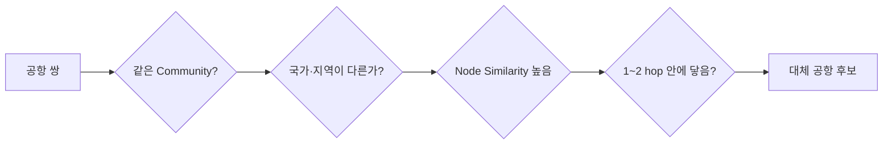

# Neo4j GDS 노드 유사도 · 최단 경로 종합 정리

> 기준: `교안_02_유사도_경로_종합.ipynb`
>
> 핵심 데이터: 아시아 공항 노선망 `Airport -[:ROUTE]-> Airport`
>
> 보조 데이터: 다섯 부서 메일망 `Member -[:MAILED]-> Member`, 수도권 전철망 `Station -[:NEXT_TO]-> Station`

---

## 0. 전체 흐름

이번 단원은 그래프에서 **닮은 노드를 찾고 → 가장 짧은 길을 찾고 → 여러 조건을 겹쳐 실제 후보를 좁히는 과정**.

```text
원본 Neo4j 그래프
        ↓
GDS용 무방향 Projection
        ↓
┌─────────────────────────────┐
│ 1. Node Similarity          │
│    상대 노드 집합 비교       │
│    Jaccard + degreeCutoff   │
└─────────────────────────────┘
        ↓
┌─────────────────────────────┐
│ 2. Shortest Path           │
│    홉 수 / 거리 / 시간 최소  │
│    Dijkstra                │
└─────────────────────────────┘
        ↓
┌─────────────────────────────┐
│ 3. 조건 결합                │
│    커뮤니티 + 유사도 + 경로  │
└─────────────────────────────┘
        ↓
대체 공항 후보 추출
```

핵심은 결과 숫자보다 **무엇을 기준으로 닮았다고 했는지, 무엇을 비용으로 최소화했는지**를 먼저 확인하는 것.

```text
"가장 닮음"  → 유사도의 정의에 따라 달라짐
"가장 가까움" → 비용의 정의에 따라 달라짐
```

---

# 1. 실습 그래프 준비

이번 실습에서는 서로 다른 세 그래프를 한 DB에서 사용.

| Projection | 원본 그래프 | 노드 | 원본 관계 | 분석 목적 |
|---|---|---:|---:|---|
| `air` | 공항 노선망 | 767 | 8,045 | 유사도 · 경로 · 종합 분석 |
| `team` | 부서 메일망 | 194 | 2,439 | 유사도 · 경로 보조 실습 |
| `subway` | 수도권 전철망 | 659 | 778 | 가중 최단 경로 실습 |

레이블과 관계 타입이 다르므로 한 DB 안에서도 서로 섞이지 않음.

```text
Airport -[:ROUTE]-> Airport
Member  -[:MAILED]-> Member
Station -[:NEXT_TO]-> Station
```

## 1-1. GDS Projection

분석에서는 연결 자체를 보므로 세 그래프 모두 무방향으로 투영.

### 항공망

```python
run_cypher("CALL gds.graph.drop('air', false) YIELD graphName")

stats = run_cypher('''
    CALL gds.graph.project(
        'air',
        'Airport',
        {
            ROUTE: {
                orientation: 'UNDIRECTED',
                properties: ['km', 'hours', 'airlines']
            }
        }
    )
    YIELD graphName, nodeCount, relationshipCount
    RETURN graphName, nodeCount, relationshipCount
''')

print(stats[0])
```

**결과**

```text
{'graphName': 'air', 'nodeCount': 767, 'relationshipCount': 16090}
```

원본 방향 관계 8,045개가 무방향 Projection에서 양쪽으로 사용되므로:

```text
8,045 × 2 = 16,090
```

### 메일망

```text
원본 MAILED 관계 : 2,439
무방향 Projection : 4,878
```

### 전철망

```text
원본 NEXT_TO 구간 : 778
무방향 Projection : 1,556
```

> `UNDIRECTED`는 실제 데이터의 방향을 없애고 **양쪽으로 이동 가능한 분석용 구조**를 만드는 것. 실제 편도 운항 여부처럼 방향이 중요한 문제에서는 그대로 사용하면 안 됨.

---

# 2. 노드 유사도: 연결된 상대가 얼마나 겹치는가

노드 유사도는 노드의 속성값이 아니라 **연결 구조가 얼마나 비슷한가**를 비교.

예:

```text
A가 연결된 상대 = {X, Y, Z}
B가 연결된 상대 = {Y, Z, W}

공통       = {Y, Z}       → 2개
전체 합집합 = {X,Y,Z,W}    → 4개

Jaccard = 2 / 4 = 0.5
```

즉 두 노드끼리 직접 연결되어 있지 않아도 주변 구조가 비슷하면 높은 유사도가 나올 수 있음.

---

## 2-1. Jaccard 유사도

기본 정의:

```text
Jaccard = |교집합| / |합집합|

        둘 다 연결된 상대 수
      ─────────────────────
      둘 중 하나라도 연결된 상대 수
```

범위:

```text
0 → 공통 상대 없음
1 → 상대 목록이 완전히 같음
```

### GDS 기본 문법

```cypher
CALL gds.nodeSimilarity.stream(
    '투영이름',
    {
        topK: 10,
        degreeCutoff: 10
    }
)
YIELD node1, node2, similarity
```

| 옵션 | 의미 |
|---|---|
| `topK` | **각 노드마다** 유사도가 높은 상대 K개 |
| `degreeCutoff` | 연결 상대가 너무 적은 노드를 비교에서 제외 |
| `similarityMetric` | 비교 지표 변경. 기본은 Jaccard |

`topK: 10`은 전체에서 10쌍을 뽑는 것이 아님.

```text
A의 상위 10개
B의 상위 10개
C의 상위 10개
...
```

따라서 `(A, B)`와 `(B, A)`가 둘 다 나올 수 있음.

---

## 2-2. 유사도 1.0의 함정

`degreeCutoff: 1`로 거의 모든 공항을 비교하면 상위 결과가 전부 1.0에 가까워짐.

```python
sim_rows = run_cypher('''
    CALL gds.nodeSimilarity.stream(
        'air',
        {topK: 10, degreeCutoff: 1}
    )
    YIELD node1, node2, similarity
    RETURN gds.util.asNode(node1).iata AS airport,
           gds.util.asNode(node2).iata AS partner,
           round(similarity, 4) AS similarity
    ORDER BY similarity DESC, airport
    LIMIT 6
''')
```

**결과**

```text
airport  partner  similarity
AAT      KRY      1.0
AAT      HTN      1.0
AAT      KCA      1.0
AAT      TCG      1.0
AAT      NLT      1.0
AAY      AXK      1.0
```

전체에서 유사도 1.0인 공항 쌍:

```text
478쌍
```

그중 AAT와 HTN을 직접 확인하면:

```text
AAT 상대 공항 수 = 1
HTN 상대 공항 수 = 1
```

둘 다 같은 한 곳만 연결되어 있으면:

```text
교집합 = 1
합집합 = 1
Jaccard = 1 / 1 = 1.0
```

하지만 이것을 "완전히 닮은 핵심 공항"이라고 해석하면 안 됨.

> **비교할 정보가 거의 없어서 1.0이 된 것일 수 있음.**

---

## 2-3. `degreeCutoff`로 작은 노드 제거

```python
for cutoff in [1, 10, 20]:
    stat = run_cypher('''
        CALL gds.nodeSimilarity.stats(
            'air',
            {topK: 10, degreeCutoff: $cutoff}
        )
        YIELD nodesCompared
        RETURN nodesCompared
    ''', cutoff=cutoff)[0]

    top = run_cypher('''
        CALL gds.nodeSimilarity.stream(
            'air',
            {topK: 10, degreeCutoff: $cutoff}
        )
        YIELD node1, node2, similarity
        RETURN gds.util.asNode(node1).iata AS airport,
               gds.util.asNode(node2).iata AS partner,
               round(similarity, 4) AS similarity
        ORDER BY similarity DESC, airport
        LIMIT 1
    ''', cutoff=cutoff)[0]

    print(cutoff, stat['nodesCompared'], top)
```

**결과**

| cutoff | 비교 대상 | 최고 쌍 | 유사도 |
|---:|---:|---|---:|
| 1 | 767 | AAT - KCA | 1.0000 |
| 10 | 187 | HAN - SGN | 0.6604 |
| 20 | 112 | HAN - SGN | 0.6604 |

`degreeCutoff`를 높이면 작은 공항을 많이 제외하므로 **유사도 1.0 노이즈를 줄일 수 있음.**

하지만 너무 높이면 실제로 의미 있는 작은 공항도 사라짐.

```text
degreeCutoff 낮음
→ 작은 노드 포함
→ 1.0 과대평가 증가

높음
→ 큰 노드 중심 비교
→ 작은 노드 정보 손실
```

교안에서는 큰 공항끼리 비교하기 위해 `10` 사용.

---

## 2-4. 차수와 서로 다른 상대 수를 구분

Jaccard에서 비교하는 것은 **관계 개수**가 아니라 **서로 다른 이웃의 집합**.

왕복 노선:

```text
ICN → NRT
ICN ← NRT

관계 수 = 2
상대 공항 = 1곳
```

인천(ICN)의 실습값:

```text
관계 수       = 188
상대 공항 수   = 94
```

따라서 `degreeCutoff`의 의미를 판단할 때 관계 수와 이웃 수를 혼동하지 않음.

---

## 2-5. 인천과 가장 닮은 공항

```python
near = run_cypher('''
    CALL gds.nodeSimilarity.stream(
        'air',
        {topK: 5, degreeCutoff: 10}
    )
    YIELD node1, node2, similarity
    WITH gds.util.asNode(node1) AS a,
         gds.util.asNode(node2) AS b,
         similarity
    WHERE a.iata = $who
    RETURN b.iata AS airport,
           b.city AS city,
           b.country AS country,
           round(similarity, 4) AS similarity
    ORDER BY similarity DESC
''', who='ICN')
```

**결과**

| 공항 | 도시 | 국가·지역 | 유사도 |
|---|---|---|---:|
| NRT | Tokyo | Japan | 0.5258 |
| TPE | Taipei | Taiwan | 0.5254 |
| HKG | Hong Kong | Hong Kong | 0.5000 |
| PVG | Shanghai | China | 0.4459 |
| BKK | Bangkok | Thailand | 0.3657 |

1위와 2위 차이는 매우 작음.

```text
NRT 0.5258
TPE 0.5254
차이 0.0004
```

따라서 유사도처럼 0~1 사이에 밀집된 값은 너무 빨리 반올림하면 순위 차이가 사라질 수 있음.

---

## 2-6. 손으로 Jaccard 검산

인천(ICN)과 나리타(NRT):

```python
check = run_cypher('''
    MATCH (a:Airport {iata: $a})--(x:Airport)
    WITH collect(DISTINCT x) AS partners_a

    MATCH (b:Airport {iata: $b})--(y:Airport)
    WITH partners_a,
         collect(DISTINCT y) AS partners_b

    WITH partners_a,
         partners_b,
         [p IN partners_a WHERE p IN partners_b] AS both

    RETURN size(partners_a) AS partners_a,
           size(partners_b) AS partners_b,
           size(both) AS common,
           size(partners_a) + size(partners_b) - size(both) AS union_size,
           round(
               1.0 * size(both) /
               (size(partners_a) + size(partners_b) - size(both)),
               4
           ) AS jaccard
''', a='ICN', b='NRT')
```

**결과**

```text
ICN 상대     94
NRT 상대     54
공통 상대    51
합집합       97

51 / 97 = 0.5258
```

GDS 결과와 동일.

> 새 알고리즘을 처음 쓸 때는 **한 사례를 직접 계산해 검산**하면 데이터 문제와 알고리즘 해석 문제를 구분하기 쉬움.

---

## 2-7. 메일망 적용 예시

377번 구성원과 가장 닮은 5명을 찾는 형태.

```python
team_sim = run_cypher('''
    CALL gds.nodeSimilarity.stream(
        'team',
        {topK: 5, degreeCutoff: 10}
    )
    YIELD node1, node2, similarity

    WITH gds.util.asNode(node1) AS a,
         gds.util.asNode(node2) AS b,
         similarity

    WHERE a.employee_id = 377

    RETURN b.employee_id AS employee_id,
           b.dept AS dept,
           round(similarity, 4) AS similarity
    ORDER BY similarity DESC
''')
```

**원본 확인 기준**

```text
1위: 157번
부서: 0
유사도: 0.68
```

377번은 부서 7이므로 **소속 부서는 달라도 실제 연결 상대가 비슷할 수 있음.**

---

# 3. 최단 경로: 어떤 길이 가장 짧은가

최단 경로는 출발 노드와 도착 노드 사이에서 **총비용이 가장 작은 경로**를 찾는 문제.

```text
비용을 안 줌 → 관계 하나 = 비용 1
             → 홉 수 최소

km를 비용으로 줌 → 총 거리 최소
hours를 비용으로 줌 → 총 시간 최소
```

---

## 3-1. `gds.shortestPath.dijkstra`

```cypher
MATCH (a:Airport {iata: 'ICN'}),
      (b:Airport {iata: 'BTH'})

CALL gds.shortestPath.dijkstra.stream(
    'air',
    {
        sourceNode: a,
        targetNode: b
    }
)
YIELD totalCost, nodeIds
```

중요:

```text
sourceNode / targetNode에는
'IATA 문자열'이 아니라 실제 Neo4j 노드를 넘김
```

가중치가 없으면:

```text
관계 한 개 비용 = 1

그래서
totalCost = 건넌 관계 수 = hops
```

---

## 3-2. 인천 → 바탐: 편 수 최소

```python
route = run_cypher('''
    MATCH (a:Airport {iata: $a}),
          (b:Airport {iata: $b})

    CALL gds.shortestPath.dijkstra.stream(
        'air',
        {sourceNode: a, targetNode: b}
    )
    YIELD totalCost, nodeIds

    RETURN totalCost AS cost,
           size(nodeIds) - 1 AS hops,
           [n IN nodeIds | gds.util.asNode(n).iata] AS route,
           [n IN nodeIds | gds.util.asNode(n).city] AS cities
''', a='ICN', b='BTH')
```

**실제 노트북 실행 결과 예시**

```text
총비용: 2.0
편 수: 2
경로: ['ICN', 'DPS', 'BTH']
도시: ['Seoul', 'Denpasar', 'Batam']
```

하지만 2편짜리 최단 경로는 두 개 존재.

```text
ICN → CGK → BTH
ICN → DPS → BTH
```

따라서 보장되는 것은:

```text
최소 편 수 = 2
```

경유 공항 자체는 실행마다 달라질 수 있음.

> **동점 최단 경로가 여러 개면 `dijkstra.stream()`이 어느 경로 하나를 돌려줄지는 고정되지 않음.**

---

## 3-3. 한 출발지에서 전체까지: `allShortestPaths`

특정 한 목적지가 아니라 **출발지에서 도달 가능한 모든 노드까지의 최소 비용**을 계산.

```python
spread = run_cypher('''
    MATCH (a:Airport {iata: $a})

    CALL gds.allShortestPaths.dijkstra.stream(
        'air',
        {sourceNode: a}
    )
    YIELD totalCost

    RETURN toInteger(totalCost) AS hops,
           count(*) AS airports
    ORDER BY hops
''', a='ICN')
```

### 인천(ICN)

| 홉 | 공항 수 |
|---:|---:|
| 0 | 1 |
| 1 | 94 |
| 2 | 511 |
| 3 | 149 |
| 4 | 12 |

### 베이징(PEK)

| 홉 | 공항 수 |
|---:|---:|
| 0 | 1 |
| 1 | 157 |
| 2 | 440 |
| 3 | 156 |
| 4 | 13 |

해석:

```text
ICN 직항    94곳
PEK 직항   157곳
→ 허브 차이는 큼

2편 이내
ICN 605곳
PEK 597곳
→ 거의 비슷
```

즉 이 데이터에서 허브 공항의 가장 큰 이점은 **전체 도달 가능 여부보다 직항 편의성**에 있음.

---

# 4. 가중 최단 경로: 무엇을 최소화할 것인가

Dijkstra의 핵심은 알고리즘 자체보다 **비용을 어떤 값으로 정의하느냐**.

```cypher
relationshipWeightProperty: 'km'
```

처럼 관계 속성을 비용으로 지정.

## 4-1. 세 가지 기준

```text
편 수 최소
→ 관계 수를 최소화

거리 최소
→ km 합계를 최소화

시간 최소
→ hours 합계를 최소화
```

교안의 `hours`는 원본 데이터가 아니라 다음 식으로 만든 값.

```text
hours = km / 800 + 1
```

의미:

```text
비행 시간 ≈ 거리 / 800km/h
+ 각 구간마다 1시간의 이착륙·환승 비용
```

즉 시간 최소 경로에는 **거리와 편 수가 동시에 반영**됨.

---

## 4-2. 동일 구간을 세 기준으로 비교

인천(ICN) → 바탐(BTH).

```python
for label, weight in [
    ('편 수 최소', None),
    ('거리 최소', 'km'),
    ('시간 최소', 'hours')
]:
    ...
```

### 노트북 실제 실행 출력

| 기준 | 편 수 | km | 시간 | 경로 |
|---|---:|---:|---:|---|
| 편 수 최소 | 2 | 6,916 | 10.65 | ICN → DPS → BTH |
| 거리 최소 | 4 | 5,096 | 10.37 | ICN → CAN → PEN → SZB → BTH |
| 시간 최소 | 3 | 5,175 | 9.47 | ICN → KUL → PKU → BTH |

핵심:

```text
편 수 최소 ≠ 거리 최소 ≠ 시간 최소
```

거리 최소 경로는 4편이지만 총거리는 가장 짧음.

시간 최소 경로는 3편이지만 2편짜리 경로보다 더 빠름.

즉:

```text
한 번 덜 갈아타는 것보다
크게 돌아가는 손해가 더 클 수 있음
```

---

## 4-3. 원본 노트북의 동점 경로 설명 주의

원본의 **실행 출력**에서는 편 수 최소 경로가:

```text
ICN → DPS → BTH
6,916km / 10.65시간
```

으로 기록되어 있음.

반면 바로 뒤 설명 표에는 다른 동점 경로인:

```text
ICN → CGK → BTH
6,118km / 9.65시간
```

이 적혀 있음.

둘 다 **2편이라는 최단 홉 조건을 만족하는 동점 경로**라는 점이 핵심.

따라서 정리본에서는 실제 실행 출력값을 결과 예시로 사용하고, 경로 자체는 고정값으로 외우지 않음.

```text
고정해서 믿을 값 → 최소 홉 수 2
실행마다 달라질 수 있는 값 → 동점 중 선택된 경유지
```

---

## 4-4. 비용 정의가 답을 바꿈

현재 정의:

```text
hours = km / 800 + 1
```

환승 비용을 1시간이 아니라 더 크게 잡으면 결과가 달라짐.

교안 설명 기준:

```text
환승 벌점 1시간
→ 시간 최소 경로가 더 많은 환승을 감수할 수 있음

환승 벌점 증가
→ 적게 갈아타는 경로가 점점 유리
```

따라서 보고서에서 "가장 빠른 경로"만 적으면 부족.

반드시 다음도 함께 기록.

```text
거리 기준인지
시간 기준인지
시간 계산식은 무엇인지
환승 비용은 얼마인지
```

> **모델의 정의가 사실상 답을 결정함.**

---

## 4-5. 잘못된 비용 선택 예시

인천(ICN) → 프놈펜(PNH).

```text
직항 거리       = 3,598 km
거리 최소 경로   = ICN → CAN → PNH
총거리           = 3,597 km
```

거리만 최소화하면 **1km를 줄이기 위해 한 번 갈아타는 경로**를 선택.

알고리즘 계산은 맞지만 실제 여행 목적에는 부적절할 수 있음.

```text
알고리즘 오류 X
비용 정의 문제 O
```

---

# 5. 전철망에서 같은 원리 확인

강남 → 홍대입구를 두 기준으로 비교.

```text
정거장 수 최소
→ 가중치 없음

거리 최소
→ relationshipWeightProperty: 'km'
```

원본 확인 기준:

| 기준 | 정거장 수 | 총 거리 |
|---|---:|---:|
| 정거장 수 최소 | 10 | 13.48 km |
| 거리 최소 | 11 | 13.13 km |

```text
거리 최소
→ 정거장은 한 개 더 지나지만
→ 총 거리는 더 짧음
```

교안 설명에서는 환승 횟수도 다름.

```text
정거장 수 최소 경로 → 환승 5회
거리 최소 경로       → 환승 4회
```

즉 전철에서도:

```text
정거장 수 최소
거리 최소
환승 최소
```

가 서로 다른 문제.

> 이 실습의 `km`는 **역 좌표 사이 직선거리**라 실제 선로 길이와 다름. 속성의 출처까지 확인해야 결과를 제대로 해석할 수 있음.

---

# 6. 커뮤니티 + 유사도 + 경로를 겹치기

한 알고리즘만으로 "대체 공항"을 결정하기 어려움.

교안에서는 네 조건을 함께 적용.

```text
1. 같은 커뮤니티
2. 서로 다른 국가·지역
3. 노선 상대가 유사함
4. 두 편 이내로 도달 가능
```

구조:



---

## 6-1. 커뮤니티 저장

```python
run_cypher('''
    CALL gds.leiden.write(
        'air',
        {
            writeProperty: 'community',
            randomSeed: 42,
            concurrency: 1
        }
    )
    YIELD communityCount
    RETURN communityCount
''')
```

실행 결과:

```text
community 수: 7
```

교안 설명대로 실행 환경에 따라 커뮤니티 수가 약간 달라질 수 있으므로 **번호나 개수 자체보다 이후 조건을 통과하는 후보가 안정적인지** 확인.

---

## 6-2. 대체 공항 후보 쿼리

```python
alt_rows = run_cypher('''
    CALL gds.nodeSimilarity.stream(
        'air',
        {topK: 10, degreeCutoff: 10}
    )
    YIELD node1, node2, similarity

    WITH gds.util.asNode(node1) AS a,
         gds.util.asNode(node2) AS b,
         similarity

    // A-B / B-A가 섞여도 같은 쌍으로 정렬
    WITH CASE WHEN a.iata < b.iata THEN a ELSE b END AS x,
         CASE WHEN a.iata < b.iata THEN b ELSE a END AS y,
         similarity

    WHERE x.community = y.community
      AND x.country <> y.country
      AND EXISTS {
          MATCH (x)-[:ROUTE*1..2]-(y)
      }

    RETURN DISTINCT
           x.iata AS airport_a,
           x.city AS city_a,
           x.country AS country_a,
           y.iata AS airport_b,
           y.city AS city_b,
           y.country AS country_b,
           round(similarity, 4) AS similarity

    ORDER BY similarity DESC, airport_a
    LIMIT 10
''')
```

### 결과

| A | 국가·지역 | B | 국가·지역 | 유사도 |
|---|---|---|---|---:|
| KUL | Malaysia | SIN | Singapore | 0.5868 |
| BAH | Bahrain | KWI | Kuwait | 0.5778 |
| AMM | Jordan | BEY | Lebanon | 0.5667 |
| KWI | Kuwait | MCT | Oman | 0.5490 |
| BAH | Bahrain | MCT | Oman | 0.5319 |
| ICN | South Korea | NRT | Japan | 0.5258 |
| ICN | South Korea | TPE | Taiwan | 0.5254 |
| BAH | Bahrain | DMM | Saudi Arabia | 0.5106 |
| CMB | Sri Lanka | MAA | India | 0.4884 |
| CAN | China | HKG | Hong Kong | 0.4771 |

1위:

```text
KUL ↔ SIN
유사도 0.5868
```

의미:

```text
국가는 다름
+ 같은 노선 커뮤니티
+ 연결 상대가 많이 겹침
+ 짧은 경로로 서로 이동 가능

→ 노선망에서 비슷한 역할을 하는 대체 후보
```

단, 이것만으로 실제 대체 가능하다고 확정할 수는 없음.

```text
공항 슬롯
수용량
항공사 계약
비자·국경 조건
실시간 운항 상황
```

등은 이 그래프에 없기 때문.

---

# 7. 커뮤니티 내부 연결을 그림으로 확인

교안에서는 인도네시아와 말레이시아가 반복 실행에서도 같은 커뮤니티로 묶이는 이유를 두 나라 사이 노선만 잘라 확인.

기본 수치:

```text
Indonesia 공항  : 57곳
Malaysia 공항   : 32곳
두 나라 연결 쌍 : 25쌍
방향 관계       : 50개
```

국경 너머와 연결된 공항:

```text
Indonesia 쪽 : 16곳
Malaysia 쪽  : 7곳
```

연결 집중도:

```text
Indonesia 최다 : CGK 4쌍
Malaysia 최다  : KUL 13쌍

KUL 한 곳이 25쌍 중 13쌍 담당
→ 52%
```


그림을 읽는 핵심:

```text
두 나라가 여러 공항에서 서로 닿음
        +
말레이시아 쪽 연결이 KUL에 크게 집중
```

따라서 "두 나라가 같은 커뮤니티"라는 결과를 한 단계 더 풀면:

```text
서로 연결이 많다
→ 맞음

연결이 고르게 분산되어 있다
→ 아님

KUL이 중요한 관문 역할
→ 맞음
```

커뮤니티 분석만 보면 묶음까지만 보이고, **어떤 노드가 그 묶음을 떠받치는지**는 내부 연결을 다시 봐야 함.

---

# 8. 최단 경로의 노드 속성까지 활용

경로를 구한 뒤 `nodeIds`를 실제 노드로 되돌리면 경로에 있는 속성도 분석 가능.

예: 메일망 377번 → 75번.

```python
path = run_cypher('''
    MATCH (a:Member {employee_id: 377}),
          (b:Member {employee_id: 75})

    CALL gds.shortestPath.dijkstra.stream(
        'team',
        {sourceNode: a, targetNode: b}
    )
    YIELD totalCost, nodeIds

    RETURN totalCost AS hops,
           [id IN nodeIds |
               gds.util.asNode(id).employee_id
           ] AS members,
           [id IN nodeIds |
               gds.util.asNode(id).dept
           ] AS departments
''')[0]

print('홉:', path['hops'])
print('경로:', path['members'])
print('서로 다른 부서 수:', len(set(path['departments'])))
```

원본 확인 기준:

```text
최단 거리 = 4 hops
```

이 두 사람 사이에는 같은 길이의 최단 경로가 여러 개 있으므로 경유 구성원과 부서 수는 달라질 수 있음.

핵심:

```text
불변
→ 출발 노드
→ 도착 노드
→ 최소 비용

동점이 있으면 가변
→ 실제로 선택된 경유 노드
→ 경로 중간 속성
```

---

# 9. 응용: 대체 공항 추천 함수

교안 마지막 응용을 실행 가능한 형태로 정리.

조건:

```text
입력 공항과
- 같은 커뮤니티
- 다른 국가·지역
- 2편 이내 도달
- degreeCutoff 10
- topK 10 유사도 후보
```

### 구현 예시

```python
def find_alternative(iata):
    rows = run_cypher('''
        CALL gds.nodeSimilarity.stream(
            'air',
            {topK: 10, degreeCutoff: 10}
        )
        YIELD node1, node2, similarity

        WITH gds.util.asNode(node1) AS a,
             gds.util.asNode(node2) AS b,
             similarity

        // 물어본 공항이 왼쪽/오른쪽 어느 쪽에 있어도 받음
        WHERE a.iata = $who OR b.iata = $who

        WITH CASE WHEN a.iata = $who THEN a ELSE b END AS me,
             CASE WHEN a.iata = $who THEN b ELSE a END AS other,
             similarity

        WHERE me.community = other.community
          AND me.country <> other.country
          AND EXISTS {
              MATCH (me)-[:ROUTE*1..2]-(other)
          }

        RETURN DISTINCT
               other.iata AS airport,
               other.city AS city,
               other.country AS country,
               round(similarity, 4) AS similarity,
               EXISTS {
                   MATCH (me)-[:ROUTE]-(other)
               } AS direct

        ORDER BY similarity DESC, airport
    ''', who=iata)

    return rows
```

### 사용

```python
alternatives = find_alternative('KUL')
pd.DataFrame(alternatives)
```

**원본 확인 기준**

```text
1위: SIN
유사도: 0.5868
```

예시 형태:

```python
[
    {
        'airport': 'SIN',
        'city': 'Singapore',
        'country': 'Singapore',
        'similarity': 0.5868,
        'direct': True
    },
    ...
]
```

이 함수는 단순 유사도 순위보다 조건을 더 많이 걸어 **실제 후보 리스트에 가까운 결과**를 만듦.

---

# 10. 자주 헷갈리는 부분

## `topK`는 전체 상위 K개가 아님

```text
X 전체에서 가장 높은 10쌍
O 노드마다 자기 상위 10개
```

그래서 동일 쌍이 양방향으로 나타날 수 있음.

---

## `degreeCutoff`는 유사도 점수 기준이 아님

```text
similarity >= 0.5 같은 필터 X

연결 상대가 일정 수 미만인 노드를
비교 자체에서 제외 O
```

---

## 관계 수와 이웃 수는 다름

```text
왕복 관계 2개
≠
상대 공항 2곳
```

Jaccard는 **이웃 집합**을 사용.

---

## Dijkstra의 `totalCost` 의미는 가중치에 따라 달라짐

| 설정 | `totalCost` 의미 |
|---|---|
| 가중치 없음 | 관계 수 |
| `km` | 거리 합 |
| `hours` | 시간 합 |

---

## 동점 최단 경로는 경로 자체가 흔들릴 수 있음

```text
최소 비용은 동일
경유 노드는 달라질 수 있음
```

경로 자체를 중요한 근거로 쓸 경우 동점 여부를 먼저 확인.

---

## `relationshipWeightProperty`는 알고리즘에 따라 해석이 달라짐

교안_01 커뮤니티 분석에서 `airlines`:

```text
값이 클수록 연결이 강함
```

Dijkstra의 `km`, `hours`:

```text
값이 클수록 비용이 큼
```

같은 `relationshipWeightProperty` 옵션이라도 **알고리즘이 값을 사용하는 방식**은 다름.

---

# 11. 실사용 판단 순서

## 유사도

```text
1. 무엇을 이웃으로 볼지 결정
2. 방향성 결정
3. 이웃 수 분포 확인
4. degreeCutoff 결정
5. nodeSimilarity 실행
6. topK 의미 확인
7. 한 쌍 손으로 검산
8. 너무 작은 점수 차이는 반올림 전에 확인
```

## 최단 경로

```text
1. 무엇을 최소화할지 결정
2. 해당 비용 속성의 정의 확인
3. Projection에 속성이 들어 있는지 확인
4. Dijkstra 실행
5. totalCost 의미 확인
6. 동점 경로 존재 여부 확인
7. 필요하면 다른 비용 기준과 비교
```

## 종합 추천

```text
후보 생성
   ↓
구조적 유사성
   ↓
커뮤니티 조건
   ↓
경로 거리 조건
   ↓
도메인 조건
   ↓
사람이 최종 판단
```

---

# 12. 최종 치트시트

| 하고 싶은 일 | 핵심 코드 / 개념 |
|---|---|
| 노드 유사도 | `gds.nodeSimilarity.stream()` |
| Jaccard | `교집합 / 합집합` |
| 작은 노드 제외 | `degreeCutoff` |
| 노드별 상위 K | `topK` |
| GDS ID → 노드 | `gds.util.asNode(nodeId)` |
| 두 노드 최단 경로 | `gds.shortestPath.dijkstra.stream()` |
| 한 노드 → 전체 | `gds.allShortestPaths.dijkstra.stream()` |
| 가중치 없는 비용 | 관계 수 = 홉 수 |
| 거리 최소 | `relationshipWeightProperty: 'km'` |
| 시간 최소 | `relationshipWeightProperty: 'hours'` |
| 경로 노드 목록 | `nodeIds` |
| 경로 길이 | `size(nodeIds) - 1` |
| 직항 존재 여부 | `EXISTS { MATCH (a)-[:ROUTE]-(b) }` |
| 2편 이내 | `EXISTS { MATCH (a)-[:ROUTE*1..2]-(b) }` |
| 커뮤니티 저장 | `gds.leiden.write()` |
| 중복 쌍 정리 | `CASE WHEN ...` + `DISTINCT` |

---

## 핵심 압축

```text
Node Similarity
= 두 노드가 "누구와 연결되어 있는가"를 비교

Shortest Path
= 두 노드 사이에서 "무엇의 합을 최소화할 것인가"를 결정

종합 분석
= 한 알고리즘의 순위를 바로 믿지 않고
  여러 독립 조건을 겹쳐 후보를 좁힘
```

### 한 줄 정리

> **그래프 분석의 핵심은 알고리즘 이름보다, 유사도의 분모와 경로의 비용을 어떻게 정의했는지에 있음.**

---

## 데이터 해석 주의

- 항공 노선망은 교안 설명 기준 OpenFlights 자료이며 **2014년 6월 이후 갱신이 멈춘 역사 자료**. 현재 실제 운항망으로 해석하지 않음.
- `hours`는 원본 속성이 아니라 교안에서 정의한 계산값.
- 전철 `km`는 실제 선로 길이가 아니라 역 좌표 사이 직선거리.
- 커뮤니티 탐지 결과는 실행 환경과 난수 처리에 따라 일부 달라질 수 있음.
- 최단 경로에 동점이 있으면 `totalCost`는 같아도 반환 경로는 달라질 수 있음.
