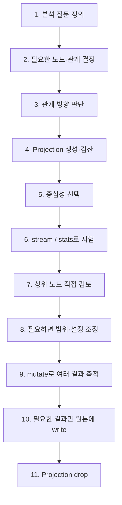

# Neo4j GDS 중심성 핵심 정리: PageRank · 개인화 · 매개 · 근접

> 중심성은 **그래프에서 무엇이 중요한지 순위를 매기는 방법**이다.  
> 같은 그래프라도 어떤 중심성을 쓰느냐에 따라 전혀 다른 노드가 상위에 올라온다.

---

## 1. 중심성은 무엇을 기준으로 보느냐가 다르다

| 알고 싶은 것 | 중심성 | 기준 |
|---|---|---|
| 연결이 가장 많은 노드 | Degree | 이웃의 **개수** |
| 중요한 이웃과 연결된 노드 | PageRank | 이웃이 넘겨 주는 **점수** |
| 특정 노드 기준으로 관련 깊은 노드 | Personalized PageRank | **출발점**에서 흘러간 점수 |
| 서로 다른 무리를 잇는 길목 | Betweenness | 노드를 지나는 **최단 경로 수** |
| 다른 노드까지 평균적으로 가까운 자리 | Harmonic Closeness | 다른 노드까지의 **거리** |

핵심:

```text
Degree
→ 연결이 얼마나 많은가

PageRank
→ 누구와 연결되어 있는가

Personalized PageRank
→ 특정 노드에서 봤을 때 무엇이 중요한가

Betweenness
→ 어디가 연결망의 길목인가

Closeness
→ 어디에서 출발해야 전체에 빨리 닿는가
```

중심성에는 절대적인 정답이 없다.

> **질문에 맞는 중심성을 고르는 것이 먼저다.**

---

# 2. 분석 전에 투영부터 결정

GDS 중심성은 **투영된 메모리 그래프** 위에서 계산한다.

이번 실습에서는 질문에 따라 세 투영을 사용한다.

| 투영 | 구성 | 목적 |
|---|---|---|
| `drugGraph` | 약물·질병·약효분류 + 관계 5종 | 약·질병 그래프의 중심성 |
| `subwayGraph` | `Station` + `NEXT_TO` | 중심 역 분석 |
| `fullGraph` | 노드 5종 + 관계 12종 전체 | 특정 약과 연결된 다양한 개체 분석 |

```text
원본 Neo4j 그래프
        ↓
질문에 필요한 노드·관계 선택
        ↓
GDS Projection
        ↓
중심성 알고리즘
        ↓
순위 해석
```

### 실습 투영 규모

```text
drugGraph
노드 2,012
관계 18,406

subwayGraph
노드 659
관계 1,556

fullGraph
노드 15,540
관계 183,932
```

모두 무방향으로 투영했기 때문에 관계 수는 원본의 2배다.

---

## 왜 무방향으로 투영했나

PageRank는 원래 방향 그래프를 위한 알고리즘이다.

예:

```text
웹페이지 A ──링크──▶ 웹페이지 B
사용자 A ──팔로우──▶ 사용자 B
```

이런 관계는 화살표 자체에 의미가 있으므로 방향을 유지한다.

반면 이번 의료 그래프의:

```text
Compound ──TREATS──▶ Disease
```

에서 화살표는 주로 **약과 병의 역할을 구분하는 표현**이다.

방향을 유지하면:

- 들어오는 관계가 없는 종류는 PageRank 바닥값에 몰림
- 특정 종류에 점수가 일방적으로 쌓임
- 계산은 정상 종료되지만 질문에 맞지 않는 순위가 나올 수 있음

따라서 이번 실습에서는 관계를 무방향으로 투영한다.

```cypher
CALL gds.graph.project(
    'drugGraph',
    ['Compound', 'Disease', 'PharmacologicClass'],
    {
        TREATS:       {orientation: 'UNDIRECTED'},
        PALLIATES:    {orientation: 'UNDIRECTED'},
        INCLUDES:     {orientation: 'UNDIRECTED'},
        RESEMBLES_DD: {orientation: 'UNDIRECTED'},
        RESEMBLES_CC: {orientation: 'UNDIRECTED'}
    }
)
```

판단 기준:

```text
화살표가 지목·추천·흐름을 의미
→ 방향 유지

양쪽의 연결 자체가 중요
→ UNDIRECTED 고려
```

---

# 3. PageRank: 연결 수가 아니라 이웃의 중요도까지 본다

## Degree와 PageRank의 차이

Degree는 단순하다.

```text
Degree(v) = v에 연결된 관계 수
```

PageRank는 이웃이 가진 점수를 나누어 전달받는다.

\[
PR(v) = (1-d) + d \sum_{u \in In(v)} \frac{PR(u)}{L(u)}
\]

| 기호 | 의미 |
|---|---|
| `PR(u)` | 이웃 `u`의 PageRank |
| `L(u)` | `u`가 점수를 나눠 줄 관계 수 |
| `d` | damping factor |

즉:

```text
Degree
"이웃이 몇 명인가?"

PageRank
"어떤 이웃이 나를 지지하는가?"
+
"그 이웃은 자기 점수를 몇 곳에 나누는가?"
```

### 기본 실행

```cypher
CALL gds.pageRank.stream('drugGraph')
YIELD nodeId, score

RETURN
    gds.util.asNode(nodeId).name AS name,
    labels(gds.util.asNode(nodeId))[0] AS kind,
    score
ORDER BY score DESC, name
LIMIT 10
```

PageRank의 `score`는 **개수나 확률이 아니라 상대적인 값**이다.

> 점수 자체보다 **순위**로 읽는다.

---

## Degree와 실제로 얼마나 다른가

`drugGraph`의 상위 10개를 비교한 결과:

```text
Degree Top10 ∩ PageRank Top10 = 3개
```

공통 노드:

```text
Diphenhydramine
hematologic cancer
hypertension
```

즉 10자리 중 7자리가 달라졌다.

대표 사례:

```text
Eltrombopag
PageRank : 4위
Degree   : 469위
```

이 약이 연결된 약효분류 13개 중 대부분은 연결된 약이 1개뿐이었다.

```text
약효분류 ──▶ Eltrombopag
```

이웃이 다른 곳에 점수를 나눌 필요가 거의 없기 때문에 자기 PageRank를 Eltrombopag 쪽에 크게 전달한다.

> **연결 수가 적어도 중요한 이웃에게 집중적으로 점수를 받으면 PageRank가 높을 수 있다.**

---

# 4. PageRank 설정: 수렴 여부까지 확인

PageRank는 점수를 반복해서 전달하며 계산한다.

주요 설정:

| 설정 | 의미 | 기본값 |
|---|---|---:|
| `dampingFactor` | 이웃에게 흘려보내는 점수 비율 | `0.85` |
| `maxIterations` | 최대 반복 횟수 | `20` |
| `tolerance` | 변화량이 이 값보다 작으면 중단 | `0.0000001` |

예:

```cypher
CALL gds.pageRank.stream(
    'drugGraph',
    {
        dampingFactor: 0.85,
        maxIterations: 50
    }
)
YIELD nodeId, score
```

### 수렴 여부 확인

점수 대신 실행 상태만 볼 때는 `.stats`.

```cypher
CALL gds.pageRank.stats(
    'drugGraph',
    {maxIterations: 100}
)
YIELD ranIterations, didConverge
RETURN ranIterations, didConverge
```

실습 결과:

```text
최대 20회  → 실제 20회  / 수렴 False
최대 50회  → 실제 50회  / 수렴 False
최대 100회 → 실제 92회  / 수렴 True
```

기본값 20회는 **수렴할 때까지 실행한다는 뜻이 아니다.**

실습에서는:

```text
1~8위 → 동일
9~10위 → 20회와 50회에서 순서 변경
```

점수가 비슷한 하위 순위는 반복 설정에 따라 달라질 수 있다.

> 순위를 기록하거나 비교할 때는 **PageRank 설정도 같이 기록**한다.

---

# 5. GDS 실행 모드: 계산 결과를 어디에 둘 것인가

대부분의 GDS 알고리즘은 비슷한 실행 모드를 제공한다.

| 모드 | 결과 위치 | 용도 |
|---|---|---|
| `.stream` | 결과 행으로 반환 | 바로 확인 |
| `.stats` | 통계만 반환 | 실행 상태·분포 확인 |
| `.mutate` | **Projection 안** | 후속 알고리즘에 사용 |
| `.write` | **Neo4j 원본 노드** | 나중에 Cypher에서 조회 |

---

## stream

저장하지 않고 결과만 받는다.

```cypher
CALL gds.pageRank.stream('drugGraph')
YIELD nodeId, score
```

단순 분석·확인에 가장 편하다.

---

## write

계산 결과를 Neo4j 노드 속성에 저장한다.

```cypher
CALL gds.pageRank.write(
    'drugGraph',
    {writeProperty: 'pagerank'}
)
YIELD nodePropertiesWritten
```

이후 일반 Cypher로 조회 가능하다.

```cypher
MATCH (d:Disease)
WHERE d.pagerank IS NOT NULL

RETURN d.name, d.pagerank
ORDER BY d.pagerank DESC
```

사용 예:

```text
PageRank가 높은 질병
+
치료제 5개 이상
+
특정 속성 조건
```

처럼 그래프 점수와 일반 DB 조건을 같이 사용할 때 유용하다.

---

## mutate

원본에는 쓰지 않고 **Projection에만 속성을 추가**한다.

```cypher
CALL gds.pageRank.mutate(
    'drugGraph',
    {mutateProperty: 'pr'}
)
YIELD nodePropertiesWritten
```

Projection 내부 속성은 GDS를 통해 읽는다.

```cypher
CALL gds.graph.nodeProperty.stream(
    'drugGraph',
    'pr'
)
YIELD nodeId, propertyValue
```

Projection을 삭제하면 mutate 값도 함께 사라진다.

---

## 실사용 패턴: 여러 알고리즘을 mutate로 모으기

```text
Projection 생성
      ↓
Degree mutate
      ↓
PageRank mutate
      ↓
Betweenness mutate
      ↓
결과 비교
      ↓
필요하면 원본에 한 번에 write
      ↓
Projection 삭제
```

예:

```cypher
CALL gds.degree.mutate(
    'drugGraph',
    {mutateProperty: 'deg'}
)

CALL gds.pageRank.mutate(
    'drugGraph',
    {mutateProperty: 'pr'}
)

CALL gds.betweenness.mutate(
    'drugGraph',
    {mutateProperty: 'bc'}
)
```

여러 속성을 한 번에 원본으로 저장:

```cypher
CALL gds.graph.nodeProperties.write(
    'drugGraph',
    ['deg', 'pr', 'bc']
)
YIELD propertiesWritten
```

> 여러 중심성을 함께 분석할 때는 **mutate로 모은 뒤 필요한 값만 마지막에 저장**하는 흐름이 유용하다.

---

# 6. Personalized PageRank: 특정 노드의 관점으로 바꾸기

일반 PageRank:

```text
"전체 그래프에서 무엇이 중요한가?"
```

개인화 PageRank:

```text
"Sildenafil 기준으로 무엇이 관련 깊은가?"
"강남역 기준으로 중요한 주변 역은?"
```

즉 **출발점이 있는 질문**에 사용한다.

---

## sourceNodes 지정

```cypher
MATCH (s:Compound {name: 'Sildenafil'})
WITH collect(s) AS src

CALL gds.pageRank.stream(
    'drugGraph',
    {sourceNodes: src}
)
YIELD nodeId, score

RETURN
    gds.util.asNode(nodeId).name AS name,
    score
ORDER BY score DESC
```

일반 PageRank와 달리 새 점수가 출발점 쪽에 집중된다.

```text
일반 PageRank
→ 전체 그래프의 공통 순위

Personalized PageRank
→ 특정 노드에서 본 순위
```

실습 결과:

```text
Sildenafil 기준

1. Sildenafil
2. Udenafil
3. Vardenafil
...
```

전체 PageRank에서는 Sildenafil이 1,000위권이었지만 개인화하면 주변 노드가 위로 올라온다.

---

## Personal PageRank를 거리로 읽으면 안 된다

개인화 PageRank는:

```text
"몇 홉 떨어져 있는가?"
```

를 직접 계산하는 알고리즘이 아니다.

출발점에서 점수를 흘려보냈을 때 **그 노드가 얼마나 많은 점수를 받는지**를 본다.

따라서:

```text
가까움 = 반드시 PageRank가 높음
```

으로 단순 해석하면 안 된다.

---

# 7. 투영이 바뀌면 같은 질문의 답도 달라진다

`drugGraph`에는:

```text
Compound
Disease
PharmacologicClass
```

만 있고 `Gene`, `BINDS`가 없다.

따라서 Sildenafil 기준 Personalized PageRank를 돌려도 **약의 표적 유전자**는 결과에 들어올 수 없다.

이후 전체 그래프를 담은 `fullGraph`를 생성한다.

```text
노드
Compound
Disease
Gene
Symptom
PharmacologicClass

관계
12종 전체
```

같은 Sildenafil 기준 Personalized PageRank를 다시 계산하면:

```text
Sildenafil
CYP3A4
Vardenafil
systemic scleroderma
CYP3A5
PDE5A
...
```

처럼 Gene 노드도 나타난다.

핵심:

> **투영에 없는 정보는 알고리즘 입장에서는 존재하지 않는 정보와 같다.**

```text
질문이 달라짐
    ↓
필요한 노드·관계가 달라짐
    ↓
Projection도 달라질 수 있음
```

반대로 모든 관계를 무조건 넣는 것도 정답은 아니다.

`fullGraph`에서 일반 PageRank를 실행했을 때 상위 10개가 모두 Disease였다.

즉:

> **그래프를 크게 만드는 것이 항상 더 좋은 분석은 아니다.**

---

# 8. 계산할 때만 범위를 좁히기

Projection을 새로 만들지 않고 알고리즘 실행 시 범위를 줄일 수도 있다.

## nodeLabels

```cypher
CALL gds.pageRank.stream(
    'fullGraph',
    {
        sourceNodes: src,
        nodeLabels: ['Compound']
    }
)
```

`Compound`만 남겨 계산한다.

---

## relationshipTypes

```cypher
CALL gds.pageRank.stream(
    'fullGraph',
    {
        sourceNodes: src,
        relationshipTypes: ['BINDS']
    }
)
```

`BINDS` 관계만 사용한다.

중요:

> 이것은 **계산 후 결과를 필터링하는 것이 아니다.**

```text
원래 그래프
      ↓
nodeLabels / relationshipTypes 적용
      ↓
그래프 자체가 축소
      ↓
PageRank 재계산
      ↓
점수 자체가 달라짐
```

Sildenafil 예시:

| 설정 | 결과 성격 |
|---|---|
| 필터 없음 | 닮은 약 + 유전자 + 질병 등이 섞임 |
| `nodeLabels: ['Compound']` | 약물끼리의 관계 중심 |
| `relationshipTypes: ['BINDS']` | 같은 표적과 연결된 약·유전자 중심 |

셋 다 다른 질문에 대한 답이다.

### 실사용 판단

```text
한 번만 범위를 좁혀 계산
→ nodeLabels / relationshipTypes

같은 범위를 여러 알고리즘에서 계속 사용
→ 별도 Projection
```

---

# 9. Betweenness: 네트워크의 길목 찾기

Degree와 PageRank는 연결이 몰린 곳을 찾는 성격이 강하다.

그러나 연결 수가 많지 않아도 **두 집단을 이어 주는 노드**가 중요할 수 있다.

Betweenness centrality는:

> 모든 노드 쌍의 최단 경로 중 해당 노드를 지나는 경로가 얼마나 많은지를 계산한다.

```text
집단 A ───── [Bridge] ───── 집단 B
                  ↑
          Betweenness가 높음
```

### 실행

```cypher
CALL gds.betweenness.stream('drugGraph')
YIELD nodeId, score

RETURN
    gds.util.asNode(nodeId).name AS name,
    score
ORDER BY score DESC
LIMIT 10
```

실습:

```text
1. hypertension
2. Phenacemide
...
```

`Phenacemide`는 Degree 162위였지만 Betweenness 2위였다.

즉:

```text
연결 수는 많지 않음
+
서로 다른 약물 계열 사이의 경로에 위치
=
높은 Betweenness
```

---

## Betweenness는 계산 비용에 주의

모든 노드 쌍의 최단 경로를 보기 때문에 다른 중심성보다 무거울 수 있다.

교안의 실행 예:

| Projection | PageRank | Betweenness |
|---|---:|---:|
| `drugGraph` / 2,012노드 | 약 `0.01초` | 약 `0.15초` |
| `fullGraph` / 15,540노드 | 약 `0.04초` | 약 `16.15초` |

노드 수가 7.7배 늘었을 때 Betweenness 실행 시간은 크게 증가했다.

> 큰 그래프에서 Betweenness를 사용할 때는 **분석 범위를 먼저 줄이는 것**이 중요하다.

---

# 10. Closeness: 전체에 빨리 닿는 자리

Closeness는 다른 노드까지의 평균 최단 거리를 기준으로 한다.

```text
A에서 다른 노드까지 평균적으로 2홉
B에서 다른 노드까지 평균적으로 5홉

→ A가 더 중심
```

기본 호출:

```cypher
CALL gds.closeness.stream('drugGraph')
YIELD nodeId, score
```

점수가 클수록 평균적으로 가깝다.

---

## 끊어진 그래프에서는 주의

실습에서 기본 Closeness 상위 노드는 `1.0`이었다.

그런데 1위 노드의 이웃은 **1개뿐**이었다.

```text
A ── B

나머지 그래프와 연결 끊김
```

기본 Closeness는 **도달 가능한 노드만 기준으로 거리**를 계산하기 때문에 이런 작은 연결 요소가 오히려 높은 점수를 받을 수 있다.

에러는 발생하지 않는다.

---

## Harmonic Closeness

연결되지 않은 그래프에서는 교안에서 `harmonic` 방식을 사용한다.

```cypher
CALL gds.closeness.harmonic.stream('drugGraph')
YIELD nodeId, score

RETURN
    gds.util.asNode(nodeId).name AS name,
    score
ORDER BY score DESC
LIMIT 10
```

도달할 수 없는 노드는 거리 기여를 `0`으로 처리한다.

실습 1위:

```text
Prednisone
```

따라서:

```text
그래프가 충분히 연결됨
→ closeness

여러 연결 요소로 끊겨 있음
→ closeness.harmonic
```

---

# 11. 같은 그래프라도 중심성에 따라 순위가 다르다

`drugGraph` 하나에서 상위 10개를 비교한 결과:

| 비교 | 공통 노드 |
|---|---:|
| PageRank ↔ Degree | `3 / 10` |
| Betweenness ↔ Degree | `2 / 10` |
| PageRank ↔ Betweenness | `5 / 10` |

즉 같은 데이터와 같은 Projection을 사용해도 **알고리즘만 바꾸면 결과가 크게 달라진다.**

전철 그래프에서는:

```text
Degree ↔ PageRank
상위 10개 중 9개가 겹침
```

역 대부분이 앞뒤 몇 개 역과 연결된 구조라 두 기준이 비슷한 결과를 낸다.

따라서 중심성을 여러 개 쓰는 목적은:

> **서로 다른 구조적 역할을 찾아낼 때** 의미가 있다.

---

# 12. 어떤 중심성을 선택할까

```text
"연결이 가장 많은 것은?"
→ Degree

"중요한 것들과 연결된 것은?"
→ PageRank

"이 노드 기준으로 관련 깊은 것은?"
→ Personalized PageRank

"서로 다른 집단을 연결하는 핵심 길목은?"
→ Betweenness

"어디서 출발해야 전체에 빨리 닿는가?"
→ Harmonic Closeness
```

### 선택 질문

1. **기준 노드가 있는가?**
   - 있음 → Personalized PageRank 고려

2. **연결 개수만 필요한가?**
   - 예 → Degree
   - 이웃의 중요도도 필요 → PageRank

3. **끊어지면 문제가 되는 다리를 찾는가?**
   - → Betweenness

4. **전체 노드와의 평균 거리가 중요한가?**
   - → Closeness
   - 그래프가 끊겨 있다면 → Harmonic Closeness

---

# 13. 실사용 중심성 분석 흐름



중요한 습관:

```text
결과만 보지 않음
↓
어떤 Projection인가?
↓
어떤 관계 방향인가?
↓
어떤 알고리즘인가?
↓
어떤 설정인가?
↓
상위 노드가 왜 올라왔는지 실제 관계 확인
```

---

# 14. 실사용 코드 템플릿

## PageRank

```cypher
CALL gds.pageRank.stream('graphName')
YIELD nodeId, score

RETURN
    gds.util.asNode(nodeId).name AS name,
    score
ORDER BY score DESC
LIMIT 10
```

## Personalized PageRank

```cypher
MATCH (s:Label {name: $name})
WITH collect(s) AS src

CALL gds.pageRank.stream(
    'graphName',
    {sourceNodes: src}
)
YIELD nodeId, score

RETURN
    gds.util.asNode(nodeId).name AS name,
    score
ORDER BY score DESC
LIMIT 10
```

## 관계 타입 제한

```cypher
CALL gds.pageRank.stream(
    'graphName',
    {
        sourceNodes: src,
        relationshipTypes: ['REL_TYPE']
    }
)
YIELD nodeId, score
```

## Betweenness

```cypher
CALL gds.betweenness.stream('graphName')
YIELD nodeId, score

RETURN
    gds.util.asNode(nodeId).name AS name,
    score
ORDER BY score DESC
LIMIT 10
```

## Harmonic Closeness

```cypher
CALL gds.closeness.harmonic.stream('graphName')
YIELD nodeId, score

RETURN
    gds.util.asNode(nodeId).name AS name,
    score
ORDER BY score DESC
LIMIT 10
```

---

# 15. 분석 종료 후 Projection 삭제

투영은 서버 메모리를 사용한다.

```cypher
CALL gds.graph.list()
YIELD graphName, nodeCount, memoryUsage

RETURN graphName, nodeCount, memoryUsage
ORDER BY graphName
```

실습에서는 `fullGraph`가 약 `27 MiB`를 사용했다.

분석이 끝났으면 자신이 만든 투영을 삭제한다.

```cypher
CALL gds.graph.drop('drugGraph', false)
YIELD graphName
RETURN graphName
```

여러 개라면 만든 이름만 지정해 삭제한다.

```text
drugGraph
subwayGraph
fullGraph
```

`mutate`로 저장한 값은 Projection과 함께 사라진다.

필요한 값은 삭제 전에 원본으로 옮긴다.

---

# 핵심 압축

| 개념 | 핵심 |
|---|---|
| Degree | 이웃 **개수** |
| PageRank | 중요한 이웃에게 받은 **점수** |
| PageRank 점수 | 절대값보다 **순위**로 해석 |
| `dampingFactor` | 점수를 이웃으로 전달하는 비율 |
| `maxIterations` | 최대 반복 수. 기본 20회는 수렴 보장 아님 |
| `.stream` | 결과만 반환 |
| `.stats` | 실행 통계 반환 |
| `.mutate` | Projection 내부에 저장 |
| `.write` | Neo4j 원본 속성으로 저장 |
| Personalized PageRank | `sourceNodes`로 **관점의 출발점** 지정 |
| Projection | 담은 데이터가 곧 **질문의 범위** |
| `nodeLabels` | 실행 시 사용할 노드 종류 제한 |
| `relationshipTypes` | 실행 시 사용할 관계 종류 제한 |
| Betweenness | 집단 사이의 **길목** |
| Harmonic Closeness | 전체에 평균적으로 **빨리 닿는 자리** |
| 중심성 비교 | 같은 그래프도 알고리즘에 따라 순위가 크게 달라질 수 있음 |

## 한 줄 정리

> **중심성 분석은 “가장 중요한 노드”를 찾는 작업이 아니라, 먼저 중요함의 기준을 정의하고 그 기준에 맞는 Projection과 알고리즘을 선택하는 작업이다.**
