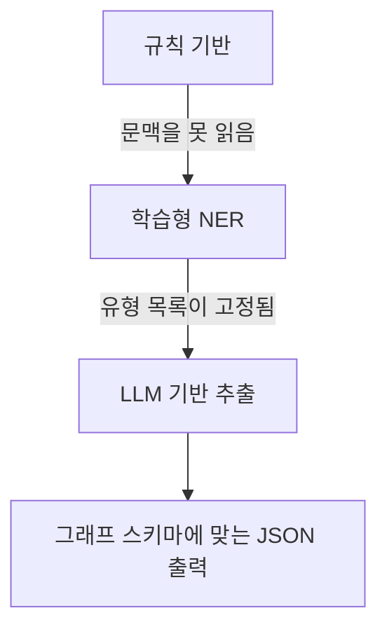

# 정보 추출(IE)과 NER — 개념·문법 압축 정리

> 기준: `교안_01_정보추출과_NER.ipynb`  
> 정리 방향: **개념 우선 → 핵심 문법 → 방법별 한계**  
> 원본 노트북의 이미지는 `images/...` 외부 경로로 참조되어 실제 이미지 파일은 포함되지 않음. 이미지가 설명하던 내용은 아래 도식·표로 재구성함.

---

# 1. IE와 NER 핵심 개념

## 정보 추출(IE)

**정보 추출(IE, Information Extraction)** = 사람이 읽는 **비정형 텍스트**에서 컴퓨터가 사용할 수 있는 **개체와 관계**를 뽑아 **정형 지식**으로 바꾸는 작업.

```text
비정형 문서
"Carbidopa가 AHR을 활성화한다"
        ↓ IE
개체: Carbidopa, AHR
관계: Carbidopa ──활성화──> AHR
        ↓
지식 그래프에 적재 가능한 구조
```

논문·진료 기록처럼 문장 안에 사실이 있어도 그대로는 그래프 탐색이나 쿼리에 쓰기 어려움.  
따라서 **문장 → 개체/관계 → 그래프** 형태로 변환해야 함.

### 교안의 IE 4단계

| 단계 | 핵심 역할 |
|---|---|
| **개체 인식(NER)** | 문장에서 약물·유전자·질병 같은 개체 찾기 |
| **스키마 설계** | 사용할 개체 유형·관계 유형 정의 |
| **관계 추출** | 찾은 개체 사이의 관계 추출 |
| **정규화** | 같은 대상의 서로 다른 표기를 하나로 통합 |


> 교안 표의 학습 순서는 `개체 인식 → 스키마 설계 → 관계 추출 → 정규화`.  
> 동시에 본문에서는 스키마를 **미리 정하는 단계**라고 설명하므로, 학습 순서와 실제 설계 선후는 구분해서 보면 됨.

IE에는 이외에도 다음 작업이 있음.

- **이벤트 추출(event extraction)**: 누가·언제·무엇을 했는지를 사건 단위로 추출.
- **상호참조 해결(coreference resolution)**: `it`, `the drug`, `이 약물` 등이 앞의 어느 개체를 가리키는지 연결.

## 개체명 인식(NER)

**NER(Named Entity Recognition)** = 문장에서 **개체가 있는 위치를 찾고, 그 개체의 유형을 붙이는 작업**.

핵심 출력:

```python
{
    'name': 'Carbidopa',
    'type': 'Compound',
    'start': 0,
    'end': 9
}
```

즉 NER의 본질은 **(구간 span, 유형 type)** 을 찾는 것.

| 용어 | 의미 |
|---|---|
| **개체(entity)** | 미리 정한 유형 목록에 속하는 표현 |
| **유형(type)** | 개체의 종류. 예: `Compound`, `Gene` |
| **구간(span)** | 원문에서 개체가 차지하는 글자 범위 `start:end` |

### 이 교안의 개체 유형 5종

유형 목록은 NER 전체에 고정된 것이 아니라 **목적에 맞게 정의**함.  
이 교안은 기존 지식 그래프의 노드 레이블과 동일하게 사용.

| 유형 | 의미 | 예 |
|---|---|---|
| `Compound` | 약물·화합물 | Carbidopa, omeprazole |
| `Gene` | 유전자 | AHR, CYP2C19 |
| `Disease` | 질병 | Parkinson disease, psoriasis |
| `Symptom` | 증상 | pain, dizziness |
| `PharmacologicClass` | 약효 분류 | statins, cannabinoids |

```text
NER의 type 문자열
        =
그래프의 Label 문자열
```

그래프에 바로 연결하려면 유형 문자열을 같은 이름으로 유지하는 것이 중요.

### NER 기법의 흐름

| 방식 | 핵심 |
|---|---|
| **규칙 기반** | 사람이 사전·정규식 패턴 작성 |
| **통계 기반(CRF)** | 라벨 데이터에서 앞뒤 문맥 확률 학습 |
| **딥러닝(BERT)** | 문맥 임베딩으로 토큰 분류 |
| **LLM** | 재학습 없이 프롬프트로 유형과 출력 형식 지시 |

이 교안은 **규칙 기반 → BERT 기반**을 직접 비교하고, 다음 교안에서 LLM으로 이어짐.

---

# 2. NER 출력 표현 — Span과 BIO

## Span: 개체의 위치 + 유형

예문:

```text
Carbidopa, used to treat Parkinson disease, was reported to activate AHR.
^^^^^^^^^                ^^^^^^^^^^^^^^^^^                           ^^^
Compound                 Disease                                   Gene
0~9                      25~42                                     69~72
```

이름만 저장하지 않고 구간을 저장하는 이유:

- 같은 이름이 여러 번 나와도 **위치로 구분** 가능.
- `text[start:end]`로 원문을 다시 잘라 **검증** 가능.
- 이후 관계 추출에서 정확한 등장 위치를 기준으로 처리 가능.
- 서로 겹치는 개체도 **span 목록**이면 표현 가능.

> `end`는 마지막 글자 위치가 아니라 **마지막 글자의 다음 위치**.  
> 따라서 `text[start:end]`에 그대로 사용.

### `find()`로 span 만들기

```python
text = 'Carbidopa, used to treat Parkinson disease, was reported to activate AHR.'

labeled = [
    ('Carbidopa', 'Compound'),
    ('Parkinson disease', 'Disease'),
    ('AHR', 'Gene'),
]

spans = []

for name, entity_type in labeled:
    start = text.find(name)

    spans.append({
        'name': name,
        'type': entity_type,
        'start': start,
        'end': start + len(name),
    })

for span in spans:
    print(
        span['start'],
        span['end'],
        span['type'],
        '->',
        text[span['start']:span['end']]
    )
```

**결과**

```text
0 9 Compound -> Carbidopa
25 42 Disease -> Parkinson disease
69 72 Gene -> AHR
```

핵심 문법:

```python
start = text.find(name)
end = start + len(name)
text[start:end]
```

주의:

- 못 찾으면 `find()`는 `-1` 반환.
- 같은 이름이 여러 번 나오면 기본 `find()`는 **첫 위치만** 반환.
- 대소문자·철자가 조금만 달라도 못 찾음.

## BIO 태깅

학습형 NER 모델은 보통 문장을 **토큰 단위**로 읽고, 각 토큰에 라벨 하나를 출력함.

`Parkinson disease`처럼 하나의 개체가 두 토큰에 걸치면 단순히 둘 다 `Disease`라고 써서는 **개체 1개인지 2개인지 구분할 수 없음**.

그래서 BIO 사용.

| 라벨 | 의미 | 사용 위치 |
|---|---|---|
| `B-유형` | Begin | 개체가 시작하는 토큰 |
| `I-유형` | Inside | 같은 개체가 이어지는 토큰 |
| `O` | Outside | 개체가 아닌 토큰 |

예:

| 토큰 | BIO |
|---|---|
| `Carbidopa,` | `B-Compound` |
| `used` | `O` |
| `to` | `O` |
| `treat` | `O` |
| `Parkinson` | `B-Disease` |
| `disease,` | `I-Disease` |
| `was` | `O` |
| `reported` | `O` |
| `to` | `O` |
| `activate` | `O` |
| `AHR.` | `B-Gene` |

### `B-`와 `I-`의 핵심 역할

| 토큰 | 개체 2개 | 개체 1개 |
|---|---|---|
| `CYP2C19` | `B-Gene` | `B-Gene` |
| `SLCO1B1` | `B-Gene` | `I-Gene` |

```text
B-Gene + B-Gene  → Gene 개체 2개
B-Gene + I-Gene  → 여러 토큰으로 된 Gene 개체 1개
```

즉 **`B-`는 개체 경계를 구분**하는 역할.

### BIO에서 헷갈리기 쉬운 점

`I-`는 공백 기준이 아니라 **토크나이저가 만든 토큰 기준**.

```text
Neo4j
↓ subword tokenizer
Neo   ##4   ##j
B-ORG I-ORG I-ORG
```

같은 이름이 다시 등장하면 그 위치에서 **다시 `B-`로 시작**함. BIO는 서로 다른 개체 수가 아니라 **등장 위치**를 표시.

같은 대상을 하나로 합치는 것은 BIO가 아니라 뒤 단계의 **정규화** 역할.

BIO는 **토큰 하나당 라벨 하나**라 겹치는 개체 표현에는 한계가 있음. 이런 경우 `(start, end, type)` span 목록이 더 적합.

### BIO 만들기 — 수업용 단순 코드

```python
tokens = text.split()
tags = ['O'] * len(tokens)

for name, entity_type in labeled:
    parts = name.split()

    for i, token in enumerate(tokens):
        if parts[0] in token:
            for j, part in enumerate(parts):
                tags[i + j] = (
                    ('B-' if j == 0 else 'I-')
                    + entity_type
                )
            break

for token, tag in zip(tokens, tags):
    print(token, '->', tag)
```

핵심:

```python
tags = ['O'] * len(tokens)
'B-' + entity_type
'I-' + entity_type
```

> 교육용 단순화 코드. `split()`은 구두점을 제대로 분리하지 못하고 같은 이름의 첫 등장만 처리함. 실제 학습형 NER에서는 모델의 토크나이저와 `start/end` 위치 정보를 함께 사용.

---

# 3. 규칙 기반 NER

## 기본 구조 — 사전과 패턴

규칙 기반 NER에는 두 축이 있음.

```text
1. 사전(gazetteer)
   이름 자체를 알고 있어야 하는 개체
   예: omeprazole, psoriasis, CYP2C19

2. 패턴(regex)
   생김새가 일정한 값
   예: rs9923231, 날짜, 이메일, 용량
```

### 토크나이저 정규식

```python
import re

TOKEN = re.compile(r'[A-Za-z][A-Za-z0-9\-]*')
```

의미:

```text
[A-Za-z]          영문자로 시작
[A-Za-z0-9\-]*    이후 영문자·숫자·하이픈 허용
```

따라서 `HLA-A`, `CYP2C19`, `Warfarin-related` 등을 하나의 토큰으로 잡음.

하지만 이 선택 때문에 `Warfarin-related` 전체가 한 토큰이 되어 내부 `Warfarin`을 놓치는 **경계 문제**가 생김.

### 고정 패턴은 정규식 사용

유전 변이 ID처럼 형식이 고정된 값은 사전보다 정규식이 적합.

```python
VARIANT = re.compile(r'rs\d+')
VARIANT.findall(text)
```

예:

```text
rs9923231
```

반대로 `omeprazole`, `psoriasis`, `CYP2C19`처럼 이름 자체에 공통 패턴이 없는 개체는 사전이 필요.

## 개체 사전 구조

교안의 `name2id.json`:

```python
dictionary = load_json('name2id.json')

entries = dictionary['entries']
genes = dictionary['genes']
```

`entries['warfarin']` 예:

```python
{
    'id': 'Compound::DB00682',
    'label': 'Compound',
    'canonical': 'Warfarin',
    'source': 'hetionet'
}
```

- `id`: 그래프 노드 ID
- `label`: 개체 유형
- `canonical`: 표준 이름
- `source`: 사전 출처

유전자는 별도 저장.

```python
genes['CYP2C19']
# 'Gene::1557'
```

유전자 기호는 **대소문자가 중요**해서 소문자화된 일반 `entries`와 분리.

사전에 ID까지 들어 있는 이유는 추출한 이름을 나중에 **기존 그래프 노드와 정확히 연결**하기 위해서.

## 단순 소문자 매칭의 문제

잘못된 단순 접근:

```python
word = match.group().lower()
```

유전자 `LARGE`는 실제 기호지만 `large`는 일반 형용사.

```text
LARGE → Gene
large → 일반 단어
```

둘을 모두 소문자로 바꾸면 구분 불가.

교안 사전에는 이런 유전자 기호가 **33개** 존재.

```text
ACT, CAT, CLOCK, IMPACT, LARGE, REST, SET, STAR ...
```

약물 상품명도 비슷한 충돌이 있음.

```text
perform, react, sustain, today ...
```

사전이 틀린 것이 아니라 **같은 철자가 일반 단어와 실제 개체 이름으로 동시에 존재**하는 문제.

## 개선된 규칙 기반 NER

원칙:

- **Gene**: 대소문자까지 정확히 비교.
- 나머지 이름: 소문자 비교 허용.
- 일반 영어 단어와 충돌하는 상품명은 별도 예외 처리.

```python
def rule_based_ner(text):
    found = []

    for match in TOKEN.finditer(text):
        word = match.group()

        # Gene: 대소문자까지 정확히 비교
        if word in genes:
            entity_type = 'Gene'

        # 나머지 개체: 소문자 기준 비교
        elif word.lower() in entries:
            if (
                word.lower() in brand_stopwords
                and word.islower()
            ):
                continue

            entity_type = entries[word.lower()]['label']

        else:
            continue

        found.append({
            'name': word,
            'type': entity_type,
            'start': match.start(),
            'end': match.end(),
        })

    return found
```

교안 결과:

```text
단순 소문자 매칭: 29건
대소문자를 지킨 매칭: 28건
사라진 오탐: {'large'}
```

## 규칙 기반의 4가지 한계

| 한계 | 예 | 원인 |
|---|---|---|
| **미등록어** | `statins`, `proton pump inhibitors` | 사전에 없는 이름은 못 찾음 |
| **경계 문제** | `Warfarin-related` 안의 `Warfarin` | 토큰 경계를 규칙이 미리 결정 |
| **대소문자 충돌** | `large` ↔ `LARGE` | 소문자화하면 의미가 다른 표현이 합쳐짐 |
| **약어 충돌** | `PSD`, `OTC` | 동일 철자의 다른 의미를 문맥으로 구분 못함 |

추가로 낱말 하나씩만 비교하면 **공백이 들어간 다중 단어 이름**을 구조적으로 놓침.

교안 사전에서는:

```text
entries 전체: 6695건
공백이 든 이름: 2555건
```

n-gram 규칙을 계속 추가할 수 있지만 예외 규칙이 늘어나면서 복잡도가 커짐.

```text
규칙 기반
= 빠르고 동작이 명확함
= 사전 ID와 바로 연결하기 쉬움
- 문맥을 읽지 못함
- 사전과 예외 규칙을 계속 관리해야 함
```

---

# 4. 머신러닝 기반 NER

## Hugging Face `pipeline`

교안 사용 모델:

```text
dslim/bert-base-NER
```

이 모델은 일반 영어 뉴스 데이터 기반으로 다음 네 유형을 사용.

| 라벨 | 의미 |
|---|---|
| `PER` | Person |
| `ORG` | Organization |
| `LOC` | Location |
| `MISC` | 기타 고유명사 |

기본 호출:

```python
from transformers import pipeline

ner = pipeline(
    'token-classification',
    model='dslim/bert-base-NER'
)

text = 'Sarah Kim joined Neo4j in London last spring.'
result = ner(text)
```

기본 출력은 **토큰 단위 BIO 결과**.

```python
[
    {'entity': 'B-PER', 'word': 'Sarah', ...},
    {'entity': 'I-PER', 'word': 'Kim', ...},
    {'entity': 'B-ORG', 'word': 'Neo', ...},
    {'entity': 'I-ORG', 'word': '##4', ...},
    {'entity': 'I-ORG', 'word': '##j', ...},
    {'entity': 'B-LOC', 'word': 'London', ...},
]
```

### 토큰 결과를 개체 단위로 합치기

```python
merged = pipeline(
    'token-classification',
    model='dslim/bert-base-NER',
    aggregation_strategy='simple'
)

entities = merged(text)
```

결과 형태:

```python
[
    {
        'entity_group': 'PER',
        'word': 'Sarah Kim',
        'start': 0,
        'end': 9,
        'score': 0.99,
    },
    {
        'entity_group': 'ORG',
        'word': 'Neo4j',
        'start': 17,
        'end': 22,
        'score': 0.95,
    },
    {
        'entity_group': 'LOC',
        'word': 'London',
        'start': 26,
        'end': 32,
        'score': 0.99,
    },
]
```

```text
모델 내부 표현
B-PER / I-PER / B-ORG / ...
        ↓ aggregation_strategy='simple'
실사용 표현
(name, type, start, end, score)
```

원문 검증:

```python
for ent in entities:
    print(text[ent['start']:ent['end']])
```

### `pipeline` 출력 구조

| 항목 | aggregation 없음 | `aggregation_strategy='simple'` |
|---|---|---|
| 라벨 | `entity='B-PER'` | `entity_group='PER'` |
| 이름 | 토큰 한 조각 | 합쳐진 개체 이름 |
| 위치 | `start`, `end` | `start`, `end` |
| 확신도 | `score` | `score` |
| 토큰 번호 | `index` | 없음 |

입력은 문자열 하나 또는 여러 문자열의 리스트.  
출력은 **`list[dict]`**, 찾은 개체가 없으면 빈 리스트.

`score`가 낮은 결과를 임계값으로 거르는 방식도 사용 가능.

## 학습형 NER의 핵심 한계 — 유형 목록 고정

교안의 의료 문장:

```python
paper_sentence = (
    'Carbidopa, used to treat Parkinson disease, '
    'was reported to activate AHR.'
)

for ent in merged(paper_sentence):
    print(ent['word'], ent['entity_group'], ent['score'])
```

교안 출력:

```text
Carbidop   MISC  0.59
Parkinson  PER   0.58
```

문제:

- `Carbidopa`를 `Compound`로 분류하지 못함.
- `Parkinson disease`를 `Disease`가 아니라 `PER`로 오분류.
- `AHR`은 놓침.
- `Carbidopa`도 `Carbidop`까지만 잘려 경계 오류 발생.

원인은 모델이 애초에 다음 네 종류만 출력하도록 학습되었기 때문.

```text
PER
ORG
LOC
MISC
```

즉 `Compound`, `Gene`, `Disease`, `Symptom`, `PharmacologicClass`가 **출력 선택지 자체에 없음**.

```text
학습형 NER
= 사전을 직접 나열하지 않아도 문맥으로 개체를 찾을 수 있음
= 하지만 학습할 때 정한 유형 목록은 고정됨
```

> 교안 후반 요약에서는 학습형 모델이 규칙 기반의 `미등록어·경계` 문제를 해결한다고 표현함.  
> 다만 같은 교안의 실제 출력에서는 `Carbidopa → Carbidop`처럼 경계 오류가 발생함. 따라서 **규칙 기반의 구조적 한계를 완화하지만 실제 경계 정확도를 보장하는 것은 아님**으로 이해하는 편이 실행 결과와 일치함.

## 모델 고르기 — 유형부터 확인

NER은 Hugging Face에서 주로 **`token-classification`** 태스크로 분류됨.

후보 검색:

```python
from huggingface_hub import list_models

models = list_models(
    pipeline_tag='token-classification',
    search='biomedical',
    sort='downloads',
    limit=5,
)

for model in models:
    print(model.id)
```

모델 카드에서 볼 핵심:

| 항목 | 이유 |
|---|---|
| **유형 목록** | 원하는 개체 유형을 출력할 수 있는지 |
| **학습 데이터** | 어느 도메인 문장으로 학습했는지 |
| **라이선스** | 사용 조건 확인 |
| **마지막 갱신일** | 유지·관리 상태 확인 |

메타 정보:

```python
from huggingface_hub import model_info

info = model_info('dslim/bert-base-NER')
print(info.tags)
print(info.lastModified)
```

### 모델 전체를 받기 전에 라벨 확인

가중치를 받기 전에 설정 파일만 받아 출력 가능한 유형을 확인 가능.

```python
from transformers import AutoConfig

config = AutoConfig.from_pretrained(
    'd4data/biomedical-ner-all'
)

labels = config.id2label.values()

types = sorted({
    label.split('-', 1)[-1]
    for label in labels
    if label != 'O'
})

print(types)
```

핵심:

```python
config.id2label
```

= 모델이 실제로 출력할 수 있는 라벨 전체 목록.

교안 비교에서는 `d4data/biomedical-ner-all`에 `Disease_disorder`, `Medication`, `Sign_symptom`은 있지만 `Gene`, `PharmacologicClass`에 해당하는 유형은 없었음.

즉 **도메인이 맞는 모델이라도 내 그래프 스키마와 정확히 일치한다고 보장할 수 없음**.

또한 모든 모델이 동일한 BIO 형식을 쓰는 것도 아니므로 모델을 바꿀 때는 실제 `id2label`을 확인해야 함.

```python
labels = list(
    AutoConfig
    .from_pretrained(model_name)
    .id2label
    .values()
)

print(labels)
```

라벨 형식이 다르면 후처리 코드도 달라져야 함.

---

# 5. 전체 비교와 최소 문법

## 규칙 기반 vs 학습형 vs LLM

| 방식 | 개체를 찾는 기준 | 장점 | 핵심 한계 |
|---|---|---|---|
| **규칙 기반** | 사전 + 정규식 | 빠름, 동작 명확, 사전 ID와 연결 쉬움 | 미등록어·경계·대소문자·약어 충돌 |
| **학습형 NER** | 라벨 데이터로 학습된 문맥 | 사전 없이 문맥 기반 탐지 | **유형 목록이 학습 때 고정** |
| **LLM** | 프롬프트의 지시 | 재학습 없이 원하는 유형 지정 가능 | 다음 교안에서 다룸 |



사전은 LLM을 쓰더라도 완전히 사라지는 것이 아님.

```text
NER / LLM이 개체 이름 추출
        ↓
사전의 canonical / id와 연결
        ↓
기존 그래프의 정확한 노드로 정규화
```

## 최종 핵심

| 개념 | 기억할 것 |
|---|---|
| **IE** | 비정형 텍스트 → 개체·관계 → 정형 지식 |
| **NER** | 문장에서 **개체의 span + type** 찾기 |
| **span** | `start`, `end`; `text[start:end]`로 검증 |
| **BIO** | `B-` 시작, `I-` 이어짐, `O` 개체 아님 |
| **B와 I** | 같은 유형 개체의 **경계** 구분 |
| **개체 유형** | 목적·그래프 스키마에 맞게 정의 |
| **규칙 기반** | 사전 + 패턴. 핵심 약점은 문맥을 못 읽는 것 |
| **정규식** | 생김새가 고정된 ID·날짜·이메일 등에 적합 |
| **학습형 NER** | 문맥 기반이지만 출력 유형이 학습 시 고정 |
| **Hugging Face** | NER은 `token-classification`; `config.id2label` 먼저 확인 |
| **aggregation** | BIO 토큰 출력을 개체 단위 `(span, type)`으로 합침 |
| **정규화** | 같은 대상을 하나로 묶고 그래프 ID와 연결하는 후속 단계 |

### 최소 문법만 다시 보기

```python
# span
start = text.find(name)
end = start + len(name)
entity_text = text[start:end]
```

```python
# 정규식 토큰화
TOKEN = re.compile(r'[A-Za-z][A-Za-z0-9\-]*')
```

```python
# 고정 패턴 추출
VARIANT = re.compile(r'rs\d+')
VARIANT.findall(text)
```

```python
# Hugging Face NER
ner = pipeline(
    'token-classification',
    model='dslim/bert-base-NER',
    aggregation_strategy='simple'
)

entities = ner(text)
```

```python
# 모델이 낼 수 있는 유형 확인
config = AutoConfig.from_pretrained(model_name)
print(config.id2label)
```

## 전체 흐름 한 줄

```text
문서
→ NER로 개체(span + type) 추출
→ 스키마에 맞는 유형인지 확인
→ 개체 사이 관계 추출
→ 표기/ID 정규화
→ 지식 그래프에 연결
```
