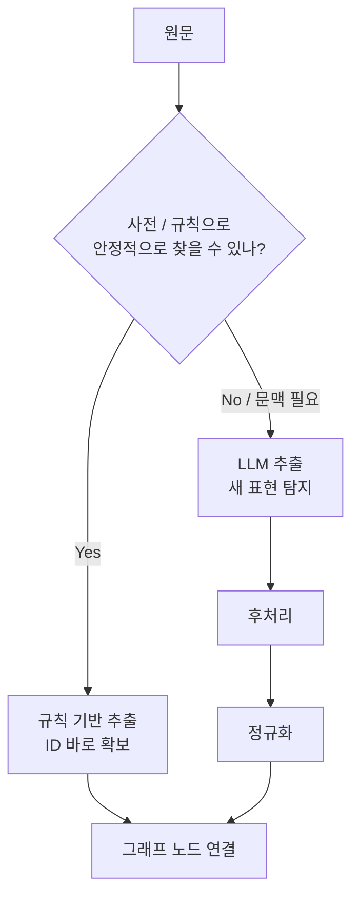

# LLM 기반 NER — 개념·문법 압축 정리

> 기준: `교안_02_LLM_기반_NER.ipynb`  
> 정리 방향: **개념 우선 → 핵심 문법 → 후처리 → 규칙 기반과 비교**  
> 원본 노트북의 그림 `images/postprocess_funnel.png`, `images/rule_vs_llm.png`는 외부 경로로만 참조되고 실제 이미지 파일은 포함되지 않음. 그림이 설명하던 내용은 아래 도식·표로 재구성함.

---

# 1. LLM 기반 NER 핵심 개념

## 왜 LLM을 NER에 쓰나

앞 교안의 규칙 기반 NER은 **사전에 있는 표현**을 빠르고 일관되게 찾고, 사전의 `id`까지 바로 얻는 장점이 있었음.

하지만 다음 문제에서 막힘.

| 한계 | 예 |
|---|---|
| **미등록어** | `statins`, `proton pump inhibitors` |
| **경계 문제** | `Warfarin-related` 내부의 `Warfarin` |
| **대소문자 충돌** | `LARGE` ↔ `large` |
| **약어 충돌** | `OTC`, `PSD`, `SET` 등 |

LLM은 사전의 문자열만 비교하는 대신 **문맥을 읽고**, 프롬프트로 원하는 개체 유형을 알려 주면 **재학습 없이** 개체를 뽑을 수 있음.

```text
규칙 기반 NER
사전에 있나? → 있으면 추출
        ↓
미등록어·문맥 충돌에서 한계

LLM 기반 NER
문장을 읽고 "이 표현이 어떤 개체인가?" 판단
        ↓
사전 밖 표현도 추출 가능
```

이 교안의 개체 유형은 앞 단원과 동일한 5종.

```text
Compound
Gene
Disease
Symptom
PharmacologicClass
```

그래프의 노드 레이블과 같은 이름을 사용함.

## 전체 흐름

LLM이 개체를 잘 찾는 것만으로는 프로그램에 바로 넣을 수 없음.


핵심은 두 단계로 나눠 생각하는 것.

```text
1. LLM이 개체를 찾는다.
2. 프로그램이 쓸 수 있도록 구조와 내용을 검증한다.
```

---

# 2. LLM으로 개체 추출하기

## Zero-shot

**zero-shot** = 정답 예시를 주지 않고, **무엇을 해야 하는지만 지시**하는 방식.

```python
from langchain_core.prompts import ChatPromptTemplate

zero_prompt = ChatPromptTemplate.from_template(
    '다음 논문 원문에서 개체를 뽑아 유형과 함께 나열해 주세요.\n'
    '유형은 Compound, Gene, Disease, Symptom, PharmacologicClass 중에서 고르세요.\n'
    '원문: {원문}'
)

chain = zero_prompt | make_model()
answer = chain.invoke({'원문': text})

print(answer.text)
```

교안 실행에서는 규칙 기반이 놓쳤던 다음 표현도 잡았음.

```text
statins
proton pump inhibitors
Warfarin
```

즉 LLM의 장점은:

```text
사전에 등록되어 있나?
        X
문맥상 어떤 개체인가?
        O
```

### 하지만 바로 생기는 문제

zero-shot 답은 다음처럼 사람이 읽기 좋은 **줄글/목록**으로 나옴.

```text
### Compound
- Omeprazole
- Atorvastatin
...

### Gene
- CYP3A5
- CYP2C19
...
```

프로그램 입장에서는 다음 문제가 있음.

- 개체 하나씩 안정적으로 꺼내기 어려움.
- 출력 모양이 실행마다 달라질 수 있음.
- JSON처럼 보여도 실제 JSON이라는 보장이 없음.
- 모델이 유형 이름을 마음대로 바꿀 수 있음.

따라서 **개체 추출 능력**과 **출력 형식 보장**을 따로 해결해야 함.

## LLM NER에서는 Span보다 이름 중심

앞 교안의 규칙 기반 NER은 다음처럼 `start`, `end`를 직접 계산했음.

```python
{
    'name': 'Carbidopa',
    'type': 'Compound',
    'start': 0,
    'end': 9
}
```

이 교안의 LLM NER은 글자 위치를 직접 세게 하기보다 **개체 이름을 원문 그대로 반환**하도록 지시함.

```text
LLM 출력
name + type
    ↓
후처리
name이 실제 원문에 있는지 확인
```

즉 이 교안에서는 span 검증 대신 **원문 등장 확인**을 사용함.

---

# 3. 구조화 출력 — 프로그램이 쓸 수 있는 NER

## 핵심: `with_structured_output`

줄글 출력 대신 **Pydantic 스키마**를 정하고 모델이 그 구조로 답하게 함.

```text
프롬프트만 사용
→ 형식을 "부탁"

with_structured_output
→ 형식을 "계약"
```

### 개체 하나의 스키마

```python
from typing import Literal, Optional
from pydantic import BaseModel, Field


class Entity(BaseModel):
    name: str = Field(
        description='개체 이름(원문에 나온 그대로)'
    )

    type: Literal[
        'Compound',
        'Gene',
        'Disease',
        'Symptom',
        'PharmacologicClass',
        'Other'
    ] = Field(
        description='개체 유형'
    )

    other_type: Optional[str] = Field(
        default=None,
        description=(
            'type 이 Other 일 때만 채운다. '
            '실제 유형을 영어 한 낱말로 적는다.'
        )
    )

    confidence: float = Field(
        description='개체와 유형이 맞다고 보는 확신도 0.0~1.0'
    )
```

개체는 여러 개이므로 한 번 더 리스트로 감쌈.

```python
class EntityList(BaseModel):
    entities: list[Entity] = Field(
        description='원문에서 뽑은 개체 목록'
    )
```

## `Field(description=...)`의 역할

`description`은 단순 코드 주석이 아니라 **모델에게 전달되는 지시**.

```python
name: str = Field(
    description='개체 이름(원문에 나온 그대로)'
)
```

이 지시가 중요한 이유:

```text
원문: statins
모델이 임의 수정: Statins
        ↓
name in text 검사 실패 가능
```

따라서 스키마 단계에서부터 **원문 표기를 그대로 유지**하도록 지시함.

## `Literal`로 유형 제한

다음처럼 `str`만 사용하면:

```python
type: str
```

모델이 다음 같은 유형을 새로 만들 수 있음.

```text
drug
gene/enzyme
Drug class
Institution
Year
```

반면 `Literal`을 사용하면 허용값을 제한할 수 있음.

```python
type: Literal[
    'Compound',
    'Gene',
    'Disease',
    'Symptom',
    'PharmacologicClass',
    'Other'
]
```

핵심:

```text
str
→ 모델이 유형 이름을 생성

Literal
→ 허용된 값 중에서 선택
```

그래프에 연결할 NER이라면 **유형 문자열을 스키마와 맞추는 것**이 중요함.

## 왜 `Other`가 필요한가

허용 유형을 5개만 두면, 어디에도 속하지 않는 표현을 모델이 **억지로 5개 중 하나에 넣을 수 있음**.

따라서:

```text
5개 유형 + Other
```

구조로 둠.

```python
type = 'Other'
other_type = 'Institution'
```

`other_type`은 버리기 전에 살펴볼 가치가 있음.

예를 들어 `Year`, `Institution`, `Protein`이 계속 나온다면:

```text
현재 스키마에 필요한 유형이 빠졌나?
        ↓
새 유형을 추가할지 판단
```

즉 `Other`는 단순 쓰레기통이 아니라 **스키마 확장 후보를 찾는 관찰 지점**.

## 구조화 추출기

```python
EXTRACT_SYSTEM = (
    '의학 논문 원문에서 개체를 뽑아라. '
    '유형은 Compound, Gene, Disease, Symptom, '
    'PharmacologicClass 중에서 고르고, '
    '다섯에 안 드는 개체는 Other 로 적는다. '
    '개체 이름은 원문에 나온 표현을 그대로 쓴다.'
)

EXTRACT_PROMPT = ChatPromptTemplate.from_messages([
    ('system', EXTRACT_SYSTEM),
    ('user', '{원문}'),
])


def extract_entities(text):
    chain = (
        EXTRACT_PROMPT
        | make_model().with_structured_output(EntityList)
    )

    return chain.invoke({'원문': text}).entities
```

사용:

```python
ents = extract_entities(text)

for ent in ents:
    print(ent.name, '->', ent.type)
```

교안 실행 예:

```text
CYP3A5 -> Gene
CYP2C19 -> Gene
...
Warfarin -> Compound
statins -> PharmacologicClass
proton pump inhibitors (PPIs) -> PharmacologicClass
NSAIDs -> PharmacologicClass
CPIC -> Other
```

해당 실행에서는 총 **25개**가 추출됨.

> LLM 출력은 실행마다 달라질 수 있으므로 `25개` 자체를 정답으로 보면 안 됨.

## 구조화 출력이 보장하는 것

```text
보장하는 것
→ 답이 정상적으로 파싱되면 필드와 자료형이 스키마 구조를 따름

보장하지 않는 것
→ 모델이 항상 올바른 내용만 추출한다는 것
→ 호출/파싱 오류가 절대 나지 않는다는 것
```

스키마와 맞지 않는 답은 잘못된 형태 그대로 통과하기보다 **파싱 단계에서 예외**로 드러남.

따라서 실무에서는 호출부를 `try`로 감싸는 방어 코드가 필요할 수 있음.

---

# 4. Few-shot과 구조화 출력의 차이

## Few-shot

**few-shot** = 원하는 답의 예시를 프롬프트에 같이 넣어 모델을 유도하는 방법.

```python
few_prompt = ChatPromptTemplate.from_template(
    '예시)\n'
    '원문: Carbidopa, used to treat Parkinson disease, '
    'was reported to activate AHR.\n'
    '개체: Carbidopa(Compound), '
    'Parkinson disease(Disease), AHR(Gene)\n\n'
    '위 예시처럼 유형을 붙여 개체를 뽑아 주세요.\n'
    '원문: {원문}'
)

answer = (
    few_prompt
    | make_model()
).invoke({'원문': text})
```

교안 실행에서는 예시의 `이름(유형)` 형식은 어느 정도 따라왔지만, 한 줄 대신 **불릿 목록**으로 출력됨.

```text
few-shot
→ 형식을 유도

with_structured_output
→ 형식을 스키마로 강제
```

따라서 프로그램이 안정적으로 읽어야 하는 결과라면 **few-shot만으로 형식을 맡기지 않음**.

---

# 5. `confidence` — 확률이 아니라 자기 보고

스키마에 다음 필드를 둘 수 있음.

```python
confidence: float
```

교안의 일반 문서 실행에서는 대부분 높은 값에 몰렸음.

```text
1.00 : 23개
0.99 : 1개
0.95 : 1개
```

반면 일부러 약어 충돌이 많은 문장을 넣자 점수가 갈렸음.

```text
0.55  ACT therapy
0.62  SET
0.78  LARGE
0.78  CAT
0.84  PSD
0.96  OTC drugs
0.98  CLOCK study
```

여기서 중요한 구분:

| 값 | 의미 |
|---|---|
| BERT 계열 NER의 `score` | 모델이 계산한 분류 확률/점수 |
| 이 교안 LLM의 `confidence` | 모델이 **스스로 보고한 확신도** |

즉 LLM의 `confidence=1.0`이라고 해서 정확하다는 보장은 없음.

같은 문장을 다시 넣으면 값도 달라질 수 있음.

### 적절한 용도

```text
낮은 confidence
→ 자동 삭제
```

보다

```text
낮은 confidence
→ 사람이 먼저 검수할 후보로 정렬
```

하는 용도로 사용.

자동 제거는 다음의 **후처리 규칙**이 맡음.

---

# 6. 후처리 — 추출 결과를 믿을 수 있게 만들기

구조가 맞아도 내용까지 맞는 것은 아님.

LLM NER에는 다음 문제가 남음.

```text
1. 허용하지 않은 유형
2. 원문에 없는 개체 생성(환각)
3. 같은 개체의 중복
```

따라서 세 단계로 정제함.


교안의 `12 → 11 → 9 → 8`은 결함을 일부러 섞어 둔 연습 데이터의 실행 결과.

## 6-1. 유형 검증

허용 유형 집합:

```python
allowed_types = {
    'Compound',
    'Gene',
    'Disease',
    'Symptom',
    'PharmacologicClass'
}
```

필터:

```python
type_ok = [
    r for r in raw_entities
    if r['type'] in allowed_types
]
```

교안 예:

```text
12개
↓
CPIC / Guideline 제거
↓
11개
```

구조화 스키마를 사용했다면 허용 밖 문자열 대신 주로 `Other`가 이 단계에서 걸림.

## 6-2. 원문 등장 확인

개체 이름이 **그 개체가 추출됐다고 기록된 문서의 원문**에 실제로 있는지 확인.

```python
doc_text = {
    paper['doc_id']: paper['text']
    for paper in papers
}

in_text = [
    r for r in type_ok
    if r['name'] in doc_text[r['doc_id']]
]
```

중요:

```text
전체 코퍼스에서 찾기 X
해당 doc_id의 원문에서 찾기 O
```

다른 논문에 우연히 같은 이름이 있어도 환각이 통과하면 안 되기 때문.

교안 예:

```text
11개
↓
Aspirin, BRCA1 제거
↓
9개
```

두 이름은 의학적으로 그럴듯하지만 **해당 원문에는 없는 이름**이라 제거됨.

### 대소문자 문제

엄격한 검사:

```python
name in text
```

는 원문 표기와 대소문자까지 같아야 함.

교안의 zero-shot 출력에서는:

```text
Statins
Omeprazole
Simvastatin
```

처럼 모델이 첫 글자를 대문자로 바꿨지만 원문에는 소문자로 존재했음.

```text
진짜 개체
→ 모델이 표기 수정
→ 엄격한 원문 검사에서 환각으로 잘못 제거 가능
```

그래서 스키마의 다음 지시가 중요함.

```python
Field(
    description='개체 이름(원문에 나온 그대로)'
)
```

교안 후반의 통합 함수에서는 다음처럼 **대소문자를 무시한 검사**도 사용함.

```python
if ent.name.lower() not in text.lower():
    continue
```

즉 교안에는 두 검사가 모두 등장함.

```text
엄격 검사
name in text
→ 원문 표기까지 확인

대소문자 완화 검사
name.lower() in text.lower()
→ 대소문자 변경에 의한 오제거 감소
```

## 6-3. 중복 제거

같은 `(이름, 유형)`을 하나만 남김.

```python
seen = set()
clean = []

for r in in_text:
    key = (r['name'], r['type'])

    if key not in seen:
        seen.add(key)
        clean.append(r)
```

이름만 키로 쓰지 않는 이유:

```text
같은 name
+ 다른 type
→ 서로 다른 추출 결과일 수 있음
```

교안 예:

```text
9개
↓
중복 1개 제거
↓
8개
```

최종:

```text
omeprazole -> Compound
CYP2C19 -> Gene
simvastatin -> Compound
SLCO1B1 -> Gene
celecoxib -> Compound
Carbidopa -> Compound
AHR -> Gene
psoriasis -> Disease
```

---

# 7. 추출 + 후처리를 함수 하나로 묶기

핵심 흐름:

```text
원문
→ extract_entities()
→ 유형 검사
→ 원문 검사
→ 중복 제거
→ {'name', 'type'} 목록
```

정리된 형태:

```python
def extract_and_clean(text):
    """원문에서 개체를 추출하고 후처리한 뒤 반환."""
    seen = set()
    out = []

    for ent in extract_entities(text):

        # 1. 허용 유형 검사
        if ent.type not in allowed_types:
            continue

        # 2. 원문 등장 확인
        if ent.name.lower() not in text.lower():
            continue

        # 3. 중복 제거
        key = (ent.name, ent.type)
        if key in seen:
            continue

        seen.add(key)
        out.append({
            'name': ent.name,
            'type': ent.type
        })

    return out
```

> 원본 실습 코드에는 함수명이 `extact_and_clean`으로 적힌 셀이 있으나, 문제 설명의 의도는 `extract_and_clean`임. 위에서는 함수 이름만 문제 설명과 맞춰 정리함.

교재 실행에서는 실제 구조화 출력에 후처리를 적용했을 때 **0건이 제거된 실행도 있었음**.

이것이 후처리가 필요 없다는 뜻은 아님.

```text
후처리
= 항상 많이 제거하는 장치 X
= 드물지만 그래프를 망칠 오류를 적재 전에 차단하는 안전장치 O
```

---

# 8. 여러 문서에 적용하기

문서 하나가 아니라 코퍼스 전체에 반복 적용.

```python
all_entities = []

for paper in papers:
    for ent in extract_entities(paper['text']):
        all_entities.append(ent)
```

유형 분포 집계:

```python
from collections import Counter

print(
    Counter(
        ent.type
        for ent in all_entities
    )
)
```

교안의 한 실행:

```text
전체 개체 수: 184

Compound             54
Gene                 45
PharmacologicClass   27
Symptom              22
Other                20
Disease              16
```

LLM 출력이라 숫자는 실행마다 달라질 수 있음.

## 호출 수와 비용

```text
논문 1편
→ 모델 호출 1회

논문 N편
→ 모델 호출 N회
```

따라서 대량 코퍼스에서는:

- 같은 프롬프트의 결과를 불필요하게 다시 호출하지 않기.
- 처리 문서 수에 상한 두기.
- 규칙 기반으로 1차 후보를 좁힌 뒤 LLM 사용하기.

등의 역할 분담이 필요함.

---

# 9. 규칙 기반 NER vs LLM NER

같은 원문에 두 방식을 적용한 교안 실행:

```text
규칙 기반: 20개
LLM      : 24개
```

LLM만 잡은 것:

```text
NSAIDs
Warfarin
proton pump inhibitors (PPIs)
statins
```

그중 사전에 없는 이름:

```text
NSAIDs
proton pump inhibitors (PPIs)
statins
```

모두 원문에는 실제로 존재했음.

> 원본 그림의 설명에는 LLM `25개`가 한 실행값으로 적혀 있고, 노트북의 다른 실행 결과에는 `24개`가 출력됨. 이 차이 자체가 **LLM 출력이 실행마다 흔들린다**는 교안의 핵심 예시.

## 역할 차이

| 비교 | 규칙 기반 | LLM |
|---|---|---|
| 사전 밖 표현 | 못 잡음 | 잡을 수 있음 |
| 문맥 판단 | 약함 | 강함 |
| 그래프 노드 `id` | 사전에서 바로 획득 | 바로 없음 |
| 실행 일관성 | 높음 | 실행마다 달라질 수 있음 |
| 모델 호출 비용 | 없음 | 문서 수만큼 발생 |
| 정규화 필요성 | 상대적으로 낮음 | 높음 |

핵심:

```text
규칙 기반과 LLM은 경쟁 관계가 아니라 역할 분담
```



---

# 10. LLM이 더 찾은 뒤 생기는 새 문제 — 정규화

LLM이 사전 밖 표현을 잘 찾아도 그래프에서는 바로 쓸 수 없는 경우가 있음.

예:

```text
PPIs
proton pump inhibitors
```

둘은 같은 개념을 가리킬 수 있지만 이름만 보면 서로 다름.

LLM 결과를 그대로 노드로 만들면:

```text
(PPIs)
(proton pump inhibitors)
```

가 **서로 다른 노드**가 될 수 있음.

또 기존 사전에 `id`가 없으면 기존 그래프의 어느 노드와 연결해야 하는지 알 수 없음.

따라서:

```text
LLM NER
→ 새 이름 발견
→ 정규화
→ 표준 이름 / ID 연결
→ 그래프 적재
```

이 교안의 결론은:

```text
LLM은 "찾기"를 넓힌다.
정규화는 "같은 대상을 같은 노드로 연결"한다.
```

사전에 없는 이름은 이후 **정규화** 또는 **격리 적재** 대상으로 이어짐.

---

# 11. `with_structured_output`의 방식

교안에서 정리한 `method`:

| `method` | 역할 |
|---|---|
| `json_schema` | 스키마를 모델 요청에 직접 전달하고 그 구조로 파싱 |
| `json_mode` | 교안에서는 `json_schema`의 옛 이름으로 설명 |
| `function_calling` | 스키마를 도구 정의 형태로 바꿔 도구 호출로 받음 |

교안에서는 기본 경로로 `json_schema`를 사용함.

핵심 사용 문법은 동일.

```python
model.with_structured_output(EntityList)
```

---

# 12. 전체 핵심 비교

| 개념 | 기억할 것 |
|---|---|
| **LLM NER** | 프롬프트로 원하는 유형의 개체를 추출 |
| **zero-shot** | 예시 없이 지시만 제공 |
| **few-shot** | 예시로 출력 방향을 유도하지만 형식을 보장하지는 않음 |
| **구조화 출력** | `with_structured_output()`으로 프로그램이 읽을 구조를 강제 |
| **Pydantic** | 추출할 필드와 자료형을 스키마로 정의 |
| **`Literal`** | 허용할 개체 유형을 제한 |
| **`Other`** | 기존 유형에 없는 개체를 억지 분류하지 않도록 받는 칸 |
| **`other_type`** | 새로운 스키마 후보를 관찰 |
| **`Field(description=...)`** | 모델에게 전달되는 출력 규칙 |
| **`confidence`** | 확률이 아니라 LLM의 자기 보고값 |
| **유형 검증** | 허용된 그래프 유형만 남김 |
| **원문 등장 확인** | 원문에 없는 환각 제거 |
| **중복 제거** | 같은 `(name, type)` 하나만 유지 |
| **배치 적용** | 문서마다 호출하므로 문서 수가 곧 비용으로 연결 |
| **규칙 기반** | 빠르고 일관되며 사전 ID를 바로 얻음 |
| **LLM** | 사전 밖 표현을 찾지만 ID가 없어 정규화 필요 |

---

# 13. 최소 문법만 다시 보기

## 모델 + 프롬프트

```python
from langchain_openai import ChatOpenAI
from langchain_core.prompts import ChatPromptTemplate

model = ChatOpenAI(model='gpt-5.6-luna')

prompt = ChatPromptTemplate.from_messages([
    ('system', '의학 논문에서 개체를 추출하라.'),
    ('user', '{원문}')
])
```

## Pydantic 구조

```python
class Entity(BaseModel):
    name: str
    type: Literal[
        'Compound',
        'Gene',
        'Disease',
        'Symptom',
        'PharmacologicClass',
        'Other'
    ]


class EntityList(BaseModel):
    entities: list[Entity]
```

## 구조화 출력

```python
chain = (
    prompt
    | model.with_structured_output(EntityList)
)

entities = chain.invoke({
    '원문': text
}).entities
```

## 유형 검증

```python
allowed_types = {
    'Compound',
    'Gene',
    'Disease',
    'Symptom',
    'PharmacologicClass'
}

clean = [
    ent for ent in entities
    if ent.type in allowed_types
]
```

## 원문 확인

```python
if ent.name.lower() in text.lower():
    ...
```

## 중복 제거

```python
seen = set()

key = (ent.name, ent.type)

if key not in seen:
    seen.add(key)
```

## 유형 분포

```python
from collections import Counter

Counter(
    ent.type
    for ent in all_entities
)
```

---

# 14. 전체 흐름 한 줄

```text
논문 원문
→ LLM으로 개체 추출
→ Pydantic + Literal로 출력 구조 고정
→ 유형 검증
→ 원문 등장 확인
→ 중복 제거
→ 사전 밖 이름 정규화
→ 표준 ID와 연결
→ 지식 그래프 적재
```

가장 중요한 구분:

```text
LLM = 개체를 "찾는" 범위를 넓힘
구조화 출력 = 결과의 "모양"을 고정
후처리 = 결과의 "신뢰성"을 높임
정규화 = 개체를 기존 그래프의 "표준 ID"와 연결
```
