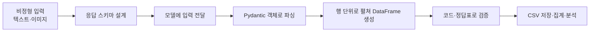

# OpenAI API — 텍스트·이미지 데이터 정형화 핵심 정리

> 기준 자료  
> - `교안_03_텍스트_데이터_정형화.ipynb`  
> - `교안_04_이미지_이해_정형화.ipynb`

> 목적: 자유로운 텍스트와 이미지를 **일정한 스키마의 데이터로 변환하고, 검증한 뒤 표와 CSV로 저장**하는 흐름 이해.

---

## 0. 전체 흐름



텍스트와 이미지 정형화의 핵심 문법은 같음.

```python
result = client.chat.completions.parse(
    model="...",
    messages=[...],
    response_format=결과스키마,
).choices[0].message.parsed
```

달라지는 부분은 **입력 방식**뿐.

- 텍스트: `content`에 문자열 전달
- 이미지: `content` 리스트에 텍스트와 `image_url` 전달
- 출력: 둘 다 `BaseModel` 스키마에 맞는 객체

---

# 1. 텍스트 데이터 정형화

## 1.1 핵심 개념

텍스트 정형화는 제각각인 자연어를 같은 열을 가진 데이터로 바꾸는 작업.

```text
고객 문의·설문·리뷰
→ 모델이 내용 해석
→ 미리 정한 필드에 값 배치
→ DataFrame
→ 집계·검증·저장
```

스키마는 단순한 출력 틀이 아니라 **모델이 지켜야 할 계약서이자 프롬프트**.

| 문법 | 역할 | 예 |
|---|---|---|
| `Literal[...]` | 허용값 고정 | 감정은 긍정·부정·중립만 |
| `Optional[T]` | 없는 값 허용 | 주문번호가 없으면 `None` |
| `list[SubModel]` | 여러 항목 표현 | 개인정보 여러 개, 품목 여러 개 |
| `Field(description=...)` | 판단 기준 전달 | “없으면 빈 리스트” |
| `Field(ge=, le=)` | 숫자 범위 제한 | 확신도 0~1 |

가장 중요한 원칙:

> **모르는 값을 억지로 채우지 않음.**  
> 빈칸은 나중에 보완할 수 있지만, 지어낸 값은 오류인지 알아보기 어려움.

---

## 1.2 핵심 예시 ① 고객 문의 분류

### 목적

상담 문의에서 다음 항목을 자동 추출.

- 문의 유형
- 긴급도
- 감정
- 핵심 이슈
- 주문번호
- 상담 응답 가이드

### 핵심 스키마

```python
class Inquiry(BaseModel):
    category: Literal["환불", "교환", "배송", "상품", "기술지원", "불만", "기타"]
    urgency: Literal["긴급", "높음", "보통", "낮음"]
    emotion: Literal["긍정", "중립", "부정"]
    key_issues: list[str] = Field(min_length=2, max_length=5)
    order_number: Optional[str] = Field(default=None, description="문의에 없으면 반드시 null")
    suggested_response: str
```

### 입력

```text
주문번호 ORDER-230415입니다.
환불 어떻게 하나요??? 급합니다ㅠㅠ 배송비 차감되나요??
```

### 결과

```text
유형: 환불
긴급도: 긴급
감정: 부정
주문번호: ORDER-230415
핵심 이슈: 환불 방법, 주문번호 확인, 배송비 차감
```

### 핵심

`order_number`를 `Optional`로 두었기 때문에 주문번호가 없는 문의에는 `None`이 들어감.

6건을 표로 변환한 결과:

```text
유형: 교환 2건 / 환불 1건 / 배송 1건 / 기술지원 1건 / 기타 1건
긴급도: 긴급 3건 / 보통 3건
주문번호 포함: 2건
```

분류 성능을 높이는 방법:

1. 분류 기준을 시스템 프롬프트에 구체적으로 작성
2. 직접 정답을 매긴 테스트 데이터 준비
3. 모델 결과와 정답을 비교해 정확도 측정
4. 필요하면 더 좋은 모델 사용

좋아 보이는 답이 아니라 **정답 데이터와의 일치율**로 평가.

---

## 1.3 핵심 예시 ② 개인정보 탐지와 마스킹

### 목적

문장에서 개인정보를 찾아 유형별로 기록하고, 원문에서는 가려서 반환.

```text
PIIResult
├─ masked_text
├─ items
│  ├─ original
│  ├─ pii_type
│  └─ masked
└─ risk
```

### 핵심 스키마

```python
class PIIItem(BaseModel):
    original: str
    pii_type: Literal["이름", "전화번호", "이메일", "주소", "주민번호", "카드번호", "계좌번호"]
    masked: str

class PIIResult(BaseModel):
    masked_text: str
    items: list[PIIItem] = Field(description="개인정보가 없으면 빈 리스트")
    risk: Literal["없음", "낮음", "보통", "높음"]
```

### 입력

```text
안녕하세요, 홍길동입니다.
010-1234-5678로 연락주세요.
이메일은 hong@example.com 입니다.
```

### 모델이 탐지한 값

```text
이름: 홍길동 → 홍**
전화번호: 010-1234-5678 → 010-****-5678
이메일: hong@example.com → h***@example.com
위험도: 보통
```

### 반드시 추가할 검증

모델이 `items`에는 개인정보를 적었지만 `masked_text`에는 원문을 남길 수 있음.

```python
leaks = [
    item.original
    for item in result.items
    if item.original in result.masked_text
]
```

교안 실행 결과에서는 **가렸다고 기록했지만 실제 문장에 남은 값이 2건** 발견됨.

```text
홍길동
국민은행 123-456-789012
```

핵심 교훈:

> **모델의 설명과 실제 결과를 따로 검증해야 함.**

- 전화번호·이메일처럼 형식이 고정됨 → 정규표현식이 더 싸고 정확
- 이름·주소처럼 형식이 일정하지 않음 → LLM 활용 가치가 큼
- 실무에서는 규칙과 LLM을 섞어 사용

---

## 1.4 핵심 예시 ③ 자유 설문 표준화

### 목적

다양한 표현을 숫자와 공통 범주로 변환.

```text
"스물다섯살" → age=25
"3천5백" → income=3500
"서울 강남" → region="서울"
"40대 초반" → age=None, age_group="40대"
"많이 벌어요" → income=None
```

두 층으로 관리.

| 층 | 내용 |
|---|---|
| 원본 추출 | 나이·성별·직업·소득·지역 |
| 분석용 표준화 | 연령대·직업분류·소득구간 |

### 핵심 원칙

정확한 값이 없으면 추측하지 않음.

```python
age: Optional[int]
income: Optional[int]
```

예:

```text
입력: 40대 초반 남성 자영업자 연수입 5000만원 충청도
결과:
- 정확한 나이: None
- 연령대: 40대
- 직업분류: 자영업
- 지역: 충청도
```

### 모델과 코드의 역할 분리

| 작업 | 담당 |
|---|---|
| “스물다섯살”을 25로 해석 | 모델 |
| 빈칸 개수를 세어 품질 등급 계산 | 코드 |

교안에서는 모델이 부여한 품질과 코드 규칙이 **5건 중 1건에서 다르게 나옴**.

```python
missing = df[check_cols].isna().sum(axis=1)
df["품질(코드)"] = missing.map(grade)
```

핵심:

> **해석은 모델, 계산 가능한 규칙은 코드.**  
> 둘이 다르면 해당 행만 사람이 확인.

---

## 1.5 대량 처리 파이프라인

수십 건 이상을 처리할 때 필요한 요소.

```text
진행 상황 출력
+ 한 건 실패 시 계속 진행
+ 실패 행 표시
+ 결과 저장
```

```python
rows = []

for i, row in enumerate(data.itertuples(), start=1):
    try:
        result = analyze(row.content)
        rows.append(result.model_dump())
    except Exception:
        rows.append({"sentiment": None, "topic": None})

    if i % 10 == 0:
        print(f"{i}/{len(data)} 완료")

pd.DataFrame(rows).to_csv("output.csv", index=False, encoding="utf-8-sig")
```

교안의 리뷰 40건 처리 결과:

```text
40건 완료
실패 0건
```

별점과 감정 레이블을 교차 비교해 품질을 확인하고, 결과를 CSV로 저장함.

> API 호출 결과는 반드시 저장.  
> 다시 호출하면 시간과 비용이 다시 발생함.

---

# 2. 이미지 이해와 정형화

## 2.1 핵심 개념

이미지 정형화도 흐름은 텍스트와 같음.

```text
이미지
→ 이미지 내용을 모델이 이해
→ 스키마에 맞는 객체
→ 행 단위 표
→ 검산·정답표 비교
→ 저장
```

차이는 이미지가 `content` 리스트 안에 들어간다는 점.

---

## 2.2 이미지를 넣는 두 가지 방법

| 방법 | 사용 상황 | 핵심 |
|---|---|---|
| 로컬 파일 | 내 PC·사내 사진 | base64 data URL로 변환 |
| 공개 URL | 웹에 공개된 이미지 | 이미지 주소 전달 |

### 로컬 파일

```python
def to_data_url(path):
    data = base64.b64encode(Path(path).read_bytes()).decode()
    return f"data:image/jpeg;base64,{data}"
```

### 공통 요청 구조

```python
content = [
    {"type": "text", "text": "이 사진을 설명해줘."},
    {"type": "image_url", "image_url": {"url": image_url}},
]
```

중요:

- 텍스트와 이미지는 **같은 메시지의 `content` 리스트**에 넣음
- 공개 URL은 모델 서버에서 접근 가능해야 함
- 로그인 주소·사내망 주소는 실패 가능
- 여러 장을 비교하려면 `image_url` 항목을 여러 개 추가

```python
content = [{"type": "text", "text": "두 사진을 비교해줘."}]
content += [{"type": "image_url", "image_url": {"url": u}} for u in image_urls]
```

---

## 2.3 핵심 예시 ① 패션 사진 → 상품 속성 표

### 목적

사진에서 착장 정보와 개별 아이템 속성을 추출.

```text
FashionPhoto
├─ gender
├─ style
└─ items
   ├─ item_type
   ├─ color
   └─ pattern
```

### 핵심 스키마

```python
class FashionItem(BaseModel):
    item_type: Literal["상의", "하의", "아우터", "원피스", "신발", "가방", "액세서리"]
    color: Literal["블랙", "화이트", "그레이", "네이비", "블루", "레드",
                   "베이지", "브라운", "그린", "옐로우", "핑크", "기타"]
    pattern: Literal["무지", "스트라이프", "체크", "프린트", "기타"]

class FashionPhoto(BaseModel):
    gender: Literal["남성", "여성", "공용"]
    style: Literal["캐주얼", "포멀", "스포티", "스트리트", "기타"]
    items: list[FashionItem]
```

한 사진에서 여러 아이템이 나오므로 `items: list[FashionItem]` 사용.

### 실행 결과

교안 코드는 패션 사진 **3장**을 분석해 아이템 **10개**를 행으로 펼침.

```text
상의 3
하의 3
신발 2
액세서리 2

블랙 4
화이트 4
네이비 1
레드 1
```

> 노트북 출력 문구에는 “사진 4장”이라고 적혀 있지만, 실제 코드는 앞 3장을 분석함.

사람이 작성한 정답표와 아이템 수를 비교한 결과:

```text
사진 1: 사람 5개 / 모델 4개
사진 2: 사람 4개 / 모델 3개
사진 3: 사람 3개 / 모델 3개
```

수가 다르다고 바로 틀린 것은 아님.

- 사람은 액세서리를 생략할 수 있음
- 모델은 그림자나 배경 물체를 아이템으로 볼 수 있음
- 무엇을 아이템으로 셀지 기준을 먼저 고정해야 함

### 실무 순서

```text
소수 사진으로 시험
→ 결과 확인
→ Literal·description 수정
→ 전량 처리
→ 중간 저장
```

처음부터 수천 장을 처리하면 잘못된 스키마에 비용을 낭비할 수 있음.

---

## 2.4 핵심 예시 ② 영수증 OCR → 정산용 표

### 목적

영수증 이미지에서 가게·총액·결제수단·품목을 추출.

```text
Receipt
├─ store_name
├─ total_amount
├─ payment
└─ items
   ├─ name
   ├─ quantity
   └─ price
```

### 핵심 스키마

```python
class ReceiptItem(BaseModel):
    name: str
    quantity: int
    price: float

class Receipt(BaseModel):
    store_name: Optional[str] = None
    total_amount: float
    payment: Literal["현금", "카드", "기타"]
    items: list[ReceiptItem]
```

가게 이름이 안 보이면 `None`.  
보이지 않는 상호를 추측하면 정산 데이터가 오염됨.

### 실행 결과

영수증 4장에서 다음 값을 추출.

```text
총액: 60,000 / 28,000 / 11,000 / 174,600
품목 행: 총 7개
```

### 핵심 검산

영수증은 내부 숫자로 검증 가능.

```python
items_sum = item_df.groupby("image_file")["price"].sum()
difference = total_amount - items_sum
```

교안 결과:

```text
검산 통과: 3 / 4장
```

실패한 한 장:

```text
품목 합: 194,000
할인: 19,400
총액: 174,600
```

따라서 검산 실패가 곧 OCR 오류는 아님.

```text
검산 실패
├─ 숫자를 잘못 읽음
└─ 할인·세금이 별도로 존재함
```

할인과 세금 필드까지 추출하면 자동 판별 범위를 넓힐 수 있음.

### 정답표와 비교할 때의 주의

교안에서는 총액이 정답표와 3/4장 일치했고, 상호명은 비교 가능한 2장 중 0장 일치함.

그러나 불일치 한 건은 모델이 아니라 **정답표 금액 표기 오류**였음.

```text
실제·모델: 60,000
정답표: 60.0
```

핵심:

> 모델뿐 아니라 정답표도 틀릴 수 있음.  
> 값이 다르면 양쪽 원본을 확인.

업무 목적에 따라 검증 기준도 달라짐.

| 목적 | 중요한 필드 |
|---|---|
| 경비 정산 | 총액·결제수단 |
| 상품 분석 | 품목명·수량 |
| 가맹점 분석 | 상호명 |

---

# 3. 텍스트와 이미지 정형화 비교

| 구분 | 텍스트 | 이미지 |
|---|---|---|
| 입력 | 자연어 문자열 | base64 또는 공개 URL |
| 공통 핵심 | Pydantic 스키마와 `parse()` | Pydantic 스키마와 `parse()` |
| 중첩 예 | 개인정보·이슈 목록 | 패션 아이템·영수증 품목 |
| 대표 검증 | 원문 값 누출·빈칸·정답 레이블 | 금액 합계·사람 정답표 |
| 주요 비용 | 호출 건수 | 이미지 크기와 장수 |
| 주요 위험 | 없는 값을 지어냄 | OCR 오독·물체 누락·과잉 탐지 |

---

# 4. 실무 핵심 원칙

## 스키마 설계

- 집계할 값은 `Literal`로 고정
- 없는 값은 `Optional`과 `None`으로 처리
- 여러 항목은 중첩 리스트로 표현
- 판단 기준은 `description`에 구체적으로 작성

## 모델과 코드 분업

```text
문맥 해석·분류·추출 → 모델
개수·합계·범위·누출 검사 → 코드
최종 애매한 사례 → 사람
```

## 검증

- 모델이 출력했다고 그대로 믿지 않음
- 원본과 비교
- 정답표와 비교
- 내부 합계와 비교
- 모델 판단과 코드 판단이 다른 행만 검토

## 비용과 안정성

- 소수 샘플로 먼저 시험
- 이미지는 필요 이상으로 크게 보내지 않음
- 한 건 실패가 전체를 멈추지 않게 처리
- 진행 상황 출력
- 결과를 중간 저장
- 같은 데이터를 불필요하게 재호출하지 않음

---

# 5. 최종 요약

```text
비정형 데이터를 표로 만드는 핵심
= 입력 이해 + 스키마 강제 + 코드 검증
```

- 텍스트와 이미지는 입력만 다르고 정형화 구조는 같음.
- `BaseModel`은 출력 형식이면서 모델에게 주는 지시문.
- `Literal`은 값의 흔들림을 막음.
- `Optional`은 모델의 억지 추측을 막음.
- 중첩 리스트는 한 입력 안의 여러 항목을 표현.
- 해석은 모델, 계산과 검산은 코드가 담당.
- 검증 실패는 오류 후보를 찾는 신호이지 무조건 모델 오류라는 뜻은 아님.
- 정형화 결과는 DataFrame으로 펼치고 반드시 저장.
