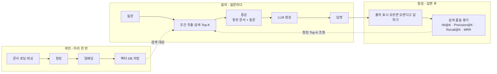

# RAG 개념 정리

## 1. RAG 전체 파이프라인

RAG는 **미리 문서를 검색 가능한 형태로 저장해 두고**, 질문이 들어오면 **관련 근거를 찾아 프롬프트에 붙인 뒤 LLM이 답을 생성**하는 흐름.

전체 과정은 시점에 따라 크게 3부분으로 나뉨.

1. **색인(Indexing, 미리 한 번)**
   - 문서 로딩·파싱 → 청킹 → 임베딩 → 벡터 DB 저장
2. **질의(Query, 질문마다)**
   - 질문 → 조건 추출 → 검색(Top-K) → 증강 → LLM 생성
3. **점검(Evaluation, 답변 후)**
   - 출처 표시·근거 확인
   - 검색 품질 평가
   - 필요하면 청킹·Top-K 등을 수정



### 단순 구현에서 빠지기 쉬운 부분

- **넣기 전:** PDF·스캔본 등은 먼저 텍스트로 변환해야 함 → **파싱**
- **넣을 때:** 긴 문서는 검색 가능한 크기로 나눠야 함 → **청킹**
- **찾을 때:** 질문 속 기간·문서 종류·팀 등의 조건을 분리해야 함 → **메타데이터 필터**
- **답한 뒤:** 검색과 답변이 실제 근거를 제대로 사용했는지 평가해야 함 → **점검**

---

## 2. 색인: 문서를 벡터 DB에 넣기

### 2.1 로딩·파싱(Document Parsing)

일반 문서는 처음부터 `txt` 형태가 아님.
PDF·스캔·표·HWP 등을 **프로그램이 읽을 수 있는 텍스트로 변환**하는 과정이 필요함.

> **파싱이 깨지면 뒤 과정도 전부 영향을 받음.**

| 도구 | 형태 | OCR | 특징 | 적합한 경우 |
|---|---|---:|---|---|
| PyMuPDF4LLM | 오픈소스·로컬 | ✕ | 빠르고 간단 | 글자 위주 PDF |
| Docling | 오픈소스·로컬 | ○ | 레이아웃·표 인식 | 무료로 비교적 정교하게 처리할 때 |
| Upstage Document Parse | API | ○ | 표·한국어·HWP에 강점 | 복잡한 한국 문서 |
| LlamaParse | API | ○ | 복잡한 표에 강함 | 정확도를 우선할 때 |

---

### 2.2 청킹(Chunking)

**청킹 = 문서를 검색 단위인 작은 조각(chunk)으로 나누는 작업.**

긴 문서를 통째로 임베딩하면 문제가 생김.

- 여러 의미가 한 벡터에 섞여 의미가 흐려짐
- 필요한 한 문단이 아니라 문서 전체가 검색 단위가 됨
- LLM에 큰 문서를 그대로 넣으면 입력 한도·비용 문제가 커짐

청킹하면:

- **의미 선명:** 한 조각의 주제가 좁아져 임베딩이 또렷해짐
- **정밀 검색:** 필요한 문단만 Top-K로 가져올 수 있음
- **컨텍스트 절약:** 관련 조각만 LLM에 전달

> RAG 품질은 **청킹 전략**에 크게 좌우됨.

#### `chunk_size`와 `overlap`

- `chunk_size`: 한 청크의 크기
  - 강의에서는 **글자 수 기준**
  - 너무 크면 의미가 섞임
  - 너무 작으면 문맥이 끊김
- `overlap`: 앞뒤 청크가 겹치는 구간
  - 청크 경계에서 잘린 문맥을 이어 줌
  - 대신 중복 저장량과 비용 증가

#### 대표 청킹 방식

| 방식 | 자르는 기준 | 장점 | 약점 |
|---|---|---|---|
| 고정 길이 | 무조건 N글자마다 | 가장 단순하고 빠름 | 문장 중간에서 잘릴 수 있음 |
| 고정 + overlap | N글자마다 자르되 앞뒤를 겹침 | 끊긴 문맥 보완 | 중복 저장·비용 증가 |
| 문장 단위 | 마침표 등 문장 경계 | 문맥이 자연스러움 | 청크 길이가 일정하지 않음 |

- 줄글 형태의 사규 → **문장 단위**가 무난
- 표·목록이 섞인 문서 → **고정 길이 + overlap**이 무난
- 더 정교한 방식은 Advanced RAG 영역

#### 예: `chunk_size=30`, `overlap=8`

```text
실제 이동 폭 = chunk_size - overlap
             = 30 - 8
             = 22글자
```

즉, 다음 청크는 30글자 뒤가 아니라 **22글자 뒤에서 시작**하고 8글자는 앞 청크와 겹침.

| 번호 | 시작 위치 | 길이 | 예시 청크 | 앞 청크와 겹친 부분 |
|---:|---:|---:|---|---|
| 0 | 0 | 30 | 환불은 구매일로부터 14일 이내에만 가능합니다. 단순 | - |
| 1 | 22 | 30 | 합니다. 단순 변심은 배송비를 고객이 부담합니다. 제품 | 합니다. 단순 |
| 2 | 44 | 30 | 담합니다. 제품 하자는 배송비를 회사가 부담하고 전액 | 담합니다. 제품 |
| 3 | 66 | 14 | 부담하고 전액 환불합니다. | 부담하고 전액 |

---

### 2.3 임베딩 → 벡터 DB 적재

색인 순서:

```text
로딩·파싱 → 청킹 → 임베딩 → 적재
```

- **로딩·파싱:** 문서를 읽을 수 있는 텍스트로 변환
- **청킹:** 검색 단위로 분리
- **임베딩:** 청크마다 벡터 생성
- **적재:** 벡터와 원문·메타데이터를 벡터 DB에 저장

청킹이 임베딩보다 먼저임.
강의 내용 기준으로 **벡터가 된 뒤에는 원래 문장으로 되돌려 쪼개는 방식이 아니므로**, 먼저 검색 단위를 정해야 함.

벡터 DB에는 벡터만 넣는 것이 아니라 **원문과 출처 같은 메타데이터도 함께 저장**해야 함.

예시 컬렉션:

| id | 청크 내용 | 벡터 차원 | 출처(메타데이터) |
|---|---|---:|---|
| c0 | 환불은 구매일로부터 14일 이내 가능합니다. | 768 | 환불정책.pdf |
| c1 | 제품 하자는 전액 환불되며 배송비는 회사 부담입니다. | 768 | 환불정책.pdf |
| c2 | 배송은 결제 후 2~3일 걸립니다. | 768 | 배송안내.pdf |
| c3 | 회원 등급은 구매액에 따라 올라갑니다. | 768 | 회원약관.pdf |

> **한 행 = 문서 하나가 아니라 청크 하나.**

---

## 3. 질의: 질문에서 근거를 찾고 답하기

### 3.1 질문 임베딩 + Top-K 검색

질문도 임베딩한 뒤 벡터 DB의 청크와 비교함.
가장 가까운 청크 **상위 K개**를 가져오는 역할이 **Retriever(검색기)**.

강의 예시에서는:

```text
거리 = 1 - 유사도
```

따라서 **거리가 작을수록 질문과 가까움**.

질문:

> `환불 언제까지 돼요?`

| 순위 | 거리 | 청크 내용 | K=2일 때 |
|---:|---:|---|---|
| 1 | 0.005 | 환불은 구매일로부터 14일 이내 가능합니다. | ○ 사용 |
| 2 | 0.048 | 제품 하자는 전액 환불되며 배송비는 회사 부담입니다. | ○ 사용 |
| 3 | 0.696 | 배송은 결제 후 2~3일 걸립니다. | ✕ 제외 |
| 4 | 0.862 | 회원 등급은 구매액에 따라 올라갑니다. | ✕ 제외 |

`K=2`라면 상위 2개 청크만 다음 단계의 근거로 사용.

---

### 3.2 질문 = 조건 + 검색어

질문의 모든 내용을 그대로 임베딩 검색에만 맡기지 않고 역할을 분리할 수 있음.

```text
질문 = 조건 + 검색어
```

- **조건** → 메타데이터 필터
- **검색어** → 임베딩 기반 의미 검색

예:

| 사용자 질문 | 뽑아낸 조건 | 남는 검색어 |
|---|---|---|
| 작년 환불 규정 알려줘 | `year = 2024` *(원문 예시 기준)* | 환불 규정 |
| 공지 중에서 배송 지연 관련 있어? | `category = notice` | 배송 지연 |
| 인사팀 문서로만 연차 규정 찾아 줘 | `team = hr` | 연차 규정 |
| 환불 절차가 어떻게 되나요? | 없음 | 환불 절차 |

조건 예:

- `작년`
- `공지 중에서`
- `내 팀 문서만`

이런 값은 벡터 의미 검색보다 `year`, `category`, `team` 같은 **메타데이터 필터**로 처리.

#### LLM으로 조건 추출

LLM에 사용 가능한 메타데이터 항목을 알려 주고 질문에서 해당 값을 **정해진 구조(JSON 등)**로 추출하게 함.

흐름:

```text
사용자 질문
→ LLM이 조건 추출
→ 구조화된 값 생성
→ 벡터 DB의 where 조건으로 전달
→ 남은 검색어만 임베딩 검색
```

---

### 3.3 증강(Augmentation) + 생성(Generation)

검색된 Top-K 문서를 질문과 함께 프롬프트에 넣음.

```text
질문
+ 검색한 근거 문서
= 증강된 프롬프트
→ LLM 생성
→ 답변
```

여기서 답을 만드는 역할이 **Generator(생성기)**.

환각을 줄이기 위한 기본 처리:

- 검색한 근거를 프롬프트에 명확히 포함
- 답변에 출처 표시
- 근거가 없으면 모른다고 답하도록 지시

---

## 4. 검색 품질 평가

RAG는 **검색이 좋아야 답도 좋아짐**.
따라서 생성 답변만 보기 전에 **검색 결과부터 평가**하는 것이 중요함.

### 4.1 골든셋(Golden Set)

질문마다 반드시 검색되어야 하는 **정답 문서·정답 청크**를 미리 정해 둔 기준 데이터.

```text
질문
→ 검색 결과 Top-K
→ 골든셋과 비교
→ 검색 품질을 숫자로 평가
```

### 4.2 주요 지표

| 지표 | 보는 것 | 계산/판단 |
|---|---|---|
| **Hit@K** | 정답이 Top-K 안에 하나라도 있는가 | 있으면 `1`, 없으면 `0` |
| **Precision@K** | 가져온 K개 중 정답 비율 | `Top-K 안 정답 수 / K` |
| **Recall@K** | 전체 정답 중 얼마나 찾았는가 | `찾은 정답 수 / 전체 정답 수` |
| **MRR** | 첫 정답이 얼마나 위에 나왔는가 | 여러 질문의 `1 / 첫 정답 순위` 평균 |

#### Hit@K

정답의 개수나 순위는 보지 않음.
**상위 K개 안에 정답이 있는지 여부만 확인.**

#### Precision@K

예:

```text
반환 5개 중 정답 2개
Precision@5 = 2 / 5 = 0.4
```

노이즈가 많을수록 Precision이 낮아짐.

#### Recall@K

예:

```text
전체 정답 2개
Top-5 안에서 정답 2개 모두 발견
Recall@5 = 2 / 2 = 1.0
```

정답 근거를 **놓치지 않았는지** 확인하는 지표.

#### MRR

먼저 각 질문의 Reciprocal Rank(RR)를 구함.

```text
RR = 1 / 첫 정답 순위
```

| 첫 정답 순위 | RR | 해석 |
|---:|---:|---|
| 1위 | 1.0 | 바로 첫 결과에서 찾음 |
| 2위 | 0.5 | 두 번째 결과 |
| 3위 | 0.33 | 순위가 더 내려감 |
| 5위 | 0.2 | 낮은 순위에서 겨우 발견 |
| 못 찾음 | 0 | Top-K 안에 정답 없음 |

여러 질문의 RR 평균이 **MRR**.

---

### 4.3 실무에서 우선 볼 지표

1. **Recall@K 우선**
   - 정답 근거가 Top-K 안에 없으면 LLM이 근거를 사용할 수 없음
   - 검색이 최종 답변 품질의 상한을 결정
2. **Precision@K 개선**
   - 노이즈가 많으면 토큰 비용 증가
   - 불필요한 문서 때문에 모델이 헷갈릴 수 있음
3. **MRR 개선**
   - 상위 1~2개처럼 적은 문서만 컨텍스트에 넣을 때 특히 중요

```text
먼저 정답을 놓치지 않게 만들기
→ 그다음 순위와 정밀도 개선
```

---

## 5. 최종 흐름 요약

```text
[색인 - 미리]
문서 로딩·파싱
→ 청킹
→ 임베딩
→ 벡터 DB 저장

[질의 - 질문마다]
질문
→ 조건 추출
→ 조건 필터 + Top-K 검색
→ 찾은 문서 + 질문으로 프롬프트 증강
→ LLM 생성
→ 답변

[점검 - 답변 후]
출처 표시
→ 근거 없으면 모른다고 처리
→ Hit@K / Precision@K / Recall@K / MRR 평가
→ 필요하면 청킹·Top-K 등을 조정하고 다시 검색
```

### 핵심만 압축

- **파싱:** 문서를 읽을 수 있는 텍스트로 변환
- **청킹:** 검색할 수 있는 작은 단위로 분리
- **임베딩:** 각 청크를 벡터로 변환
- **벡터 DB:** 벡터 + 원문 + 메타데이터 저장
- **Retriever:** 질문과 가까운 Top-K 청크 검색
- **조건 추출:** 기간·분류·팀 등은 메타데이터 필터로 분리
- **Augmentation:** 검색 근거를 질문과 함께 프롬프트에 추가
- **Generator:** 근거를 바탕으로 LLM이 답변 생성
- **평가:** 검색 품질부터 확인하며, 특히 Recall@K를 우선 개선
