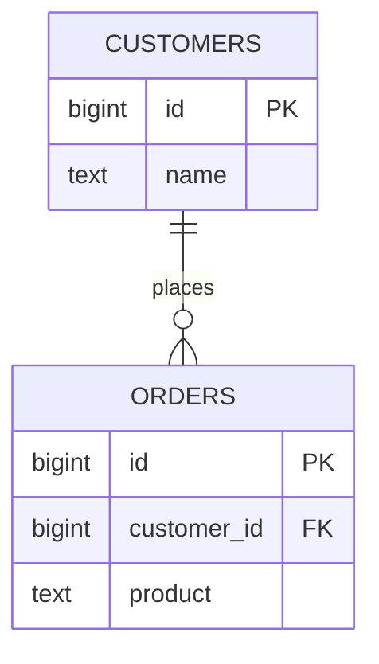
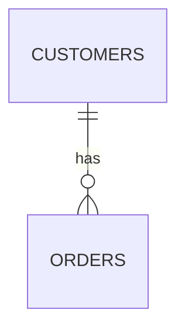
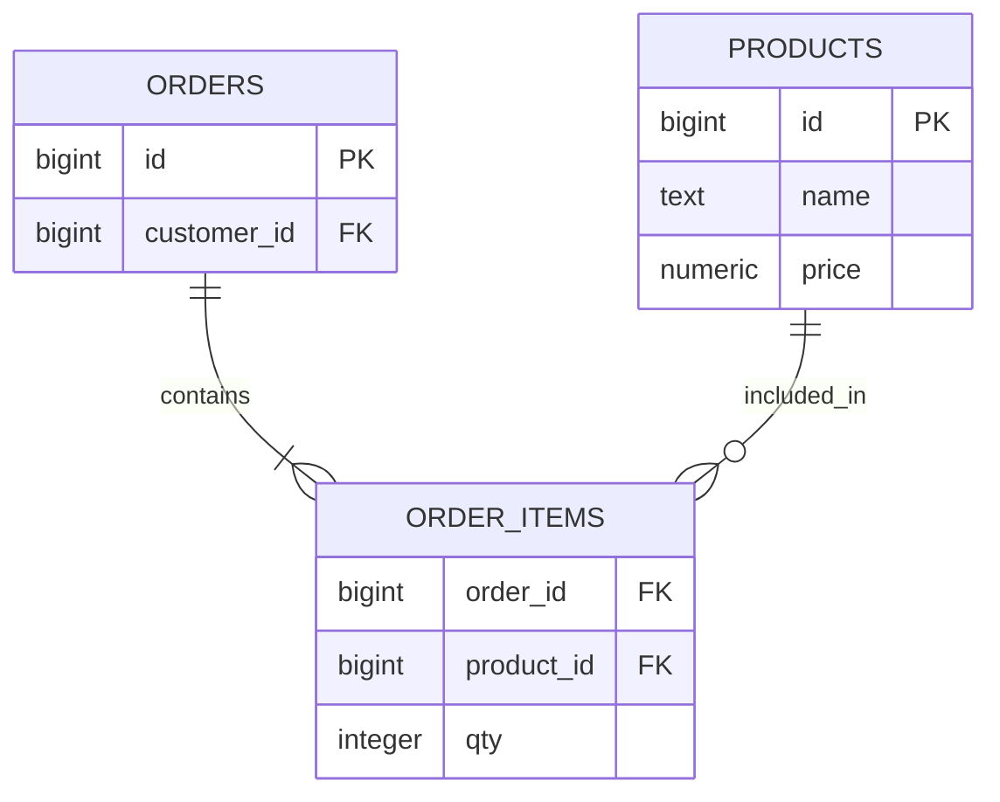
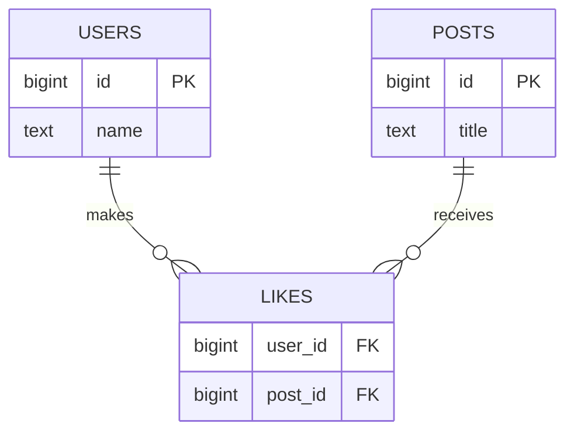
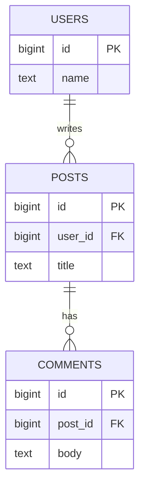
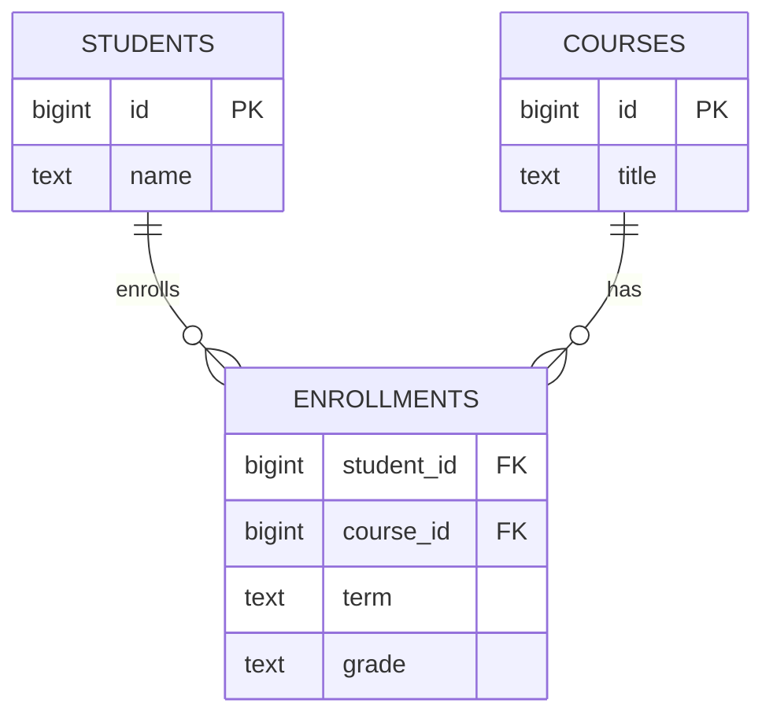
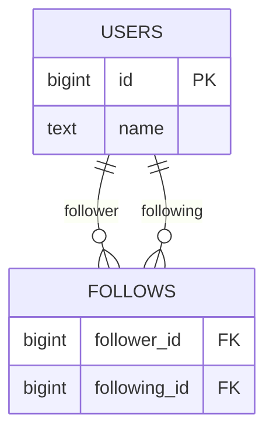

# 데이터베이스 개념

## 1. 관계형 데이터베이스

관계형 데이터베이스는 **데이터를 여러 테이블(Table)로 나누어 저장하고, 필요한 테이블끼리 연결해서 사용하는 방식**.

- 한 테이블에 모든 정보를 몰아넣지 않음
- 각 테이블은 한 종류의 데이터를 담당
- 테이블끼리는 **키(Key)** 로 연결
- 필요한 데이터는 관계를 따라 다른 테이블에서 가져옴

### 예: `customers` 테이블

| id | name | email | city |
|---:|---|---|---|
| 1 | 김민수 | minsu@shop.com | 서울 |
| 2 | 이지은 | jieun@shop.com | 부산 |
| 3 | 박하늘 | haneul@shop.com | 대구 |

- **열(Column)**: `id`, `name`, `email`, `city`처럼 어떤 정보를 저장할지 정함
- **행(Row)**: 고객 한 명처럼 데이터 한 건
- **셀(Cell)**: 행과 열이 만나는 실제 값
- `id`: 이름이 같아도 고객을 구분할 수 있는 식별값

---

## 2. 표·행·열 용어 정리

같은 구조를 분야마다 다른 용어로 부름.

| 개념 | 관계형 이론 | SQL·실무 | 파이썬으로 비유 |
|---|---|---|---|
| 표 | Relation | Table | `list[dict]` |
| 행 | Tuple | Row / Record | `dict` 하나 |
| 열 | Attribute | Column / Field | `dict`의 key |
| 셀의 값 | Value | Cell value | `dict`의 value |

> ERD의 **Entity(개체)** 는 저장할 대상을 뜻하며, 실제 구현에서는 보통 테이블 하나로 만들어짐.

---

## 3. 스키마와 데이터 타입

### 데이터 타입(Data Type)

열이 **어떤 종류의 값**을 저장할지 정하는 규칙.

### 스키마(Schema)

이 교안에서는 우선 **테이블의 열 이름 + 각 열의 데이터 타입**으로 이해.

예: `customers` 스키마

```text
id          bigint        -- 고객 번호
name        text          -- 이름
email       text          -- 이메일
city        text          -- 도시
created_at  timestamptz   -- 가입 시각
```

타입을 미리 정해두면 맞지 않는 종류의 값이 들어오는 것을 막을 수 있음.

### 자주 쓰는 타입

| 타입 | 의미 | 예 |
|---|---|---|
| `text` | 길이 제한 없는 문자열 | 이름, 이메일, 주소 |
| `varchar(n)` | 최대 `n`자까지 허용하는 문자열 | 우편번호, 상품 코드 |
| `integer` | 정수 | 주문 금액, 주문 수량 |
| `bigint` | 더 큰 범위의 정수 | 큰 ID 값 등 |
| `numeric` | 소수까지 정확하게 표현하는 수 | 할인율, 환율 |
| `boolean` | 참/거짓 | 결제 완료 여부 |
| `date` | 날짜 | 생일 |
| `timestamptz` | 날짜·시각 + 시간대 | 주문 시각, 가입 시각 |

---

## 4. 제약조건(Constraint)

**잘못된 데이터가 저장되지 않도록 테이블에 붙이는 검사 규칙**.

값이 들어올 때마다 조건을 확인함.

### 예

```sql
name  text not null
email text unique not null
```

- `not null`: 값이 비어 있는 것을 막음
- `unique`: 같은 값이 반복되는 것을 막음

### 주요 제약조건

| 제약조건 | 역할 | 예 |
|---|---|---|
| `not null` | 빈 값(`NULL`) 금지 | 고객 이름은 반드시 입력 |
| `unique` | 중복 값 금지 | 이메일 중복 금지 |
| `check` | 값의 범위·조건 강제 | 주문 금액은 0 이상 |
| `default` | 값이 없으면 기본값 사용 | 주문 시각을 현재 시각으로 |
| `primary key` | 행 하나를 대표해서 구분 | 고객 `id` |
| `references` | 다른 테이블의 키를 참조 | 주문의 `customer_id` |

> `unique`만으로는 `NULL` 자체를 막지 못하므로, 반드시 값이 있어야 한다면 `not null`과 함께 사용.

예:

```sql
amount integer check (amount >= 0)
```

---

## 5. 키(Key)와 테이블 연결

### 5.1 기본키(PK, Primary Key)

**테이블에서 행 하나를 정확히 식별하는 대표 키**.

예: `customers.id`

- 중복 불가
- `NULL` 불가
- 한 테이블에는 하나의 Primary Key 제약을 둠
- 여러 열을 묶어 하나의 복합 기본키로 만들 수도 있음

### 5.2 외래키(FK, Foreign Key)

**다른 테이블의 키를 가리키도록 만든 열**.

예: `orders.customer_id` → `customers.id`



- `customers.id`: 고객을 식별하는 PK
- `orders.customer_id`: 주문이 어느 고객의 것인지 가리키는 FK

### 참조 무결성

외래키에는 실제로 존재하는 참조 대상만 넣을 수 있게 함.

예:

```text
customers에 id=99가 없음
        ↓
orders.customer_id = 99 저장 시도
        ↓
참조 대상이 없으므로 거부
```

→ 주인 없는 주문 같은 잘못된 관계를 막음.

---

## 6. 관계와 카디널리티(Cardinality)

카디널리티는 **한쪽 데이터가 반대쪽 데이터와 몇 개까지 연결될 수 있는지** 표시하는 것.

### 까마귀발 표기 핵심

| 표기 | 의미 |
|---|---|
| `||` | 반드시 하나 `(1)` |
| `o|` | 없거나 하나 `(0..1)` |
| `|{` | 하나 이상 `(1..N)` |
| `o{` | 없거나 여러 개 `(0..N)` |

핵심 기호만 기억:

```text
||   = 1
O    = 0 가능
<    = 여러 개(N)
```

### 6.1 1:N 관계

예: **고객 1명 : 주문 0개 이상**



- 고객 한 명은 주문을 여러 건 가질 수 있음
- 주문 한 건은 고객 한 명을 가리킴
- **외래키는 N쪽 테이블에 둠**

```text
customers.id  ←  orders.customer_id
     1                  N
```

### 6.2 M:N 관계

양쪽 모두 여러 개와 연결되는 관계.

예: 주문과 상품

- 한 주문에 여러 상품
- 한 상품이 여러 주문에 포함 가능

이 경우 직접 M:N으로 두지 않고 **중간표(Junction Table)** 로 나눔.



`order_items`가 관계를 연결하면서 `qty` 같은 **관계 자체의 정보**도 저장.

### 6.3 M:N 예: 게시물 좋아요

사용자와 게시물도 M:N 관계.



- 한 사용자가 여러 게시물에 좋아요 가능
- 한 게시물도 여러 사용자의 좋아요를 받을 수 있음
- `likes`가 두 테이블 사이의 중간표 역할

> 관계는 한쪽 방향으로만 해석하는 것이 아니라 양쪽에서 읽을 수 있음. 다만 실제 FK 열은 1:N의 N쪽 또는 M:N의 중간표에 위치함.

---

## 7. ERD(Entity Relationship Diagram)

데이터베이스 구조는 만든 뒤 변경 비용이 커질 수 있으므로 **테이블을 만들기 전에 ERD로 구조를 설계**.

ERD = 데이터 구조를 **상자와 선으로 표현한 설계도**.

### ERD의 3요소

| 요소 | 의미 | 예 |
|---|---|---|
| Entity(개체) | 저장할 대상 | 고객, 주문 |
| Attribute(속성) | 대상이 가진 정보 | 이름, 이메일, 금액 |
| Relationship(관계) | 대상끼리 연결되는 방식 | 고객 1명 → 주문 여러 건 |

### ERD 그리는 순서

1. **대상 찾기** → 어떤 데이터를 저장할지 결정
2. **정보 적기** → 각 대상의 속성(열) 결정
3. **선 잇기** → 어떤 대상끼리 연결되는지 결정
4. **개수 정하기** → 1:1, 1:N, M:N 등 카디널리티 표시

쇼핑몰 예:

```text
고객 · 주문
   ↓
고객: 이름, 이메일
주문: 금액, 시각
   ↓
고객 ─ 주문 연결
   ↓
고객 1 : 주문 0..N
```

---

## 8. ERD 실무 형태

### 8.1 블로그·게시판: 1:N 사슬

한 사용자가 여러 글을 작성하고, 한 글에 여러 댓글이 달리는 구조.



```text
users 1:N posts 1:N comments
```

### 8.2 수강신청: 중간표가 관계의 정보를 가짐

학생과 과목은 M:N 관계.



`term`, `grade`는 학생 자체의 정보도, 과목 자체의 정보도 아님.

→ **학생과 과목의 관계에만 존재하는 정보**이므로 중간표 `enrollments`에 저장.

### 8.3 팔로우: 같은 테이블을 다시 참조

팔로우는 사용자와 사용자 사이의 관계.



- `follower_id`: 팔로우하는 사용자
- `following_id`: 팔로우 대상 사용자
- 두 열 모두 같은 `users.id`를 참조
- 방향이 다르므로 역할이 드러나는 이름을 사용

---

## 9. 설계도에서 실제 데이터베이스로

### DBMS

ERD로 설계한 구조대로 테이블을 만들고, 데이터와 제약조건을 관리하는 프로그램.

```text
DBMS = Database Management System
     = 데이터베이스 관리 시스템
```

이 교안에서 사용할 DBMS는 **PostgreSQL**.

실습 환경은 **Supabase**를 사용하고, 이후 ERD를 SQL의 `CREATE TABLE`로 옮기는 흐름.

```text
ERD 설계
   ↓
테이블·열 결정
   ↓
타입·제약조건 결정
   ↓
PK·FK 및 관계 설정
   ↓
CREATE TABLE 작성
```

---

## 10. 핵심 총정리

| 단계 | 정하는 것 | 핵심 |
|---|---|---|
| 표·행·열 | 무엇을 저장할지 | 한 종류를 한 테이블에, 한 건을 한 행에 |
| 타입 | 열이 담을 값의 종류 | `text`, `integer`, `numeric`, `boolean`, `date`, `timestamptz` 등 |
| 제약 | 허용할 값의 범위 | `not null`, `unique`, `check`, `default` |
| PK | 행 식별 | 중복·NULL 불가 |
| FK | 다른 테이블 참조 | `references`로 연결, 참조 무결성 유지 |
| 1:N | 한쪽 1, 반대쪽 여러 개 | FK는 **N쪽**에 둠 |
| M:N | 양쪽 모두 여러 개 | **중간표**로 풀어냄 |
| ERD | 전체 구조 설계 | Entity · Attribute · Relationship + Cardinality |

### 한 줄 흐름

```text
저장 대상 찾기
→ 테이블과 열 정하기
→ 데이터 타입 정하기
→ 제약조건 정하기
→ PK/FK 연결하기
→ 관계의 개수 정하기
→ ERD로 확인하기
→ SQL로 구현하기
```

### 꼭 기억할 것

- **PK**: 내 테이블의 행을 식별
- **FK**: 다른 테이블의 행을 참조
- **1:N**: FK는 N쪽
- **M:N**: 중간표 필요
- **ERD**: 테이블을 만들기 전 데이터 구조를 검토하는 설계도
