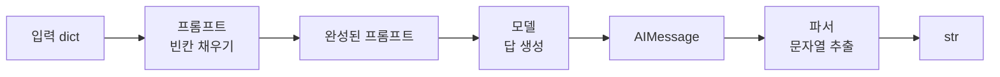

# LangChain 기본 구조

## 0. 전체 흐름

LangChain의 핵심은 **모델 호출에 필요한 부품을 표준화하고, 부품을 파이프처럼 연결하는 것**.

```text
모델 연결
  ↓
메시지 구성
  ↓
프롬프트 템플릿
  ↓
모델 호출
  ↓
출력 파싱
  ↓
LCEL 체인
  ↓
batch / 다단계 체인
```

### 핵심 데이터 흐름

```text
입력 dict
  → ChatPromptTemplate
  → 완성된 프롬프트(ChatPromptValue)
  → Chat Model
  → AIMessage
  → StrOutputParser
  → 문자열(str)
```

> 임베디드 이미지의 핵심도 같은 구조.  
> **프롬프트 → 모델 → 파서**의 왼쪽 출력이 오른쪽 입력으로 전달되고, 세 부품을 연결한 전체도 하나의 Runnable 체인으로 취급.



---

## 1. 모델 연결

직접 API를 다루면 공급자마다 호출 방식이 달라짐.  
LangChain은 모델을 비슷한 인터페이스로 감싸 `invoke()` 등으로 호출하게 함.

### OpenAI

```python
from langchain_openai import ChatOpenAI

# temperature=0: 답변의 무작위성을 낮춰 비교적 일정하게 생성
model = ChatOpenAI(
    model="gpt-4o-mini",
    temperature=0,
)
```

### Gemini

```python
from langchain_google_genai import ChatGoogleGenerativeAI

model = ChatGoogleGenerativeAI(
    model="gemini-2.5-flash"
)
```

> `temperature=0`은 변동성을 낮추는 설정이지, 모든 호출의 결과가 완전히 동일하다는 보장은 아님.

---

## 2. 모델 호출과 메시지

### 2.1 문자열 하나로 바로 호출

```python
reply = model.invoke(
    "강아지 방석을 처음 고르는 사람에게 확인할 점 두 가지를 짧게 알려줘."
)

print("응답 부품 종류:", type(reply).__name__)
print("응답 텍스트:", reply.text)
```

**결과 예시**

```text
응답 부품 종류: AIMessage
응답 텍스트:
1. 사이즈: 강아지가 편하게 누울 수 있는 크기인지 확인
2. 재질: 내구성·세탁 가능 여부와 피부에 안전한 소재인지 확인
```

핵심:
- `model.invoke(...)`의 반환값은 보통 `AIMessage`
- 사람이 읽을 텍스트는 `reply.text`로 추출 가능

### 2.2 역할을 나눈 메시지

```python
from langchain_core.messages import HumanMessage, SystemMessage

messages = [
    SystemMessage(
        "너는 반려동물 용품 온라인숍의 친절한 상담원이다. "
        "존댓말로 간결하게 답한다."
    ),
    HumanMessage("요즘 자꾸 밥을 남기는데 어떻게 하죠?"),
]

reply = model.invoke(messages)
print(reply.text)
```

**결과 예시**

```text
사료의 종류와 급여량, 식사 환경을 먼저 확인하고,
지속적으로 식사를 거부하면 건강 문제 가능성도 확인하는 것이 좋습니다.
```

### 메시지 역할

| 메시지 | 역할 |
|---|---|
| `SystemMessage` | 모델의 역할·규칙·말투 지정 |
| `HumanMessage` | 사용자의 질문·요청 전달 |
| `AIMessage` | 모델이 반환하는 응답 객체 |

---

## 3. 이미지까지 넣는 멀티모달 메시지

이미지도 메시지의 `content` 안에 **텍스트 블록 + 이미지 블록** 형태로 전달 가능.

### 3.1 로컬 이미지 → base64

```python
import base64


def image_to_base64(path):
    """로컬 이미지 파일을 base64 문자열로 변환."""
    with open(path, "rb") as f:
        return base64.b64encode(f.read()).decode("utf-8")


bed_b64 = image_to_base64("data/images/pet_bed.jpg")
bed_data_url = f"data:image/jpeg;base64,{bed_b64}"

print("앞부분:", bed_data_url[:40], "...")
print("전체 길이:", len(bed_data_url), "자")
```

**결과 예시**

```text
앞부분: data:image/jpeg;base64,/9j/4AAQSkZJRgABA ...
전체 길이: 84651 자
```

### 3.2 OpenAI 형식: `image_url`

```python
photo_reply = model.invoke([
    SystemMessage("너는 반려동물 용품 홍보 문구를 쓰는 카피라이터다."),
    HumanMessage(content=[
        {
            "type": "text",
            "text": "이 상품 사진을 보고 홍보 문구를 한 문장으로 써줘. "
                    "사진에서 보이는 특징을 근거로 들어줘."
        },
        {
            "type": "image_url",
            "image_url": {"url": bed_data_url}
        },
    ]),
])

print(photo_reply.text)
```

**결과 예시**

```text
"부드럽고 푹신한 원형 디자인과 차분한 그레이 색상이 돋보이는
반려동물 침대로 편안한 휴식 공간을 만들어 주세요!"
```

### 3.3 LangChain 표준 이미지 블록

공급자에 덜 종속적인 표준 형식 사용 가능.

```python
photo_reply = model.invoke([
    SystemMessage("너는 반려동물 용품 홍보 문구를 쓰는 카피라이터다."),
    HumanMessage(content=[
        {
            "type": "text",
            "text": "이 상품 사진을 보고 홍보 문구를 한 문장으로 써줘."
        },
        {
            "type": "image",
            "base64": bed_b64,
            "mime_type": "image/jpeg",
        },
    ]),
])
```

### MIME type

base64 문자열만으로는 원본 파일 형식을 알 수 없으므로 `mime_type`으로 형식을 표시.

| 확장자 | MIME type |
|---|---|
| `.jpg`, `.jpeg` | `image/jpeg` |
| `.png` | `image/png` |
| `.gif` | `image/gif` |
| `.webp` | `image/webp` |
| `.pdf` | `application/pdf` |

---

## 4. 프롬프트 템플릿

반복되는 프롬프트에서 **바뀌는 값만 `{변수}`로 비워 두고 재사용**.

### 4.1 `ChatPromptTemplate.from_messages()`

```python
from langchain_core.prompts import ChatPromptTemplate

promo_prompt = ChatPromptTemplate.from_messages([
    (
        "system",
        "너는 반려동물 용품 홍보 문구를 쓰는 카피라이터다."
    ),
    (
        "human",
        "다음 상품의 홍보 문구를 한 문장으로 써줘. "
        "이름: {name}, 특징: {keywords}"
    ),
])
```

### 4.2 값만 채워 확인: `format_messages()`

모델 호출 없이 완성된 메시지만 확인.

```python
filled = promo_prompt.format_messages(
    name="포근 강아지 방석",
    keywords="메모리폼, 미끄럼 방지 바닥, 세탁 가능",
)

for message in filled:
    print(type(message).__name__, ":", message.content)
```

**결과**

```text
SystemMessage : 너는 반려동물 용품 홍보 문구를 쓰는 카피라이터다.
HumanMessage : 다음 상품의 홍보 문구를 한 문장으로 써줘.
이름: 포근 강아지 방석, 특징: 메모리폼, 미끄럼 방지 바닥, 세탁 가능
```

### 4.3 프롬프트 객체 생성: `prompt.invoke()`

```python
filled_prompt = promo_prompt.invoke({
    "name": "포근 강아지 방석",
    "keywords": "메모리폼, 미끄럼 방지 바닥, 세탁 가능",
})

print(model.invoke(filled_prompt).text)
```

**결과 예시**

```text
"포근 강아지 방석은 메모리폼으로 편안함을 제공하고,
미끄럼 방지 바닥과 세탁 가능한 구조로 실용성까지 갖췄습니다."
```

### 구분

```text
format_messages(...)  → 완성된 메시지 리스트 확인
prompt.invoke({...})   → ChatPromptValue 생성
model.invoke(...)      → 실제 모델 호출
```

> 템플릿 변수명과 입력 딕셔너리의 키 이름은 일치해야 함.

### 한 줄 템플릿

System/Human 역할 구분이 필요 없는 간단한 경우:

```python
prompt = ChatPromptTemplate.from_template(
    "{name}의 장점을 한 줄 상품평으로 써줘."
)
```

---

## 5. 프롬프트를 YAML 파일로 관리

프롬프트가 길어지면 코드에서 분리해 별도 파일로 관리 가능.

### `prompts.yml`

```yaml
promo_writer:
  description: 상품 이름과 특징을 받아 홍보 문구 한 문장을 쓴다
  system: |
    너는 반려동물 용품 홍보 문구를 쓰는 카피라이터다.
    과장하지 않고, 주어진 특징에 근거해서만 쓴다.
  human: |
    다음 상품의 홍보 문구를 한 문장으로 써줘.
    이름: {name}
    특징: {keywords}

care_guide:
  description: 상품 이름을 받아 관리 방법을 알려 준다
  system: |
    너는 반려동물 용품 상담원이다. 존댓말로 간결하게 답한다.
  human: |
    {name}를 오래 쓰려면 어떻게 관리해야 하는지 두 가지만 알려줘.
```

### YAML → 딕셔너리

```python
import yaml

with open("data/prompts.yml", encoding="utf-8") as f:
    PROMPTS = yaml.safe_load(f)

print("파일에 든 프롬프트:", list(PROMPTS))
```

**결과**

```text
파일에 든 프롬프트: ['promo_writer', 'care_guide']
```

### 이름으로 템플릿 생성

```python
def load_prompt(name):
    spec = PROMPTS[name]

    return ChatPromptTemplate.from_messages([
        ("system", spec["system"]),
        ("human", spec["human"]),
    ])


file_prompt = load_prompt("promo_writer")
print(sorted(file_prompt.input_variables))
```

**결과**

```text
['keywords', 'name']
```

```python
filled_file = file_prompt.invoke({
    "name": "포근 강아지 방석",
    "keywords": "메모리폼, 미끄럼 방지 바닥, 세탁 가능",
})

print(model.invoke(filled_file).text)
```

**결과 예시**

```text
"포근 강아지 방석은 메모리폼으로 편안함을 제공하며,
미끄럼 방지 바닥과 세탁 가능한 구조로 실용성을 더했습니다."
```

핵심:

```text
코드에 프롬프트 직접 작성
        ↓
YAML 파일에 프롬프트 저장
        ↓
yaml.safe_load()
        ↓
ChatPromptTemplate.from_messages()
```

---

## 6. 출력 파서

모델의 응답은 `AIMessage`.  
뒤 단계에서 문자열만 필요하면 `StrOutputParser`로 텍스트를 추출.

```python
from langchain_core.output_parsers import StrOutputParser

parser = StrOutputParser()

ai_message = model.invoke("포근 강아지 방석, 한마디로 홍보해줘.")
text_only = parser.invoke(ai_message)

print("파서 통과 전:", type(ai_message).__name__)
print("파서 통과 후:", type(text_only).__name__)
print(text_only)
```

**결과 개념**

```text
파서 통과 전: AIMessage
파서 통과 후: str
"포근한 강아지 방석으로 편안한 휴식을 선물하세요!"
```

```text
AIMessage
   ↓ StrOutputParser
문자열
```

> 버전에 따라 `AIMessage.text`가 `TextAccessor`로 표시될 수 있음.  
> `TextAccessor`는 문자열처럼 동작하는 `str` 하위 타입. `StrOutputParser`의 목적은 최종 텍스트를 문자열 형태로 다루게 만드는 것.

---

## 7. LCEL 체인: `|`로 부품 연결

**프롬프트 + 모델 + 파서**를 하나의 파이프라인으로 결합.

```python
promo_chain = promo_prompt | model | parser
```

### 데이터 흐름

```text
{name, keywords}
      ↓
promo_prompt
      ↓
완성된 프롬프트
      ↓
model
      ↓
AIMessage
      ↓
parser
      ↓
문자열
```

체인을 구성하는 각 부품은 `Runnable`.  
연결된 체인 자체도 다시 하나의 `Runnable`로 사용 가능.

### `invoke()` 한 번으로 전체 실행

```python
result = promo_chain.invoke({
    "name": "포근 강아지 방석",
    "keywords": "메모리폼, 미끄럼 방지 바닥, 세탁 가능",
})

print(type(result).__name__)
print(result)
```

**결과 예시**

```text
str
"포근 강아지 방석으로 편안하고 안전한 휴식 공간을 만들어 주세요.
메모리폼, 미끄럼 방지 바닥, 세탁 가능한 구조까지 갖췄습니다!"
```

### 핵심

```python
# 따로 실행
prompt_value = promo_prompt.invoke(data)
ai_message = model.invoke(prompt_value)
result = parser.invoke(ai_message)

# 체인으로 실행
result = (promo_prompt | model | parser).invoke(data)
```

---

## 8. `batch()`: 여러 입력 처리

입력이 여러 개면 같은 체인을 반복 호출하기보다 `batch()` 사용 가능.

```python
import pandas as pd

products_df = pd.read_csv("data/pet_products.csv")

products = [
    {
        "name": row["name"],
        "keywords": row["keywords"],
    }
    for _, row in products_df.head(3).iterrows()
]

results = promo_chain.batch(products)

for product, result in zip(products, results):
    print(product["name"], "→", result)
```

**결과 예시**

```text
포근 강아지 방석 → 메모리폼과 미끄럼 방지 바닥으로 편안하고 안전한 휴식을 제공하는 세탁 가능한 방석!
튼튼 고양이 스크래처 → 고밀도 골판지와 캣닢, 교체형 구조로 오래 즐기는 스크래처!
산책 자동 리드줄 → 5m 길이와 원터치 잠금, 야간 반사띠를 갖춘 편리한 자동 리드줄!
```

### 입력 형태가 중요

프롬프트 변수와 딕셔너리 키가 같아야 함.

```python
# 프롬프트
"이름: {name}, 특징: {keywords}"

# 입력
{
    "name": "포근 강아지 방석",
    "keywords": "메모리폼, 미끄럼 방지 바닥, 세탁 가능",
}
```

---

## 9. 체인 연결: 앞 결과를 다음 단계 입력으로

한 번 생성한 결과를 다른 체인의 입력으로 전달해 다단계 처리 가능.

### 1단계: 홍보 문구 초안

```python
draft = promo_chain.invoke({
    "name": "포근 강아지 방석",
    "keywords": "메모리폼, 미끄럼 방지 바닥, 세탁 가능",
})
```

### 2단계: 초안을 더 짧게 수정

```python
shorten_prompt = ChatPromptTemplate.from_messages([
    (
        "system",
        "너는 긴 문구를 짧고 강한 한 줄 광고로 다듬는 편집자다."
    ),
    (
        "human",
        "다음 문구를 12자 안팎의 한 줄 광고로 줄여줘:\n{draft}"
    ),
])

shorten_chain = shorten_prompt | model | parser

final = shorten_chain.invoke({"draft": draft})
```

**결과 예시**

```text
[1단계 초안]
"포근 강아지 방석으로 편안하고 안전한 휴식 공간을 만들어 주세요.
메모리폼과 미끄럼 방지 바닥, 세탁 가능한 구조까지 갖췄습니다!"

[2단계 한 줄]
"포근한 방석, 편안한 휴식!"
```

### 흐름

```text
상품 정보
   ↓
promo_chain
   ↓
초안 문자열
   ↓ {draft}
shorten_chain
   ↓
최종 한 줄 문구
```

핵심은 **앞 체인의 출력 형식과 뒤 체인이 요구하는 입력 변수를 맞추는 것**.

---

## 10. 최종 기술 스택 정리

| 단계 | 목적 | 핵심 코드 |
|---|---|---|
| 1. 모델 래퍼 | 공급자 모델 연결 | `ChatOpenAI(...)`, `ChatGoogleGenerativeAI(...)` |
| 2. 메시지 | 역할·질문 구성 | `SystemMessage`, `HumanMessage` |
| 3. 멀티모달 | 텍스트 + 이미지 전달 | `HumanMessage(content=[...])` |
| 4. 프롬프트 템플릿 | 변수 기반 재사용 | `ChatPromptTemplate.from_messages(...)` |
| 5. 프롬프트 파일 | 프롬프트를 코드 밖에서 관리 | `yaml.safe_load()` → `from_messages()` |
| 6. 출력 파서 | `AIMessage` → 문자열 | `StrOutputParser()` |
| 7. LCEL | 부품을 파이프라인으로 연결 | `prompt \| model \| parser` |
| 8. 단일 실행 | 입력 하나 처리 | `.invoke(...)` |
| 9. 다중 실행 | 입력 여러 개 처리 | `.batch([...])` |
| 10. 다단계 처리 | 앞 결과를 다음 체인에 전달 | `chain2.invoke({"draft": result})` |

---

## 11. 핵심만 다시 보기

```python
# 1. 모델
model = ChatOpenAI(model="gpt-4o-mini", temperature=0)

# 2. 프롬프트
prompt = ChatPromptTemplate.from_messages([
    ("system", "너는 반려동물 용품 카피라이터다."),
    ("human", "{name}의 특징 {keywords}를 바탕으로 한 줄 홍보 문구를 써줘."),
])

# 3. 파서
parser = StrOutputParser()

# 4. 체인
chain = prompt | model | parser

# 5. 실행
result = chain.invoke({
    "name": "포근 강아지 방석",
    "keywords": "메모리폼, 미끄럼 방지 바닥, 세탁 가능",
})

print(result)
```

**결과 예시**

```text
"메모리폼의 편안함과 미끄럼 방지, 세탁 편의성을 모두 갖춘 포근 강아지 방석!"
```

### 한 문장 요약

> **LangChain = 모델·메시지·프롬프트·출력 파서를 표준 부품으로 만들고, LCEL(`|`)로 연결해 재사용 가능한 AI 처리 흐름을 만드는 도구.**

---

## 12. 점검·수정 반영 사항

- 반복되던 `포근 강아지 방석` 예시는 하나의 공통 흐름으로 통합.
- `prompt.invoke()`와 `model.invoke()`의 역할을 분리해 혼동 방지.
- 이미지 예시에서 정의되지 않았던 `bed_b64`를 명시적으로 생성하도록 수정.
- MIME type의 `application/pdf` 오탈자 수정.
- LangChain 표준 이미지 base64 블록을 현재 형태인 `base64` + `mime_type` 구조로 정리.
- `StrOutputParser`의 최종 목적을 `AIMessage → 문자열`로 명확화.
- 원문 실행 결과의 `TextAccessor`는 버전 차이로 발생 가능한 문자열 하위 타입임을 별도 표기.
- `invoke`, `batch`, 다단계 체인을 **단일 처리 → 다중 처리 → 후처리 연결** 순서로 재배치.
- 임베디드 체인 그림은 Markdown에서 유지 가능한 Mermaid 흐름도로 재구성.
