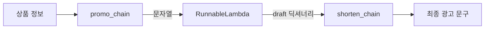
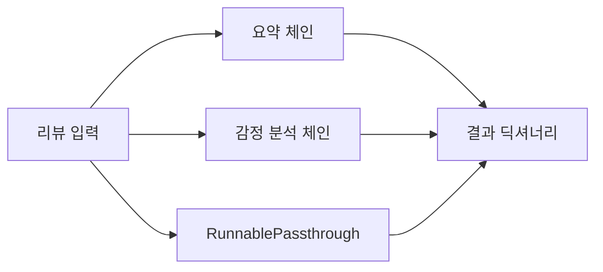
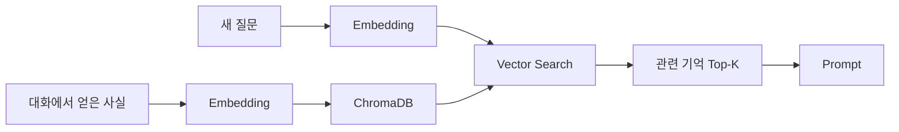
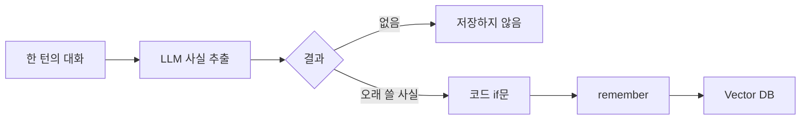
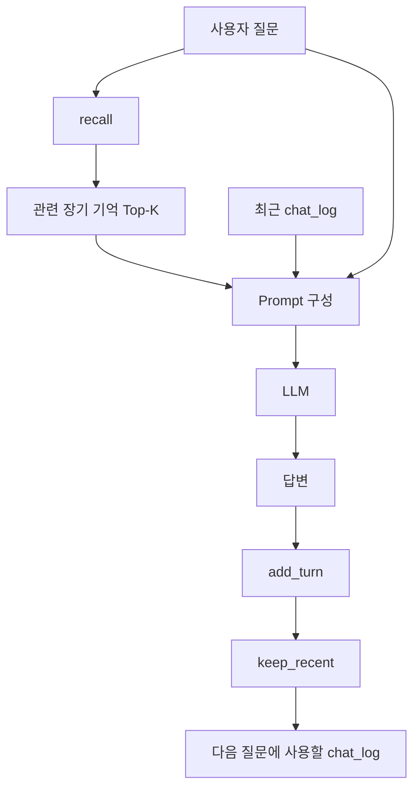
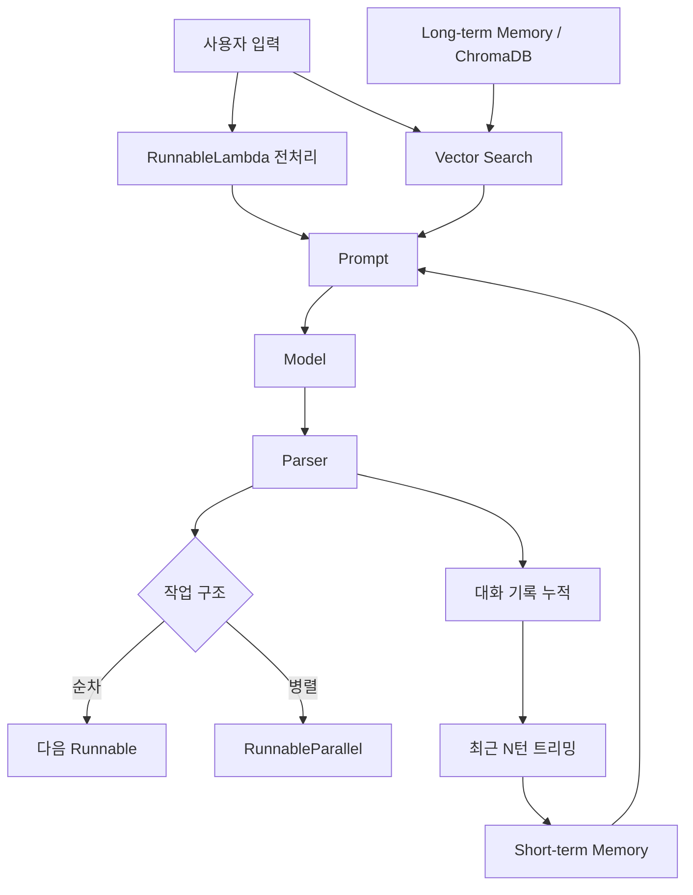

# LangChain Runnable · Memory · 대화 워크플로우

> 핵심 흐름: **기본 체인 → Runnable 규약 → 함수 연결 → 병렬 처리 → 단기 기억 → 기록 관리 → 장기 기억 → 자동 기억 판단 → 멀티턴 상담 워크플로우**

---

# 1. 전체 구조

앞 단계의 기본 구조는 다음과 같음.

```text
프롬프트 → 모델 → 출력 파서
```

LangChain에서는 각 요소를 **Runnable**이라는 공통 규약으로 다룸.


이번 단계의 핵심은 단순한 LLM 호출에서 끝나지 않고, **여러 부품을 연결해 하나의 대화 시스템으로 확장하는 것**.

---

# 2. 기본 준비

```python
from langchain_core.output_parsers import StrOutputParser
from langchain_core.prompts import ChatPromptTemplate
from langchain_openai import ChatOpenAI

model = ChatOpenAI(
    model='gpt-4o-mini',
    temperature=0,
)

parser = StrOutputParser()
```

- `model`: LLM 호출 부품
- `parser`: 모델 응답에서 문자열만 추출
- `temperature=0`: 응답 변동성을 줄이는 설정

기본 체인:

```python
chat_prompt = ChatPromptTemplate.from_messages([
    ('system', '너는 반려동물 용품 상담원이다. 존댓말로 간결하게 답한다.'),
    ('human', '{input}'),
])

simple_chain = chat_prompt | model | parser
```

```text
입력 딕셔너리
→ Prompt
→ Model
→ Parser
→ 문자열 결과
```

---

# 3. Runnable — 모든 부품의 공통 실행 규약

## 핵심

모델·프롬프트·파서·체인 모두 같은 실행 방식을 가짐.

| 실행 | 의미 | 입력/출력 |
|---|---|---|
| `invoke()` | 하나 처리 | 1개 → 1개 |
| `batch()` | 여러 입력 처리 | 리스트 → 리스트 |
| `stream()` | 결과를 조각으로 받음 | 1개 → 여러 chunk |

체인 자체도 하나의 Runnable이므로 다시 다른 체인의 부품으로 사용 가능.

---

## 3.1 `invoke()` — 하나씩 실행

```python
one = simple_chain.invoke({
    'input': '고양이 스크래처는 어떤 재질이 좋아? 한 문장으로 답해줘.'
})

print(type(one).__name__)
print(one)
```

**결과 형태**

```text
str 계열 문자열
모델이 생성한 상담 답변
```

파서가 마지막에 있으므로 별도로 `.text`를 꺼낼 필요 없음.

---

## 3.2 `batch()` — 여러 입력 처리

```python
questions = [
    {'input': '강아지 방석은 얼마나 자주 세탁해? 한 문장으로.'},
    {'input': '산책 리드줄 길이는 어느 정도가 좋아? 한 문장으로.'},
]

answers = simple_chain.batch(questions)
```

```text
입력 리스트
→ 같은 체인으로 여러 작업 처리
→ 결과 리스트
```

입력 순서와 결과 순서가 대응됨.

---

## 3.3 `stream()` — 결과를 조각으로 받기

```python
pieces = []

for chunk in simple_chain.stream({
    'input': '반려견과 첫 산책을 나갈 때 준비물을 세 가지만 알려줘.'
}):
    print(chunk, end='')
    pieces.append(chunk)

full_text = ''.join(pieces)
```

```text
모델 생성 시작
→ chunk
→ chunk
→ chunk
→ ...
→ 전체 문자열 완성
```

- 챗봇의 타이핑 효과 구현에 사용
- chunk 개수는 매번 달라질 수 있음
- 최종 처리는 보통 `''.join(...)`으로 합친 문자열 기준

---

# 4. RunnableLambda — 파이썬 함수를 체인 부품으로

일반 파이썬 함수를 LangChain 체인 중간에 넣고 싶을 때 사용.

```python
from langchain_core.runnables import RunnableLambda
```

## 4.1 입력 전처리

```python
def clean_text(text):
    return ' '.join(text.split())

clean_step = RunnableLambda(clean_text)

print(clean_step.invoke('  강아지   방석  추천 '))
```

**결과**

```text
강아지 방석 추천
```

함수를 `RunnableLambda()`로 감싸면 `invoke`, `batch`, 파이프 연결이 가능한 Runnable이 됨.

---

## 4.2 전처리 함수 + LLM 체인

프롬프트는 `{input}` 딕셔너리를 요구하므로 문자열을 해당 형태로 변환.

```python
clean_chain = (
    RunnableLambda(lambda q: {'input': clean_text(q)})
    | chat_prompt
    | model
    | parser
)

print(clean_chain.invoke('  캣타워는   어떤 걸 골라야  하나요? '))
```

```text
사용자 문자열
→ 공백 정리
→ {'input': 정리된 문자열}
→ Prompt
→ Model
→ Parser
```

---

# 5. RunnableLambda로 체인과 체인 연결

## 문제

앞 체인과 뒤 체인의 **입출력 형태가 다르면 바로 연결할 수 없음**.

```text
promo_chain 출력
= 문자열

shorten_chain 입력
= {'draft': 문자열}
```

따라서 중간에 **형태 변환용 다리**가 필요.

```python
to_draft = RunnableLambda(
    lambda text: {'draft': text}
)
```

**결과**

```python
to_draft.invoke('테스트 문구')
```

```text
{'draft': '테스트 문구'}
```

---

## 5.1 2단 체인

```python
promo_chain = promo_prompt | model | parser
shorten_chain = shorten_prompt | model | parser

two_step_chain = promo_chain | to_draft | shorten_chain
```



실행:

```python
result = two_step_chain.invoke({
    'name': '포근 강아지 방석',
    'keywords': '메모리폼, 미끄럼 방지 바닥, 세탁 가능',
})
```

핵심:

```text
기존 방식
앞 체인 invoke → 변수 저장 → 뒤 체인 invoke

Runnable 방식
앞 체인 | 변환 부품 | 뒤 체인
→ invoke 한 번
```

합쳐진 체인도 Runnable이므로 `batch()` 사용 가능.

> `stream()`을 사용할 때 중간 변환 부품이 앞 단계의 **전체 문자열**을 필요로 하면, 그 단계가 끝날 때까지 기다린 뒤 다음 단계에서 스트리밍이 시작될 수 있음.

---

# 6. RunnableParallel — 같은 입력으로 여러 작업 병렬 처리

하나의 입력을 여러 체인에 동시에 전달하고 결과를 하나의 딕셔너리로 모을 때 사용.

```python
from langchain_core.runnables import (
    RunnableParallel,
    RunnablePassthrough,
)
```

## 예시 — 리뷰 요약 + 감정 분석 + 원본 보존

```python
summary_chain = (
    ChatPromptTemplate.from_messages([
        ('human', '다음 리뷰를 한 문장으로 요약해줘:\n{input}')
    ])
    | model
    | parser
)

sentiment_chain = (
    ChatPromptTemplate.from_messages([
        ('human', '다음 리뷰의 감정을 긍정/부정/중립 중 하나로만 답해줘:\n{input}')
    ])
    | model
    | parser
)
```

병렬 부품:

```python
analyze = RunnableParallel(
    summary=summary_chain,
    sentiment=sentiment_chain,
    original=RunnablePassthrough(),
)
```

실행:

```python
result = analyze.invoke(review)
```

**결과 형태**

```python
{
    'summary': '요약 결과',
    'sentiment': '긍정/부정/중립',
    'original': '원본 리뷰',
}
```



### `RunnablePassthrough`

입력을 수정하지 않고 그대로 전달하는 부품.

```text
입력 → 그대로 출력
```

원본 데이터와 가공 결과를 같이 남길 때 유용.

---

# 7. 단기 기억 — MessagesPlaceholder

## 모델은 호출 사이의 대화를 자동으로 기억하지 않음

```python
model.invoke('우리 강아지 이름은 초코야. 소형견이고 두 살이야.')
model.invoke('초코한테 맞는 방석을 추천해줘.')
```

두 호출은 서로 독립적이므로 두 번째 호출에 첫 번째 내용이 자동 전달되지 않음.

즉:

```text
기억 기능이 없음
= 이전 메시지를 다음 요청에 넣지 않았기 때문
```

---

## 7.1 대화 기록 자리 만들기

```python
from langchain_core.prompts import MessagesPlaceholder

memory_prompt = ChatPromptTemplate.from_messages([
    ('system', '너는 반려동물 용품 상담원이다. 존댓말로 간결하게 답한다.'),
    MessagesPlaceholder('history'),
    ('human', '{input}'),
])

memory_chain = memory_prompt | model | parser
```

```text
System
→ 이전 대화 history
→ 현재 질문
→ Model
```

---

## 7.2 기록 형식

```python
history = [
    ('user', '우리 강아지 이름은 초코야. 소형견이고 두 살이야.'),
    ('assistant', '네, 초코는 두 살 소형견이군요! 무엇을 도와드릴까요?'),
]
```

사용:

```python
answer = memory_chain.invoke({
    'history': history,
    'input': '초코한테 맞는 방석을 추천해줘.',
})
```

핵심:

> 모델이 스스로 기억하는 것이 아니라 **이전 대화를 매 호출마다 다시 넣어 주는 것**.

---

# 8. 기록 관리 — 누적과 트리밍

대화를 계속 통째로 넣으면 프롬프트가 무한히 길어짐.

따라서:

```text
대화 발생
→ 기록 누적
→ 최근 N턴만 유지
```

---

## 8.1 한 턴 추가

한 턴 = 사용자 1줄 + 모델 1줄.

```python
def add_turn(history, user_text, ai_text):
    return history + [
        ('user', user_text),
        ('assistant', ai_text),
    ]
```

예:

```python
add_turn([], '안녕하세요', '안녕하세요! 무엇을 도와드릴까요?')
```

**결과**

```python
[
    ('user', '안녕하세요'),
    ('assistant', '안녕하세요! 무엇을 도와드릴까요?'),
]
```

원본 리스트를 직접 수정하지 않고 새 리스트를 반환.

---

## 8.2 최근 N턴만 남기기

```python
def keep_recent(history, n_turns):
    return history[-2 * n_turns:]
```

한 턴이 2줄이므로 최근 N턴 = 뒤에서 `2 * N`개.

예:

```python
sample = [
    ('user', 'a'),
    ('assistant', 'b'),
    ('user', 'c'),
    ('assistant', 'd'),
]

print(keep_recent(sample, 1))
```

**결과**

```python
[
    ('user', 'c'),
    ('assistant', 'd'),
]
```

### 주의 — `n_turns=0`

```python
history[-2 * 0:]
→ history[0:]
→ 전체 기록
```

0턴을 빈 기록으로 처리하려면 별도 조건 필요.

```python
def keep_recent(history, n_turns):
    if n_turns <= 0:
        return []
    return history[-2 * n_turns:]
```

---

# 9. 기억의 3단계

| 방식 | 저장 내용 | 프롬프트에 넣는 방식 | 사용 예 |
|---|---|---|---|
| 기록 없음 | 없음 | 매번 새 요청 | 요약·번역·분류·대량 생성 |
| 단기 기억 | 최근 대화 | 최근 N턴 전체 | 한 세션 상담 |
| 장기 기억 | 오래 유지되는 사실 | 관련된 사실만 검색 | 재방문 고객·개인 비서 |

판단 기준:

```text
이번 세션만 필요한가?
→ 단기 기억

다음에 다시 만나도 필요한가?
→ 장기 기억
```

---

# 10. 장기 기억 — 벡터 저장소 사용

단기 기억을 트리밍하면 오래된 내용은 사라짐.

계속 필요한 사실은 별도로 저장하고, 질문할 때 **관련된 것만 검색**해서 프롬프트에 추가.



기술 스택:

```text
문장
→ SentenceTransformer
→ Embedding Vector
→ ChromaDB
→ Cosine 거리 검색
```

---

## 10.1 저장소 준비

```python
from pathlib import Path

import chromadb
from sentence_transformers import SentenceTransformer

embed_model = SentenceTransformer(
    'jhgan/ko-sroberta-multitask'
)

OUT_DIR = Path('output')
OUT_DIR.mkdir(parents=True, exist_ok=True)

chroma = chromadb.PersistentClient(
    path=str(OUT_DIR / 'chroma_memory')
)

memory_box = chroma.get_or_create_collection(
    'long_term',
    metadata={'hnsw:space': 'cosine'},
)
```

---

## 10.2 `remember()` — 사실 저장

```python
def remember(fact):
    new_id = f'mem{memory_box.count()}'

    vector = embed_model.encode(
        [fact],
        normalize_embeddings=True,
    )

    memory_box.add(
        ids=[new_id],
        documents=[fact],
        embeddings=vector.tolist(),
    )

    return new_id
```

예시로 저장하는 사실:

```text
우리 강아지 이름은 초코이고 두 살 소형견이다.
초코는 닭고기 알레르기가 있어 닭고기 간식은 피해야 한다.
배송은 부재 시 경비실에 맡겨 달라고 요청했다.
```

---

## 10.3 `recall()` — 관련 기억 검색

```python
def recall(question, k=2):
    q_vec = embed_model.encode(
        [question],
        normalize_embeddings=True,
    )

    res = memory_box.query(
        query_embeddings=q_vec.tolist(),
        n_results=k,
    )

    return list(zip(
        res['documents'][0],
        res['distances'][0],
    ))
```

거리 해석:

```text
cosine distance
0에 가까울수록 의미가 가까움
```

예:

```text
질문: 초코한테 줄 간식 하나 추천해줘.
→ 알레르기 관련 기억 우선 검색

질문: 택배는 어디에 두고 가면 되나요?
→ 경비실 배송 관련 기억 우선 검색
```

장기 기억은 모든 사실을 프롬프트에 넣는 것이 아니라 **질문과 가까운 사실만 Top-K로 선택**하는 구조.

---

# 11. 무엇을 장기 기억에 저장할 것인가

핵심 기준:

> **다음에 다시 만나도 참인가?**

### 저장 대상

```text
알레르기
취향
사는 곳
배송 조건
예산
구독 등급
오래 유지되는 사용자 속성
```

### 저장하지 않을 대상

```text
일회성 질문
현재 영업시간
이미 지나간 주문 상태
단순 인사·잡담
```

장기 기억은 데이터가 실제로 저장되므로 민감정보 관리와 삭제 기능도 고려해야 함.

---

# 12. 자동 기억 판단

매 대화마다 사람이 직접 `remember()`를 호출하는 대신, LLM에게 **오래 남길 사실이 있는지 추출**하게 만들 수 있음.

단, 모델은 판단 신호만 만들고 **최종 저장 여부는 코드가 결정**.

---

## 12.1 사실 추출 체인

```python
extract_prompt = ChatPromptTemplate.from_messages([
    (
        'system',
        "너는 상담 대화에서 '다음에 다시 만나도 참인 사실'만 골라 적는 정리원이다.\n"
        '- 오래 유지되는 사실이 있으면 완전한 한 문장으로 적는다.\n'
        "- 일회성 내용이면 정확히 '없음'이라고 적는다.\n"
        "- 문장 하나 또는 '없음' 외에는 아무것도 쓰지 않는다."
    ),
    ('human', '손님: {user}\n상담원: {reply}'),
])

extract_chain = extract_prompt | model | parser
```

---

## 12.2 저장 여부를 코드에서 결정

```python
def maybe_remember(user_text, reply):
    fact = extract_chain.invoke({
        'user': user_text,
        'reply': reply,
    }).strip()

    if fact.startswith('없음'):
        return None

    remember(fact)
    return fact
```



핵심 분리:

```text
모델
→ 무엇이 기억 후보인지 판단

코드
→ 실제 저장 여부 결정
```

민감정보 차단·저장 정책 등을 `if` 지점에 추가 가능.

---

# 13. 최종 상담 워크플로우

이제 다음 요소를 하나로 결합.

```text
역할 프롬프트
+ 장기 기억
+ 단기 대화 기록
+ 현재 질문
+ LLM 체인
+ 기록 누적/트리밍
```

---

## 13.1 상담 프롬프트

```python
counsel_prompt = ChatPromptTemplate.from_messages([
    (
        'system',
        '너는 반려동물 용품 온라인숍의 상담원이다. '
        '존댓말로 친절하고 간결하게 답한다.\n'
        '[기억해 둔 사실]\n{memory}'
    ),
    MessagesPlaceholder('history'),
    ('human', '{input}'),
])

counsel_chain = counsel_prompt | model | parser
```

프롬프트 순서:

```text
System 역할
→ 장기 기억
→ 최근 대화
→ 현재 질문
```

---

## 13.2 `ask()` — 전체 대화 처리

```python
MAX_TURNS = 10
chat_log = []


def ask(user_text, max_turns=MAX_TURNS):
    global chat_log

    # 1. 질문과 관련된 장기 기억 검색
    facts = [
        fact
        for fact, _ in recall(user_text, k=2)
    ]

    memory_text = '\n'.join(
        f'- {fact}' for fact in facts
    )

    # 2. 장기 기억 + 단기 기록 + 질문으로 답 생성
    answer = counsel_chain.invoke({
        'memory': memory_text,
        'history': chat_log,
        'input': user_text,
    })

    # 3. 이번 대화 저장
    chat_log = add_turn(
        chat_log,
        user_text,
        answer,
    )

    # 4. 최근 N턴만 유지
    chat_log = keep_recent(
        chat_log,
        max_turns,
    )

    return answer
```

전체 흐름:



---

# 14. 단기 기억과 장기 기억의 역할 차이

예시:

```text
1턴
"우리 강아지 이름은 초코야. 소형견이고 두 살이야."

2턴
"초코한테 맞는 방석을 추천해줘."
```

→ 바로 앞 대화 내용이므로 **단기 기억**으로 처리 가능.

반면:

```text
"초코는 닭고기 알레르기가 있다."
```

이 사실이 현재 `chat_log`에는 없지만 장기 기억에 저장되어 있다면:

```text
간식 추천 질문
→ recall()
→ 닭고기 알레르기 사실 검색
→ 프롬프트에 삽입
→ 답변에 반영
```

즉:

```text
단기 기억
= 바로 앞 문맥 연결

장기 기억
= 오래된 사용자 사실 회상
```

둘은 대체 관계가 아니라 역할이 다름.

---

# 15. 멀티턴 챗봇 루프

`ask()`가 기억 처리를 담당하므로 실제 챗봇 루프는 단순하게 만들 수 있음.

```python
END_WORDS = ('종료', '그만', 'exit')


def chat():
    turn = 0

    while True:
        user_text = input('손님: ').strip()

        if user_text in END_WORDS or not user_text:
            print('상담원: 이용해 주셔서 감사합니다.')
            break

        if user_text.startswith('기억해:'):
            fact = user_text.split(':', 1)[1].strip()
            remember(fact)
            print('상담원: 기억해 두겠습니다 —', fact)
            continue

        print('상담원:', ask(user_text))
        turn += 1

        if turn >= MAX_TURNS:
            print('(최대 턴 수에 도달해 상담을 마칩니다)')
            break
```

### 루프 한 바퀴

```text
사용자 입력
→ 종료 여부 확인
→ 기억 저장 명령인지 확인
→ ask()
→ 답변
→ 다음 턴
```

`while True`에는 반드시 `break` 조건이나 최대 횟수 같은 종료 장치 필요.

> 이 실습의 `ask()`는 장기 기억을 **검색만** 하고 자동 저장하지 않음. 일반 질문은 단기 기록에만 쌓이고, 장기 기억 쓰기는 `기억해:` 명령 또는 별도의 `maybe_remember()` 연결이 담당함.

---

# 16. 기록 상한 확인

`MAX_TURNS = 10`이라면:

```text
1턴 = 2줄
10턴 = 최대 20줄
```

12턴을 계속 추가하고 매번 트리밍하면:

```text
전체 입력: 12턴
남은 기록: 최근 10턴 = 20줄
가장 오래된 질문: 질문3
```

즉 앞의 2턴은 단기 기록에서 제거됨.

계속 필요한 사실은 장기 기억으로 따로 저장해야 함.

---

# 17. 전체 기술 스택 흐름



### 쌓이는 순서

```text
1. Prompt | Model | Parser
2. Runnable 규약
3. RunnableLambda로 사용자 함수 연결
4. RunnableLambda로 체인 간 입출력 형태 연결
5. RunnableParallel로 여러 작업 동시 처리
6. MessagesPlaceholder로 단기 대화 기억
7. add_turn / keep_recent로 기록 관리
8. Embedding + ChromaDB로 장기 기억
9. LLM으로 기억 후보 추출
10. 코드에서 저장 여부 결정
11. ask()로 전체 워크플로우 통합
12. while 루프로 실제 멀티턴 챗봇 구현
```

---

# 18. 핵심 주의점

## 입출력 형태 확인

체인을 연결할 때는 항상 다음을 확인.

```text
앞 부품의 출력 형태
=
뒤 부품이 요구하는 입력 형태?
```

다르면 `RunnableLambda`로 변환.

---

## Memory의 본질

```text
모델 자체에 기억이 생기는 것이 아님.

단기 기억
→ 이전 대화를 프롬프트에 다시 삽입

장기 기억
→ 저장된 사실을 검색해 프롬프트에 삽입
```

결국 **모델에게 어떤 컨텍스트를 넣어 주는가의 문제**.

---

## 기억이 필요 없는 작업도 있음

```text
독립된 문서 요약
번역
분류
상품 설명 대량 생성
```

이런 작업은 대화 연속성이 없으므로 Memory를 넣을 이유가 없음.

`batch()`를 사용하는 편이 적합.

---

## 장기 기억은 선택적으로 저장

모든 대화를 장기 기억에 넣으면:

```text
불필요한 기억 증가
→ 검색 품질 저하
→ 잘못된 정보 지속 재사용 가능
→ 개인정보 보관 문제 증가
```

따라서 **오래 유지되는 사실만 저장**.

---

# 19. 핵심 코드 압축

```python
# 기본 체인
chain = prompt | model | parser

# 사용자 함수 → Runnable
step = RunnableLambda(my_function)

# 체인 입출력 형태 변환
bridge = RunnableLambda(lambda x: {'draft': x})
full_chain = chain1 | bridge | chain2

# 병렬 처리
parallel = RunnableParallel(
    a=chain_a,
    b=chain_b,
    original=RunnablePassthrough(),
)

# 단기 기억
prompt = ChatPromptTemplate.from_messages([
    ('system', '역할'),
    MessagesPlaceholder('history'),
    ('human', '{input}'),
])

# 기록 누적
history = add_turn(history, user_text, answer)

# 최근 N턴
history = keep_recent(history, N)

# 장기 기억 저장
remember(fact)

# 장기 기억 검색
facts = recall(question, k=2)

# 최종 상담
answer = ask(user_text)
```

---

# 20. 최종 요약

| 개념 | 역할 | 핵심 코드 |
|---|---|---|
| Runnable | LangChain 부품의 공통 규약 | `invoke`, `batch`, `stream` |
| `RunnableLambda` | 파이썬 함수를 체인 부품으로 | `RunnableLambda(fn)` |
| 형태 변환 | 체인 사이 입력·출력 연결 | `lambda x: {'draft': x}` |
| `RunnableParallel` | 동일 입력으로 여러 작업 병렬 처리 | `RunnableParallel(...)` |
| `RunnablePassthrough` | 입력 원본 유지 | `RunnablePassthrough()` |
| `MessagesPlaceholder` | 이전 대화 삽입 | `MessagesPlaceholder('history')` |
| `add_turn` | 대화 한 턴 누적 | 사용자 + assistant |
| `keep_recent` | 최근 N턴만 유지 | `history[-2*N:]` |
| 장기 기억 | 오래 유지되는 사실 저장 | Embedding + ChromaDB |
| `remember` | 사실 벡터 저장 | `memory_box.add(...)` |
| `recall` | 관련 기억 검색 | `memory_box.query(...)` |
| 자동 기억 | LLM이 기억 후보 추출 | `extract_chain` |
| 저장 정책 | 실제 저장 여부 결정 | Python `if` |
| `ask` | 단기+장기 기억 통합 | recall → invoke → 기록 |
| `while` | 실제 멀티턴 대화 반복 | 종료 조건 필수 |

## 한 문장 정리

> **LangChain의 Runnable을 중심으로 함수·병렬 처리·단기 기록·벡터 기반 장기 기억을 연결하면, 단순한 LLM 호출을 멀티턴 상담 워크플로우로 확장할 수 있음.**
