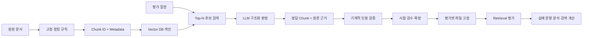
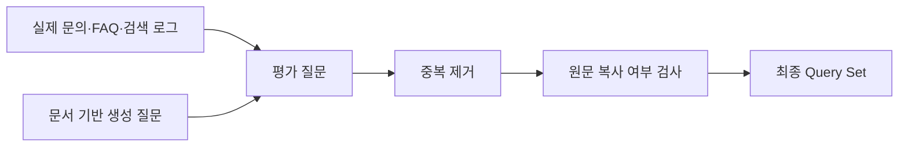
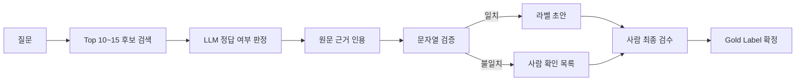

# RAG 평가셋 구축·검증 파이프라인

> 목적: 검색 성능을 재기 전에 **평가셋 자체를 먼저 검증**하는 전체 흐름 정리  
> 핵심: **질문 → 후보 검색 → 정답 조각 판정 → 근거 인용 → 기계 검증 → 사람 확정 → 평가셋 점검 → 버전 고정**

---

## 0. 전체 개발 파이프라인



### 핵심 원칙

```text
검색기가 반환하는 단위 = 평가 라벨의 단위
```

검색기가 `chunk`를 반환한다면 정답도 **chunk 단위**로 붙여야 함.

문서 단위로만 채점하면 같은 문서의 엉뚱한 조각을 검색해도 적중으로 처리될 수 있음.

---

# 1. 평가셋이 필요한 이유

RAG 검색 성능을 측정하려면 먼저 **정답이 무엇인지** 정해 둬야 함.

```text
잘못된 평가셋
    ↓
잘못된 Retrieval 점수
    ↓
잘못된 검색기 비교
    ↓
잘못된 개선 방향
```

숫자는 정상적으로 출력되기 때문에 오류를 발견하기 더 어려움.

따라서 검색기를 평가하기 전에 **평가셋 자체를 검수**해야 함.

---

# 2. 평가셋의 기본 구조

한 문항의 핵심 요소는 3개.

| 요소 | 의미 | 역할 |
|---|---|---|
| `query` | 사용자 질문 | 검색 입력 |
| `gold_chunks` | 정답 Chunk ID | 검색 결과 채점 |
| `근거문장` | 정답 조각 안의 실제 원문 | 라벨 검수·재라벨링 |

예시:

```text
query
개인정보 처리방침을 공개하지 않으면 어떤 제재를 받나요?

gold_chunks
pp40-0|pp40-1

근거문장
원문 근거 1 || 원문 근거 2
```

여러 정답은 다음처럼 저장.

```text
gold_chunks : chunk1|chunk2|chunk3
근거문장    : 근거1 || 근거2 || 근거3
```

중요:

```text
정답 Chunk 1개 ↔ 근거 문장 1개
```

순서도 서로 대응해야 함.

---

# 3. 검색 대상 문서 준비

교안에서는 두 안내서를 페이지 단위 CSV로 사용.

```python
import pandas as pd

docs = pd.read_csv("data/guide_docs.csv")
evalset = pd.read_csv("data/guide_eval_chunk.csv")
```

`guide_docs.csv`

```text
한 행 = 안내서 한 쪽
```

주요 열:

```text
id
문서
발간
쪽
소제목
본문
```

평가셋은 별도 파일로 관리.

```text
guide_eval_chunk.csv
```

이렇게 분리해야 **검색용 데이터와 정답 데이터가 섞이지 않음**.

---

# 4. Chunk 규칙을 먼저 고정

## 4.1 왜 고정해야 하나

정답 라벨은 Chunk ID를 기준으로 붙음.

청킹 규칙이 바뀌면:

```text
chunk_size 변경
chunk_overlap 변경
splitter 변경
원문 전처리 변경
        ↓
Chunk 경계 변경
        ↓
Chunk ID와 정답 라벨 불일치
```

따라서 평가 시점에서는 **정답을 만들 때 사용한 청킹 규칙을 그대로 사용**해야 함.

교안 기준:

```python
from langchain_text_splitters import RecursiveCharacterTextSplitter

splitter = RecursiveCharacterTextSplitter(
    chunk_size=400,
    chunk_overlap=80
)
```

### `chunk_overlap`

`overlap`은 문장이 잘리는 것을 완전히 막는 기능이 아님.

정확히는:

```text
Chunk 경계 부근 내용을 다음 Chunk에도 일부 반복
→ 경계에서 정보가 사라질 위험 완화
```

---

# 5. Chunk ID와 Metadata 설계

평가를 하려면 각 조각을 안정적으로 식별해야 함.

예:

```text
ai33-0
ai33-1
ai33-2
```

구조:

```text
문서 ID - Chunk 번호
```

필요한 metadata:

| metadata | 역할 |
|---|---|
| `doc_id` | 어느 페이지·문서에서 왔는지 |
| `chunk_no` | 해당 문서 안의 Chunk 순서 |
| `chunk_total` | 문서가 총 몇 Chunk인지 |
| `쪽` | 실제 원문 출처 |
| `소제목` | 사람이 검수할 때 위치 확인 |

구현:

```python
from langchain_core.documents import Document

documents = []
chunk_ids = []
chunk_texts = []

for row in docs.itertuples():

    parts = splitter.split_text(row.본문)

    for i, piece in enumerate(parts):

        chunk_id = f"{row.id}-{i}"

        documents.append(
            Document(
                page_content=piece,
                metadata={
                    "doc_id": row.id,
                    "chunk_no": i,
                    "chunk_total": len(parts),
                    "쪽": int(row.쪽),
                    "소제목": row.소제목,
                }
            )
        )

        chunk_ids.append(chunk_id)
        chunk_texts.append(piece)
```

Chunk 본문을 ID로 바로 조회할 수 있게 사전도 준비.

```python
chunk_text = dict(zip(chunk_ids, chunk_texts))
```

---

# 6. Vector DB 색인

```python
from langchain_chroma import Chroma
from langchain_huggingface import HuggingFaceEmbeddings

embeddings = HuggingFaceEmbeddings(
    model_name="jhgan/ko-sroberta-multitask"
)

store_400 = Chroma.from_documents(
    documents,
    embeddings,
    collection_name="guide_400",
    persist_directory="output/chroma_eval",
    ids=chunk_ids,
)
```

중요:

```python
ids=chunk_ids
```

평가에서는 검색된 **본문이 아니라 ID**가 필요함.

```text
검색 결과 ID
vs
gold_chunks
```

를 비교해야 하기 때문.

---

# 7. 검색 결과에서 Chunk ID만 꺼내기

```python
def search_ids(store, query, k):
    """질문과 가장 가까운 상위 k개 Chunk ID를 반환."""
    retriever = store.as_retriever(
        search_kwargs={"k": k}
    )
    return [
        doc.id
        for doc in retriever.invoke(query)
    ]
```

사용:

```python
result = search_ids(
    store_400,
    "개인정보 처리방침에는 무엇을 적어야 하나요?",
    5
)

print(result)
```

평가 구조:

```text
검색 결과
["pp10-0", "pp09-1", "pp11-0", ...]

정답
["pp09-1", "pp10-0"]

→ 두 목록을 비교해 Retrieval 지표 계산
```

---

# 8. 왜 문서 단위가 아니라 Chunk 단위인가

예를 들어 정답이:

```text
ai33-0
```

인데 검색 결과가:

```text
ai33-2
```

라고 가정.

문서 단위로 보면 둘 다:

```text
ai33
```

이므로 적중으로 계산됨.

하지만 실제 답변 생성 모델에게 전달되는 것은:

```text
ai33-2의 본문
```

이고 그 안에 정답 근거가 없다면 RAG는 실패한 것.

```text
문서 단위 평가
ai33-2 → ai33 → 정답 처리

Chunk 단위 평가
ai33-2 != ai33-0 → 실패
```

따라서:

> **평가 단위는 실제 검색기가 반환하는 단위와 맞춘다.**

---

# 9. 근거 문장을 함께 저장하는 이유

Chunk ID만 저장하면 청킹 방식을 변경했을 때 정답을 잃게 됨.

예:

```text
기존 정답
ai33-0
```

청킹 변경 후:

```text
ai33-0 → 다른 내용
```

하지만 실제 정답 문장을 저장해 두면 새 색인에서 그 문장을 다시 찾아 **새 Chunk ID를 재부여**할 수 있음.

즉:

```text
Chunk ID = 현재 색인용 정답 위치
근거 문장 = 장기적으로 유지할 정답 근거
```

---

# 10. 평가 질문 만들기

평가 질문은 크게 두 경로에서 수집.

| 질문 출처 | 장점 | 단점 |
|---|---|---|
| 실제 사용자 질문 | 실제 말투·관심사 반영 | 초기에는 데이터 부족 |
| 문서 기반 생성 질문 | 빠르게 대량 생성 | 원문을 베끼기 쉬움 |

실전에서는 둘을 섞음.



## 좋은 질문의 조건

1. 실제 사용자의 말투에 가까움
2. 자료 안에서 답을 찾을 수 있음
3. 단일 정답·복수 정답 난이도가 섞임
4. 같은 의미의 질문을 반복하지 않음

문서에서 만든 질문은 원문 표현을 그대로 복사하면 검색이 지나치게 쉬워짐.

```text
원문과 거의 동일한 질문
→ lexical overlap 증가
→ 실제 사용 질문보다 검색 점수 과대평가 가능
```

---

# 11. 정답 라벨링 전체 파이프라인



핵심:

> LLM은 **라벨 초안 생성기**, 사람은 **최종 판정자**.

---

# 12. 1단계 — 후보 Chunk 좁히기

모든 Chunk를 모델에게 넣지 않고 검색으로 먼저 후보를 좁힘.

```python
label_query = (
    "개인정보 처리방침을 만들지도, "
    "공개하지도 않으면 어떤 제재를 받나요?"
)

candidates = search_ids(
    store_400,
    label_query,
    12
)
```

보통:

```text
전체 Chunk
↓ Retrieval
상위 10~15개
↓ LLM 판정
정답 후보
```

### 중요한 한계

검색 후보에 들어오지 않은 정답은 LLM이 볼 수 없음.

```text
Retriever가 놓침
→ 판정 후보에서 제외
→ Gold Label에서도 빠질 가능성
```

즉 **현재 검색기를 이용해 평가셋을 만들면 현재 검색기의 편향이 평가셋에 들어갈 수 있음**.

대응:

- 후보 `K`를 넉넉하게 설정
- 문서를 사람이 직접 읽어 만든 질문·라벨도 섞기
- 후보 밖의 정답이 없는지 사람 검수

---

# 13. 2단계 — 구조화된 출력으로 판정

줄글로 판정을 받으면 후처리가 어려움.

따라서 Pydantic Schema로 결과 형식을 고정.

```python
from pydantic import BaseModel, Field


class ChunkLabel(BaseModel):
    chunk_id: str = Field(
        description="정답 Chunk ID"
    )

    evidence: str = Field(
        description="해당 Chunk에서 답이 되는 원문 문장"
    )


class Labels(BaseModel):
    labels: list[ChunkLabel] = Field(
        description="정답 Chunk 목록. 없으면 빈 목록"
    )
```

모델에 적용:

```python
judge_model = model.with_structured_output(Labels)
```

결과가 문자열이 아니라 객체로 들어옴.

```python
result.labels[0].chunk_id
result.labels[0].evidence
```

---

# 14. 판정 Prompt

```python
from langchain_core.prompts import ChatPromptTemplate

judge_prompt = ChatPromptTemplate.from_template("""
[질문]
{question}

[후보 조각]
{chunks}

[규칙]
1. 각 조각을 독립적으로 판단한다.
2. 해당 조각 하나만으로 질문에 답할 수 있어야 한다.
3. chunk_id는 후보에 존재하는 값을 그대로 사용한다.
4. evidence는 조각의 원문을 그대로 인용한다.
5. 답할 수 있는 조각이 없으면 빈 목록을 반환한다.
""")
```

연결:

```python
judge_chain = judge_prompt | judge_model
```

후보를 모델이 읽을 수 있는 형태로 변환.

```python
def format_candidates(chunk_ids):
    blocks = [
        f"id: {cid}\n{chunk_text[cid]}"
        for cid in chunk_ids
    ]

    return (
        "\n" + "-" * 60 + "\n"
    ).join(blocks)
```

판정 함수:

```python
def label_question(query, chunk_ids):
    return judge_chain.invoke({
        "question": query,
        "chunks": format_candidates(chunk_ids),
    })
```

---

# 15. 후보를 한 번에 판정하는 이유

후보 12개라면:

```text
Chunk별 판정
12 Chunk → LLM 12회

한 번에 판정
12 Chunk → LLM 1회
```

장점:

- 호출 횟수 감소
- 결과를 하나의 `labels` 목록으로 바로 받음
- 복수 정답 처리 쉬움

주의:

> 모델이 여러 Chunk를 합쳐야만 답이 되는 경우까지 정답으로 판단하지 않도록 **"각 Chunk 하나만으로 답할 수 있는가"**를 명시해야 함.

---

# 16. 3단계 — 근거 원문 인용 강제

모델이 단순히:

```text
이 Chunk가 정답입니다.
```

라고 말하게 두지 않음.

반드시:

```text
chunk_id
evidence
```

를 함께 반환하게 함.

이렇게 하면:

```text
판정
+
판정 이유
```

를 동시에 남길 수 있음.

---

# 17. 4단계 — 인용이 실제 원문인지 검증

LLM이 evidence를 지어낼 가능성이 있으므로 코드로 확인.

## 공백 정규화

```python
import re


def squeeze(text):
    """띄어쓰기와 줄바꿈 제거."""
    return re.sub(r"\s+", "", text)
```

## 포함 여부 확인

```python
def quoted_in_chunk(sentence, chunk_id):
    if chunk_id not in chunk_text:
        return False

    if not sentence.strip():
        return False

    return (
        squeeze(sentence)
        in squeeze(chunk_text[chunk_id])
    )
```

검증:

```text
LLM이 제시한 evidence
        ↓
실제 Chunk 본문 안에 존재?
        ↓
Yes → 라벨 후보 유지
No  → 사람 검수 목록
```

---

# 18. 자동 검증 결과를 바로 삭제하면 안 되는 이유

문자열 검증 실패는 두 종류.

| 상황 | 의미 | 처리 |
|---|---|---|
| LLM이 없는 문장을 생성 | 잘못된 근거 | 제외 |
| 실제 근거인데 기호·표기 차이 존재 | 자동 검증의 한계 | 사람 확인 |

예:

```text
원문: ▲ 개인정보 보호조치
인용: 개인정보 보호조치
```

의미는 같지만 단순 부분문자열 검사는 실패할 수 있음.

따라서 실패한 라벨은 즉시 삭제하기보다:

```python
review_needed
```

목록으로 보내는 것이 안전.

---

# 19. 라벨 초안 분류

```python
gold = []
evidence = []
review_needed = []

for item in verdict.labels:

    if item.chunk_id not in candidates:
        review_needed.append(item.chunk_id)

    elif quoted_in_chunk(
        item.evidence,
        item.chunk_id
    ):
        gold.append(item.chunk_id)
        evidence.append(item.evidence)

    else:
        review_needed.append(item.chunk_id)
```

결과:

```text
gold
→ 자동 검증까지 통과한 라벨 초안

review_needed
→ 사람이 원문을 열어 확인할 항목
```

최종 Gold Label은 사람이 확정.

---

# 20. 평가셋은 한 번 확정하면 고정

LLM 판정은 모델에 따라 달라질 수 있음.

```text
모델 A → 정답 4개
모델 B → 정답 2개
사람 → 정답 3개
```

매번 평가할 때 다시 라벨링하면:

```text
지난 평가의 정답
!=
이번 평가의 정답
```

이 되어 점수 비교가 무의미해짐.

따라서:

```text
자동 라벨링
→ 사람 검수
→ CSV 확정
→ 평가용 Gold Dataset 버전 고정
```

권장:

```text
evalset_v1.csv
evalset_v2.csv
```

처럼 평가셋 버전도 별도로 관리.

함께 기록할 것:

- 원본 문서 버전
- 청킹 규칙
- Embedding 모델
- Chunk ID 생성 규칙
- 평가셋 버전

---

# 21. 전체 문항을 Batch로 라벨링

문항마다 후보를 먼저 생성.

```python
K_CAND = 12

judge_inputs = []
cand_by_q = {}

for row in evalset.itertuples():

    cands = search_ids(
        store_400,
        row.query,
        K_CAND
    )

    cand_by_q[row.query_id] = cands

    judge_inputs.append({
        "question": row.query,
        "chunks": format_candidates(cands),
    })
```

여러 모델 요청을 Batch 실행.

```python
verdicts = judge_chain.batch(
    judge_inputs,
    config={"max_concurrency": 4}
)
```

`max_concurrency`:

```text
동시에 실행할 요청 수 제한
→ 과도한 동시 호출 방지
```

---

# 22. 기존 Gold와 새 판정 비교

자동 재라벨링의 목적은 기존 평가셋을 무조건 덮어쓰는 것이 아님.

```text
기존 Gold
vs
새 판정
```

에서 차이가 나는 문항을 찾아 **사람 검수 대상으로 좁히는 것**.

비교:

```python
saved = set(saved_gold)
new = set(new_gold)

same = saved & new
new_only = new - saved
saved_only = saved - new
```

Jaccard overlap:

```python
overlap = len(saved & new) / len(saved | new)
```

해석:

```text
1.0 → 완전히 동일
0.0 → 공통 라벨 없음
```

중요:

> 자동 라벨링의 목적은 사람을 제거하는 것이 아니라 **사람이 읽어야 할 문항을 줄이는 것**.

---

# 23. 평가셋 품질 점검

평가셋을 저장하기 전에 최소 다음 항목을 검사.

| 검사 | 문제가 생기면 |
|---|---|
| 1. Gold Chunk ID가 색인에 존재하는가 | 영원히 검색 불가능한 정답 발생 |
| 2. Evidence가 실제 Chunk에 존재하는가 | 지어낸 근거 가능 |
| 3. Query가 원문을 지나치게 복사했는가 | 검색 점수 과대평가 |
| 4. 복수 정답 문항이 존재하는가 | Hit와 Recall이 사실상 중복 |
| 5. 현재 Retriever가 못 찾는 문항도 있는가 | 평가셋이 너무 쉬움 |
| 6. Gold Chunk가 지나치게 많은 문항은 없는가 | Recall 해석 어려움 |
| 7. 여러 평가 지표가 실제로 다른 정보를 주는가 | 지표가 중복됨 |

추가 권장 검사:

- 중복 질문
- 특정 Chunk에 정답이 과도하게 집중됐는지
- 질문 출처별 비율
- 주제별 질문 분포
- 단일 정답 / 복수 정답 분포

---

# 24. 1~2번 — ID와 Evidence 검증

```python
indexed_ids = set(chunk_ids)

bad_id = []
bad_evidence = []

for row in evalset.itertuples():

    ids = row.gold_chunks.split("|")
    sentences = row.근거문장.split(" || ")

    if len(ids) != len(sentences):
        print(
            "라벨과 근거 개수 불일치:",
            row.query_id
        )

    for chunk_id, sentence in zip(
        ids,
        sentences
    ):

        if chunk_id not in indexed_ids:
            bad_id.append(chunk_id)

        elif not quoted_in_chunk(
            sentence,
            chunk_id
        ):
            bad_evidence.append(chunk_id)
```

정상:

```text
bad_id = []
bad_evidence = []
```

---

# 25. Query가 원문을 베꼈는지 확인

교안에서는 **3-gram** 기반 겹침 비율을 사용.

```python
def overlap_ratio(query, text):

    query = re.sub(r"\s+", "", query)
    body = re.sub(r"\s+", "", text)

    if len(query) < 3:
        return 0.0

    grams = {
        query[i:i + 3]
        for i in range(len(query) - 2)
    }

    return (
        sum(g in body for g in grams)
        / len(grams)
    )
```

개념:

```text
질문을 3글자 단위로 자름
        ↓
몇 개가 원문에 그대로 존재하는지 계산
        ↓
원문 복사 가능성 확인
```

주의:

`0.5` 같은 기준값은 **절대적인 규칙이 아님**.

데이터와 질문 길이에 따라 분포를 보고 기준을 정해야 함.

---

# 26. 정답 개수 분포 확인

```python
evalset["정답수"] = (
    evalset["gold_chunks"]
    .str.split("|")
    .apply(len)
)

print(
    evalset["정답수"]
    .value_counts()
    .sort_index()
)
```

왜 필요한가:

```text
Gold = 1개
→ Hit@K와 Recall@K가 동일

Gold = 여러 개
→ 검색기가 정답을 얼마나 넓게 회수하는지 Recall로 확인 가능
```

하지만 정답이 지나치게 많아도 문제.

예:

```text
정답 5개
K = 3
```

검색기가 상위 3개를 모두 정답으로 검색해도:

```text
Recall@3 최대 = 3 / 5 = 0.6
```

따라서 Recall은 반드시:

```text
K
+
Gold 개수
```

와 함께 해석.

---

# 27. 질문이 너무 넓으면 쪼개기

정답 Chunk가 지나치게 많은 질문은 대개 범위가 넓음.

예:

```text
"개인정보 처리 시 점검할 항목을 모두 알려줘"
```

보다:

```text
"배포 전 보안 점검 항목은?"
"학습 데이터 점검 항목은?"
```

처럼 나누는 것이 평가에 더 적합할 수 있음.

```text
넓은 질문
→ Gold 증가
→ 작은 K에서 Recall 상한 감소
→ Retriever 성능과 질문 범위가 섞여 평가됨
```

쪼갤 수 없는 실제 사용자 질문이라면 별도 유형으로 묶고 더 큰 `K`를 사용하는 방식도 가능.

---

# 28. 너무 쉬운 평가셋도 문제

현재 검색기가 모든 문항을 맞힌다면:

```text
개선 전 = 100점
개선 후 = 100점
```

검색기를 바꿔도 차이를 측정하기 어려움.

평가셋에는 어느 정도:

```text
현재 Retriever가 실패하는 문항
```

도 포함되어야 함.

이 실패 문항이 있어야:

```text
검색기 변경
→ 실제로 좋아졌는가?
→ 다른 문항을 망가뜨리지는 않았는가?
```

를 확인 가능.

---

# 29. 중복 질문 검사

```python
duplicate_queries = (
    evalset["query"]
    .duplicated()
    .sum()
)

print(duplicate_queries)
```

같은 의미의 질문이 반복되면 특정 주제의 비중이 실제 의도보다 커질 수 있음.

---

# 30. Gold Chunk 중복 사용 검사

여러 질문이 같은 Chunk를 정답으로 사용할 수는 있음.

그 자체가 오류는 아님.

다만 특정 Chunk가 지나치게 많이 반복되면:

```text
그 Chunk만 잘 찾는 Retriever
→ 전체 점수까지 크게 상승
```

할 수 있음.

```python
from collections import Counter

gold_all = [
    chunk_id
    for row in evalset.itertuples()
    for chunk_id in row.gold_chunks.split("|")
]

counts = Counter(gold_all)

reused = {
    chunk_id: count
    for chunk_id, count in counts.items()
    if count >= 2
}
```

평가셋의 **주제 편중 여부를 보는 보조 지표**로 사용.

---

# 31. 평가셋 구축에서 가장 중요한 편향

## Candidate Selection Bias

라벨 후보를 현재 Retriever로 뽑으면:

```text
현재 Retriever가 찾음
→ 후보에 포함
→ Gold가 될 수 있음

현재 Retriever가 못 찾음
→ 후보에서 제외
→ Gold가 될 기회 자체가 없음
```

이렇게 평가셋이 현재 검색기에 유리하게 만들어질 수 있음.

따라서 최종 평가셋은:

```text
실제 사용자 질문
+
문서 직접 검토
+
넉넉한 후보 검색
+
LLM 판정
+
사람 검수
```

를 섞는 방식이 안전.

---

# 32. 자동화와 사람의 역할 분리

## 코드가 잘하는 것

```text
후보 검색
ID 검사
문자열 포함 검사
중복 검사
분포 계산
Batch 처리
```

## LLM이 잘하는 것

```text
질문과 Chunk의 의미 비교
답할 수 있는지 1차 판정
원문 근거 후보 선택
```

## 사람이 해야 하는 것

```text
모호한 라벨 최종 판단
실제 사용자 질문인지 판단
너무 넓은 질문 분리
잘못된 자동 판정 제거
최종 Gold Dataset 승인
```

전체 구조:

```text
Machine
   ↓
LLM
   ↓
Machine Validation
   ↓
Human Review
```

---

# 33. 실전용 최소 함수 묶음

```python
import re


def search_ids(store, query, k):
    retriever = store.as_retriever(
        search_kwargs={"k": k}
    )
    return [
        doc.id
        for doc in retriever.invoke(query)
    ]


def squeeze(text):
    return re.sub(r"\s+", "", text)


def quoted_in_chunk(
    sentence,
    chunk_id,
    chunk_text
):
    if chunk_id not in chunk_text:
        return False

    if not sentence.strip():
        return False

    return (
        squeeze(sentence)
        in squeeze(chunk_text[chunk_id])
    )


def format_candidates(
    chunk_ids,
    chunk_text
):
    blocks = [
        f"id: {cid}\n{chunk_text[cid]}"
        for cid in chunk_ids
    ]

    return (
        "\n" + "-" * 60 + "\n"
    ).join(blocks)
```

---

# 34. 실제 개발 순서

평가셋 제작을 처음부터 진행한다면 다음 순서가 안정적.

```text
1. 원본 문서 확정
2. 전처리 규칙 확정
3. Chunk 규칙 확정
4. Chunk ID 규칙 확정
5. Vector DB 색인
6. 평가 질문 수집
7. 질문 중복·원문 복사 검사
8. 질문별 Top-N 후보 검색
9. LLM 구조화 판정
10. 원문 Evidence 인용
11. Evidence 기계 검증
12. 검증 실패 항목 사람 확인
13. 전체 라벨 사람 최종 검수
14. Gold Dataset 파일 고정
15. ID·근거·분포 품질 검사
16. Retrieval 평가
17. 실패 문항 분석
18. 검색기 개선
19. 같은 Gold Dataset으로 재평가
```

중요:

```text
검색기를 바꿔도
평가셋은 그대로 유지
```

그래야 개선 전후 점수를 공정하게 비교할 수 있음.

---

# 35. 자주 발생하는 문제

| 문제 | 원인 | 대응 |
|---|---|---|
| Gold ID가 검색되지 않음 | 청킹·ID 규칙 변경 | 색인과 평가셋 버전 맞추기 |
| 문서 점수는 높은데 답변 실패 | 문서 단위 채점 | Chunk 단위 평가 |
| 자동 라벨이 자주 틀림 | 모델 판정 한계 | Evidence 강제 + 사람 검수 |
| Evidence 검증 실패 | 환각 또는 표기 차이 | `review_needed` 분리 |
| Gold가 너무 적음 | 후보 K가 작음 | 후보 확대·문서 직접 검수 |
| Gold가 너무 많음 | 질문 범위가 넓음 | 질문 분리 |
| 검색 점수가 비정상적으로 높음 | 질문이 원문을 복사 | n-gram 겹침 검사 |
| 개선해도 점수가 안 변함 | 평가셋이 너무 쉬움 | 실패 문항 포함 |
| 점수 변동이 라벨 변경 때문 | 평가 때마다 재라벨링 | Gold Dataset 고정 |

---

# 36. 교안 코드에서 보완해서 기억할 점

## `chunk_overlap`

```text
문장 분할을 완전히 방지하는 값 X
경계의 정보를 일부 중복시켜 손실을 줄이는 값 O
```

## 후보 검색은 완전히 "공짜"가 아님

이 실습에서는 로컬 HuggingFace 임베딩을 사용하므로 **LLM API 호출 비용은 없지만**, 질의 임베딩과 Vector Search 계산 자체는 발생함.

## 자동 문자열 검증은 완벽한 의미 검증이 아님

```text
부분문자열 검증 성공
→ 실제 원문을 인용했다는 강한 증거

부분문자열 검증 실패
→ 반드시 틀렸다는 뜻은 아님
```

기호·유니코드·표 파싱 차이 등이 존재할 수 있으므로 실패 항목은 사람 검수 대상으로 보내는 것이 적절.

## `3-gram`, `0.5`, Gold 8개 기준

교안에서 사용하는 **실습용 휴리스틱**.

모든 프로젝트에 그대로 적용하는 절대 기준이 아님.

실제 데이터의 분포를 먼저 보고 임계값을 정하는 편이 좋음.

## 평가 문항 수

20~30개는 빠른 실험용으로는 편하지만 문항 하나가 점수에 미치는 영향이 큼.

평가 결과를 중요한 의사결정에 사용한다면 문항 수와 질문 분포를 더 충분히 확보해야 함.

---

# 37. 최종 핵심 정리

```text
평가셋
= 질문 + 정답 Chunk + 원문 Evidence
```

```text
평가 단위
= Retriever가 실제 반환하는 단위
```

```text
라벨링
= 후보 검색
→ LLM 구조화 판정
→ 원문 인용
→ 기계 검증
→ 사람 확정
```

```text
자동 라벨링의 목적
= 사람을 없애는 것 X
= 사람이 확인할 범위를 줄이는 것 O
```

```text
평가셋 확정 후
= 버전을 고정하고 같은 평가셋으로 개선 전·후 검색기를 비교
```

가장 중요한 한 문장:

> **검색기를 평가하기 전에, 검색기를 재는 평가셋부터 검증한다.**

---

## 이미지·도식 반영 메모

원본 노트북은 아래 두 이미지를 외부 경로로 참조함.

```text
images/문서vs청크_라벨.png
images/라벨링_4단계.png
```

이미지 데이터 자체는 노트북 파일에 내장되어 있지 않아 직접 추출할 수 없음.  
대신 이미지 주변의 설명과 캡션을 기준으로 핵심 구조를 위의 **Mermaid 흐름도**로 재구성함.
